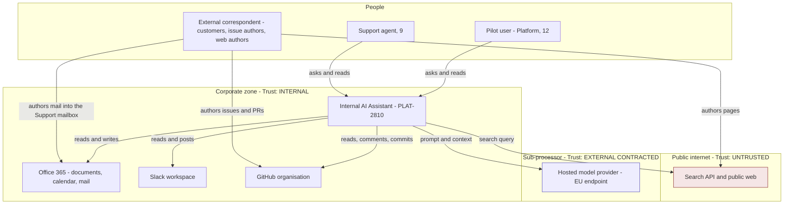
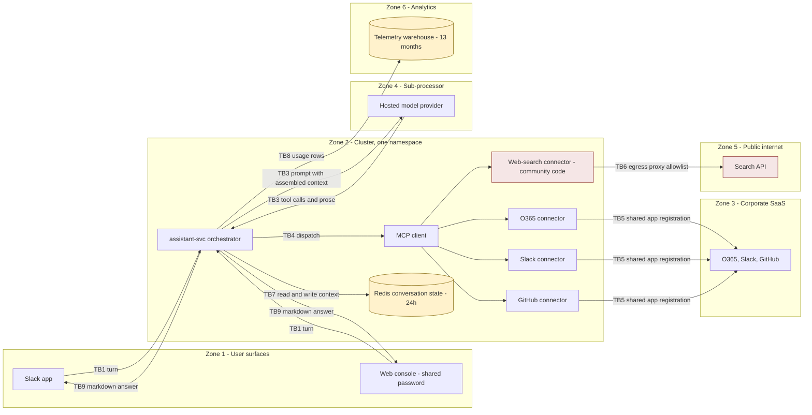
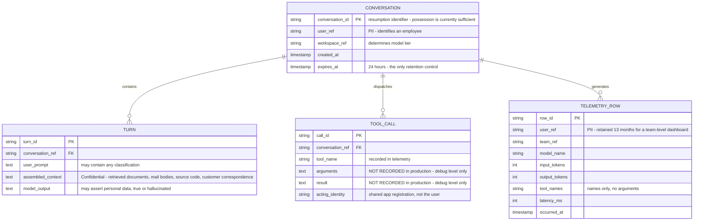

# Internal AI Assistant — Security Architecture

**Version:** 1.1 (post-validation-session; map authored before the threat model, evaluation after it) · **Date:** 2026-09-09 · **Classification:** Internal
**Prepared by:** **Brett Crawley, Principal Application Security Engineer** — author of this document and facilitator of the validation session. Produced with AI assistance using the security-review skill set authored by Brett Crawley.
**Model:** Claude Opus 5
**Frameworks:** C4 · STRIPED · LINDDUN · OWASP Top 10 (2021) · OWASP LLM and Agentic Top 10 · Privacy by Design · AWS Well-Architected Security Pillar
**Companion documents:** `02-use-abuse-and-security-privacy-use-cases.md` · `04-gap-analysis.md` · `05-srtm-and-test-artefacts.md` · `06-threat-model.md`

**Status legend:** 🔴 Open · 🟡 Partial / In progress (issue cited) · 🔵 Planned · 🟢 Mitigated / Live · ⚪ Accepted.

**Provenance legend:** `[VS §n · CONFIRMED / CORRECTED / NEW / CONTESTED / ACCEPTED / CLOSED / STILL OPEN]`, where `n` is the section of the validation session transcript (`transcript.md`). Untagged text is v1.0 material the session did not touch.

**v1.1 — what the validation session changed in this document.** Five things, all in the descriptive half, which is the half that should be hardest to get wrong. **TB5** is confirmed worse than described: the requesting user's identity is not merely unenforced, it is *dropped in the orchestrator* before dispatch, so there is no user field on the connector call at all. **TB9**'s absence from the design is confirmed by the author of the diagrams — "It isn't on my diagram. There's no arrow there." **§2.6 gains two rows** for divergences that are not between two artefacts but between an artefact and something written down nowhere (**O6**, **O7**). **§2.4's data model is confirmed correct and was used to correct the threat model**, which had said customer data reaches the telemetry warehouse; it does not. And **AC-05 gains a prerequisite**: the trust-model reclassification it asks for cannot be delivered as an edit, because the position it replaces was never decided (**O7**).

> This document is authored in two parts, deliberately. Sections 1 to 5 are **descriptive**: what exists, what crosses which boundary, and where the documentation and the tickets disagree. They were written before the threat model, because the threat model iterates over them. Sections 6 to 9 are **judgemental**: the target design now that the threats are known, which findings need architectural change rather than a tactical fix, and what the design fails on principle. They were written after it. The model rests on documentation and tickets only — no source code, infrastructure code or Helm charts were supplied.

---

## 1. Architectural context and constraints

The constraints are not incidental. Three of them explain most of the security posture, and two of them were accepted at portfolio level by people who were not assessing security when they accepted them.

| Constraint | Source | Architectural consequence |
|---|---|---|
| Delivery inside FY26 H2; board reporting date fixed and immovable | PMO-0447, PR-01 (Accepted) | Every "narrow before GA" and "migrate off the prototype" item is competing with a date that does not move. This is why PLAT-2814-6 and PLAT-2820-3 are unscheduled rather than late. |
| No net new headcount | PMO-0447 | Delivery from existing team capacity; blocked dependencies (Identity Platform) cannot be worked around by resourcing. |
| Running cost must be predictable and attributable to a cost centre | PMO-0447 | Produced PLAT-2822 and, with it, per-user telemetry retained 13 months for a team-level dashboard. |
| Must use approved vendors; procurement will not run a new vendor assessment inside the window | PMO-0447 | Produced D-01: build on Data Platform's existing model provider agreement rather than assess one for this purpose. |
| Use vendor-supplied MCP connectors rather than build integrations | D-02 | Maintenance, and therefore the tool-description instruction surface, sits with the vendor and changes outside the organisation's change control. |
| Assistant acts as the requesting user, not as a system identity | D-03 | The right decision. It is documented as implemented and is not implemented. |
| No new data stores; read from systems of record in place | D-05 | Genuinely good: avoids a duplication and retention problem. Partly undercut by conversation state and telemetry, which are new stores. |
| Group AI governance not yet defined; initiatives proceed on the basis that governance will be retrofitted | PR-03 (Open, workstream not started) | There is no organisational gate that this design has to pass. |

**Non-functional target that shapes the design:** "Response under 6 seconds for a typical question" (PLAT-2810). This is the pressure behind the no-confirmation decision in PLAT-2817 and behind untrimmed context.

---

## 2. The system as it is

### 2.1 System context

The three edges from **External correspondent** are the ones the approved architecture page does not draw. Its Trust model section reads: "The corporate network boundary is the trust boundary... The one place untrusted content enters is web search." Two of those three edges deposit attacker-authored content *inside* the corporate zone, where it is then read by the assistant as trusted material.

### 2.2 Component decomposition

| Component | Responsibility | Interfaces | Data owned | Security boundary | Failure mode |
|---|---|---|---|---|---|
| **Slack app surface** (PLAT-2831-1) | Receive turns, render markdown answers | Slack Events API | None | Slack workspace authentication; public ingress reaches it | Turn lost |
| **Web console surface** (PLAT-2831-2) | Same, in a browser; history view | HTTPS behind VPN | None | **Shared password behind VPN**; SSO is PLAT-2831-3, To Do | Turn lost |
| **Orchestrator `assistant-svc`** | Assemble context, call the model, interpret and dispatch tool calls, loop to a final answer | Internal HTTP from surfaces; provider API; MCP client | Conversation state (in Redis) | Cluster-internal, no ingress route | Turn fails; degraded answers still returned |
| **Connector runtime `assistant-connectors`** | Host the MCP client and four connector processes | MCP to four servers | None | **Same namespace as the orchestrator** (PLAT-2814-1) | Tool call fails; the orchestrator answers anyway |
| **O365 connector** | Documents, calendar, mail; send mail | Vendor MCP server | None | Shared app registration | Tool call fails |
| **Slack connector** | Channels, DMs; post message | Vendor MCP server, **full scope set** (PLAT-2814-3) | None | Shared app registration | Tool call fails |
| **GitHub connector** | Issues, PRs, code; comment, update, commit | Vendor MCP server, org-level app | None | Shared app registration | Tool call fails |
| **Web-search connector** | Public search; output passes the sanitiser | **Community** MCP server in cluster | None | Egress proxy allowlist; no isolation tier | Tool call fails |
| **Conversation store** | Turn history and accumulated context, 24-hour expiry | Redis | Conversation state | Cluster-internal | Session lost |
| **Telemetry pipeline** | Per-request usage rows | Analytics warehouse | Usage telemetry, 13 months | Unstated | Metrics lost |
| **Consumption dashboard** (PLAT-2822-3) | Team-level cost attribution | Warehouse query | None | Unstated | Dashboard stale |

### 2.3 Data flow with trust zones

### 2.4 Data model, reconstructed

**This model is reconstructed from prose, not read from a schema.** No DDL, migrations, ORM models or ERDs were supplied. Every field below is inferred from the data-handling table in the pilot operations page and from the telemetry description in PLAT-2822-1. It is included because the schema is where PII classification and encryption-at-rest claims are actually tested, and because its absence is itself a finding — every privacy and at-rest conclusion in this pack is tagged "if present" as a result.

**Per-store classification, protection and retention:**

| Store | Where it lives | Classification | Protection at rest | Retention | Deletion path |
|---|---|---|---|---|---|
| Conversation state | Redis, in cluster, single region | Internal; in practice **Confidential** — it aggregates source code, mail bodies and customer correspondence | **Unstated.** No encryption, authentication or access-control detail in any source | 24 hours from expiry set | User may delete own conversations (PLAT-2825-2). No leaver trigger, no third-party route — **G-15** |
| Usage telemetry | Analytics warehouse | Internal; **personal data** by virtue of the user dimension | Unstated | 13 months | **None stated — G-15** |
| Platform logs | Platform logging, centralised | Internal; becomes **Confidential** if debug logging is ever enabled | Platform baseline | 90 days hot, 12 months cold | **None stated — G-15** |
| Secrets | AWS Secrets Manager | Secret | KMS, workload-identity scoped | Rotation "where the downstream system supports it" | Rotation, not deletion |
| Model provider context | Sub-processor, EU endpoint | Confidential and personal data | Contractual, unverified | **Unknown — G-16** | Contractual, unverified |
| Systems of record | O365, Slack, GitHub | Per source classification | Vendor | Vendor terms | Vendor process, unaffected by the assistant |

`[VS §7 · CONFIRMED]` **The reconstruction was checked in the validation session and held.** `TELEMETRY_ROW` is confirmed as user, team, model, token counts, tool names and latency — **no customer content and no customer identifier** — by the engineer who built the pipeline. That matters beyond this document: `06-threat-model.md`'s P1 stated that customer data was "reflected in 13 months of telemetry", which was wrong, and **this reconstructed model is what established it was wrong.** The correction is recorded at P1. A model built from prose caught an error in a finding built from the same prose, which is an argument for building the model, and none of it substitutes for the DDL that was never supplied.

**Schema-level concerns.** Three, all of which a real schema would settle. `assembled_context` is a free-form field that accumulates every classification the assistant can reach — the store's declared classification of "Internal" is set by where it sits, not by what it holds. `arguments` and `result` on `TOOL_CALL` are the fields the architecture page's Audit section promises are recorded and the Logging section says are not; the schema is where that contradiction would be visible. `user_ref` on `TELEMETRY_ROW` is the field that turns a cost dataset into a behavioural one, and nothing in the design says it is pseudonymised.

### 2.5 Trust boundaries

| ID | Boundary | What crosses | Control at the crossing | Confidence | Evidence / open issue |
|---|---|---|---|---|---|
| **TB1** | Person to surface | The user's turn; their identity | Slack: workspace authentication. Console: **shared password behind the MFA-enforced VPN** | **Low** for the console | PLAT-2831-3 To Do; S2 rough edges. Finding S1 |
| **TB2** | Surface to orchestrator | Turn plus asserted user identity | Cluster-internal, no ingress route | Medium | S1 Deployment. Identity assertion mechanism unverified — no code supplied |
| **TB3** | Orchestrator to model provider | The full assembled context: source code, mail, customer correspondence | TLS; egress allowlist; EU endpoint; enterprise agreement held by another team | **Low** on contractual scope | D-01; PMO-0447 procurement constraint. Finding P4 |
| **TB4** | Orchestrator to connector runtime | Tool name and model-composed arguments | **None stated.** Same namespace; trust by network position | **Low** | PLAT-2814-1. Findings S5, AI3, C1 |
| **TB5** | Connector to corporate SaaS | Read and write requests | **Documented:** per-user delegated OAuth. **Actual:** one app registration with application permissions, and **the requesting user's identity is dropped in the orchestrator before dispatch — there is no user field on the connector call** `[VS §1 · CONFIRMED]` | **Very low — the documented control does not exist, and nothing carries the information it would need** | S1 Authorisation vs PLAT-2820 (To Do) and PLAT-2820-3; Q5 answered in the session. Findings O1, E1, S2, R2 |
| **TB6** | Web-search connector to public internet | Search query out; attacker-authored content in | Egress proxy domain allowlist; "the sanitiser" on the way back | Medium on egress, **Low** on ingress | S3 Network; PLAT-2814-5. Findings I3, AI6, C6 |
| **TB7** | Orchestrator to conversation store | Accumulated context of every classification | Cluster-internal | **Low** | No encryption or authentication detail in any source. Finding I2 |
| **TB8** | Orchestrator to telemetry warehouse | Per-user usage rows | Unstated | **Low** | PLAT-2822-1. Findings P2, CL5 |
| **TB9** | Model output to the user's rendering client | Markdown, including image and link tags, rendered by a browser or the Slack client | **None** | **Very low — this boundary is not drawn anywhere in the design** | S2: "markdown images referencing external URLs... Not investigated." Finding AI2 |
| **TB10** | Cluster workload to AWS control plane | Pod or node identity to Secrets Manager and the API server | Workload identity per service, provisioned by Platform Security | Medium, **unverified** | S3 Identity and Secrets. Findings CL6, C5 |

**TB9 is the boundary the design does not have.** It appears in no document, in no ticket and in no diagram, and it is where the zero-click exfiltration path in SAC-01 completes. The egress proxy — the organisation's strongest data-loss control, in place since 2023 — sits on TB6 and cannot see TB9 at all, because the fetch is made by the user's own client rather than by a cluster workload.

`[VS §4 · CONFIRMED]` **Both halves of that were confirmed in the validation session, by the two people best placed to contradict them.** The architecture owner, who draws these diagrams: "It isn't on my diagram. There's no arrow there." The Platform Security Champion, who had opened the discussion by stating that everything leaving the cluster passes the egress proxy: "Then the proxy is irrelevant to it. Completely irrelevant." He had cited the proxy in two design reviews this quarter. This is the most useful confirmation in the pack, because a boundary that nobody draws is a boundary nobody reviews — and the control the organisation would reach for is the one that structurally cannot apply. The remedy costs about three days `[VS §4 · CORRECTED]`, revised up from a day: the CSP header is a day and the markdown subset spans two renderers plus the outbound composer.

### 2.6 Where the documentation and the tickets disagree

The brief asked that implementation and documentation be compared. No implementation was supplied, so this is the nearest equivalent: the **approved design pages** against the **ticket state**. Every row is a place where a reader of the approved page would build on a control that does not exist.

| # | Approved documentation claims | Ticket state shows | Finding |
|---|---|---|---|
| 1 | Per-user delegated OAuth at every connector; "a user cannot reach anything through the assistant that they could not reach directly" (S1, Approved 2026-05-22) | PLAT-2820 **To Do**; PLAT-2820-1 blocked on Identity Platform since 2026-04-18, not scheduled; PLAT-2820-3 records one app registration with application permissions | **O1**, E1 |
| 2 | "Every privileged action... recorded with the acting user, the action, and the parameters it was called with" (S1 Audit) | Same page, Logging: "Tool arguments and results are logged at debug level, off in production" | **R1** |
| 3 | "Actions are attributable to them in the target system's own audit log" (S1) | The target system sees the app registration | **R2** |
| 4 | "All corporate applications authenticate through the identity provider. MFA is enforced" (S3, the standing reference designs are told to cite) | Console is behind the VPN with a shared password; PLAT-2831-3 To Do | **O2**, S1 |
| 5 | Connector table lists bounded scopes per connector (S1) | PLAT-2814-3: Slack installed "with the full scope set"; PLAT-2814-6 To Do, not scheduled | **E2** |
| 6 | "Web search is the only one reaching content originating outside the organisation" (S1) | Support reads a shared mailbox of customer-authored mail (S2); GitHub connector reads issues and PRs from outside contributors | **AI1** |
| 7 | "No new persistent stores" (S1 Data handling), following D-05 | Redis conversation state (24h) and 13 months of telemetry are both new stores holding data derived from the systems of record | **P2**, P3 |
| 8 | "Traffic reaching the connector runtime has already been authenticated at the perimeter" (S1 Trust model) | Perimeter authentication says nothing about which user, and the console's perimeter credential is shared | **S5**, S1 |
| 9 `[VS §2 · NEW]` | Standing controls page, Source control: protected branches require an approving review and signed commits, organisation-wide. The architecture page cites that baseline | **Nothing in any supplied source.** A standing exemption for `platform-ci` exists as a config file in the organisation repository. It predates this epic and is written down nowhere a design review would look | **O6**, T3 |
| 10 `[VS §3 · NEW]` | Architecture page Trust model: internal sources are behind authentication and need no equivalent handling to web search | PLAT-2814's acceptance criterion says the same thing — **and it was written as a scoping note, not as a security position.** The two artefacts agree with each other and neither of them is the decision. There is no decision | **O7**, AI1 |

`[VS · v1.1]` **Rows 9 and 10 are a different kind of divergence from rows 1 to 8 and the difference is worth stating.** Rows 1 to 8 compare two artefacts, which is a check anybody can run and which this pack ran from the documents alone. Row 9 compares an artefact with a configuration file nobody documents; row 10 compares two artefacts that **agree**, and finds that neither is the origin of what they agree on. Neither is reachable by reading the estate, which is why both arrived in a room and not in a review — and why **COMP-14**'s control-claim convention and **COMP-15**'s exceptions register are the two changes that would make this section derivable in future.

Row 1 is the important one, and the mechanism matters more than the fact. The architecture page's change log reads: *"2026-05-22 | Authorisation section updated following D-03 | M. Oyelaran."* The page was updated to record a **decision**. A reader — including the architecture forum that approved it on 2026-05-20 — reads it as a description of the **build**. The gap between deciding and delivering is exactly the interval in which PLAT-2820 has been blocked, and nothing on the page signals it.

---

## 3. Control architecture as it stands

| Control domain | What exists | What carries the guarantee | Assessment |
|---|---|---|---|
| **Identity — human** | Slack workspace auth; VPN with MFA; **shared password on the console** | The corporate identity provider, except on the console | 🔴 One surface sits outside the organisation's own standard |
| **Identity — workload** | Workload identities per service, provisioned by Platform Security | AWS IAM | 🟡 Genuinely provided by the platform; the assistant's own use of it is unverified. `[VS §8 · ACCEPTED]` The Security Champion accepted the cluster-RBAC and token-mounting question as covered by this baseline (C5 closed, **AR-01**) and **declined** the same closure for node identity and IMDS (CL6), which remains open. The distinction is his and it is the right one: the baseline is a statement about workload provisioning, not about the node |
| **Identity — delegated** | **Nothing.** One app registration with application permissions | Nothing | 🔴 The central architectural defect, PLAT-2820 |
| **Authorisation** | The target SaaS systems' own access control — which the assistant bypasses by holding tenant-wide permissions | Nothing, currently | 🔴 E1 |
| **Cryptography — transit** | TLS terminated at the edge and re-established internally; encrypted to managed datastores | Platform baseline (S3 Runtime) | 🟢 Inherited, and adequate |
| **Cryptography — at rest** | Secrets Manager with KMS. Redis and warehouse protection unstated | Platform baseline for secrets only | 🟡 Two stores holding Confidential data have no stated at-rest position |
| **Crypto agility** | Not addressed anywhere in the sources | — | 🔴 No algorithm inventory, no versioned metadata on stored artefacts |
| **Network — ingress** | Public ingress reaches the surfaces only; internal services carry no ingress route | Platform baseline (S3 Network) | 🟢 Correct and clearly stated |
| **Network — egress** | Egress proxy with a domain allowlist, reviewed weekly, in place since 2023 | Platform baseline | 🟡 Strong, and structurally unable to cover TB9 or an allowlisted user-content host |
| **Network — segmentation** | Default-deny NetworkPolicy **between namespaces** | Platform baseline | 🔴 Connectors are in the orchestrator's namespace, so the control does not separate them — C1 |
| **Secrets** | AWS Secrets Manager, mounted at pod start, workload-identity scoped | Platform baseline | 🟡 Mounted into pods that also run third-party MCP code — I4 |
| **Detective — audit** | Request-level logging: conversation ID, user, team, latency, token counts, tool names | Application logging | 🔴 Arguments absent; no tamper-resistant destination; no correlation across services — R1, R4, R5 |
| **Detective — runtime** | Not addressed in the sources | — | 🔴 No runtime detection, no anomaly alerting, no cost alerting (PLAT-2822-4 To Do) |
| **Provisioning** | Branch protection, required review, signed commits on protected branches **with a standing undocumented exemption for `platform-ci`** `[VS §2 · NEW]`, org-wide secret scanning with push protection, dependency scanning blocking on Critical, container scanning with weekly rebuilds — **and no digest pinning: all four MCP servers float on `latest`** `[VS §8 · CONFIRMED]` | Platform baseline (S3) | 🟡 **Downgraded from 🟢.** A genuinely strong inherited baseline whose exceptions are not enumerable from the page that describes it (**O6**), and which reaches none of the MCP surface. It bounds fewer findings than v1.0 credited — the T3 credit is withdrawn — and closes none of the top ten |
| **Model-layer** | "The sanitiser" on web-search output | A pattern-based transform of unknown implementation | 🔴 Load-bearing by default because nothing else carries the guarantee — AI1, AI6 |

---

## 4. Data lifecycle

| Stage | What happens | Control | Gap |
|---|---|---|---|
| **Collection** | Content is read from systems of record at request time; telemetry is written per request; no consent, notice or opt-in exists for any of it | D-05 avoids duplication into a new system of record | No lawful basis identified for third-party correspondence (P1); no notice to anyone (P6) |
| **Processing** | Context assembled, sent to a sub-processor, model output interpreted as tool calls and dispatched | — | Context is not minimised, not delimited by provenance, and not bounded to one purpose within a session (P5, AI1) |
| **Storage** | Redis 24h; telemetry 13 months; platform logs 90d/12m; provider retention unknown | 24-hour TTL is a real and useful control | Three of the four stores have no stated protection and none has a deletion path (I2, P3) |
| **Sharing** | Every prompt goes to the model provider. Nothing else leaves by design; several things can leave by injection | Egress allowlist | Sub-processor scope unverified (P4); exfiltration paths at TB9 and through allowlisted hosts (AI2, I3) |
| **Retention** | Set by TTL and by warehouse policy | The 24-hour TTL | 13 months of per-user rows exceed the stated purpose (P2) |
| **Destruction** | Redis expiry; user-initiated conversation deletion | Expiry works | No path for telemetry, logs, provider retention, or for anyone who is not the conversation's owner (P3) |

The lifecycle has one strong property and one structural hole. The strong property is D-05: refusing to build a new system of record was the right call and it removed an entire class of problem. The hole is that the *derived* stores — conversation state, telemetry, logs — were not treated as in scope for that decision, and they are where the data now accumulates.

---

## 5. Security implications of the accepted decisions

| Decision | Recorded rationale | Security implication | Verdict |
|---|---|---|---|
| **D-01** Existing model provider agreement | Procurement window closed | Confidential source code and third-party customer correspondence are sent to a sub-processor under a contract scoped to another team's purposes. The commercial constraint was accepted at portfolio level; the data-protection consequence was not assessed alongside it | 🔴 P4 — verify before GA, and carry as an explicit accepted risk if it cannot be |
| **D-02** Vendor MCP connectors | Faster; maintenance sits with the vendor | Tool descriptions are an instruction surface that reaches the model's context, and this decision places them outside the organisation's change control by design | 🔴 AI9, AI12 — needs a pinning and diff gate, not a reversal |
| **D-03** Act as the requesting user | Preserves attribution and existing permission boundaries | Correct, and the most important security decision in the pack. It is documented as implemented and is not implemented | 🔴 O1, E1 — the decision is right; the delivery is the gap |
| **D-04** Pilot with Platform and Support | Highest measured time loss; both willing | Chose, without noting it, to put third-party customer personal data into scope in the second pilot | 🔴 P1 — the team has since raised this itself |
| **D-05** No new data stores | Avoids duplication and retention | Right, and partly undercut by the derived stores it did not cover | 🟡 P2, P3 |
| **PLAT-2817 AC** No confirmation step | The pilot group were clear a confirm dialog on every action would be slower than doing the work | A real usability finding, answered with the wrong control. The choice is not "confirm everything or confirm nothing" — it is confirm on risk. `[VS §5 · CONTESTED]` The product owner defended it on tested evidence — usage stopped when everything was confirmed — accepted confirmation on commits, refused it on mail and in-channel posts, and owes a risk-based model in three weeks. Outbound mail to customers is unresolved and is Support's objection | 🔴 AI4, accepted risk **AR-02** — see SUC-05 |
| **PLAT-2814 AC** Only web-search output is untrusted `[VS §3 · NEW]` | **None. It was a scoping note, not a decision** — the product owner was recording what was in scope for one story and was not ruling on internal sources | This is the most consequential entry in this table and it does not belong in it, because it is not an accepted decision. It was implemented as a security position, written into the trust model as an assessed one, and assumed by the Security Champion to be a platform control. Four people, three artefacts, no decision | 🔴 **O7** — a decision to be taken, not a document to be corrected |
| **PR-01** Immovable date, accepted | Board commitment | Every unscheduled hardening ticket is competing with a date that will not move. This is why the sequencing in `04-gap-analysis.md` separates launch gates from hardening rather than listing everything as urgent | ⚪ Accepted at portfolio level |
| **PR-03** Governance retrofitted | Workstream not started; accepted at the July steering group | No organisational gate exists that this design must pass. The security review named as a PROD-1131 dependency is the only one, and it is scheduled "before pilot expansion" — after an expansion has already happened | 🔴 O3, O4 |

---

## 6. Assessment against principles

| Principle | Assessment |
|---|---|
| **Defence in depth** | 🔴 Single-layer at the point that matters. The guarantee "a user cannot reach what they cannot reach directly" is carried by nothing. There is no second control behind the sanitiser, none behind the model's judgement on tool arguments, and none behind the model's narration of what it did |
| **Least privilege** | 🔴 The opposite. One app registration, application permissions, full Slack scope set, org-level GitHub app with commit rights. Every connector holds the maximum its API offers |
| **Secure by default** | 🔴 A new workspace inherits the widest configuration and would require action to narrow. Actions execute without confirmation by default. Debug logging is a flag away from a Confidential spill |
| **Fail securely** | 🔴 Fails open in two places: a failed connector call still produces an answer the user cannot distinguish from a complete one (D5), and provider rate limiting is absorbed by retry rather than by a circuit breaker (D2) |
| **Complete mediation** | 🔴 Authorisation is evaluated when a conversation starts, not when a tool call resumes inside it twenty hours later (E5), and object-level authorisation is not evaluated at all (E1) |
| **Separation of duties** | 🟡 Platform Security reviews IAM and egress additions — a real separation. Not present within the workload: the same identity dispatches actions and writes the record of them (R1) |
| **Economy of mechanism** | 🟢 The architecture is genuinely simple: two services, four connectors, one store, one loop. Simplicity is an asset here and the fixes should not spend it |
| **Weakest link** | 🔴 The community web-search MCP server: third-party code, processing hostile input by design, in the same namespace as every connector credential (C1, C6, AI10) |
| **Proportionality** | 🟡 Reasonable for Platform's internal use case. Not proportionate to Support's, which introduced third-party customer data without a corresponding change in controls |
| **Human-centered security** | 🟡 Mixed, and better than most. The team listened to users about confirmation friction — the instinct is right, the control chosen is wrong (AI4). Against that, the console's shared password is the classic case of the insecure path being the easy one (S1) |
| **Crypto agility** | 🔴 Not addressed. No algorithm inventory, no versioned crypto metadata. Low urgency for a system whose data has a 24-hour to 13-month life, but it should be recorded as a knowing omission rather than an oversight |
| **Quantum readiness** | 🟢 Not material. Nothing here carries long-term confidentiality requirements; TLS and KMS are inherited and will migrate with the platform |

---

## 7. Architectural changes required

These are the items that no amount of careful coding fixes. Tactical fixes are in `04-gap-analysis.md`.

### AC-01 — Move the authorisation decision to the connector, per user 🔴

*Findings:* E1, E3, E5, S2, R2, O1. *Gap:* G-01. *Counter:* SUC-01.

The assistant must not hold a credential that reaches more than the requesting user reaches. This is D-03, already decided and already correct; what is missing is the delivery. Architecturally it means: a credential store keyed by user and connector, the requesting user's identity carried through the orchestrator into every dispatch, and the connector's own authorisation decision — made by O365, Slack or GitHub against a delegated token — becoming the enforcement point.

The property this buys is the one the whole design needs: **the enforcement is deterministic and outside the model.** A successful prompt injection then produces a tool call that the connector refuses, rather than a tool call that succeeds.

*Blocking dependency:* Identity Platform, requested 2026-04-18, not scheduled. This is a portfolio escalation, not an engineering task.

### AC-02 — Give the connector runtime a real isolation boundary 🔴

*Findings:* C1, C6, I4, AI10, S5. *Gap:* G-07. *Counter:* SUC-07.

One namespace per connector, default-deny NetworkPolicy including egress, one service account and one secret scope each, and the web-search connector on a sandboxed runtime or a tainted node pool. The design currently relies on the platform's inter-namespace default-deny for a separation that is intra-namespace, so the control does not apply.

### AC-03 — Draw TB9 and put a deterministic filter on it 🔴

*Findings:* AI2, I3. *Gap:* G-03. *Counter:* SUC-03.

Model output crossing to a rendering client is a trust boundary. It needs a control on it: CSP restricting `img-src` and `connect-src` in the console, and a markdown subset that strips image tags in both surfaces and in anything the assistant posts or sends. This is the cheapest architectural change in the pack and it closes the exfiltration path that requires no credential.

### AC-04 — Separate the action record from the model's narration 🔴

*Findings:* R1, R3, R4, T2. *Gap:* G-09. *Counter:* SUC-09.

The dispatcher writes an append-only, correlated record of what was actually dispatched; the conversation display reads from that record rather than from the model's account of itself. Today the same output serves as both the effect and the evidence of the effect, which means an injection that causes a harm also authors its own alibi.

### AC-05 — Make the trust boundary follow the content, not the network 🔴

*Findings:* AI1, AI6, AI14, P5. *Gap:* G-06. *Counter:* SUC-06.

Reclassify every input channel by who authored the content, not by which network it arrived on. Mail bodies, external Slack and GitHub content, and web results are untrusted regardless of the fact that they are sitting inside an authenticated corporate system. Structurally delimit them in context, tag them with provenance, and let that provenance gate what tools may be called afterwards.

This is the change that retires the mental model in `diagram1-assumed.svg`. The corporate network boundary is not the trust boundary; it never was, and the Support use case makes that unmissable.

`[VS §3 · CORRECTED]` **AC-05 has a prerequisite this document did not know it had, and it is not an architectural change.** v1.0 wrote AC-05 as a reclassification — as though a position had been taken and needed replacing. The validation session established that **the position was never taken**: PLAT-2814's acceptance criterion was a scoping note that three subsequent artefacts, including this system's trust model, inherited as an assessed security decision (**O7**). So AC-05 cannot be delivered by editing the trust model, because there is nothing behind the trust model to edit. **The prerequisite is a written decision** — naming every input channel, classifying each by who authored its content, and stating what handling each receives — owned by the architecture owner with the Security Champion and the Data Protection Officer, before any further pilot expansion. The channels it must name are now known to include **three Slack Connect channels shared with customers, two of them carrying the escalations of the organisation's two highest-obligation enterprise accounts** (`06-threat-model.md` **P8**) `[VS §3, §7 · NEW]`. The session deliberately did not take the decision in the room, and that was the right call: a decision made in ninety seconds at the end of an hour is not better than the one that is missing.

### AC-06 — Place friction on risk rather than on frequency 🔴

*Findings:* AI4, AI3, AI13. *Gap:* G-05. *Counter:* SUC-05.

Out-of-band confirmation on irreversible and externally-visible actions, and on any action whose arguments derive from retrieved rather than user-authored content. Constrained argument schemas validated by the dispatcher on every write tool. The pilot group's objection stands and is answered by narrowing what gets confirmed, not by confirming nothing.

---

## 8. New requirements surfaced by the architecture

These did not exist in PLAT-2810's acceptance criteria and are carried into `04-gap-analysis.md` §5 and the SRTM.

- **SEC-N01** The orchestrator must carry the requesting user's identity into every tool dispatch and record it. *(from AC-01, AC-04)*
- **SEC-N02** Every write tool must validate its arguments against an allowlist at the dispatcher before the call leaves the connector runtime. *(from AC-06)*
- **SEC-N03** Each connector must run in its own namespace with its own service account, its own secret scope and a default-deny egress policy. *(from AC-02)*
- **SEC-N04** Any workload processing externally-authored content must run on a sandboxed runtime or a dedicated node pool. *(from AC-02)*
- **SEC-N05** Assistant output must pass a deterministic filter at every rendering and posting sink. *(from AC-03)*
- **SEC-N06** Tool dispatches must be recorded in a store the workload identity can append to but not modify or delete. *(from AC-04)*
- **SEC-N07** Content entering context must carry a provenance tag, and provenance must gate subsequent tool invocation. *(from AC-05)*
- **SEC-N08** Tool-call iterations, per-conversation tokens and per-user daily tokens must have hard caps enforced at the orchestrator. *(from D1, D3)*
- **SEC-N09** MCP server images must be digest-pinned and signature-verified at admission, and tool-description changes must be diffed and reviewed on every version bump. *(from AI9, AI12)*
- **SEC-N10** A documented kill switch with a named owner and a stated stop time must exist before the pilot expands again. *(from AI11)*
- **PRV-N01** Conversation state and telemetry must have a stated at-rest protection and an owner-independent deletion path. *(from §2.4)*
- **PRV-N02** Telemetry must drop the user dimension after the current billing period. *(from P2)*
- **PRV-N03** Calendar entry bodies and free-text subjects must be excluded from context by default. *(from P7)*
- **PRV-N04** A DPIA must be completed before Support's use of the shared mailbox continues past a stated date. *(from P1)*
- **COMP-N01** The model provider DPA must be confirmed to cover this purpose, these categories and these data subjects. *(from P4)*
- **COMP-N02** The EU AI Act applicability assessment blocked behind PR-03 must be obtained. `[VS §7 · CORRECTED]` **The NIS2 half of this requirement is discharged and replaced.** The organisation is not an essential or important entity, so the sector assessment resolves to not applicable; the Article 21 measures apply anyway, contractually, through two customers who are. *(from O3)*
- **COMP-N03** `[NEW · VS §7]` The security measures imposed by the two customer contracts that pass NIS2 obligations down must be enumerated, mapped to the controls in §3, and recorded where a design can cite them. *(from O3, P8)*
- **SEC-N11** `[NEW · VS §3]` A written decision must exist classifying every input channel by who authored its content and stating the handling each receives, and every design page or story that relies on that classification must cite the decision by ID. *(from O7, AC-05)*
- **SEC-N12** `[NEW · VS §2]` Every deviation from a standing platform control must have an entry in an exceptions register before the configuration implementing it is merged, and the register and the configuration must be checked against each other automatically. *(from O6, and COMP-15)*
- **SEC-N13** `[NEW · VS §8]` Connector credentials must be separable such that rotating one does not interrupt the others, so that rotation is a routine operation rather than an outage. *(from I4, CL1)*

---

## 9. What is genuinely strong

Said plainly, and by name, because the rest of this document is blunt and the team has earned the standing to be told what they got right.

**The inherited platform baseline is excellent, and specific.** Egress control through a domain-allowlisting proxy, in place since 2023 and reviewed weekly, is a control most organisations of this size do not have. Branch protection with required review and signed commits across the whole estate. Organisation-wide secret scanning with push protection. Dependency scanning that blocks the build on Critical. Base images scanned on push and rebuilt weekly. Default-deny network policy between namespaces. Debug endpoints disabled in production builds by configuration before promotion. None of these had to be argued for in this design, and several of them bound findings that would otherwise be worse — the egress proxy alone is why exfiltration in this system needs an allowlisted destination rather than any destination.

**D-03 is the right decision, made early, for the right reason.** "Assistant acts as the requesting user, not as a system identity — preserves attribution and existing permission boundaries", dated 2026-04-02. That is the correct architecture for an agentic system with tool access, and most teams reach it after an incident rather than before a pilot. The finding against it is a delivery finding, not a design one.

**D-05 is the right decision too.** Refusing to build a new system of record removed an entire class of duplication and retention risk before it existed.

**The team documents its own unknowns.** S2's "Known rough edges" and "Open questions we have not resolved" sections are unusual and valuable. Four of this pack's findings — context growth, acting rather than asking, the markdown images, and whether the Support mailbox should be in scope — are the team's own observations, promoted to findings and given severities. The pack agrees with them; it did not discover them.

**PLAT-2825 exists at all.** "Users see what it did" was made an acceptance criterion of the epic. The implementation is falsifiable (R3) and needs to change, but the requirement was correctly identified as a security property at the point where most teams would have left it out.

---

*This document reflects the Confluence pages and Jira tickets supplied in `input/` as at 2026-09-09, and the validation session of the same date. No source code, Terraform, Helm charts or schemas were supplied; the data model in §2.4 is reconstructed from prose and every at-rest and privacy conclusion drawn from it is tagged "if present" in the companion threat model — except where a named engineer converted an absence into an observation in the session, which is tagged where it occurs. Session-derived claims carry `[VS §n]` tags resolving to sections of `transcript.md`. Ticket statuses are point-in-time as extracted. Nothing here is legal advice.*
