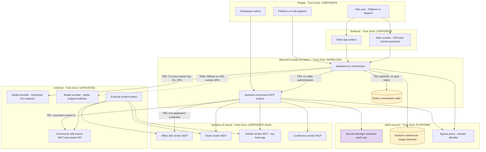
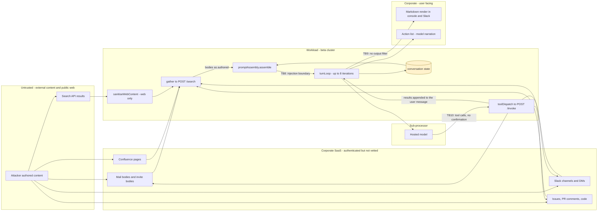
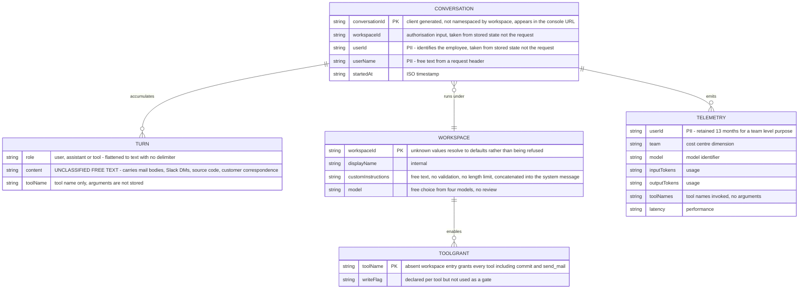
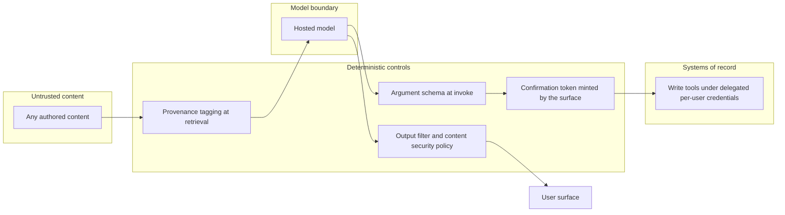

# Internal AI Assistant — Security Architecture

**Version:** 1.0 (architecture map authored before the threat model; architecture evaluation added after it) · **Date:** 2026-09-08
**Prepared by:** **Brett Crawley, Principal Application Security Engineer** — author of this security architecture document. Produced with AI assistance using the security-review skill set authored by **Brett Crawley, Principal Application Security Engineer**.
**Model:** Claude Opus 5
**Frameworks:** STRIPED · LINDDUN · OWASP Top 10 (2021) · OWASP LLM and Agentic Top 10 · Privacy by Design
**Companion documents:** `06-threat-model.md` · `04-gap-analysis.md` · `05-srtm-and-test-artefacts.md`

**Status legend:** 🔴 Open · 🟡 Partial / In progress (issue cited) · 🔵 Planned · 🟢 Mitigated / Live · ⚪ Accepted.

> This document is written in two passes, and the split is deliberate. Sections 1 to 6 are the **architecture map**: what exists, as designed and as built, including every place the two disagree. They were authored before the threat model, because the threat model iterates over the components and boundaries mapped here. Sections 7 to 9 are the **architecture evaluation**: what has to change now that the threats are known. They were authored after it.

---

## 1. Architectural context and constraints

The assistant is not a greenfield design with a security budget. It is a pilot delivered inside a set of constraints recorded at portfolio level, and most of its architecture is a consequence of them. Naming them first makes the design legible; several findings are the direct shadow of a constraint, not of an engineering mistake.

| Constraint | Source | Architectural consequence |
|---|---|---|
| Delivery inside FY26 H2; the board reporting date is fixed | PMO-0447, risk PR-01 accepted | Blocked dependencies were routed around rather than waited on. ADR-0002 is the clearest example |
| No net new headcount | PMO-0447 | Two engineers built both services. ADR-0001 records that neither writes the platform's standard language |
| Running cost must be attributable to a cost centre | PMO-0447 | Per-user telemetry retained 13 months, and per-workspace model selection with no review gate |
| Must use approved vendors; procurement will not run a new assessment | PMO-0447 | D-01 pinned the model provider; D-02 pinned vendor MCP connectors, so connector code is opaque to review |
| Group AI governance not yet defined | PMO-0447, risk PR-03, open, workstream not started | There is no policy layer above this design. The steering group accepted that governance will be retrofitted |
| Identity Platform have not scheduled delegated authorisation | PLAT-2820-1, requested 2026-04-18, not in their next two quarters | ADR-0002: one application-scoped app registration across all connectors. This is the root of the largest cluster of findings |
| The pilot group measured a confirmation step as slower than doing the work by hand | ADR-0003, PLAT-2817 acceptance criteria | Write actions execute with no confirmation |
| The platform standard is Go; the vendor MCP clients are published for Node first | ADR-0001 | A second runtime in the estate, and the shared CI templates do not fit it |

**The pattern.** Every one of these is a reasonable local decision. Taken together they produce a system in which an organisation-wide credential, an unfiltered retrieval path and an unconfirmed write path meet in one process. The architecture is not careless; it is the shape that these constraints produce when nothing pushes back.

---

## 2. System context

The dashed edge is the one the approved Confluence page does not describe. The four edges from the external content author are the ones the approved page describes as being inside the trust boundary.

---

## 3. Component decomposition

### 3.1 assistant-svc — orchestrator

**Responsibility.** Accept a turn, assemble context, call the provider, interpret and dispatch tool calls, loop to a final answer.
**Interfaces.** `POST /turns`, `GET /healthz`, and — mounted whenever `EXPOSE_DEBUG_ROUTES` is not the literal string `false` — `GET /internal/debug/conversations/:id` and `GET /internal/debug/config`.
**Dependencies.** Redis, `assistant-connectors`, the model provider, the workspace configuration file.
**Data owned.** Conversation state. Nothing else.
**Security boundary.** Workload zone. Holds both provider keys through the shared IRSA role, and by that role can read every connector credential as well.
**Failure mode.** Fails open in three places: an unknown workspace receives defaults rather than a refusal (`workspaceConfig.ts:12`), a non-200 from retrieval returns an empty chunk list and the turn answers anyway (`retrieval.ts:18`), and an enterprise 429 silently reroutes the prompt to a different provider account (`hosted.ts:32`).

### 3.2 assistant-connectors — MCP surface

**Responsibility.** Host the five connectors and expose tool listing, fan-out search and tool invocation to the orchestrator.
**Interfaces.** `GET /tools`, `POST /search`, `POST /invoke`, `GET /healthz`. None of them authenticate the caller. The service comment states that because there is no ingress route, the caller is always the orchestrator.
**Dependencies.** Four vendor MCP servers, one community MCP server, Secrets Manager, the workspace tool override file.
**Data owned.** Connector credentials in memory. No persistent store.
**Security boundary.** Workload zone, sharing an IAM role and a namespace with the orchestrator, with network policy disabled.
**Failure mode.** Fails open on authorisation: a workspace with no entry in `workspace-tools.json` receives every tool including `commit` and `send_mail` (`registry.ts:34`). Individual connector search failures are swallowed (`server.ts:29`).

### 3.3 Conversation state — Redis on ElastiCache

**Responsibility.** Hold the full conversation under `conv:{conversationId}` with a 24-hour TTL so a thread can be resumed.
**Interfaces.** Redis protocol on 6379, no auth token, no transport encryption, security group admitting the whole VPC CIDR.
**Data owned.** Everything the conversation accumulated: user text, assistant text, and every tool result verbatim.
**Security boundary.** Nominally workload zone. In practice VPC-wide, because the security group is the only control and network policy is off.
**Failure mode.** On expiry the conversation vanishes, which is also the only deletion mechanism and the reason a wrong action discovered after a day cannot be investigated.

### 3.4 Surfaces

The Slack app and the web console both render assistant output as markdown. The console sits behind the VPN with a shared password; SSO is PLAT-2831-3 and is not scheduled. The console URL carries the conversation identifier, which the incident runbook instructs users to read out of it.

### 3.5 Model provider

Two accounts behind one client. The primary is the enterprise EU endpoint contracted by Data Platform. The secondary is a pay-as-you-go account predating the enterprise agreement, used on any 429. `config.ts:31` records a 30-day provider retention for abuse monitoring; the comment at the head of `hosted.ts` describes the primary as zero retention under the DPA. Both statements are in the same repository and they disagree.

### 3.6 Connectors as built

| Connector | Kind | Read tools | Write tools | Content treated as untrusted | In the approved architecture page |
|---|---|---|---|---|---|
| Office 365 | Vendor MCP | `search_documents`, `read_calendar`, `read_mail` | `send_mail` | No | Yes |
| Slack | Vendor MCP | `search_messages`, covering channels and DMs | `post_message` | No | Yes |
| GitHub | Vendor MCP | `search_issues`, `read_file` | `comment_issue`, `update_issue`, `commit` | No | Yes |
| Confluence | Vendor MCP | `search_pages` | None | No | **No — added 2026-07-14 as a configuration change with no ticket** |
| Web search | Community MCP | `web_search` | None | Yes, via a three-expression sanitiser | Yes |

---

## 4. Data-flow diagram with trust zones

**The single most important thing this diagram shows.** Five of the six inbound content paths reach `promptAssembly.assemble` without passing through `sanitiseWebContent`. The approved Confluence trust model states that "the one place untrusted content enters is web search, which is why its output is sanitised". The four corporate SaaS paths carry content that any employee, any contractor, and — through inbound mail, public issues and Slack Connect — any member of the public can author. The `input/confluence/diagram1-assumed.svg` illustration supplied with the pack is titled *What most engineers assume* and draws exactly this misconception: four MCP tools inside one tidy corporate trust zone with the internet as the only untrusted region.

### 4.1 Trust boundaries

| ID | Boundary | Crossing | Control at the crossing | Confidence | Evidence |
|---|---|---|---|---|---|
| TB1 | User to surface | Human authentication | SSO and MFA for Slack; **shared password over VPN** for the console | Low | PLAT-2831-3 To Do; data-handling page |
| TB2 | Surface to orchestrator | Identity assertion | `x-assistant-workspace-id` and `x-assistant-user-id` headers, presence-checked only | Low | `turns.ts:16-23` |
| TB3 | Orchestrator to connector service | Service-to-service call | None. Network position only, and network policy is disabled | Low | `mcp/server.ts:5-10`; `values.yaml:22-26` |
| TB4 | Orchestrator to Redis | Conversation read and write | Security group on the VPC CIDR. No TLS, no auth token | Low | `redis.tf:12,15,23-28` |
| TB5 | Orchestrator to enterprise model endpoint | Prompt and completion | TLS, bearer key, EU region, enterprise DPA | Medium | `hosted.ts:14-26`; agreement not supplied |
| TB5b | Orchestrator to public model endpoint | Prompt and completion on 429 | Bearer key only. No DPA, region not pinned | Low | `hosted.ts:32-35`; ADR-0006 |
| TB6 | Connector service to systems of record | Tool call and search | One application-scoped credential per connector, shared across all users | Low | `serviceIdentity.ts:18-32`; ADR-0002 |
| TB7 | Web search to connector service | Untrusted content in | `sanitiseWebContent` — two literal phrases and HTML tag stripping | Low | `webContent.ts:7-18` |
| TB8 | Retrieved content to model context | Untrusted content becomes instruction | **None for the four corporate connectors** | Low | `retrieval.ts:11-21`; `promptAssembly.ts:45-51`; ADR-0004 |
| TB9 | Model output to user surface | Rendering | None. Markdown rendered as authored | Low | PLAT-2831-2; data-handling known rough edges |
| TB10 | Model output to write tools | Irreversible action | Workspace tool allowlist only, and it fails open | Low | `registry.ts:31-40`; ADR-0003 |
| TB11 | Workload to AWS control plane | Secret retrieval | IRSA, one role for both services, wildcard secret resource | Medium | `iam.tf:1-22`; `values.yaml:28-33` |
| TB12 | Namespace to namespace in the cluster | Lateral reach | Platform standard says default-deny; the chart disables it and the beta cluster has none | Low | `values.yaml:22-26`; platform controls page |

---

## 5. Data model and schemas

No relational schema was supplied. The entities below are reconstructed from `services/assistant-svc/src/types.ts`, `config.ts`, the workspace configuration files and the telemetry description on the Confluence data-handling page. Everything in this section is therefore tagged as resting on code and prose rather than on DDL.

**Per-store classification, protection and retention**

| Entity or store | Where it lives | Classification | Protection at rest | Protection in transit | Retention | Deletion path |
|---|---|---|---|---|---|---|
| CONVERSATION and TURN | Redis on ElastiCache, eu-west-1 | Confidential; may carry any classification the connectors reach, including customer personal data | AES at rest enabled | **None. Transit encryption disabled, no auth token** | 24-hour TTL | **TTL expiry only. `drop()` exists in `history.ts:28` and is not wired to any route, despite PLAT-2825-2 being Done — G-14** |
| Prompt and completion, primary | Model provider, EU endpoint | Confidential | Vendor managed | TLS | Code says 30 days for abuse monitoring; the code comment claims zero retention | **None available to us — G-15** |
| Prompt and completion, fallback | Model provider, public endpoint, region unpinned | Confidential | Vendor managed | TLS | 30 days, outside the enterprise DPA | **None — G-16** |
| TELEMETRY | Analytics warehouse | Internal, personal data at individual granularity | Not supplied | Not supplied | 13 months | **None described — G-17** |
| WORKSPACE and TOOLGRANT | JSON files in the image, path overridable by environment variable | Internal, security relevant | Filesystem only | Not applicable | Life of the image | Redeploy |
| Platform logs | Platform logging, eu-west-1 | Internal | Platform managed | Platform managed | 90 days hot, 12 months cold | Platform lifecycle |
| Connector credentials and provider keys | Secrets Manager under `assistant/*` | Secret | KMS | TLS | Until rotated | Manual, per the rotation runbook |

**Schema-level concerns.** `TURN.content` is the important one: it is a single unclassified free-text column that, by design, accumulates content of every classification the five connectors can reach. Nothing in the type, the store or the code carries a classification, a source label or a retention marker per turn, so no downstream control can treat a customer's mail body differently from a public web result. That is the schema-level root of the privacy findings and of the injection findings alike.

---

## 6. Where the documentation and the implementation disagree

This is the section the pack exists for. Each row is a claim a reader of the approved material would reasonably believe, and what the committed code actually does.

| # | The documentation says | The implementation does | Evidence | Threat model finding |
|---|---|---|---|---|
| 1 | "Each connector holds a per-user delegated credential obtained through OAuth, stored with a short TTL... A user cannot reach anything through the assistant that they could not reach directly" — approved architecture page, present tense, following D-03 | One app registration with **application** permissions across all connectors. `credentialFor()` takes `_userId` and ignores it. ADR-0002 states that a user can obtain content they could not open directly | `serviceIdentity.ts:18-32`; ADR-0002; PLAT-2820 is To Do | O1, E4, I3 |
| 2 | "Four connectors" — approved architecture page connector table | Five. Confluence was added 2026-07-14 "as a config change" with no ticket, and the page was not updated | `registry.ts:11`; `config/connectors.json:23-29`; `docs/pilot-scope.md` says five | O2 |
| 3 | "The one place untrusted content enters is web search, which is why its output is sanitised" — approved architecture page trust model | Retrieval fans out to every connector and returns bodies as authored. Only web results pass the sanitiser | ADR-0004; `retrieval.ts:11-21`; `o365.ts:17`; `github.ts:19` | AI1, AI5 |
| 4 | "Every privileged action taken by the assistant is recorded with the acting user, the action, and the parameters it was called with" — approved architecture page | `dispatch()` logs workspace and tool name at info. Arguments and results are logged at debug, and production runs at info. The acting user is not in the line at all | `toolDispatch.ts:13-18`; incident runbook step 3 confirms it | R1, R2 |
| 5 | "Debug and diagnostic endpoints... disabled in production builds" — approved platform controls page | `exposeDebugRoutes` defaults to true and the chart deliberately does not set the variable, because the runbook uses the routes in production | `config.ts:39`; `values.yaml:10`; incident runbook step 2 | I1, I2, O5 |
| 6 | "Default-deny network policies apply between namespaces" — approved platform controls page | `networkPolicy.enabled: false`, with a chart comment recording that the beta cluster does not have them, so anything in the cluster can reach these ports | `values.yaml:22-26` | O4, C3, S2 |
| 7 | "Dependency scanning... enabled on all repositories through the shared CI template. Critical findings block the build" — approved platform controls page | The workflow builds and tests only. The comment records that the template was inherited from `platform-ci`, which is exempt, so it never had one to inherit. No lockfile is committed against `npm ci` | `ci.yml:20-22`; `branch-protection-exemptions.yml`; PLAT-2077 | O3 |
| 8 | "Branch protection... requires an approving review before merge... applies across the estate", and the PLAT-2817-3 comment that this bounds the blast radius | Three repositories are exempt, including `platform-ci`, which pushes to main nightly, and `infra-bootstrap`, which provisions reviewer access. The GitHub app is org-level and `commit` writes to the working branch | `branch-protection-exemptions.yml`; `github.ts:12`; PLAT-2817-3 | E6, AI17 |
| 9 | "Hosted provider under the existing enterprise agreement... EU-hosted endpoint" — approved architecture page | On any 429 the same prompt is retried against a public endpoint with a pay-as-you-go key predating the agreement | `hosted.ts:32-35`; ADR-0006 | I4, P4 |
| 10 | "No new persistent stores... Everything else is read from the system of record at request time and not retained" — approved architecture page | Usage telemetry is written per request to the analytics warehouse and kept 13 months; the provider retains prompts 30 days | data-handling page; `config.ts:31` | P3, I5 |
| 11 | "Users can delete their own conversations" — PLAT-2825-2, Done | `history.drop()` exists and is called from nowhere in the supplied tree. No route exposes it | `history.ts:28`; no reference elsewhere | P4 |
| 12 | "Actions taken are shown in the conversation" — PLAT-2825, Done | The action list is rendered from the model's own account of what it did, and the API returns tool **names** only, with no arguments and no target | PLAT-2825-1; `turnLoop.ts:42`; `turns.ts:43-47` | AI13, R1 |
| 13 | "Content returned from web search is treated as untrusted and cleaned" — PLAT-2814 acceptance criterion | The cleaner strips HTML tags before applying a two-phrase regular expression, so tag stripping breaks the phrase it is looking for; and paraphrase is untouched | `webContent.ts:7-18`; `webContent.test.ts` tests only the literal phrase | AI6 |
| 14 | The assistant "acts as the requesting user", D-03 | `retrieval.gather()` does not send a `userId` at all, while `mcp/server.ts` destructures one from the body and passes it down. On the whole retrieval path the identity is `undefined` | `retrieval.ts:12-16` against `mcp/server.ts:22-33` | E3 |

**How this happened, and it matters for the fix.** Twelve of these fourteen are recorded honestly somewhere in the repository — in an ADR, in a chart comment, in a ticket comment, or in a runbook. The team knew. What is missing is not awareness; it is a mechanism that carries a pilot-time decision back into the approved page a reviewer reads, and a gate that stops the pilot's accepted shortcuts from becoming the general-availability design by default. The architecture evaluation in section 8 treats that as an architectural requirement, not a process nicety.

---

## 7. Control architecture and data lifecycle

*Authored after the threat model. Sections 7 to 9 are the evaluation pass.*

### 7.1 Control architecture as built

| Plane | What exists | What is missing | Findings |
|---|---|---|---|
| **Identity** | SSO with MFA for Slack and corporate systems; IRSA for the workload | Per-user identity on the console; verified assertion at the orchestrator; caller authentication at the connector service; per-user connector credentials | S1, S2, S5, E4, CL2 |
| **Authorisation** | Server-side tool allowlist per workspace at `mcp/server.ts:41` | Object-level checks on conversation resume and debug read; any user identity at all on the retrieval path; a closed default for unknown workspaces | S3, E1, E2, E3, I3 |
| **Cryptography** | TLS at the edge and to the provider; AES at rest on ElastiCache and KMS on Secrets Manager | Transit encryption and authentication to Redis; application-layer protection of conversation content; integrity marking on stored turns | T1, AI9 |
| **Network** | Perimeter termination, no ingress route, egress proxy allowlist | Default-deny network policy in the cluster the pilot runs in; narrowed Redis security group; recorded egress justification | C3, O4, T1, CL4 |
| **Detective** | Platform logging with 90-day hot retention; vendor SaaS audit logs | Arguments, acting user, correlation identifier, retention matching the detection lag, any alerting or detection rule on this workload | R1, R2, R4, R5, RR3 |
| **Provisioning** | Helm chart, Terraform, workload identity per service account | Pod security context, resource limits, automount disabled, image digest pinning, signing and admission verification | C1, C2, C4, C5, C6 |
| **AI-specific** | A three-expression sanitiser on one of five inbound content paths | Provenance on retrieved content, a confirmation gate on irreversible actions, argument schemas, an output filter, a tool-definition inventory, a kill switch | AI1 to AI17, RR1 |

The pattern is that the platform planes are largely present and the workload planes are largely absent. Every control the platform provides is doing its job; almost nothing sits between the model and the organisation's data.

### 7.2 Data lifecycle

**Collection.** Content is not collected in the ordinary sense; it is read at request time from five systems of record, which is decision D-05 and is genuinely good for privacy. What that framing misses is that the moment content is read it becomes a *copy* in the prompt, in Redis, at the processor and in the processor's retention store.

**Processing.** Five inbound paths merge into a single unclassified free-text field with no provenance (AI5). This is the architectural root of both the injection findings and the purpose-mixing findings, and no control downstream can recover a distinction that was destroyed at assembly.

**Storage.** Four stores with four different retentions and no common identifier for a data subject: Redis 24 hours, the processor 30 days, the warehouse 13 months, platform logs 12 months.

**Sharing.** One contracted sub-processor, plus an uncontracted one on any 429 (I4), plus whatever a rendered markdown image reaches (AI4).

**Retention and destruction.** One TTL, three uncontrolled copies, and a delete function wired to nothing (P4). There is no point in the lifecycle at which the organisation can say where one person's data is.

---

## 8. Security implications of the accepted ADRs

The eight ADRs are the honest record of the pilot's trade-offs. Six of them carry security consequences that the approved architecture page does not.

| ADR | Decision | Security implication | Findings |
|---|---|---|---|
| ADR-0001 | Node and TypeScript, two services | Second runtime in a Go estate; the shared CI templates do not fit, which is how the scanning gap arose | O3 |
| ADR-0002 | One app registration with application permissions | The single largest cluster in the model. Named its own consequence and its own non-propagation to Confluence | E4, I3, R3, O1, CL2 |
| ADR-0003 | Actions execute without confirmation | Removes the only deterministic gate between influenced model output and irreversible action. Its own alternatives section says confirming irreversible actions is worth revisiting and the definition is not hard | AI3, AI1, AI2 |
| ADR-0004 | Retrieval fans out to every connector, bodies as authored | Merges five trust levels into one context and one purpose. Underpins both the injection and the privacy clusters | AI1, AI5, P5, D3 |
| ADR-0005 | Workspace instructions in the system message | Makes an unvalidated free-text field part of the security-relevant prompt | T2, AI15 |
| ADR-0006 | Fall back to the public endpoint on rate limit | Switches processor under load, outside the DPA, with no owner for the revert | I4, PAC-07 |
| ADR-0007 | Workspaces choose their own model | Puts the workspace with the most sensitive data on the least capable model, on cost grounds, with no measurement | AI12 |
| ADR-0008 | Conversation state in Redis keyed by conversation | Makes an unauthenticated store the source of identity for a resumed turn, and the identifier a de facto credential | S3, T1, AI9, AI7 |

**The systemic observation.** Each ADR states its own consequence accurately. What no ADR does is state the *combined* consequence — that 0002, 0003 and 0004 together mean any content author can cause an organisation-wide write. That combination is the finding a threat model exists to surface, and it is invisible from any single decision record.

---

## 9. Assessment against principles, and the changes required

### 9.1 Assessment

| Principle | Assessment |
|---|---|
| **Defence in depth** | Fails. On the critical path there is exactly one control — a two-phrase denylist on one of five inbound paths — and behind it nothing |
| **Least privilege** | Fails at three layers: one credential set for all users, one IAM role for both services, all tools for unconfigured workspaces |
| **Secure by default** | Fails. Unconfigured workspaces get everything, debug routes ship on, network policy ships off, and the safe state requires someone to remember |
| **Fail securely** | Fails in four places: unknown workspace, unconfigured tools, swallowed retrieval errors, and provider fallback. Every failure widens capability or hides degradation |
| **Complete mediation** | Fails. Authorisation is evaluated on the tool name and never on the object, the argument, or the resumed conversation |
| **Separation of duties** | Fails. One process holds all five credentials, and one role reads every secret |
| **Economy of mechanism** | Passes. The system is small, legible and easy to reason about — which is why this review could be specific |
| **Weakest link** | The credential design, ADR-0002. Almost every High and Critical finding either is it or is amplified by it |
| **Human-centred security** | Mixed. ADR-0003 correctly identified that friction everywhere is rejected; it then removed friction everywhere instead of placing it on irreversible actions, and the compensating control cannot do its job |
| **Crypto agility and quantum readiness** | Not assessed as a gap. No bespoke cryptography exists; TLS and KMS are platform-managed. Application-layer encryption of conversation state, recommended under T1, should carry an algorithm and key-version label from the start |

### 9.2 Architectural changes required, as distinct from tactical fixes

Six changes are architectural — no amount of careful coding fixes them.

1. **A deterministic action gate outside the model.** Reversibility as a first-class property of every tool, and a confirmation token minted by the surface and verified at the connector service. This is the structural answer to AI1, AI2 and AI3, and it is what makes every other AI control a defence-in-depth layer rather than the only layer.
2. **Provenance as a data type, not a formatting convention.** `RetrievedChunk` and `Turn` gain source, trust level and classification, carried through assembly in structured blocks. Without this, purpose limitation and injection resistance are both unimplementable.
3. **Identity that is verified at every hop, and per-user at the connector.** The gateway assertion, connector authentication, and the delegated credential are one change with three parts; doing only the third leaves S1 and S2 intact.
4. **An audit plane separate from the diagnostic log.** Structured, correlated, retained on the platform's schedule and independent of the conversation TTL.
5. **Fail-closed defaults throughout.** Unknown workspace, unconfigured tools, failed retrieval and rate-limited provider must all narrow capability rather than widen it.
6. **A propagation mechanism from ADR to approved page.** The divergence table and the expansion gate, so a pilot's accepted shortcut cannot become the general-availability design by default. This is the change that prevents the *next* pack from finding the same class of problem.

### 9.3 Target design

Every arrow leaving the model passes through a control that does not depend on the model behaving. That is the difference between the current design and the target one.

---

## 10. New requirements surfaced

The architecture pass surfaced requirements that were not in the epic, the initiative or the design pages. They are carried into `04-gap-analysis.md` and the SRTM with their provenance.

- **SEC-N1** Every irreversible tool call requires a confirmation token minted by the surface and verified server-side. *From SAC-01, AI3.*
- **SEC-N2** Retrieved content and tool results carry source, trust level and classification as structured fields through assembly. *From AI1, AI5, P5.*
- **SEC-N3** Every inter-service call is authenticated by workload identity, and the connector service derives workspace from the authenticated principal. *From S2.*
- **SEC-N4** Every unknown or unconfigured workspace, tool or credential resolves to no capability. *From E1, E2.*
- **SEC-N5** An audit event exists per write action, correlated across services, retained independently of the conversation TTL. *From R1, R4, R5.*
- **SEC-N6** Write capability can be disabled globally, per workspace and per tool without a deployment. *From RR1.*
- **SEC-N7** The behaviour-determining inventory — models, prompt files, connector versions, tool schemas — is versioned and verified at start-up. *From AI10, AI11.*
- **PRV-N1** Every persisted copy of conversation content has a named deletion path and a subject locator. *From P4.*
- **PRV-N2** Retrieval returns the minimum content needed for the question rather than whole bodies. *From P2, P5.*
- **COMP-N1** No workspace processes a data category outside its recorded lawful basis, enforced by the connector allowlist. *From P1, PUC-01.*
- **COMP-N2** No prompt leaves the contracted processor set under any load condition. *From I4.*
- **OPS-N1** Pilot expansion is blocked while any ADR marked as not written back is open against an approved page. *From O1, O2.*

I recommend feeding SEC-N1 to SEC-N7, PRV-N1, PRV-N2 and COMP-N1 to COMP-N2 back through the requirements baseline so they are classified, given compliance mappings and traced in the SRTM before the remediation work is scheduled.

---
