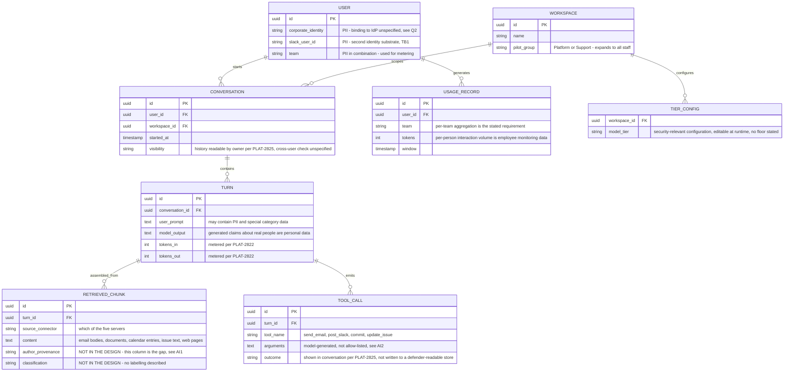
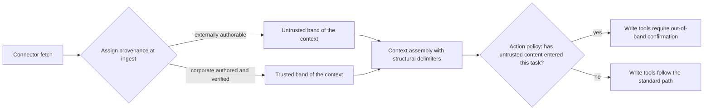
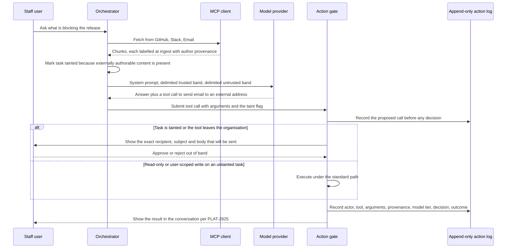

# Internal AI Assistant (PLAT-2810) — Security Architecture

**Version:** 1.0 (architecture map reconstructed from the epic; evaluation added after the threat model) · **Date:** 2026-09-09
**Prepared by:** **Brett Crawley, Principal Application Security Engineer** — author of this security architecture document; produced with AI assistance.
**Model:** Claude Opus 5
**Frameworks:** C4 · STRIDE/STRIPED · LINDDUN · OWASP Top 10 (2021) · OWASP LLM and Agentic Top 10 · Privacy by Design · Hoepman privacy strategies
**Regulatory scope:** UK GDPR and EU GDPR (employee and third-party personal data); EU AI Act (limited-risk transparency, conditional on EU deployment); NIS2 (conditional on the organisation's entity classification); CRA (assessed, out of scope); PSTI (assessed, out of scope); SOC 2 and ISO 27001 (internal control framework, conditional)
**Companion documents:** `00-context-sources-and-open-questions.md` · `02-use-abuse-and-security-privacy-use-cases.md` · `04-gap-analysis.md` · `05-srtm-and-test-artefacts.md` · `06-threat-model.md`
**Method:** Architecture reconstructed from PLAT-2810, PLAT-2814, PLAT-2817, PLAT-2822 and PLAT-2825 acceptance criteria and from `diagram1-assumed.svg`, then re-drawn with trust boundaries placed where the data's authorship actually changes rather than where the network does.

**Status legend:** 🔴 Open · 🟡 Partial / In progress (issue cited) · 🔵 Planned · 🟢 Mitigated / Live · ⚪ Accepted. Severities: Critical / High / Medium / Low / Info.

> **This document was authored in two passes, deliberately.** Sections 1 to 6 are the *map*: what the design says exists, drawn honestly, written before the threat model so the threat model has components and boundaries to iterate over. Sections 7 to 10 are the *evaluation*: what to build instead, written after the threat model so the judgement is informed by the findings. The map does not judge; the evaluation does.

---

## 1. Architectural context and constraints

**What is being built.** An agentic LLM assistant for internal staff, reachable from Slack and from a web console. It answers questions in natural language by retrieving content from Office 365 documents and calendar, corporate email, Slack, GitHub issues, pull requests and code, and public web search; and it *acts* — sending email, posting to Slack, commenting on and updating GitHub issues, and committing code. It runs a reasoning loop over MCP tool connections. Cost is controlled by routing each task to the smallest acceptable model, with cheaper tiers configurable per workspace. It is piloting with the Platform and Support teams and is intended to open up to the whole organisation.

**The constraints the design has committed to, and what each one costs.**

| Constraint | Ticket | Architectural consequence |
|---|---|---|
| Response under 6 seconds for a typical question | PLAT-2810 | A hard latency budget that any synchronous security control must fit inside. It is the stated reason a confirmation step was rejected, so it is load-bearing on the system's whole risk posture, not a performance detail. |
| No separate confirmation step on actions | PLAT-2817 | Removes the one control that is reliable regardless of whether the model is behaving. Every irreversible action is reachable from a single reasoning step. |
| Internal sources are trusted because they are behind authentication | PLAT-2814 | Fixes the trust boundary at the network and identity layer rather than at the authorship layer. This is the central architectural error and §3 re-draws around it. |
| Cheapest acceptable model per task; cheaper tiers per workspace | PLAT-2822 | Makes model capability a per-workspace, cost-driven variable. Whatever robustness the model contributes is therefore not a constant of the architecture. |
| Actions shown in the conversation; user reviews own history | PLAT-2825 | Places the audit record in the user-facing channel and scopes it to the actor. There is no described record a defender or an investigator can read. |
| Available in Slack and in the web console | PLAT-2810 | Two entry points with different identity substrates and different rendering engines. Both must be modelled. |

**Assumptions carried, each flagged so the team can correct it in one line.** (a) The model is a hosted third-party inference service, because PLAT-2822 meters tokens and offers tiers, which is the shape of a metered vendor API; (b) MCP servers are separate processes reached over a transport, per the diagram's labelling of each connector as "(MCP)"; (c) there is a persistent conversation and history store, because PLAT-2825 requires history review; (d) the assistant runs as a hosted service inside the corporate estate rather than on each user's device; (e) no retrieval index or vector store has been decided on yet, and retrieval is live query against each connector. Assumptions (a) to (d) follow from the tickets. Assumption (e) is a guess, flagged as such, and it is why finding AI13 is tagged "if present".

**What is deliberately not asserted here.** There is no deployment topology, no cloud provider, no cluster, no network design, no CI definition and no schema in the input, so this document does not invent one. Where a section would require them, it says so.

---

## 2. System context (C4 level 1) with trust zones

```mermaid
flowchart TB
    subgraph PEOPLE ["People - Trust Zone: AUTHENTICATED STAFF"]
        U["Staff user in Platform or Support pilot"]
        ADM["Workspace administrator"]
    end

    subgraph EDGE ["Entry points - Trust Zone: CORPORATE APPLICATION"]
        SL["Slack app surface"]
        WC["Web console"]
    end

    subgraph CORE ["Assistant - Trust Zone: CORPORATE APPLICATION"]
        ORCH["Reasoning loop and orchestrator"]
        ROUTER["Model tier router - PLAT-2822"]
        MCPC["MCP client"]
        CONV[("Conversation and history store")]:::data
        METER[("Per-team token usage store")]:::data
    end

    subgraph VENDOR ["Model provider - Trust Zone: THIRD PARTY PROCESSOR"]
        LLM["Hosted inference API"]
    end

    subgraph CONN ["MCP servers - Trust Zone: MIXED, SEE TB4"]
        O365["Office 365 server - documents and calendar"]
        MAIL["Email server - read and send"]
        SLK["Slack server - read and post"]
        GH["GitHub server - issues, PRs, code, commit"]
        WEB["Web search server"]
    end

    subgraph SOR ["Systems of record - Trust Zone: CORPORATE DATA"]
        O365D[("Documents and calendar")]:::data
        MAILD[("Mailboxes")]:::data
        SLKD[("Slack workspaces and channels")]:::data
        GHD[("Repositories and issue tracker")]:::data
    end

    subgraph EXT ["Outside - Trust Zone: UNTRUSTED"]
        NET["Public internet and web search index"]
        EXTP["External correspondents, customers, contractors, anonymous issue authors"]
    end

    U -->|"TB1: prompt"| SL
    U -->|"TB1: prompt"| WC
    ADM -->|"TB7: tier and connector configuration"| ROUTER
    SL --> ORCH
    WC --> ORCH
    ORCH --> ROUTER
    ROUTER -->|"TB2: prompt plus assembled context leaves the estate"| LLM
    LLM -->|"TB2: completion and tool calls return"| ROUTER
    ORCH --> MCPC
    ORCH --> CONV
    ROUTER --> METER
    MCPC -->|"TB3 and TB5"| O365
    MCPC -->|"TB3 and TB5"| MAIL
    MCPC -->|"TB3 and TB5"| SLK
    MCPC -->|"TB3 and TB5"| GH
    MCPC -->|"TB3 and TB8"| WEB
    O365 --> O365D
    MAIL --> MAILD
    SLK --> SLKD
    GH --> GHD
    WEB -->|"TB8: egress with attacker-choosable destination"| NET
    EXTP -->|"TB4: writes content that the connectors later read as trusted"| MAILD
    EXTP -->|"TB4: writes content that the connectors later read as trusted"| GHD
    EXTP -->|"TB4: writes content that the connectors later read as trusted"| SLKD
    EXTP -->|"TB4: writes content that the connectors later read as trusted"| O365D

    classDef data fill:#fff2cc,stroke:#7f6000
```

**Read the diagram against the one in the input.** The supplied sketch has four nodes inside a dashed "Corporate trust zone" and one untrusted edge. This one has the same connectors, plus the six components the epic requires but the sketch omits — web console, conversation store, usage metering, model router, MCP client and the model provider itself — and it adds the actor the sketch has no node for at all: **the external party who authors the content those connectors read**. That actor is the reason TB4 exists and is the difference between the two models.

---

## 3. Trust boundaries

Eight boundaries. TB4 is the one the supplied design does not have, and it carries most of the risk.

| ID | Boundary | What crosses | Control at the crossing, as designed | Confidence | Evidence / open question |
|----|----------|--------------|--------------------------------------|-----------|--------------------------|
| **TB1** | Person to assistant, at the Slack app and at the web console | The user's prompt; the user's asserted identity | Not stated. Two different identity substrates with no named single authority. | **Low** | PLAT-2810 acceptance criterion; Q1, Q2 in `00-context` §5.1. Finding S2. |
| **TB2** | Assistant to hosted model provider | Prompt, system prompt, tool definitions, and every retrieved excerpt assembled as context — the richest cross-system extract the organisation produces | Not stated. No contract, region, retention or training-use commitment in the input. | **Low** | Inferred from PLAT-2822 metering and tiering; Q6. Findings I6, P1, P3. |
| **TB3** | MCP client to each of five MCP servers | Tool definitions and descriptions inbound; tool arguments outbound; tool results inbound | Not stated. No pinning, signing, namespacing or per-server sandbox described. | **Low** | `diagram1-assumed.svg` labels each connector "(MCP)"; Q13. Findings AI3, AI4, AI15. |
| **TB4** | **Authorship boundary inside each connector** — between the party that may *read* a store and the party that may *write* its content | Attacker-authored text arriving as an email body, a GitHub issue or pull-request body, a Slack message from a guest or an integration, or a shared document or calendar invitation | **None. The design asserts this boundary does not exist**, in the PLAT-2814 acceptance criterion that internal sources need no untrusted-content handling. | **None — the control is absent by design** | PLAT-2814 acceptance criterion, quoted in `00-context` §1.1. Findings O1, AI1. |
| **TB5** | Reasoning loop to write-capable tools | Send email, post to Slack, comment on and update GitHub issues, commit code | **None. PLAT-2817 removes the confirmation step explicitly.** No allow-list of arguments, no separation of routine from irreversible, no per-action authorisation described. | **None — the control is absent by design** | PLAT-2817 acceptance criterion. Findings AI2, AI7, AI21, E5. |
| **TB6** | Between MCP servers, through the shared model context | Content retrieved by one server becoming an argument to another server's tool | Not stated. One MCP client is connected to five servers concurrently with no described data-flow policy between them. | **Low** | Inferred from the single-client, five-server topology in the diagram. Finding AI11. |
| **TB7** | Workspace to workspace, and pilot group to general population | Model tier configuration, connector enablement, and any content co-mingled across workspaces | Not stated. PLAT-2822 makes tier configurable per workspace; PLAT-2810 says "pilot then open up" with no gate described. | **Low** | PLAT-2822 and PLAT-2810 acceptance criteria; Q15, Q20. Findings E3, E4, O3. |
| **TB8** | Assistant to public internet, through the web search server | Search queries outbound; page content inbound; any URL the model chooses to fetch | Partial. PLAT-2814 says web content is "treated as untrusted and cleaned" but does not define what cleaning is, what performs it, or what it removes. No egress allow-list is described. | **Low** | PLAT-2814 acceptance criterion; Q14. Findings I3, AI1, AI25. |

**The load-bearing observation.** The supplied model draws its boundaries where the *network* changes. The data does not respect that. An email body crosses from an anonymous author on the internet into an authenticated corporate mailbox without ever crossing a network boundary the design can see, and arrives in the model's context wearing the mailbox's trust rating rather than its author's. TB4 is where that laundering happens, and it is the boundary the whole design is missing.

---

## 4. Component decomposition

Each component is reconstructed from an acceptance criterion. None is described in any design document, because none was supplied.

### 4.1 Entry surfaces

**Slack app surface** — *Responsibility:* accept prompts in Slack and render responses. *Interfaces:* Slack events and interactivity; renders Slack markdown including images and links. *Security boundary:* TB1. *Credentials needed:* a Slack app token and the identity mapping from Slack user to corporate user. *Failure mode:* unspecified; a failed identity mapping must fail closed, and nothing says it does.

**Web console** — *Responsibility:* the same, in a browser. *Interfaces:* HTTP; renders model output, presumably as markdown or HTML. *Security boundary:* TB1. *Failure mode:* unspecified. *Note:* absent from the supplied diagram entirely, though PLAT-2810 makes it an acceptance criterion.

### 4.2 Assistant core

**Reasoning loop and orchestrator** — *Responsibility:* assemble context, call the model, execute the tool calls the model emits, iterate until the task is done. *Data owned:* the working context for a turn. *Security boundary:* sits astride TB2, TB3, TB5 and TB6 simultaneously; it is the confluence point and therefore the highest-value component in the system. *Failure mode:* no bound on iterations, retries or fan-out is described.

**Model tier router (PLAT-2822)** — *Responsibility:* choose the smallest acceptable model for the task, honouring the workspace's configured tier. *Data owned:* tier configuration per workspace. *Security boundary:* TB2, TB7. *Note:* this component makes the model that processes a given prompt a function of the workspace's budget.

**MCP client** — *Responsibility:* maintain connections to five MCP servers, present their tool definitions to the model, dispatch tool calls. *Security boundary:* TB3, TB6. *Note:* a single client connected to five servers means five sets of tool descriptions arrive in one context and five sets of returned data are available to be passed as arguments to each other.

**Conversation and history store** — *Responsibility:* persist conversations and the action record PLAT-2825 requires. *Data owned:* the highest-concentration cross-system data set in the organisation; see §5. *Security boundary:* TB1 on read, TB7 on tenancy. *Retention:* not stated anywhere.

**Per-team token usage store (PLAT-2822)** — *Responsibility:* meter consumption per team and expose it to teams. *Data owned:* per-team, and by implication per-user, usage records. *Privacy note:* per-person interaction volume with an assistant that reaches email and calendar is employee-monitoring data whether or not it was intended as such.

### 4.3 Connectors

Five MCP servers: Office 365 (documents and calendar), Email (read and send), Slack (read and post), GitHub (issues, pull requests, code, commit) and Web search. Each is a distinct trust proposition and the design treats four of them as one. Their provenance, versions, transport, authentication and sandboxing are all unstated — question Q13.

**The read and write split matters and the design does not make it.** Four of the five connectors are both readers and writers. The GitHub connector reads code and *commits* code. The Email connector reads mailboxes and *sends* mail. That is a single component holding both halves of an exfiltration primitive.

---

## 5. Data model and data classification

No schema was supplied. This model is derived from what the acceptance criteria necessarily imply, and every classification is inferred rather than read from a column list. Findings that rest on it are tagged "if present" in the threat model.

**Two attributes in that model do not exist in the design, and both are marked.** `RETRIEVED_CHUNK.author_provenance` and `RETRIEVED_CHUNK.classification` are drawn because their absence is the finding. Content arrives in the context with no record of who wrote it and no sensitivity label, which is precisely why an email body from an anonymous sender is indistinguishable, at the point the model reads it, from a document written by the CTO.

### 5.1 Per-store classification, protection and retention

| Store | Where it lives | Classification | Protection at rest | Retention | Deletion path |
|---|---|---|---|---|---|
| Conversation and history store | Corporate estate, location unstated | **Confidential.** Personal data of staff and of third parties; special-category data reachable via calendar, email and HR documents | **Unstated — no encryption requirement exists in any ticket** | **None stated** | **None — G-12, finding P3** |
| Retrieved-chunk content within conversations | Same store | Inherits the classification of the *most sensitive* source it drew from, per turn | **Unstated** | **None stated** | **None — P3, P4** |
| Per-team token usage store | Corporate estate | Internal; personal data by aggregation; employee-monitoring risk | **Unstated** | **None stated** | **None — P6** |
| Model provider context and provider-side logs | **Third country, unknown** | Whatever the turn assembled — potentially the organisation's most sensitive content | **Unknown — no DPA or contract in the input** | **Unknown** | **Unknown — I6, P1, P7** |
| Retrieval index or vector store | Existence unknown | Would inherit every source's classification in one co-mingled corpus | Unknown | Unknown | Unknown — AI13, tagged "if present" |
| Systems of record: mailboxes, documents, Slack, repositories | Existing corporate systems | Pre-existing classification, unchanged by this project | Existing controls | Existing | Existing — the assistant does not change these, but it does create a second copy of their content in the conversation store, which has none of their controls |

**The structural point in that table.** The conversation store becomes a shadow copy of selected content from every system of record, assembled by relevance rather than by permission, with none of the source systems' retention rules, deletion paths or access controls carried across. A subject access request against the assistant is answerable only if this store is enumerable per person, and nothing in the design says it is.

---

## 6. Control architecture as designed

This is the map, not the evaluation. It records what the input describes.

| Control domain | What the design describes | Gap |
|---|---|---|
| **Identity** | That users reach the assistant from Slack and from a web console. Nothing about how either asserts identity, nothing about how the assistant authenticates to connectors, nothing about token lifetime or revocation. | No identity model exists. S2, S4, S5, AI8. |
| **Authorisation** | Nothing. No statement that a retrieval respects the requesting user's entitlements in the source system, and no statement that a tool call is checked against what that user may do. | No authorisation model exists. E1, E2, I2. |
| **Cryptography** | Nothing. No TLS requirement, no encryption-at-rest requirement, no key management, no statement of algorithms. | No cryptographic requirements exist. T5, I4, and crypto agility is unaddressed. |
| **Network** | Nothing beyond the implied reachability of five MCP servers and a hosted model API. No egress control, no allow-list, no segmentation. | I3, TB8. |
| **Input handling** | One sentence: web-search content is "treated as untrusted and cleaned". Undefined, and scoped to one connector of five. | AI1, and the definition gap itself. |
| **Output handling** | Nothing. Model output is rendered in Slack and the web console and is sent outward as email, Slack posts, issue comments and commits, with no described filter at any sink. | AI6, AI25. |
| **Detective** | PLAT-2825: actions shown in the conversation; user reviews own history. That is a user-facing feature, not security telemetry. | No defender-readable record exists. R1, R2, O2. |
| **Provisioning and configuration** | PLAT-2822: model tiers configurable per workspace. No change control on that configuration, no floor, no review. | T1, AI20. |
| **Rate and cost** | PLAT-2822: usage *tracked* per team and visible to teams. Tracking is not capping. | D1, D2, and the "an alert is not a limit" rule. |
| **Human factors** | PLAT-2817 records that the pilot group rejected confirmation dialogs as too slow. That is a genuine and correct usability observation about *undifferentiated* confirmation, and the design's response was to remove confirmation entirely rather than to make it risk-proportionate. | AI21, and PRV·H3. |

### 6.1 Data lifecycle as designed

1. **Collection** — content is pulled from five connectors at query time, selected by relevance to a prompt. No purpose limitation is expressed, no minimisation step is described, and the selection criterion is the model's judgement of relevance rather than the user's entitlement.
2. **Processing** — assembled into a prompt and sent across TB2 to a third-party inference service. The model emits text and tool calls.
3. **Storage** — persisted in the conversation and history store to satisfy PLAT-2825. Nothing states what is stored, for how long, or with what protection.
4. **Sharing** — outward through four write-capable tools and one search egress. Content can leave the organisation as an email to any address, a post in any channel the connector can reach, an issue comment on a public repository, or a URL parameter in a web fetch.
5. **Retention** — no policy exists in the input.
6. **Destruction** — no deletion path exists in the input, in any store.

Stages 5 and 6 are empty, and stage 1 has no basis recorded. That is the shape of a system that will be difficult to make lawful after the fact and straightforward to make lawful now.

---
---

## 7. Evaluation — the target architecture

*Authored after `06-threat-model.md`. Everything above describes the system as designed. Everything below is the response to what the threat model found.*

The threat model's headline is that the design contains the lethal trifecta — access to private data, exposure to attacker-authored content, and an outward channel — with the human confirmation step explicitly removed. Four architectural changes address that; everything else in the gap analysis is a tactical fix that does not need the architecture to move.

### 7.1 ARCH-1 — Move the trust boundary from the network to the authorship of the content

**The change.** Every piece of content entering the model's context carries a provenance label assigned at ingest by the connector that fetched it, not by the network zone it came from. The label answers one question: *could a party outside the organisation have authored this text?* An email body: yes. A GitHub issue on a public repository: yes. A Slack message in a channel with guests or an incoming webhook: yes. A document with external sharing enabled: yes. A commit on a protected branch by a verified corporate identity: no.

**Why it must be architectural.** The label has to be attached where the content is fetched, because that is the only place the answer is knowable. Attaching it later means inferring authorship from text, which is exactly the guess the model cannot be trusted to make.

**What it buys.** It turns "did a prompt injection succeed?" — unanswerable — into "did untrusted content enter this task?" — a deterministic fact the orchestrator knows. That is the ATLAS `AML.M0030` control, and it is the single highest-value change in this document. Addresses AI1, AI11, AI18, O1.

### 7.2 ARCH-2 — Risk-proportionate confirmation, not undifferentiated confirmation

**The change.** Classify every tool by reversibility and by blast radius, and gate on the classification rather than on every call. Reads: no gate. Writes confined to the requesting user's own scope, such as a draft in their own drafts folder: no gate. Writes visible to others or leaving the organisation — send email, post to a channel, comment on an issue, push a commit: gate, and the gate is out-of-band, meaning the confirmation is rendered from the *arguments the orchestrator will actually execute*, not from the model's description of them.

**Why this answers the pilot group rather than overruling them.** PLAT-2817's finding was that a confirm dialog *on every action* is slower than doing the work by hand. That is correct, and it is an argument against undifferentiated friction, not against friction. Most turns in a "what's blocking the release" workload are reads and will be untouched. The subset that sends mail to an external address is where the 6-second budget can afford to stop. Addresses AI2, AI7, AI21, E5, RR1.

### 7.3 ARCH-3 — One identity per user per task, propagated to the data layer

**The change.** The assistant holds no standing access of its own. Each tool call carries a short-lived credential minted for the requesting user, scoped to the single tool being called and the single task in flight, and every connector evaluates authorisation against that identity in the system of record. Retrieval returns what *that user* may read, enforced by Office 365, Slack, GitHub and the mail server — not filtered afterwards by the assistant.

**Why it must be architectural.** It is the difference between "the assistant reaches everything and shows you your slice" and "the assistant reaches your slice". Only the second survives a compromise of the reasoning loop, and only the second makes the audit trail meaningful downstream. Addresses AI8, E1, E2, E4, I2, R3, S4.

### 7.4 ARCH-4 — A defender-readable action record, separate from the user-facing one

**The change.** Every tool call is written to an append-only store the assistant's own identity cannot rewrite, carrying: the human principal, the workspace, the tool, the full arguments, the provenance labels of every chunk in the context at the time, the model and tier that produced the call, the tool description version in force, the decision, and the outcome. PLAT-2825's in-conversation display stays exactly as designed — it is a good feature — and this sits behind it.

**Why both are needed.** The conversation view answers "what did it do for me?". It cannot answer "did anything in the estate get instructed by a document to email itself to an outside address last Tuesday?", because it is scoped to one user and stored where the acting component can change it. Addresses R1, R2, R4, O2, and it is the telemetry that makes the ATLAS attack path in the threat model observable.

### 7.5 Sequence: the target flow for a write action

---

## 8. Security implications of the design decisions already accepted

The team has made three decisions that function as accepted ADRs. Each should be written down as one, so the residual is carried knowingly rather than inherited silently.

| Decision, as recorded in the tickets | Security implication | Recommended disposition |
|---|---|---|
| **PLAT-2814**: internal sources need no untrusted-content handling because they are behind authentication | Confuses read authorisation with content authorship. It is the precondition for every indirect-injection path in the threat model. | **Reverse.** ARCH-1. This is not a residual to accept; it is a factual error about where the data comes from. |
| **PLAT-2817**: no confirmation step, on pilot-group usability feedback | Removes the only control that holds when the model does not. Makes every irreversible action reachable from one reasoning step over attacker-authored input. | **Reframe, do not simply reinstate.** ARCH-2 keeps the usability finding intact and applies friction only where the blast radius earns it. |
| **PLAT-2822**: cheaper model tiers configurable per workspace | Whatever injection resistance the model contributes becomes a per-workspace budget decision, and the cheapest tier is the weakest. Because the deterministic controls do not yet exist, the model is currently the only thing between an injected instruction and a sent email. | **Accept with a floor.** Tiering is a legitimate cost control once ARCH-1 to ARCH-4 exist, because then the model's robustness is a backstop rather than the guarantee. Set a minimum tier for any task that can reach a write tool, and record the residual in an ADR. |

---

## 9. Assessment against principles

| Principle | Posture | Note |
|---|---|---|
| **Defence in depth** | **Fails.** | There is one layer — the model's judgement — and the design's own cost lever makes that layer configurable downward per workspace. |
| **Least privilege** | **Fails.** | The agent holds every connector's full capability on every request regardless of the task. E1, AI7. |
| **Secure by default** | **Fails.** | The default for a new workspace is the full connector set with no confirmation. E3, AI7. |
| **Fail securely** | **Unknown, and probably fails.** | Under a 6-second budget with a slow connector, the described behaviour is nothing. D4 covers the likely fail-open. |
| **Complete mediation** | **Fails.** | No authorisation decision is described on any retrieval or any tool call. E2, I2. |
| **Separation of duties** | **Fails.** | One component reads mailboxes and sends mail; one component reads code and commits code. Both halves of an exfiltration primitive in a single trust context. |
| **Economy of mechanism** | **Mixed.** | The design is genuinely simple, which is a real virtue — but the simplicity comes from having omitted the controls, not from having found an elegant way to enforce them. |
| **Human-centered security** | **Partially strong.** | PLAT-2817's usability observation is correct and well-evidenced from the pilot. The response drew the wrong conclusion from good data. ARCH-2 keeps the data and changes the conclusion. |
| **Crypto agility and quantum readiness** | **Not addressed.** | No cryptography is specified at all, so there is nothing to be agile about yet. Raised now because the conversation store is a long-lived confidentiality asset and a harvest-now-decrypt-later target: specify algorithm and key-version metadata on stored records before the first record is written, not after. |
| **Proportionality** | **Fails in the direction that matters.** | The controls are proportionate to a read-only FAQ bot. The system is an autonomous actor with write access to email, chat and source code. |

**Credit where it is due, and it is due in three places.** The latency requirement is quantified rather than aspirational, which is rare and makes the security trade-off discussable instead of arguable. PLAT-2825 exists at all — a lot of agentic designs ship with no action visibility whatsoever, and this team wrote it in as an acceptance criterion before any security review asked. And PLAT-2814 *does* identify untrusted content as a category and *does* commit to handling it — the boundary is drawn in the wrong place, but the team was thinking about the right problem, which is a much better starting position than not having thought about it.

---

## 10. New requirements this architecture surfaces

Fed back into the requirements baseline in `04-gap-analysis.md` §4 and traced in `05-srtm-and-test-artefacts.md`.

- **SEC-20** — Every retrieved chunk carries an author-provenance label assigned by the connector at ingest, and the label is persisted with the chunk. *(from ARCH-1)*
- **SEC-21** — The orchestrator maintains a per-task taint flag set when any externally-authorable chunk enters the context, and the flag is an input to the action gate. *(from ARCH-1)*
- **SEC-22** — Tools are classified by reversibility and blast radius, and the classification is a property of the tool registry, not of the prompt. *(from ARCH-2)*
- **SEC-23** — Confirmation for gated actions renders the arguments the orchestrator will execute, obtained out of band from the model's own description of them. *(from ARCH-2)*
- **SEC-24** — Tool calls execute under a short-lived credential minted per user per task per tool; the assistant holds no standing access. *(from ARCH-3)*
- **SEC-25** — Authorisation for retrieval is evaluated by the system of record against the requesting user, not applied as a filter after retrieval. *(from ARCH-3)*
- **SEC-26** — An append-only action log records actor, workspace, tool, arguments, context provenance, model and tier, tool-description version, decision and outcome; the assistant's identity has append-only rights to it. *(from ARCH-4)*
- **SEC-27** — A minimum model tier applies to any task in which a write tool is reachable. *(from §8)*
- **PRV-10** — The conversation store is enumerable and deletable per data subject, including retrieved chunks and generated content. *(from §5.1)*
- **PRV-11** — Records in the conversation store carry the algorithm and key-version metadata needed to re-encrypt without re-architecting. *(from §9 crypto agility)*
- **COMP-08** — A DPIA is completed before the pilot expands beyond Platform and Support. *(from §6.1 and finding P7)*

---

*This document reflects the inputs as supplied on 2026-09-09. The architecture in §2 to §6 is reconstructed from acceptance criteria, not validated against a design document or an implementation, because neither was supplied. Statuses tied to ticket references are point-in-time. Nothing here is legal advice; the GDPR and EU AI Act items should be confirmed with counsel and the Data Protection Officer.*
