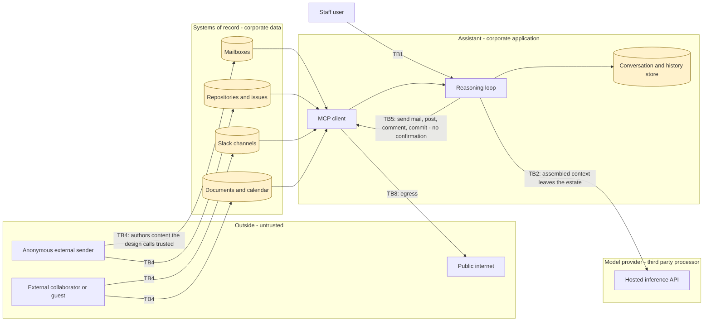
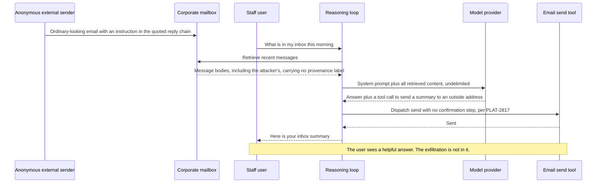

# Internal AI Assistant (PLAT-2810) — Threat Model

**Version:** 1.1 (validation-session merge) · **Date:** 2026-09-09
**Supersedes:** version 1.0 of 2026-09-09, the pre-session pack. See §1 for the delta.
**Prepared by:** **Brett Crawley, Principal Application Security Engineer** — author of this threat model; produced with AI assistance.
**Model:** Claude Opus 5
**Validated:** validation session of 2026-09-09, 14:00 to 15:35, facilitated by Brett Crawley, Principal Application Security Engineer, with Dana Whitfield (epic owner, Product), Marcus Oyelaran (lead architect), Priya Raghunathan (senior engineer, built the pilot), Tom Egerton (engineering manager, Support), Ines Ferreira (Data Protection Officer) and Kwame Osei (Security Champion, Platform). Full log at Appendix G.
**Companion:** `03-security-architecture.md` (architecture map, trust boundaries, data model) · `02-use-abuse-and-security-privacy-use-cases.md` (use, abuse and counter-use cases) · `06-threat-model-candidates.md` (phase 1 elicitation record) · `04-gap-analysis.md` · `05-srtm-and-test-artefacts.md` · `01-security-review.md`
**Method:** STRIPED per element against the components and trust boundaries mapped in the architecture review, with the LINDDUN and AI-specific privacy pass under Privacy; AI/ML surface via the Elevation of Autonomy deck, the AI extension instrument, OWASP LLM and Agentic Top 10, and MITRE ATLAS for attack-path sequencing and likelihood; mapped to OWASP Top 10 (2021), UK and EU GDPR, and the other frameworks assessed in §8. Version 1.1 merges the validation-session transcript without re-walking the instruments.

**Status legend:** 🔴 Open · 🟡 Partial / In progress (issue cited) · 🔵 Planned · 🟢 Mitigated / Live · ⚪ Accepted. Severities: Critical / High / Medium / Low / Info.

**Session provenance.** Every claim in this version that came from the validation session rather than from the supplied tickets is tagged **`[session 2026-09-09]`** at the point it is made, with the speaker named where the claim is a statement of fact about the running system — for example `[session 2026-09-09 · Priya Raghunathan]`. Untagged text is unchanged from version 1.0 and still rests on 2.5 KB of tickets and one diagram. Where the session contradicted an assumption version 1.0 made, the contradiction is stated in place and marked **`[contradicts v1.0]`** rather than edited away.

> This document covers PLAT-2810 and its four child stories as supplied, plus the trust-boundary sketch shipped alongside them. Version 1.0 rested on those two inputs and nothing else — no repository, no design page, no schema — and `00-context-sources-and-open-questions.md` records exactly what that cost. Version 1.1 adds what the owners said in a 95-minute walkthrough; it does not add a repository, a schema or an infrastructure definition, so the design-versus-implementation reconciliation is still not possible. Every significant finding below carries a concrete example threat and a concrete example mitigation inline, so the finding can be understood and argued about without opening another file. Findings are grouped by STRIPED letter; the AI and agentic surface is §6b, which is where most of the severity lives.

---

## 1. What changed from the previous pass

**Version 1.1 supersedes version 1.0 of 2026-09-09.** Nothing was built between the two versions and no control was added, so this is not the usual accumulation delta that credits a team for fixes. Version 1.0 was written from 2.5 KB of tickets and one diagram. Version 1.1 adds what seven people who own the system said out loud in a 95-minute validation session, and the honest summary of that session is this: **no finding was closed, two findings were added, two ratings moved and both moved upward, and roughly a dozen places where version 1.0 said "not stated" now say what is actually true.** That is a smaller result than a validation session is usually expected to produce and a more useful one than it looks, because the pack's own arithmetic was wrong in two places and a decision everyone believed had been made turned out never to have been made by anybody.

| Version 1.0 worry | Reality found this pass | Verdict |
|---|---|---|
| **AI1** — internal connector content is classified trusted, so attacker-authored text reaches the model as instruction | Confirmed, and it firms up rather than moves. The Support shared mailbox is the single connector the pilot most wants, and every message in it is authored by a customer or a stranger; three Slack Connect channels are shared with two enterprise customers who raise most of their issues through them. Nobody in the room disputed that an email body is authored by whoever sent it `[session 2026-09-09 · Tom Egerton]` | **Survives as AI1** — Critical, unchanged; evidence added |
| **AI21** — confirmation was removed from every action by design | Confirmed. The pack was misread in the room as demanding confirmation on every action; it does not, and §7 of the security review explicitly keeps the pilot's usability evidence. What is gated is a class list, not everything. That class list moves into the executive summary so the misreading is not available `[session 2026-09-09 · Dana Whitfield]` | **Survives as AI21** — Critical, unchanged; whether org-visible Slack posts belong in the gated set is reopened for pilot numbers |
| **T2 / AI24** — assistant commits enter the build with no review or provenance gate | Confirmed for a stronger reason than version 1.0 gave. Branch protection is on `main`; the assistant commits to the working branch, which is unprotected, and `platform-ci` holds a standing branch-protection exemption with no expiry, recorded in a config file in the org repo rather than in any documentation. Version 1.0's §3.2 claim that the pull request is "bypassed by construction" was not established by the tickets and is withdrawn `[session 2026-09-09 · Priya Raghunathan]` | **Survives as T2, AI24** — Critical, unchanged; pack wording corrected, evidence attached |
| **I3** — web search gives the assistant an attacker-choosable outbound destination | Confirmed and deliberately held. A platform egress proxy exists, denies by default, and is genuinely in the path for I3 because that path is server-side. Nobody in the room knows what is on its allow-list, which is shared and has been added to for two years. The finding does not move on the existence of a control `[session 2026-09-09 · Kwame Osei]` | **Survives as I3** — Critical; re-rating deferred to the allow-list evidence |
| **AI25** — renderers in Slack and the web console fetch remote content from model output | Confirmed. The egress proxy was offered against this finding and does not touch it: the console renders in the user's browser and Slack unfurls on Slack's own infrastructure, so neither fetch is inside the cluster. The proxy sits behind the fetch, not in front of it `[session 2026-09-09 · Priya Raghunathan]` | **Survives as AI25** — Critical, unchanged |
| **AI3** — MCP servers are not inventoried, pinned or signature-verified | Materially worse than stated. All five resolve to `latest` on every restart, the web-search server is a community repository rather than a first-party or vendor product, and nothing gates adding a sixth. AI3's example threat — a community server whose maintainer account is compromised — is not a hypothetical for one of the five `[session 2026-09-09 · Priya Raghunathan]` | **Survives as AI3** — High; **likelihood raised Medium → High** |
| **P6** — per-team token metering is a per-person behavioural record | Version 1.0 *inferred* per-person records from the existence of per-team aggregates. It is not an inference. Per-user usage is queryable in the warehouse today, the aggregation happens in the dashboard query rather than in the pipeline, and the write-up's example threat needs somebody to write a query rather than to build anything. The mitigation was also incomplete: aggregating at write time fixes the future and does nothing about the rows already there `[session 2026-09-09 · Ines Ferreira, Priya Raghunathan]` | **Survives as P6** — **Medium → High**; mitigation extended with a dated retrospective deletion |
| **I6** — corporate content crosses to an unnamed third-party inference service on every turn | Confirmed and reclassified in character. Nobody has seen a contract, including the Data Protection Officer who would have signed one. This is not a design-time finding: the transfer has been running since the pilot started `[session 2026-09-09 · Ines Ferreira]` | **Survives as I6** — High, unchanged; earliest remediation date in the pack |
| **P2** — third parties in mail, calendar and documents are processed with no notice | Confirmed and narrowed from a general population to a specific, large, named one. The shared Support mailbox is customer correspondence. Per-user credentials do not reduce the exposure, because the population entitled to read that mailbox is the whole Support team `[session 2026-09-09 · Tom Egerton, Ines Ferreira]` | **Survives as P2** — High, unchanged; population identified |
| **O1** — the supplied trust model omits six required components | Confirmed on the facts, disputed on the framing, and the dispute is worth recording. Its author drew it in about four minutes for a stand-up, titled it "What most engineers assume" as an invitation to argue, nobody argued, and it became the architecture page's trust model by neglect. All six missing components confirmed against the list `[session 2026-09-09 · Marcus Oyelaran]` | **Survives as O1** — High, unchanged; framing corrected, owner accepted |
| **O4** — the epic carries no security, privacy or compliance acceptance criterion | Confirmed and owned. Eighteen acceptance criteria, none of them security, two of them removing controls. The epic owner will write security criteria into PLAT-2810 and its children rather than leave them in a review `[session 2026-09-09 · Dana Whitfield]` | **Survives as O4** — High, unchanged; owner accepted |
| **AI13** — retrieval corpus partitioning unspecified, tagged "if present" | Version 1.0's assumption (e) — retrieval is live query — is confirmed for what runs today and explicitly **not** settled for the target design, because the 6-second number will be chased `[session 2026-09-09 · Priya Raghunathan]` | **Survives as AI13** — High; remains tagged "if present" |
| **Q1** — whether tool calls present a per-user token or a shared application credential; six findings rated on the unknown | Four people stated the intent, which is per-user delegated access. The one person who could read the configuration declined to confirm it from memory. Four recollections of an intent are not a configuration fact, and it is a configuration fact that moves the findings | **I2, E1, E2, E4, R3, AI8 unchanged** — re-rated on the app-registration evidence due 2026-09-10, and not before |
| §4 — "no inherited organisational or platform baseline was supplied" | **Contradicted.** A platform baseline exists — an egress proxy, org-wide branch protection, a controls page. It was not supplied to the review, which is a different problem. Two of its controls were examined in the session and neither closed the finding it was offered against, and one of them is carved out by an exemption list held outside the documentation `[session 2026-09-09]` | **Net-new: O6** |
| Who decided that internal content does not need sanitising | **Nobody did.** The acceptance criterion was written as a product scoping note, ADR-0004 defers to the ticket, the architecture page's trust model defers to the ADR, and the Security Champion assumed the platform ingestion sanitiser covered the assistant, which it does not because the connectors call the MCP servers directly. Four artefacts, each correct on its own, each citing another `[session 2026-09-09]` | **Net-new: O5** |
| §1 and §3 — "eleven of the fourteen Criticals collapse into that pair" and "the Critical count falls to three" | Both wrong, and they are two different counts wearing one number: everything the pair makes *reachable*, and everything the pair *closes*. The pair does not close I2, AI8, I3, AI11, E1, E2 or T2. Fixing PLAT-2814 and PLAT-2817 leaves **seven** Criticals, not three `[session 2026-09-09 · Priya Raghunathan]` | **Corrected in place** — §1 headline, §10 roll-up, §9 gate list |
| README and review — "forty-nine refined requirements" | Fifty-seven: thirty-eight SEC, eleven PRV, eight COMP, and the SRTM already traces all of them. The count was taken before the COMP block was added and never redone `[session 2026-09-09 · Priya Raghunathan]` | **Corrected in place** |
| **NIS2** — "applies conditionally on the organisation's entity classification, which the input does not establish" | **Contradicted, and the replacement obligation is stronger.** The classification has been settled for a year: the organisation is neither an essential nor an important entity. Two customers are in scope and their contracts push supply-chain security and incident notification inside their reporting window down to us. The findings stay; the reason changes, and a contractual obligation does not wait for a classification argument `[session 2026-09-09 · Ines Ferreira]` | **Survives, reason replaced** |
| **"SOC 2 and ISO 27001"** as one framework row, "assuming one is held" | **Contradicted.** SOC 2 Type II is held. ISO 27001 is not held and is not being pursued. Type II tests operating effectiveness over a period, so an auditor asks for evidence the control ran, not that it was designed — and every month the pilot runs without an action record is a month of observation period with nothing in it `[session 2026-09-09 · Ines Ferreira]` | **Row split; R1 and O2 gain an audit consequence on a clock** |
| **P7** — no DPIA | Confirmed absent: not started and never requested. The sequencing was refined rather than corrected — a DPIA arriving with six launch gates still open is not signed, it is signed with conditions attached, so the gates and the DPIA run together `[session 2026-09-09 · Ines Ferreira]` | **Survives as P7** — High, unchanged; gate on the expansion |

**Net-new findings this pass.** Two, both cross-cutting, both surfaced by the session rather than by an instrument and both recorded as such in the candidate register: **O5** — no owner has ever made the content-trust decision, and four artefacts each defer to another; **O6** — the documented control baseline and the enforced one diverge, and controls offered in good faith were aimed at the wrong side of the boundary. The register moves from 72 findings to 74.

**What did not move, and why it is listed.** Fifty-odd findings were not walked in this session; the scope was the six launch gates in §9, the regulatory section and the four questions in `00-context` §8. Their status is unchanged because nobody looked at them, which is not the same as their being confirmed. **S2, S5, T5, I4, R4 and RR3** are held pending the platform controls mapping in action 7 — Appendix F says a baseline "would likely" close or downgrade them, and after this session that verb is doing more work than it was.

---

## 2. Context & Scope

- **What is the system?** An agentic LLM assistant for internal staff, reachable from Slack and from a web console. It answers plain-language questions by retrieving from Office 365 documents and calendar, corporate email, Slack, GitHub issues, pull requests and code, and public web search, and it acts — sending email, posting to Slack, commenting on and updating GitHub issues, and committing code. A reasoning loop drives MCP tool calls. Each task is routed to the smallest acceptable model, with cheaper tiers configurable per workspace. It is piloting with Platform and Support and is intended to open to the whole organisation.
- **What was analysed:** `input/plat-2810-epic.md` — epic PLAT-2810 and stories PLAT-2814, PLAT-2817, PLAT-2822, PLAT-2825, in full — and `input/diagram1-assumed.svg` with its raster twin. Nothing else was supplied for version 1.0. There is still no repository, no infrastructure definition, no Confluence page, no schema and no parent model. Version 1.1 adds one further source: the transcript of the validation session of 2026-09-09 `[session 2026-09-09]`. A transcript is testimony, not configuration, and it is treated that way throughout — a statement about how the system is configured is recorded with its speaker and does not re-rate a finding unless the speaker was reading the configuration.
- **Languages & frameworks in scope:** none identified. No source code was supplied, so no language-level or framework-level analysis was possible. Every finding here is a design-time finding.
- **Compliance triggers:** UK and EU GDPR, because the system processes employee personal data and the personal data of third parties found in mailboxes, calendars and documents. EU AI Act transparency duties, conditional on EU deployment. NIS2, CRA, PSTI, PCI-DSS, HIPAA and SOC 2 are each assessed explicitly in §8.
- **Surfaces in scope:** STRIPED · privacy and human factors · AI/ML and agentic · third-party dependencies.
- **Out of scope:** the cloud threat surface and the container and orchestration threat surface. Neither was walked, and §6c and §6d are absent for that reason. No infrastructure-as-code, deployment topology, cluster, registry or platform information was supplied, so the Cumulus and container instruments had nothing to walk against. This is an input gap, not a judgement that the surfaces are absent — a system of this shape almost certainly runs on cloud infrastructure in containers, and §12 names what is needed to close it. Also out of scope: the pre-existing security posture of Office 365, Slack, GitHub and the corporate mail platform, which the assistant consumes but does not change.
- **Headline findings.** The design contains the lethal trifecta — access to private data, exposure to attacker-authored content, and an outward channel — and it removes the one control that holds when the model does not. Two acceptance criteria are the cause. **PLAT-2814** states that internal sources need no untrusted-content handling because they are behind authentication; that confuses who may *read* a store with who may *write* its content, and an email body is authored by whoever sent it, including anyone on the internet (**AI1**). **PLAT-2817** removes the confirmation step from every action, including sending mail and committing code (**AI21**). Together they make a zero-click path from an unauthenticated stranger's email to corporate data leaving the organisation, with no human in the loop and no defender-readable record that it happened (**R1**, **I3**). That is finding **AI1** plus **AI21** plus **I3**, and it is the reason this review exists.
- **What the validation session added to the headline** `[session 2026-09-09]`**.** Three things, and each makes the path more concrete rather than less. First, the connector the pilot most wants is a *shared* Support mailbox whose every message is written by a customer or a stranger, plus three Slack Connect channels shared with two enterprise customers — so the attacker-authored half of the trifecta is not a category, it is a named daily flow. Second, **the content-trust decision that underwrites all of it was never made by anyone**: a product scoping note, an ADR that defers to it, an architecture page that defers to the ADR, and an assumption that a platform sanitiser covered ingestion, which it does not (**O5**). Third, the fix arithmetic in version 1.0 was wrong — fixing the PLAT-2814 and PLAT-2817 pair leaves **seven** Critical findings, not three, because authorisation, egress and the commit path are not closed by provenance labelling and an action gate.

---

## 3. Attack Surface Summary

The diagrams and the full trust-boundary analysis live in `03-security-architecture.md` §2 and §3. Reproduced here: the trust-zone view the findings iterate over, the highest-risk flow, and the two tables house style requires in this section.

### 3.1 High-level architecture (trust zones)

### 3.2 CI/CD trust hierarchy and blast radius

No pipeline definition was supplied, so this is stated from the one fact the tickets establish: PLAT-2817 gives the assistant a commit capability. That places the assistant at the top of the build trust hierarchy, not the bottom. A commit lands, whatever CI is configured runs against it, and that CI job holds whatever deployment credentials it holds — which nobody reviewed as part of granting an LLM commit rights. The blast radius of a successful injection is therefore not "a bad commit" but "everything the build system can reach". Findings **T2**, **AI24**.

> **Correction, version 1.1** `[session 2026-09-09 · Priya Raghunathan]`**.** Version 1.0 of this paragraph said the pull request "is bypassed by construction". **That was not established by anything in the input and it is withdrawn.** PLAT-2817 removes a confirmation step inside the assistant; it says nothing about repository policy, and whether a pull request is bypassed depends on the repository configuration — which the same paragraph then asked about two sentences later. The finding's own issue statement was careful and did not overstate; the narrative did. The claim is now made on evidence instead, and the evidence is worse than the assertion was: **branch protection is on `main` and the assistant commits to the working branch, which is not protected**, and **`platform-ci` holds a standing branch-protection exemption with no expiry** so that release automation can push. That exemption list is a config file in the org repo and appears in no documentation, so anyone reasoning from the controls page reads "branch protection is enforced everywhere" and cannot see the list of things it is not enforced on. Whatever CI is configured runs against what lands. See **O6** for the general form of this problem.

What a code pass would still confirm: whether the commit tool targets protected branches by configuration as well as by habit, which pipelines run on assistant-authored commits, and what credentials those jobs hold. **How much the capability is used** `[session 2026-09-09 · Priya Raghunathan]`**:** eleven commits since July, nine of them the engineer testing it — so the pull-request gate in §9 costs two users a small amount of friction on something they have done twice between them, which makes it the cheapest gate in this document.

### 3.3 Highest-risk flow (sequence)

### 3.4 Network / access view

No network design was supplied. What the tickets establish: five MCP servers reachable from one client; one hosted inference API reachable outbound; one web-search server with onward reach to the public internet. Nothing describes an egress policy, so the assistant's outbound destination set is currently whatever the platform's default allows, and the model chooses the URL. Findings **I3**, **T5**, **S5**. What a code or infrastructure pass would confirm: the egress policy, the transport and authentication on each MCP connection, and whether the servers run in one process, one host or one network with the orchestrator.

### 3.5 Data classification & residency

| Store | Data | Classification | Region | Protection at rest | Retention / deletion path |
|---|---|---|---|---|---|
| Conversation and history store | Prompts, retrieved excerpts from all five connectors, tool arguments, model output | Confidential; personal data of staff and third parties; special-category data reachable | Unstated | **Unstated — no encryption requirement exists in any ticket** | **None stated — P3, P4** |
| Per-team token usage store | Per-team token counts, computed from per-person activity | Internal; personal data by aggregation | Unstated | Unstated | **None stated — P6** |
| Model provider context and provider-side logs | Whatever each turn assembled | Confidential, held by a third party | **Unknown — no provider named** | **Unknown — no contract supplied** | **Unknown — I6, P1** |
| Retrieval index or vector store | Would inherit every source's classification in one corpus | Unknown; existence not established | Unknown | Unknown | Unknown — AI13, tagged if present |
| Systems of record: mailboxes, documents, calendar, Slack, repositories | Pre-existing corporate content | Existing classification, unchanged | Existing | Existing controls | Existing — but the assistant creates a second copy in the conversation store that inherits none of them |

### 3.6 Trust boundaries

| ID | Boundary | Crossing | Control at the crossing | Confidence | Evidence / open issue |
|---|---|---|---|---|---|
| TB1 | Person to assistant | Prompt and asserted identity, at two surfaces | Not stated; no single identity authority named | Low | PLAT-2810 acceptance criterion; question Q1 and Q2 in `00-context` §5.1. **S2** |
| TB2 | Assistant to model provider | Prompt plus every retrieved excerpt | Not stated; no contract, region or retention terms supplied | Low | Inferred from PLAT-2822 metering; Q6. **I6**, **P1** |
| TB3 | MCP client to five MCP servers | Tool definitions inbound, arguments outbound, results inbound | Not stated; no pinning, signing, namespacing or sandbox | Low | Connector labelling in `diagram1-assumed.svg`; Q13. **AI3**, **AI4**, **AI16** |
| TB4 | Authorship boundary inside each connector | Attacker-authored text arriving as mail, issue, message, document or invitation | **None — the design asserts this boundary does not exist** | None: absent by design | PLAT-2814 acceptance criterion. **O1**, **AI1** |
| TB5 | Reasoning loop to write-capable tools | Send mail, post, comment, update, commit | **None — PLAT-2817 removes confirmation** | None: absent by design | PLAT-2817 acceptance criterion. **AI2**, **AI7**, **AI21**, **E5** |
| TB6 | Between MCP servers through the shared context | One server's output becoming another's tool argument | Not stated; one client, five servers, no data-flow policy | Low | Topology in `diagram1-assumed.svg`. **AI11** |
| TB7 | Workspace to workspace, pilot to general | Tier configuration, connector enablement, co-mingled content | Not stated; no rollout gate described | Low | PLAT-2822 and PLAT-2810; Q15, Q20. **E3**, **E4**, **O3** |
| TB8 | Assistant to public internet via web search | Queries outbound, page content inbound, model-chosen URLs | Partial: PLAT-2814 says web content is "cleaned", undefined | Low | PLAT-2814; Q14. **I3**, **AI25** |

---

## 4. Existing Organisational Controls

**Version 1.0 said no inherited organisational or platform baseline was supplied, and rated every finding as though none existed. The validation session contradicted that** `[contradicts v1.0]` `[session 2026-09-09 · Kwame Osei]`**.** A platform baseline does exist — an egress proxy that everything leaving the cluster passes through, org-wide branch protection, and a standing controls page covering transport, secret handling and log retention. It was not supplied to this review, which is a different failure from its not existing, and the register was rated on the wrong one of those two.

**What the session then established is the reason nothing has been credited to it yet.** Two baseline controls were offered against two findings, in good faith, by the person who owns them. Neither closed the finding it was offered against, and the reason was the same both times: **the control is real and it is aimed at the adjacent path.**

| Control | Closes | Does not close | Notes |
|---|---|---|---|
| Corporate authentication on the five systems of record | Anonymous *read* of mailboxes, documents, Slack and private repositories | Anonymous *authorship* of the content in them, which is the boundary that matters here — see TB4 and **AI1** | This is the only control the tickets assert, and PLAT-2814 relies on it for a guarantee it does not provide |
| **Platform egress proxy** — deny-by-default, everything leaving the cluster routes through it `[session 2026-09-09 · Kwame Osei]` | Potentially **I3**, which is a server-side fetch to a destination the task content chose, and therefore genuinely in the proxy's path | **AI25**, entirely. Both renderer fetches happen outside the cluster — the console renders in the user's browser and Slack unfurls on Slack's infrastructure — so the proxy is behind the fetch, not in front of it `[session 2026-09-09 · Priya Raghunathan]` | **Not credited against I3 either, yet.** Deny-by-default is confirmed; the allow-list is shared, two years old, and nobody in the room knew its contents. I3 moves when the list is produced and shows the search provider's host and little else — action 6, due 2026-09-16 |
| **Org-wide branch protection** `[session 2026-09-09 · Kwame Osei]` | Direct pushes to `main` across every repository | **T2**. The assistant commits to the working branch, which is unprotected, and `platform-ci` holds a standing exemption with no expiry `[session 2026-09-09 · Priya Raghunathan]` | The documented control and the enforced control differ, and the difference lives in a config file rather than in the documentation. This is **O6** |
| **Standing platform controls page** — transport, secret handling, log retention | Unknown. Appendix F says a baseline "would likely" close or downgrade **S2, S5, T5, I4, R4, RR3** | Unknown, finding by finding | **Nothing is credited from the page's existence.** The page is to be mapped finding by finding — action 7, due 2026-09-23. Two worked examples in one afternoon of a real control aimed at the wrong side of a boundary is the reason for the mapping rather than the assertion |

**The standing instruction that comes out of this section.** A control closes a finding when someone has traced it to the specific crossing the finding names. It does not close a finding because it exists, because it is on a page, or because it is the kind of control that usually covers this. Findings **S2, S5, T5, I4, R4** and **RR3** remain 🔴 Open on that basis, not because the baseline was judged inadequate.

---

## 5. STRIPED Analysis

### Spoofing

#### S1 — Agent-sent mail and posts carry no marker distinguishing them from the user's own — **High** 🔴
`[STRIPED-S]` `[OWASP A07:2021 Identification and Authentication Failures]` `[CWE-290]` `[ASI09]`

- **Issue.** PLAT-2817 gives the assistant send-mail, post-to-Slack and comment-on-issue capabilities exercised on the user's behalf. No acceptance criterion in any of the five tickets requires the resulting message to be identifiable as machine-composed, and PLAT-2825's visibility requirement is scoped to the sending user's own conversation, not to the recipient.
- **Example threat.** An attacker holding one member of staff's credentials asks the assistant to send four hundred internal emails asking colleagues to re-authenticate at a link. Each message arrives from a real colleague's real address, written in fluent house style, referencing a real project the assistant looked up. Recipients have been trained for years that internal mail from a known colleague is safe, and nothing in the message or its headers tells them a machine wrote and sent it.
- **Mitigation.** Mark agent origin at the tool boundary, where the orchestrator controls it, rather than in the composed text, where the model does. Apply the marking to every outward channel: mail headers plus a rendered footer, Slack posts made through a bot identity attributed to the user rather than posted as the user, and issue comments carrying the same attribution.
- **Example mitigation.** Add `X-Assistant-Origin: PLAT-2810; on-behalf-of=<user>` and a one-line visible footer at the send tool, and post to Slack with `as_user=false` under a bot identity whose display name names the assistant and the person it is acting for.
- **Refs.** SAC-06, SAC-13 · SUC-10 · TA-14 · question Q1.

#### S2 — Two entry points assert identity independently with no named single authority — **High** 🔴
`[STRIPED-S]` `[OWASP A07:2021 Identification and Authentication Failures]` `[CWE-287]` `[SOC 2 CC6.1]`

- **Issue.** PLAT-2810 requires availability in Slack and in a web console. Nothing in the tickets names the identity provider, states how a Slack user identifier is bound to a corporate identity, or says which of the two is authoritative when they disagree. A Slack workspace routinely contains guests, external Connect members and bot identities that are not staff.
- **Example threat.** A contractor with guest access to one Slack channel messages the assistant. If the Slack identity is mapped to a corporate user by matching the email address on the Slack profile — a common shortcut, and one the input neither adopts nor rules out — the contractor is resolved to a staff account and the assistant retrieves that account's mail and documents in response to their question. Nothing failed; the mapping worked exactly as written.
- **Mitigation.** Resolve both surfaces to one corporate identity through the identity provider, bind the Slack identity at app installation through an explicit account-linking step rather than by attribute matching, and deny invocation outright to any Slack principal with no verified binding.
- **Example mitigation.** Store an explicit `slack_user_id` to `idp_subject` mapping created by an OpenID Connect authorisation-code flow the user completes once, and have the orchestrator reject any request whose `slack_user_id` is absent from that table with a fail-closed error rather than a fallback lookup.
- **Refs.** SAC-13 · SUC-19 · TA-02 · questions Q1, Q2.
- **Session disposition** `[session 2026-09-09]`**: unchanged, High, held pending the platform controls mapping (action 7).** A standing platform baseline exists and was not supplied to version 1.0 `[contradicts v1.0]`; it is not credited here until it is mapped to this finding's specific crossing. See §4 and **O6**.

#### S3 — Conversation and history identifiers may act as resumption capabilities — **Medium** 🔴
`[STRIPED-S]` `[OWASP A01:2021 Broken Access Control]` `[CWE-639]`

- **Issue.** PLAT-2825 requires that a user can review their own history, which implies addressable conversation records. Nothing states that authorisation is re-evaluated when a conversation is opened, resumed or continued, as opposed to when it was created. Authorisation checked once at creation is the classic pattern behind resumable-object access flaws.
- **Example threat.** A member of staff who has moved to a different team, or who has left and retains a session, opens a conversation identifier they saw earlier and continues it. The assistant resumes the task with the context already assembled — which includes excerpts from documents and mailboxes gathered under the entitlements the original user held at the time — and answers further questions from that context without re-checking anything.
- **Mitigation.** Re-evaluate authorisation on every read and every resumption of a conversation, against the requesting principal's *current* entitlements, and treat persisted context as stale: re-fetch rather than re-serve, so that an entitlement removed since the context was built takes effect.
- **Example mitigation.** On the history read path and the resume path, check `conversation.user_id == request.principal` and re-run the source-system authorisation for every `RETRIEVED_CHUNK` before it re-enters a context, discarding chunks whose source object the principal can no longer open.
- **Refs.** SAC-12 · SUC-18 · TA-03 · question Q4.

#### S4 — Connector grants have no revocation trigger on leaver, role change or compromise — **High** 🔴
`[STRIPED-S]` `[OWASP A07:2021 Identification and Authentication Failures]` `[CWE-613]` `[NIS2 Art. 21(2)(i)]`

- **Issue.** PLAT-2814 wires the assistant to Office 365, email, Slack and GitHub. Authorisation grants of this kind are normally long-lived refresh tokens. No ticket states their lifetime, what invalidates them, or that offboarding touches them. A component that holds delegated access to four systems and is not on the joiner-mover-leaver checklist is a component that keeps its access.
- **Example threat.** An engineer leaves. Their identity-provider account is disabled the same afternoon and their laptop is wiped. The assistant's stored refresh token for their mailbox and repositories is untouched because nobody knew it existed, and it continues to work. Anyone who can address a conversation belonging to that user — see S3 — is reaching a live mailbox belonging to a former employee.
- **Mitigation.** Remove standing grants entirely by minting per-task, short-lived credentials at the moment of use, so there is nothing durable to revoke. For any grant that must persist, make it enumerable per user, add an explicit revocation step to the offboarding runbook, and subscribe to identity-provider revocation events so that disabling an account invalidates the assistant's grants within minutes.
- **Example mitigation.** Exchange the user's session for a five-minute on-behalf-of token per tool call, and register a webhook on the identity provider's `user.disabled` and `user.role_changed` events that deletes every stored grant and terminates every active conversation for that subject.
- **Refs.** SAC-12 · SUC-18, SUC-04 · TA-04 · question Q3.

#### S5 — Service identity between the assistant and each MCP server rests on reachability — **Medium** 🔴
`[STRIPED-S]` `[OWASP A07:2021 Identification and Authentication Failures]` `[CWE-306]` `[SOC 2 CC6.6]`

- **Issue.** The supplied diagram shows the reasoning loop connected to five MCP servers with no authentication described on any of those connections. Where nothing is stated, the default in practice is that being able to reach the server is treated as being allowed to use it. That makes network position the credential, which is exactly the pattern STRIPED prompt S4 exists to catch.
- **Example threat.** Anything else running in the same network segment — a build agent, a monitoring sidecar, a compromised internal service — connects to the Email MCP server directly, bypassing the assistant entirely, and calls its send and read tools with the credentials that server holds. The reasoning loop, the action gate and every control that lives in the orchestrator are all irrelevant, because the caller never went through them.
- **Mitigation.** Authenticate every MCP connection in both directions with credentials that are not derivable from network position, and refuse connections that do not present them. Bind each server to accept only the assistant's client identity.
- **Example mitigation.** Mutual TLS between the MCP client and each server with per-server client certificates pinned in the server configuration, or the equivalent workload identity if the platform provides one, with the server rejecting any unauthenticated connection rather than falling back to an allow.
- **Refs.** SAC-03 · SUC-04, SUC-12 · TA-05 · questions Q10, Q13.
- **Session disposition** `[session 2026-09-09]`**: unchanged, Medium, held pending the platform controls mapping (action 7).** A standing platform baseline exists and was not supplied to version 1.0 `[contradicts v1.0]`; it is not credited here until it is mapped to this finding's specific crossing. See §4 and **O6**.

### Tampering

#### T1 — Model tier, connector set and prompt templates are runtime-editable with no change control — **High** 🔴
`[STRIPED-T]` `[OWASP A05:2021 Security Misconfiguration]` `[CWE-15]` `[SOC 2 CC8.1]`

- **Issue.** PLAT-2822 makes cheaper model tiers configurable per workspace. The tickets describe no review path, no version history and no logging on that configuration, and the same silence covers connector enablement and the prompt templates that shape the assistant's behaviour. Security-relevant behaviour that is editable outside the reviewed change path is not covered by code review, however good that review is.
- **Example threat.** A workspace administrator under budget pressure lowers the tier for their whole team on a Friday afternoon. Because none of the deterministic controls in §6b exist yet, the model's own judgement is currently the only thing between an injected instruction in a supplier's email and the send-mail tool, so the administrator has materially weakened the organisation's exposure to every path in §6b without any record that a security-relevant change occurred.
- **Mitigation.** Treat model tier, connector enablement, tool classification and the egress allow-list as version-controlled configuration deployed through review, not as fields an administrator edits live. Write every change to the append-only action record with the principal who made it.
- **Example mitigation.** Move the settings into a `workspace-config.yaml` under change control, have the runtime read it and provide no live edit surface, and provide a break-glass override that pages the security team on use rather than an editable field that logs nothing.
- **Refs.** SAC-08 · SUC-15 · TA-06 · question Q15.

#### T2 — Agent commits enter the build pipeline with no review or provenance gate — **Critical** 🔴
`[STRIPED-T]` `[OWASP A08:2021 Software and Data Integrity Failures]` `[CWE-494]` `[SOC 2 CC8.1]`

- **Issue.** PLAT-2817's acceptance criterion "commit changes where the user asks for them" grants the assistant write access to source repositories, and PLAT-2817's other criterion removes the confirmation step. Nothing states that commits go to a branch, open a pull request, or are excluded from pipelines that hold deployment credentials. The pull request is the control that normally stands between an author and the build, and this design routes around it.
- **Example threat.** A pilot user asks the assistant to fix a failing test. The assistant retrieves the code, the failing job output and the related issue — whose body an outside contributor wrote — and produces a change that also adds one line to the build script. The commit lands, CI runs, and the added line runs inside a job holding a deployment credential. The engineer sees "committed a fix" in their conversation and moves on.
- **Mitigation.** Never let the assistant write to a default or protected branch. Route every assistant change to a feature branch and a pull request that a human approves, keep assistant-authored commits out of pipelines holding deployment credentials until that approval lands, and require the commit to be attributable to both the human and the assistant.
- **Example mitigation.** Configure branch protection to deny direct pushes from the assistant's identity, have the commit tool create `assistant/<task-id>` and open a draft pull request, and gate deployment jobs on `github.event.pull_request.merged == true` so an unmerged assistant branch cannot reach them.
- **Refs.** SAC-02 · SUC-02, SUC-03, SUC-08 · TA-07 · questions Q11, Q12.
- **Session disposition** `[session 2026-09-09]`**: confirmed, Critical, unchanged — challenged and upheld.** The lead architect argued the rating down on branch protection: an LLM committing to a repository sits at the bottom of the build trust hierarchy, not the top, because it cannot merge and the blast radius is one pull request a human declines. The engineer who built the pilot rejected that from the configuration `[session 2026-09-09 · Priya Raghunathan]`: **the assistant commits to the working branch, not to a feature branch and not to `main`, and the working branch is not protected**; protection is on `main` only. Whatever CI is configured runs against what lands. Second fact, and the one nobody had seen: **the branch-protection exemption list carries `platform-ci` standing, with no expiry**, so release automation can push — and that list is a config file in the org repo, not in Confluence, so the documented position ("branch protection is enforced everywhere") is true apart from the things it is not enforced on, which are recorded in a different system. The consequence, in the room's own words: *"branch protection bounds the blast radius" is true of `main` and not true of the path the assistant actually uses.* The lead architect accepted the correction. **T2 is therefore right for a reason version 1.0 could not have known, and the reason version 1.0 gave was weaker than the real one.** Version 1.0's §3.2 narrative claim that the pull request is "bypassed by construction" is withdrawn as unestablished — see §3.2. Usage evidence: eleven commits since July, nine of them the engineer testing, two from anyone else, so the gate is close to free. **Owner:** Priya Raghunathan, by 2026-09-26 — a change to the commit tool plus a CI condition. Generalised as **O6**.

#### T3 — A write to the conversation store changes what a later turn acts on — **Medium** 🔴
`[STRIPED-T]` `[OWASP A04:2021 Insecure Design]` `[CWE-471]`

- **Issue.** PLAT-2825 requires persisted conversations and history. That store is not merely a record: its contents are re-read into later turns as prior context, so a write to it changes the instructions a subsequent operation runs under. No ticket states who may write to it, what integrity protection it has, or that stored content is distinguished from live retrieval when it is read back.
- **Example threat.** Any component or principal with write access to that store — the assistant itself under a successful injection, an operator with database access, a bug in the history feature — appends a line to a conversation asserting a false internal policy or a wrong finance contact address. Days later the user continues that conversation, the line returns as established context, and the assistant acts on it and repeats it to colleagues.
- **Mitigation.** Restrict write access to the store to the orchestrator's identity alone, record an origin discriminator on every stored record so user-authored, retrieved and model-generated content stay distinguishable, and treat stored content as untrusted when it is read back into a context.
- **Example mitigation.** Add a non-null `origin` column constrained to `user`, `retrieved` or `generated`, have the context assembler place anything not `user` inside the same delimited untrusted band it uses for live retrieval, and grant the store's write role to the orchestrator service identity only.
- **Refs.** SAC-11 · SUC-17 · TA-08 · question Q5.

#### T4 — Documents and attachments are ingested with no type, size or content validation — **High** 🔴
`[STRIPED-T]` `[OWASP A03:2021 Injection]` `[CWE-434]`

- **Issue.** PLAT-2814 connects Office 365 documents and corporate email, both of which carry arbitrary attachments and arbitrary document formats from arbitrary authors. No ticket describes what file types are accepted, what size bound applies, what parses them, or what happens when parsing fails. Document parsers are a large and historically fragile attack surface, and the assistant will feed them attacker-supplied files as a matter of routine.
- **Example threat.** An outside sender emails a crafted document to a pilot user. The user asks the assistant to summarise their attachments. The parser handling that format processes the file inside the assistant's own process, which holds live credentials for four connectors. A parser flaw at that point is remote code execution in the most privileged component in the system, reached with no authentication at all.
- **Mitigation.** Allow-list the formats that may be parsed, bound file size and page or sheet count before parsing, run parsing in a separate process with no credentials and no network, and fail closed on anything that does not parse cleanly rather than retrying.
- **Example mitigation.** Extract text in a short-lived worker started with no environment credentials and no egress, accepting only an allow-listed set such as `pdf`, `docx`, `xlsx`, `md` and `txt` under a hard byte limit, returning text to the orchestrator over a pipe and exiting.
- **Refs.** SAC-01 · SUC-01 · TA-09 · question Q11.

#### T5 — No transport security requirement exists for any hop in the system — **Medium** 🔴
`[STRIPED-T]` `[OWASP A02:2021 Cryptographic Failures]` `[CWE-319]` `[GDPR Art. 32]`

- **Issue.** Across five tickets and one diagram there is no statement that any connection is encrypted or authenticated: not the browser to the web console, not the orchestrator to the five MCP servers, not the orchestrator to the hosted inference API. The most sensitive flow in the system — assembled cross-system context crossing TB2 — has no stated protection at all.
- **Example threat.** An MCP server is reached over plain HTTP on an internal network, as the MCP ecosystem's local-transport defaults make easy. Anything positioned on that path reads every tool argument and every tool result, which for the Email server means message bodies and for the Office 365 server means document content, and can alter a returned result so the assistant acts on content that was never in the mailbox.
- **Mitigation.** Require authenticated TLS on every hop including local ones, refuse plaintext transports in configuration rather than relying on defaults, and specify the cipher and key-version metadata now so the conversation store can be re-encrypted later without re-architecture.
- **Example mitigation.** Set the MCP client to accept only `https://` and `stdio` transports and reject any `http://` server URL at startup with a fatal error, and terminate the console with TLS 1.3 and HSTS rather than at a proxy that then forwards in the clear.
- **Refs.** PAC-06 · SUC-04 · TA-10 · question Q10.
- **Session disposition** `[session 2026-09-09]`**: unchanged, Medium, held pending the platform controls mapping (action 7).** Transport is explicitly named on the standing controls page, which exists and was not supplied to version 1.0 `[contradicts v1.0]`; it is not credited here until it is mapped hop by hop, because the hops in question include the MCP transports and the page does not name them. See §4 and **O6**.

### Repudiation

#### R1 — The only action record is user-facing and lives where the acting component can rewrite it — **High** 🔴
`[STRIPED-R]` `[OWASP A09:2021 Security Logging and Monitoring Failures]` `[CWE-778]` `[GDPR Art. 5(2)]`

- **Issue.** PLAT-2825 requires actions to be shown in the conversation and a user to review their own history. That is a product feature, and a good one. It is not an audit trail: it is scoped to one actor, rendered in the channel the acting component controls, and stored where that component's own identity can amend it.
- **Example threat.** An injected instruction causes the assistant to email a document to an outside address and then, in the same task, to omit that step from the summary it renders. The user reads a clean history. The security team, asked six weeks later whether anything left the estate, has no store to query — only per-user conversation views nobody can search across, held for an unstated period.
- **Mitigation.** Keep PLAT-2825 exactly as designed and add an append-only action record behind it, written before dispatch and again after, to storage where the assistant's identity holds append but not modify or delete.
- **Example mitigation.** Write each tool call to an object-locked bucket or a write-once table under a separate `action-log-writer` identity, with the orchestrator granted `PutObject` and denied `DeleteObject` and `PutObjectRetention` in policy.
- **Refs.** SAC-06 · SUC-11 · TA-11 · question Q17.

#### R2 — No required content for an action record: actor, tool, arguments and decision are unspecified — **High** 🔴
`[STRIPED-R]` `[OWASP A09:2021 Security Logging and Monitoring Failures]` `[CWE-223]` `[SOC 2 CC7.1]`

- **Issue.** PLAT-2825 says actions are "shown". No ticket says what a record contains. A record naming the tool without the arguments cannot answer the only question that matters after an incident, which is what was sent and to whom.
- **Example threat.** An investigation establishes that the assistant called `send_email` eleven times on one afternoon. Without recipients, subjects, bodies and the provenance of the context that produced them, the team cannot tell which were the user's intent and which came from a supplier's mail, so the whole day is treated as compromised and eleven customers are notified unnecessarily.
- **Mitigation.** Fix the record schema as a requirement, not an implementation detail: human principal, workspace, tool, full arguments, provenance labels of every chunk in context, model and tier, tool-description version, decision and outcome.
- **Example mitigation.** Emit one structured JSON event per dispatch with keys `principal`, `workspace`, `tool`, `args`, `context_provenance`, `model_tier`, `tool_desc_hash`, `decision`, `outcome`, validated against a schema so a missing key fails the write rather than logging a partial record.
- **Refs.** SAC-06 · SUC-11 · TA-11 · question Q17.

#### R3 — Downstream systems attribute agent actions to the connector principal, not the human — **High** 🔴
`[STRIPED-R]` `[OWASP A09:2021 Security Logging and Monitoring Failures]` `[CWE-282]` `[SOC 2 CC6.3]`

- **Issue.** Nothing states whether tool calls carry a per-user delegated identity or a shared application credential. If it is shared, then Exchange, Slack and GitHub each record the assistant's application identity as the actor, and the human is lost at the moment the action crosses out of the assistant.
- **Example threat.** A commit appears on a repository authored by the assistant's application account. GitHub's audit log names that account. The organisation's own action record — see R1 — is the only place the human is named, and it is the record the acting component could have amended. Attribution for a change to production code rests entirely on the least trustworthy log in the chain.
- **Mitigation.** Propagate the human identity into the source system itself, using each connector's on-behalf-of or actor-token mechanism, so that Exchange, Slack and GitHub each record the person. Where a connector offers no delegated mode, record that as an accepted residual per connector rather than letting it apply silently to all five.
- **Example mitigation.** Use the OAuth 2.0 token-exchange grant to obtain a per-user access token for each connector, and set GitHub commit `author` to the human and `committer` to the assistant so both appear in `git log`.
- **Refs.** SAC-06 · SUC-04, SUC-11 · TA-12 · question Q1.
- **Session disposition** `[session 2026-09-09]`**: unchanged, High, pending the Q1 evidence — see AI8.**

#### R4 — No correlation identifier spans the entry point, orchestrator, connectors and provider — **Medium** 🔴
`[STRIPED-R]` `[OWASP A09:2021 Security Logging and Monitoring Failures]` `[CWE-778]` `[NIS2 Art. 21(2)(b)]`

- **Issue.** A single question fans out across two surfaces, one orchestrator, five servers and one inference API. Nothing establishes a shared task identifier across them, and nothing sets a retention period for any of the resulting records — so retention is currently a storage-cost decision nobody has made, rather than a decision measured against how long detection actually takes.
- **Example threat.** Six weeks after the event, the team knows an outbound message was suspicious. Reconstructing which prompt caused it means joining Slack app logs, orchestrator logs, five connector logs and a vendor's API records on timestamps alone, across a window where the earliest of those has already rolled over.
- **Mitigation.** Mint one task identifier at the entry point, propagate it into every connector call, every inference request and every stored record, and set retention from a stated detection-lag assumption rather than from storage cost.
- **Example mitigation.** Generate `task_id` at the Slack and console handlers, pass it as a `traceparent` header on every MCP and inference call, index it on the action log, and set retention to twelve months with the assumption written down so it can be argued with.
- **Refs.** SAC-06 · SUC-11 · TA-11 · question Q17.
- **Session disposition** `[session 2026-09-09]`**: unchanged, Medium, held pending the platform controls mapping (action 7).** Log retention is named on the standing controls page, which exists and was not supplied to version 1.0 `[contradicts v1.0]`; it is not credited here until it is mapped, and a platform retention default is not the same thing as a retention period set from a stated detection-lag assumption. See §4 and **O6**.

#### R5 — Refusals, tool failures and partial completions are not distinguished from successes — **Medium** 🔴
`[STRIPED-R]` `[OWASP A09:2021 Security Logging and Monitoring Failures]` `[CWE-390]` `[SOC 2 CC7.2]`

- **Issue.** PLAT-2825 shows "actions taken". Nothing describes what the user or the record sees when a tool call fails, when three of five connectors time out inside the 6-second budget, or when the assistant declines. A refused action and a completed one that produced nothing look the same to a reader of the conversation.
- **Example threat.** The Email connector times out. The assistant answers "what is in my inbox" from Slack and GitHub content alone, in fluent prose, with no marker that a quarter of the requested sources were missing. The user acts on an answer that was never grounded in the source they asked about, and nothing in the record shows the omission.
- **Mitigation.** Record every attempted call and its outcome, including refusals and timeouts, and surface incompleteness in the answer rather than absorbing it. Make degraded output visibly degraded.
- **Example mitigation.** Log `outcome` as one of `success`, `refused`, `error` or `timeout` on every dispatch, and have the renderer prefix any answer produced from a partial source set with the named sources that failed, drawn from the dispatch results rather than from the generated text.
- **Refs.** SAC-09 · SUC-11 · TA-13 · question Q17.

### Information Disclosure

#### I1 — Context is assembled by relevance across every connector with no per-query minimisation — **High** 🔴
`[STRIPED-I]` `[OWASP A01:2021 Broken Access Control]` `[CWE-1230]` `[GDPR Art. 5(1)(c)]`

- **Issue.** PLAT-2810's acceptance criterion is that the assistant answers "using content from our existing tools". The selection criterion is relevance to the question. Nothing bounds how much is pulled, from which connectors, or narrows the set to what the answer needs before it crosses TB2 to a third party.
- **Example threat.** A user asks a one-line scheduling question. The assistant pulls calendar entries, the mail thread that produced them, two documents referenced in that thread and the related issue, and sends all of it to the model provider. The answer is one sentence; the disclosure was four documents' worth, repeated on every similar question, to a processor with no contract in evidence.
- **Mitigation.** Minimise at both ends: bound the number and size of chunks per turn, strip fields the answer cannot need before the prompt is built, and constrain the output schema where the answer has a shape.
- **Example mitigation.** Cap assembly at a fixed chunk budget per turn with a per-connector sub-cap, redact attachment bodies and full recipient lists from mail chunks unless the question is about them, and record the assembled byte count on the action log so over-assembly is visible.
- **Refs.** PAC-01, PAC-06 · SUC-04 · TA-15 · question Q5.

#### I2 — No authorisation decision is described on any retrieval path — **Critical** 🔴
`[STRIPED-I]` `[OWASP A01:2021 Broken Access Control]` `[CWE-285]` `[GDPR Art. 32]`

- **Issue.** Across five tickets there is no statement that a retrieval respects the requesting user's entitlements in the source system. PLAT-2814 lists connectors and PLAT-2810 requires answers from them; neither says whose permissions apply. Relevance is not permission, and an assistant that filters after retrieval has already read the data.
- **Example threat.** An engineer asks a general question about the reorganisation. If the Office 365 connector holds application-level permissions — which the input neither adopts nor rules out — the assistant retrieves the restricted HR planning document because it is the most relevant content in the tenancy, and quotes it back. Nobody attacked anything, and a redundancy list has been disclosed to the people on it.
- **Mitigation.** Enforce authorisation at the data layer, per user, per request. The system of record decides what is returned; the assistant never filters afterwards. Where a connector cannot run under a delegated identity, disable that connector rather than accept application-wide reach.
- **Example mitigation.** Call Microsoft Graph with a delegated user token rather than application permissions, so a `403` from Graph is what excludes the HR document and the assistant never holds it, and assert at startup that no connector is configured with application-level scopes.
- **Refs.** SAC-05 · SUC-04, SUC-05 · TA-16 · questions Q1, Q7.
- **Session disposition** `[session 2026-09-09]`**: unchanged, Critical, pending evidence.** See the Q1 note under **AI8** — this finding is one of the six that the credential model re-rates, and it does not move on recollection.

#### I3 — Web search gives the assistant an attacker-choosable outbound destination — **Critical** 🔴
`[STRIPED-I]` `[OWASP A10:2021 Server-Side Request Forgery]` `[CWE-918]` `[GDPR Art. 32]`

- **Issue.** PLAT-2814 adds a web-search connector. Search implies fetching, and fetching implies an outbound request to a destination influenced by the content of the task. No egress policy, allow-list or destination restriction appears anywhere in the input. This is the exfiltration half of the trifecta, and it is present regardless of whether any tool is called "send".
- **Example threat.** Injected content in a retrieved email tells the assistant to search for a phrase built from the user's mailbox summary. The web connector issues that query, or fetches a URL containing it, to a host the attacker registered that morning. The attacker reads their own web server log. No message was sent, no file was written, and a tool-call audit shows a search.
- **Mitigation.** Allow-list outbound destinations for the assistant and every connector, deny by default, and forbid the assistant from fetching a URL that the model produced rather than one a search provider returned.
- **Example mitigation.** Route all assistant egress through a forward proxy whose allow-list contains only the search provider's API host and the connector endpoints, with `DENY` as the default action and every denial alerted, so an attacker-registered host is refused at the network rather than at the prompt.
- **Refs.** SAC-01, SAC-03 · SUC-09, SUC-06 · TA-17 · question Q14.
- **Session disposition** `[session 2026-09-09]`**: confirmed, Critical, evidence requested, deliberately not moved.** A platform egress proxy exists, it denies by default, and unlike **AI25** this finding *is* in its path, because I3 is the assistant or a connector fetching a destination the task content chose and that fetch is server-side `[session 2026-09-09 · Kwame Osei]`. The question that decides the rating is whether the allow-list is narrow enough to refuse a host registered that morning, and the answer in the room was that nobody knows: the list is shared and has been added to for two years. **The finding does not move on the existence of the proxy.** If the produced list is deny-by-default with the search provider's host on it and not much else, I3 comes down at the next pass with the evidence attached. **Owner:** Kwame Osei, by 2026-09-16 — produce the current allow-list and the default action (action 6).

#### I4 — Connector and provider credentials have no described storage or echo controls — **Medium** 🔴
`[STRIPED-I]` `[OWASP A05:2021 Security Misconfiguration]` `[CWE-522]` `[SOC 2 CC6.1]`

- **Issue.** The assistant holds credentials for five MCP servers and one inference API. No ticket says where they live, how they reach the process, how they rotate, or what prevents a diagnostic path from echoing them. Environment variables are the common default and are readable by anything that can prompt the process to describe itself.
- **Example threat.** A user asks the assistant to explain why a connector is failing. The error path returns the upstream response, or a debug surface reflects the process environment, and a bearer token for the mail connector appears in the conversation — where it is then persisted to the conversation store and, under PLAT-2825, into the user's readable history.
- **Mitigation.** Hold credentials in a secret manager, fetch them at use, keep them out of the process environment, and scrub them at every output sink including error paths, logs and stored conversation records.
- **Example mitigation.** Resolve secrets at call time from a managed secret store with short-lived leases, and run a deny-pattern scrubber over every tool result and error string before it can enter the context or the conversation store.
- **Refs.** SAC-15 · SUC-21 · TA-18 · question Q17.
- **Session disposition** `[session 2026-09-09]`**: unchanged, Medium, held pending the platform controls mapping (action 7).** Secret handling is named on the standing controls page, which exists and was not supplied to version 1.0 `[contradicts v1.0]`; it is not credited here until it is mapped to this finding. See §4 and **O6**.

#### I5 — Tool and connector error text is returned into the conversation unfiltered — **Medium** 🔴
`[STRIPED-I]` `[OWASP A05:2021 Security Misconfiguration]` `[CWE-209]` `[SOC 2 CC7.1]`

- **Issue.** No ticket describes error handling. The default behaviour of a tool-calling loop is to place the upstream error into the context so the model can react to it, which puts vendor error bodies, internal hostnames, object identifiers and permission-denied detail in front of the user and into the store.
- **Example threat.** A user asks about a project they have no access to. The connector returns a permission-denied error naming the site, the document identifier and the owning group. The assistant relays it helpfully. The user has learned that a specific restricted document exists, who owns it and what it is called, which is the disclosure the access control was meant to prevent.
- **Mitigation.** Map upstream errors to a small set of internal codes at the connector boundary, return only the code to the model, and normalise the not-entitled and not-found cases into one indistinguishable response.
- **Example mitigation.** Translate every connector fault into one of `unavailable`, `not_found_or_not_permitted` or `invalid_request` before it enters the context, keeping the full upstream body in the action log where only the security team reads it.
- **Refs.** PAC-07 · SUC-11, PUC-09 · TA-19 · question Q17.

#### I6 — Corporate content crosses to an unnamed third-party inference service on every turn — **High** 🔴
`[STRIPED-I]` `[OWASP A08:2021 Software and Data Integrity Failures]` `[GDPR Art. 28]` `[GDPR Art. 44]` `[NIS2 Art. 21(2)(d)]`

- **Issue.** PLAT-2822 meters tokens and offers tiers, which is the shape of a metered vendor API, so every turn sends assembled context out of the estate. The provider is unnamed. No processor agreement, region, retention term or training-use commitment appears in the input, and the supplied trust-boundary diagram has no node for this flow at all.
- **Example threat.** The organisation's most sensitive material — a draft acquisition memo retrieved because it was relevant, a grievance thread, a customer's personal data — is transmitted to a service that may retain prompts for abuse monitoring in a region nobody has assessed. Nobody attacked anything; this is the system working exactly as designed, on every question, for every user.
- **Mitigation.** Name the provider, execute a processor agreement, pin the region, obtain the retention and training-use commitment in writing, add it to the sub-processor register, and either disable prompt retention or treat every prompt as disclosed.
- **Example mitigation.** Configure the provider's zero-retention or no-training endpoint where one exists and assert it at startup, pin the regional endpoint in configuration, and record the contract reference on the sub-processor register so the transfer basis is auditable.
- **Refs.** PAC-06 · PUC-08 · TA-20 · question Q6.
- **Session disposition** `[session 2026-09-09]`**: confirmed, High, unchanged in severity and changed in character — this is a live finding, not a design finding.** Asked who the provider is, the room could not name it. The lead architect: *"it's whatever the tier router is pointed at."* The engineer who built the pilot knows the endpoint and the billing account but has never seen a contract. The Data Protection Officer, who would have been the signatory, has never been shown one either `[session 2026-09-09 · Ines Ferreira]`. **The conclusion the room reached and nobody contested: corporate personal data, including the shared Support mailbox, is going to a processor with no processor agreement, no region commitment and no retention terms, on every turn, and it has been doing so since the day the pilot started.** Question Q6 remains open. This finding carries the earliest remediation date in the pack for that reason. **Owners:** Priya Raghunathan names the endpoint and the billing account by 2026-09-10 so there is something to write against (action 8); Ines Ferreira owns the processor agreement, region pinning, retention and training-use position, and the sub-processor register entry, by 2026-10-17 (action 9).

### Privacy

#### P1 — No lawful basis is identified for any category of personal data the assistant processes — **High** 🔴
`[STRIPED-P]` `[LINDDUN-Nc]` `[GDPR Art. 6]` `[GDPR Art. 5(1)(a)]` `[GDPR Art. 30]`

- **Issue.** The assistant reads employee mailboxes, calendars, documents and chat. None of the five tickets identifies a basis for that processing, and no record of processing was supplied. Employment does not itself supply a basis, and consent from staff is weak where the power relationship is unequal, so legitimate interests with a balancing test is the likely route and it has not been walked.
- **Example threat.** A member of staff objects to the assistant reading their mailbox. The organisation has no documented basis to point to, no balancing test, and no way to exclude that individual because enrolment is workspace-wide. The objection escalates, and the first written analysis of the basis is produced under regulatory pressure rather than at design time.
- **Mitigation.** Identify and document the basis per data category before the pilot expands, complete the record of processing against the data map in the companion architecture document, and build a per-user exclusion path so an objection is executable.
- **Example mitigation.** Record legitimate interests with a written balancing test covering staff and third-party correspondents, and implement an `assistant_opt_out` flag on the user record that the orchestrator checks before any connector call for that principal.
- **Refs.** PAC-01 · PUC-01 · TA-21 · question Q8.

#### P2 — Third parties in mail, calendar and documents are processed with no notice — **High** 🔴
`[STRIPED-P]` `[LINDDUN-U]` `[GDPR Art. 14]` `[GDPR Art. 5(1)(a)]`

- **Issue.** Every mailbox the assistant reads contains personal data of people outside the organisation: customers, candidates, suppliers, anyone who ever emailed a member of staff. Those people are data subjects. They have not been told, cannot object, and appear in no record of processing because none exists.
- **Example threat.** A job applicant emails a hiring manager. Their application, salary expectation and reason for leaving are retrieved into a model context, transmitted to a third-country processor and persisted in a store with no retention period. They learn none of this, and there is no route by which they could.
- **Mitigation.** Discharge the Article 14 duty for personal data obtained other than from the data subject, or record the disproportionate-effort assessment being relied on as a decision rather than an assumption; publish an external-facing statement covering assistant processing; update the internal notice.
- **Example mitigation.** Publish a processing statement on the public privacy page naming assistant processing of correspondence, and add a standard line to outbound mail signatures pointing to it, so the disclosure reaches the correspondent at the point of contact.
- **Refs.** PAC-01 · PUC-02 · TA-22 · question Q9.
- **Session disposition** `[session 2026-09-09]`**: confirmed, High, unchanged — and the population is now specific rather than general.** Version 1.0 wrote this against "anyone who ever emailed a member of staff". The session named the population: **the Support mailbox is a single shared address the whole team works out of, it is the connector the pilot most wants, and its correspondents are customers** `[session 2026-09-09 · Tom Egerton]`. The Data Protection Officer's assessment: that makes P2 considerably worse, because a shared Support mailbox is customer correspondence — identified third-party data subjects, at scale, in the connector with the strongest business pull `[session 2026-09-09 · Ines Ferreira]`. Add three Slack Connect channels shared with two enterprise accounts who raise most of their issues through them. **The Article 14 point stands and now applies to a specific, large, named population.** Two further facts belong here rather than elsewhere. **Per-user credentials do not reduce this exposure** — all seven of the Support team may read the whole mailbox, so "the user's own entitlement" narrows nothing, which is why this point was recorded against P2 and not against I2 `[session 2026-09-09 · Tom Egerton]`. And nobody has told the correspondents anything, because there was no route by which they would have: the DPO had not been asked. **Owner:** Ines Ferreira, by 2026-10-03 — the Article 14 position for the shared Support mailbox and the three Slack Connect channels, as an identified third-party population (action 12).

#### P3 — No retention period or deletion path exists for any store the assistant creates — **High** 🔴
`[STRIPED-P]` `[LINDDUN-Nc]` `[GDPR Art. 5(1)(e)]` `[GDPR Art. 17]`

- **Issue.** PLAT-2825 requires persisted history. No ticket sets a retention period for conversations, retrieved chunks, tool-call records or usage records, and none describes deletion. The conversation store therefore accumulates a shadow copy of selected content from five systems, indefinitely, carrying none of the source systems' retention rules.
- **Example threat.** A mailbox is disposed of under its own two-year retention rule when an employee leaves. Extracts of that mailbox remain in the conversation store, and in colleagues' conversation records, with no expiry. Three years later a disclosure request reaches content the organisation believed it had destroyed, and its own retention schedule is shown to be inaccurate.
- **Mitigation.** Set an enforced retention period for every store the assistant creates, defaulting to the shortest that satisfies PLAT-2825's history feature and the investigation window in R4, and automate deletion including from backups.
- **Example mitigation.** Apply a ninety-day time-to-live to conversations and retrieved chunks and twelve months to the action log, enforced by a scheduled hard-delete job, and verify with a test that asserts a record past its period is absent from the primary store, the replicas and the backups.
- **Refs.** PAC-04 · PUC-05 · TA-23 · question Q5.

#### P4 — Data subject rights cannot be executed against the conversation store — **High** 🔴
`[STRIPED-P]` `[LINDDUN-Nc]` `[GDPR Art. 15]` `[GDPR Art. 16]` `[GDPR Art. 17]`

- **Issue.** Access, rectification and erasure must reach every store holding a person's data. The conversation store holds free-form text containing named individuals, retrieved from five systems, with no per-subject index described. A right that has no implementation is a right the organisation cannot honour, however clearly its notice states it.
- **Example threat.** An external correspondent exercises erasure. Their name and correspondence appear across hundreds of conversations belonging to dozens of staff, in free-form text, with no field identifying them. The organisation either fails to comply or attempts a full-text sweep whose completeness it cannot demonstrate.
- **Mitigation.** Index per subject at write time rather than retrofitting search later, and cover the conversation store, retrieved chunks, generated content, the action log and any index with a documented and tested procedure.
- **Example mitigation.** Extract and store a `subject_refs` array of resolved identifiers on each stored chunk at write time, so an erasure request becomes an indexed delete rather than a full-text scan, and test it with a synthetic subject access request against seeded data.
- **Refs.** PAC-04 · PUC-06 · TA-24 · question Q5.

#### P5 — Special-category data is reachable and inferable from calendar and mail content — **High** 🔴
`[STRIPED-P]` `[LINDDUN-I]` `[LINDDUN-Nc]` `[GDPR Art. 9]` `[GDPR Art. 5(1)(c)]`

- **Issue.** Calendars carry medical appointments, religious observance, union meetings and interviews elsewhere; mailboxes carry occupational health and grievance correspondence. The assistant retrieves this as ordinary content, and can be asked questions whose answers are inferences over it. Article 9 data does not need to be labelled to be Article 9 data, and inference does not need intent.
- **Example threat.** A manager asks the assistant who on the team is likely to be unavailable next month. The assistant reads calendars, finds a series of hospital appointments and a recurring counselling slot, and answers with a name and a pattern. A health condition has been disclosed to a manager by a scheduling question, with no Article 9 condition anywhere in the system.
- **Mitigation.** Exclude the sources that predictably carry Article 9 data at the connector, which is deterministic, rather than filtering the answer, which is not. Where such a source must stay in scope, bring it under an identified condition with a narrower purpose and shorter retention.
- **Example mitigation.** Configure the calendar connector to return only free-busy status and organiser rather than event titles and bodies, and exclude occupational-health and HR mailbox folders by identifier at the connector, so the content never reaches a context to be inferred over.
- **Refs.** PAC-02 · PUC-03 · TA-25 · question Q9.

#### P6 — Per-team token metering is a per-person behavioural record open to secondary use — **High** 🔴
`[STRIPED-P]` `[LINDDUN-L]` `[LINDDUN-Nr]` `[GDPR Art. 5(1)(b)]` `[GDPR Art. 6]` `[GDPR Art. 5(1)(e)]`

- **Issue.** PLAT-2822 requires token usage tracked per team and visible to teams. **Per-user usage is queryable in the warehouse today** `[session 2026-09-09 · Ines Ferreira, Priya Raghunathan]` `[contradicts v1.0]` — the raw events land per user with a user identifier on them, and the aggregation to team level happens in the dashboard query rather than in the pipeline, so anyone with warehouse access can select the per-person rows. A record of how much each person interacts with an assistant that reaches their mail and calendar is a behavioural profile collected for cost control, and it will be asked for by someone else.
- **Example threat.** Six months in, a manager preparing performance reviews asks for the underlying per-person figures, framed as an engagement metric. **Nobody has to build anything for this — somebody has to write a query.** The rows are already there, the access control was never designed to refuse them, and staff who used the assistant least are marked down for not adopting new tooling: a purpose nobody agreed to and no basis covers.
- **Mitigation.** Aggregate at write time to the level the requirement actually needs, discard per-person detail once the aggregate is computed, state the purpose limitation in the privacy notice, and enforce it with access control on the store rather than with a sentence in a policy. **This is necessary and not sufficient** `[session 2026-09-09 · Ines Ferreira]`**: aggregating at write time is right going forward and does nothing about the rows already in the warehouse.** A retrospective deletion of the existing per-user rows is required, and it needs a date rather than an intention.
- **Example mitigation.** Move the `GROUP BY team` out of the dashboard query and into the ingestion pipeline so the warehouse never receives a user identifier, write usage into a `team_usage` table keyed on team and time window only, grant no role read access to per-user consumption outside a break-glass path, and run a dated one-off delete over the historical per-user rows with the completion evidenced.
- **Refs.** PAC-03 · PUC-04 · TA-26 · question Q19.
- **Session disposition** `[session 2026-09-09]`**: severity raised Medium → High. Rationale, stated in the room:** version 1.0 reached the per-person record by inference — *"per-team aggregates are computed from per-person activity, so per-person records exist"* — and the Data Protection Officer corrected the reasoning rather than the conclusion. It is not an inference. The rows exist now, they are queryable now, and the write-up's example threat therefore has no build step in front of it. A finding whose exploitation requires a `SELECT` by an authorised colleague is not a Medium. **Why it is not Critical:** the actor is an internal principal with legitimate warehouse access, the harm is a purpose violation rather than a confidentiality breach outside the organisation, and the mitigation is a pipeline change plus a delete rather than an architectural one. **Owners:** Ines Ferreira for the requirement, Priya Raghunathan for the pipeline, by 2026-10-03 (action 11).

#### P7 — No DPIA for autonomous processing of staff communications at organisational scale — **High** 🔴
`[STRIPED-P]` `[LINDDUN-Nc]` `[GDPR Art. 35]` `[GDPR Art. 36]`

- **Issue.** Systematic, large-scale processing of employee communications by a system that takes autonomous action, with special-category data reachable and a third-country transfer on every turn, is high-risk processing by almost any reading of Article 35. No assessment appears in the input, and PLAT-2810 plans to expand from two teams to the whole organisation.
- **Example threat.** The assistant reaches general availability. A privacy incident follows — an erasure that cannot be honoured, or a manager reading a colleague's correspondence through a broad question. The supervisory authority asks for the DPIA. Producing one after the fact demonstrates that the risk was never assessed before the processing began, which is the finding rather than the incident.
- **Mitigation.** Complete a DPIA before the pilot expands beyond Platform and Support, using the data map and trust boundaries in the companion architecture document as its input, and consult the supervisory authority if the residual risk stays high after mitigation.
- **Example mitigation.** Gate the general-availability release on a signed DPIA covering the connector set, the retention schedule from P3, the transfer basis from I6 and the Article 9 exclusions from P5, with the sign-off recorded as a release criterion in the ticket.
- **Refs.** PAC-01, PAC-06 · PUC-01 · TA-27 · questions Q8, Q20.
- **Session disposition** `[session 2026-09-09]`**: confirmed absent, High, unchanged.** There is no DPIA, none has been started, and none has been asked for `[session 2026-09-09 · Ines Ferreira]`. The Data Protection Officer agreed with version 1.0 that this gates the expansion rather than the pilot, and refined the sequencing: **a DPIA that arrives with six of these findings still open does not get signed, it gets a set of conditions attached.** The useful order is therefore the launch gates first with the DPIA running around them, not the DPIA in a corner while engineering does something else — which is the order already in `04-gap-analysis.md` §6. **Owner:** Ines Ferreira; due before the pilot expands beyond Platform and Support (action 10).

#### P8 — Differential responses reveal that a record exists to a requester not entitled to read it — **Medium** 🔴
`[STRIPED-P]` `[LINDDUN-D]` `[GDPR Art. 5(1)(f)]` `[GDPR Art. 32]`

- **Issue.** Once retrieval is properly authorised, the not-entitled path and the nothing-exists path still differ in the text, the latency and the token count of the response. Nothing in the design normalises them, and the assistant's fluency makes the difference easy to read.
- **Example threat.** An employee asks the assistant a series of questions probing whether a named colleague has a meeting with HR, whether a grievance thread exists, whether a candidate file is in the system. Each answer is a hedge rather than a flat nothing, and the hedges differ. The existence of a disciplinary process is inferred without a single document being read.
- **Mitigation.** Normalise the empty-result and not-entitled paths into one response before the model sees either, so the difference cannot reach the generated text, and pad the timing difference where it is observable.
- **Example mitigation.** Have the connector return the single internal code `not_found_or_not_permitted` for both cases, per I5, and have the orchestrator emit one fixed phrasing for that code rather than passing it to the model to explain.
- **Refs.** PAC-07 · PUC-09 · TA-28 · question Q7.

### Elevation of Privilege

#### E1 — The agent holds every connector's full capability on every request — **Critical** 🔴
`[STRIPED-E]` `[OWASP A01:2021 Broken Access Control]` `[CWE-269]` `[SOC 2 CC6.3]`

- **Issue.** PLAT-2814 wires five connectors and PLAT-2817 adds four write capabilities. Nothing scopes the tool set to the task in hand, so a question about a release is answered by a component holding live send-mail, post-to-Slack, update-issue and commit rights. The blast radius of any compromise of the reasoning loop is the union of all five connectors, always.
- **Example threat.** A user asks a purely read-only question. Injected content in one retrieved chunk redirects the task. Because the commit tool and the send tool are in the tool set for a question that needed neither, the redirected task reaches both, and a read-only request becomes a code change and an outbound message.
- **Mitigation.** Scope the tool set per task at dispatch: derive the minimum set from the user's stated intent, present only that set to the model, and refuse any call to a tool outside it.
- **Example mitigation.** Build a per-task allow-list before the first inference call and have the dispatcher reject any tool name not on it with a hard error, so `commit` is simply absent from a task the user opened by asking a question.
- **Refs.** SAC-01, SAC-05 · SUC-04, SUC-08 · TA-29 · question Q1.
- **Session disposition** `[session 2026-09-09]`**: unchanged, Critical, pending the Q1 evidence — see AI8.** Also recorded there: the session established that this finding is **not** closed by the PLAT-2814 and PLAT-2817 fix pair, which is part of the arithmetic correction in §1.

#### E2 — No authorisation decision sits between the user's entitlements and the tools called for them — **Critical** 🔴
`[STRIPED-E]` `[OWASP A01:2021 Broken Access Control]` `[CWE-862]` `[GDPR Art. 32]`

- **Issue.** The tickets describe what the assistant can do. They never describe a check on whether the requesting user may do it. A user who cannot merge to a protected branch, cannot post to an announcement channel and cannot mail an external distribution list may be able to have the assistant do all three, because the assistant's capability is not intersected with theirs anywhere in the design.
- **Example threat.** A contractor with read-only repository access asks the assistant to make a small change. The assistant's own connector credential holds write access, so the change lands. The contractor has just performed an action their own permissions forbid, through a component that never consulted them.
- **Mitigation.** Intersect the assistant's capability with the requesting user's at dispatch, evaluated against the source system rather than a local copy, and fail closed where the answer is unknown.
- **Example mitigation.** Before dispatching a write tool, call the source system's own permission check for that principal and object — a `GET /repos/{repo}/collaborators/{user}/permission` for GitHub, an effective-permissions call for Graph — and refuse the dispatch unless it returns write.
- **Refs.** SAC-05 · SUC-04 · TA-16 · question Q1.
- **Session disposition** `[session 2026-09-09]`**: unchanged, Critical, pending the Q1 evidence — see AI8.** Recorded with **E1**: provenance labelling and an action gate do not close an authorisation finding, so this is one of the seven Criticals that survives the PLAT-2814 and PLAT-2817 pair.

#### E3 — A new workspace receives the full connector set and no confirmation by default — **High** 🔴
`[STRIPED-E]` `[OWASP A05:2021 Security Misconfiguration]` `[CWE-1188]` `[SOC 2 CC6.3]`

- **Issue.** PLAT-2822 makes tier and connector configuration per-workspace, and PLAT-2810 plans to open up from two pilot teams to the organisation. Nothing states what an unconfigured workspace receives. A default that grants and expects an administrator to restrict it is the pattern that fails at scale, because the rollout is the moment nobody configures anything.
- **Example threat.** Finance is enabled in the general rollout. Nobody configures the workspace, so it inherits the full connector set with commit rights it will never use and mail-send rights over a mailbox carrying payment instructions. The first thing a Finance user does is ask the assistant to summarise a supplier's email, which is the exact path in the sequence diagram at §3.3.
- **Mitigation.** Default a new workspace to read-only connectors with every write tool disabled, and require an explicit, recorded enablement per write capability per workspace, so reaching a dangerous configuration takes a decision rather than an omission.
- **Example mitigation.** Ship the workspace default as `write_tools: []` and `connectors: [slack_read, github_read]`, with any addition made through the change-controlled configuration in T1 rather than a live toggle.
- **Refs.** SAC-08 · SUC-15, SUC-08 · TA-30 · question Q20.

#### E4 — Content is reachable across user and workspace boundaries through shared retrieval — **High** 🔴
`[STRIPED-E]` `[OWASP A01:2021 Broken Access Control]` `[CWE-653]` `[GDPR Art. 32]`

- **Issue.** The conversation store holds retrieved extracts from five systems for every user in every workspace. Nothing describes partitioning at the storage layer, as opposed to filtering at the query layer. Data co-mingled at ingest and separated only at query time fails to the whole corpus whenever the query-time filter is wrong or absent.
- **Example threat.** A history or search feature over conversations — the natural next story after PLAT-2825 — is built with the workspace filter applied in the application layer. One missed filter on one path returns another team's conversation, which contains verbatim extracts of that team's mail and documents. The exposure is not one record but everything anyone ever asked about.
- **Mitigation.** Partition at the storage layer by workspace and by user, so a missing application-layer filter cannot cross the boundary, and evaluate authorisation on the individual record on every read path including background and export paths.
- **Example mitigation.** Enforce row-level security keyed on `workspace_id` and `user_id` in the database, with the application connecting under a role that has no bypass, so a forgotten `WHERE` clause returns nothing rather than everything.
- **Refs.** SAC-05 · SUC-05 · TA-31 · question Q4.
- **Session disposition** `[session 2026-09-09]`**: unchanged, High, pending the Q1 evidence — see AI8.**

#### E5 — Irreversible and externally visible actions are not separated from routine ones — **High** 🔴
`[STRIPED-E]` `[OWASP A04:2021 Insecure Design]` `[CWE-732]` `[ASI02]`

- **Issue.** PLAT-2817 lists send email, post to Slack, comment on and update issues, and commit, alongside the assistant's read capabilities, with one uniform policy applied to all of them: no confirmation. Nothing in the design distinguishes a read from an irreversible outbound act, so no control can be applied proportionately even if someone wanted to.
- **Example threat.** The assistant drafts a reply and sends it to an external customer distribution list because the task was phrased loosely. There is no draft state, no undo and no gate, so the first anyone knows is the customer's reply. The same uniform policy governed retrieving a calendar entry and mailing four hundred people.
- **Mitigation.** Classify every tool by reversibility and blast radius in the tool registry, make the class a required field so an unclassified tool is not dispatchable, and write gate policy against the class rather than the tool name.
- **Example mitigation.** Add `class` to each tool definition with values `read`, `user_scoped_write`, `org_visible_write`, `external_write` and `code_integrity_write`, and have the dispatcher refuse any tool whose class is unset.
- **Refs.** SAC-02, SAC-13 · SUC-08, SUC-02 · TA-32 · question Q11.

### Denial of Service

#### D1 — Model spend is tracked per team and capped nowhere — **High** 🔴
`[STRIPED-D]` `[OWASP A04:2021 Insecure Design]` `[CWE-770]` `[LLM10]`

- **Issue.** PLAT-2822's acceptance criteria are that usage is tracked and visible. Neither is a limit. The story's own framing says cost "scales with adoption, which is the opposite of what we want", and the response was measurement. An alert is not a limit, and a dashboard is not a limit.
- **Example threat.** One task enters a retrieval loop on a large document set, or one team scripts bulk questions against the assistant. Spend rises for hours with nothing to stop it, and the first hard signal is the vendor invoice, because the team-visible dashboard is read weekly and by the team that caused it.
- **Mitigation.** Add enforced ceilings alongside the tracking: tokens per user per window, spend per workspace per day, and a global daily ceiling. The task stops when a cap is hit; PLAT-2822's tracking becomes the input to the cap rather than the whole feature.
- **Example mitigation.** Check a counter in the orchestrator before every inference call and return a hard refusal when the workspace's daily token budget is exhausted, with the budget set from observed pilot usage and reviewed monthly.
- **Refs.** SAC-09 · SUC-16 · TA-33 · question Q19.

#### D2 — Reasoning-loop iterations and tool fan-out are unbounded — **High** 🔴
`[STRIPED-D]` `[OWASP A04:2021 Insecure Design]` `[CWE-834]` `[LLM10]`

- **Issue.** One prompt fans out into many retrievals across five connectors, each retrieval enlarges the context, and a larger context drives more tokens and more tool calls. No ticket bounds iterations per task, calls per turn, or the size of what a single connector may return. Whole-document reads from Office 365 make the upper bound of one turn's work a function of the largest file in the tenancy.
- **Example threat.** A user asks the assistant to summarise everything about a two-year programme. The loop retrieves, discovers references, retrieves those, and continues. Nothing terminates it. The 6-second budget is exceeded by orders of magnitude, the task holds a connector connection throughout, and other users' requests queue behind it.
- **Mitigation.** Bound iterations per task, tool calls per turn, fan-out per connector and returned bytes per call, and stop on repeated identical calls. Return a partial answer that says it is partial rather than continuing.
- **Example mitigation.** Set `max_iterations = 8`, `max_tool_calls_per_turn = 12` and a per-call byte cap in the orchestrator, with a breaker that aborts the task after two identical consecutive tool calls and reports the truncation to the user.
- **Refs.** SAC-09 · SUC-16, SUC-20 · TA-33 · question Q19.

#### D3 — One shared provider rate budget across teams lets one workload degrade all — **Medium** 🔴
`[STRIPED-D]` `[OWASP A04:2021 Insecure Design]` `[CWE-770]` `[SOC 2 A1]`

- **Issue.** The assistant consumes one hosted inference API under one account. Provider rate limits apply to that account, not per team. PLAT-2822 partitions cost reporting but nothing partitions capacity, so a per-team quota over a single shared pool leaves the pool itself contended.
- **Example threat.** Support runs a bulk triage exercise on a Monday morning and saturates the account's request rate. Platform's users see the assistant time out or fall back mid-answer. The 6-second acceptance criterion fails for everyone, and the team that caused it sees only its own usage figure.
- **Mitigation.** Partition capacity as well as cost: per-workspace concurrency limits and a reserved share for interactive traffic, with bulk or batch work routed to a separate budget and queue.
- **Example mitigation.** Apply a per-workspace concurrency semaphore in the orchestrator sized below the account's limit, so one workspace's burst queues within its own share rather than consuming the account's headroom.
- **Refs.** SAC-09 · SUC-16 · TA-34 · question Q19.

#### D4 — The 6-second budget has no described behaviour when a connector is slow or down — **High** 🔴
`[STRIPED-D]` `[OWASP A04:2021 Insecure Design]` `[CWE-703]` `[SOC 2 A1]`

- **Issue.** PLAT-2810 sets a hard 6-second target across a fan-out to five external services and one inference API. No ticket states what happens when one of them is slow: whether the task waits, retries, or proceeds without that source. A latency budget with no stated degradation behaviour is a fail-open decision made by default rather than on purpose.
- **Example threat.** The Email connector degrades. The assistant answers "what is blocking the release" from GitHub and Slack alone, fluently and confidently, with no indication that the source the user cared about was missing. The user acts on an answer built from two thirds of the evidence, and the failure looks exactly like a success.
- **Mitigation.** Decide the degradation behaviour explicitly, bound retries, and make partial answers visibly partial, with the named failed sources drawn from the dispatch results rather than from generated text.
- **Example mitigation.** Set a per-connector deadline inside the task budget with at most one retry and a circuit breaker that opens after repeated failures, and have the renderer prefix the answer with the sources that did not respond.
- **Refs.** SAC-09 · SUC-20, SUC-11 · TA-35 · question Q16.

#### D5 — A document that always fails parsing can block the ingestion path repeatedly — **Low** 🔴
`[STRIPED-D]` `[OWASP A04:2021 Insecure Design]` `[CWE-1088]`

- **Issue.** No ticket describes what happens to content that cannot be processed. Without a poison-input path, a single malformed or hostile document retrieved as relevant is re-attempted on every task that touches it, consuming the task's budget and, where retries are unbounded, its whole latency allowance.
- **Example threat.** A corrupt spreadsheet sits in a shared folder about an active project. Every question about that project retrieves it, the parser stalls, the retry runs, and the 6-second budget is spent before any answer is produced. Every user asking about that project sees the assistant fail, and the cause is one file nobody knows about.
- **Mitigation.** Give failing content a dead-letter path: bound parse attempts, quarantine an object that fails repeatedly, exclude it from subsequent retrievals, and raise it for a human to look at.
- **Example mitigation.** Record a `parse_failures` count per source object, skip the object once it exceeds three, and emit a quarantine event to the action log so the file is fixed rather than silently degrading every task that touches it.
- **Refs.** SAC-09 · SUC-20 · TA-35 · question Q11.

### STRIPED elicitation coverage

All 57 STRIPED prompts and the 9 LINDDUN and AI-specific privacy prompts, walked against the elements mapped in §3 and transcribed from `06-threat-model-candidates.md`. Prompt IDs are not finding IDs.

| Prompt | Elements walked | Outcome |
|---|---|---|
| STR·S1 | Slack app surface and web console | S2 |
| STR·S2 | web console session tokens | S2 |
| STR·S3 | Office 365 and GitHub connector authorisation grants | S4 |
| STR·S4 | MCP client to Email MCP server | S5 |
| STR·S5 | conversation and history identifiers in PLAT-2825 | S3 |
| STR·S6 | web console authentication path | no exposure — PLAT-2810 describes no credential-verification endpoint of its own; both surfaces delegate to Slack and to the corporate session |
| STR·S7 | Slack app installation and web console federation | S2 |
| STR·S8 | Email MCP server send tool | S1 |
| STR·T1 | MCP client to hosted inference API | T5 |
| STR·T2 | reasoning loop context assembly | AI1 |
| STR·T3 | Slack app surface and web console input handling | no exposure — neither surface performs client-side validation that a server-side check duplicates; both submit free text |
| STR·T4 | conversation and history store | T3 |
| STR·T5 | workspace configuration surface PLAT-2822 | T1 |
| STR·T6 | Office 365 documents connector and email attachments | T4 |
| STR·T7 | reasoning loop execution path | no exposure — no queue or event stream appears in PLAT-2810 or the supplied diagram; the loop is synchronous inside the 6-second budget |
| STR·T8 | GitHub MCP server commit tool | T2 |
| STR·R1 | PLAT-2825 in-conversation action display | R1 |
| STR·R2 | PLAT-2825 action record fields | R2 |
| STR·R3 | Email MCP server send tool downstream attribution | R3 |
| STR·R4 | conversation and history store write path | R1 |
| STR·R5 | tool call dispatch path | R5 |
| STR·R6 | orchestrator to MCP client to hosted inference API | R4 |
| STR·R7 | conversation and history store retention | R4 |
| STR·I1 | reasoning loop context assembly | I1 |
| STR·I2 | connector tool error returns | I5 |
| STR·I3 | web console route surface | no exposure — PLAT-2810 defines two entry surfaces and no diagnostic or metrics route; the PLAT-2822 configuration surface is walked at STR·E4 |
| STR·I4 | Office 365 documents connector retrieval path | I2 |
| STR·I5 | hosted inference API at TB2 | I6 |
| STR·I6 | MCP server credential storage | I4 |
| STR·I7 | Web search MCP server egress | I3 |
| STR·I8 | conversation and history store workspace scoping | E4 |
| STR·P1 | Email MCP server read path | P1 |
| STR·P2 | reasoning loop context assembly | I1 |
| STR·P3 | Office 365 calendar connector | P2 |
| STR·P4 | conversation and history store | P3 |
| STR·P5 | conversation and history store subject-rights path | P4 |
| STR·P6 | Office 365 calendar connector | P5 |
| STR·P7 | hosted inference API at TB2 | I6 |
| STR·P8 | per-team token usage store | P6 |
| STR·P9 | PLAT-2810 processing as a whole | P7 |
| STR·E1 | tool call dispatch path | E2 |
| STR·E2 | tool call dispatch path | E2 |
| STR·E3 | conversation and history store | E4 |
| STR·E4 | workspace configuration surface PLAT-2822 | E3 |
| STR·E5 | tool argument binding | no exposure — the assistant exposes no request-body binding to a domain model; the equivalent surface is tool arguments, walked at AIX·SK3 and carried by AI2 |
| STR·E6 | MCP client service identity | E1 |
| STR·E7 | workspace provisioning default | E3 |
| STR·E8 | conversation resumption path | S3 |
| STR·E9 | GitHub MCP server commit tool | AI7 |
| STR·D1 | Slack app surface and web console | D2 |
| STR·D2 | model tier router PLAT-2822 | D1 |
| STR·D3 | reasoning loop tool dispatch | D2 |
| STR·D4 | Office 365 documents connector ingestion | D2 |
| STR·D5 | hosted inference API rate budget | D3 |
| STR·D6 | Email MCP server dependency path | D4 |
| STR·D7 | Office 365 documents connector ingestion | D5 |
| STR·D8 | reasoning loop partial-failure path | D4 |
| PRV·L | per-team token usage store | P6 |
| PRV·I | Office 365 calendar connector | P5 |
| PRV·Nr | conversation and history store | P6 |
| PRV·D | Office 365 documents connector retrieval path | P8 |
| PRV·Dd | reasoning loop response path | AI12 |
| PRV·U | Email MCP server read path | P2 |
| PRV·Nc | PLAT-2810 processing as a whole | P7 |
| PRV·Di | reasoning loop response path | P5 |
| PRV·Ad | tool call dispatch path | AI21 |

---

## 6. Additional Threat Surfaces

### 6a. Cross-cutting findings (O)

#### O1 — The supplied trust model omits six required components and places every boundary at the network — **High** 🔴
`[STRIPED-T]` `[OWASP A04:2021 Insecure Design]` `[CWE-1008]`

- **Issue.** `diagram1-assumed.svg` shows the user, the reasoning loop, four connectors in a dashed corporate trust zone and web search as "the one untrusted edge". PLAT-2810, PLAT-2822 and PLAT-2825 require six components the diagram has no node for: the web console, the conversation and history store, the token metering store, the model tier router, the MCP client, and the model provider itself. Boundaries are drawn where the network changes, not where the authorship of the data changes.
- **Example threat.** A reviewer approves this design because the picture shows a tidy boundary at every connection and one untrusted zone. The two most exposed flows in the system — attacker-authored mail arriving inside the trusted box, and corporate content leaving for a third-party inference service — are simply not on the diagram, so nobody argues about them. The design ships with the highest-risk crossings unexamined because the model used to examine it had no line for them.
- **Mitigation.** Redraw against the eight boundaries in the companion architecture document, adding the missing components and the external-author actor, and make TB4 explicit: the authorship boundary inside each connector, between who may read a store and who may write its contents.
- **Example mitigation.** Replace the sketch with the trust-zone diagram in `03-security-architecture.md` §2, which adds nodes for the console, the stores, the router, the client and the provider, and an actor node for the anonymous external author feeding mailboxes and public repositories.
- **Refs.** SAC-01 · SUC-01 · TA-01 · `00-context-sources-and-open-questions.md` §4.
- **Session disposition** `[session 2026-09-09]`**: confirmed, High, unchanged. The facts are accepted; the framing is corrected, and the correction matters.** Its author drew it in about four minutes for a stand-up and never intended it as a trust model: the title *"What most engineers assume"* and the subtitle *"a tidy boundary at every connection; the internet is the only untrusted zone"* were the joke — he drew what people assume so the team could argue about it `[session 2026-09-09 · Marcus Oyelaran]`. Nobody argued, it went onto the architecture page, and it has been the picture for four months. **So version 1.0's phrase "the supplied trust model" is disputed by its author and the dispute is upheld: it is a sketch that became a trust model by neglect, which is a different failure mode and arguably a worse one**, because nothing in the process noticed the promotion. The six missing components were checked against the list and all six confirmed — web console, conversation store, metering store, tier router, MCP client, provider — and the author named the provider node as the one that bothers him most; the Data Protection Officer noted it bothers her a great deal more `[session 2026-09-09]`. **Owner:** Marcus Oyelaran, by 2026-09-19 — redraw against the eight boundaries in `03-security-architecture.md` §3, add the six components and the external-author actor, and retire `diagram1-assumed.svg` from the architecture page (action 3). Deliberately the same owner as the content-trust ADR in **O5**.

#### O2 — No requirement in the epic produces telemetry a defender could alert on — **High** 🔴
`[STRIPED-R]` `[OWASP A09:2021 Security Logging and Monitoring Failures]` `[CWE-778]` `[NIS2 Art. 21(2)(b)]`

- **Issue.** PLAT-2825 gives a user a view of their own history. Across all five tickets there is no requirement that emits a signal to a security team: no detection of anomalous tool use, no alert on outbound sends to new external domains, no baseline of normal behaviour, no route into a monitoring platform. The attack paths in §6b would all execute without producing an observable event.
- **Example threat.** The zero-click path at §3.3 runs against forty users over three weeks. Every step is an authenticated, in-policy action by a legitimate component. Nothing fires, because nothing is watching, and the exposure is discovered when the attacker publishes.
- **Mitigation.** Emit the action record from R1 to the monitoring platform and define the detections that matter for this system: a write tool dispatched on a task whose context carried externally-authorable content, first-seen external recipients, sends to many recipients, tool-description hash changes, and abnormal iteration or token counts.
- **Example mitigation.** Ship the structured action events to the security platform and alert on the single highest-value rule first — `tool.class in (external_write, code_integrity_write) AND context_provenance contains external` — which is the signature of every path in §6b.
- **Refs.** SAC-01, SAC-06 · SUC-11 · TA-36 · question Q17.

#### O3 — The pilot-to-general rollout has no security admission gate — **Medium** 🔴
`[STRIPED-E]` `[OWASP A04:2021 Insecure Design]` `[CWE-1059]` `[SOC 2 CC8.1]`

- **Issue.** PLAT-2810 says "pilot with Platform and Support, then open up". Nothing states what must be true before opening up. The pilot population is two technical teams with technical mailboxes; the general population includes HR, Finance, Legal and Sales, whose mailboxes carry the special-category data in P5, the payment instructions in E3 and the customer personal data in P2.
- **Example threat.** The pilot succeeds on adoption and latency, which are the metrics the epic defines, and the rollout proceeds. The Legal team's mailbox — privileged correspondence, litigation strategy, employee grievances — is connected on the same terms as an engineering channel, with the same absent controls, and the first person to notice is opposing counsel in disclosure.
- **Mitigation.** Define written entry criteria for general availability that include the launch gates in §9, a completed DPIA, per-workspace risk classification, and an explicit decision per sensitive function about which connectors it gets.
- **Example mitigation.** Add release criteria to PLAT-2810 requiring AI1, AI21, I2, I3 and E1 closed, the P7 DPIA signed, and a named owner per workspace who has approved that workspace's connector set, with the ticket blocked until each is evidenced.
- **Refs.** SAC-08 · SUC-15 · TA-37 · question Q20.

#### O4 — The epic carries no security, privacy or compliance acceptance criterion — **High** 🔴
`[STRIPED-T]` `[OWASP A04:2021 Insecure Design]` `[CWE-1053]` `[GDPR Art. 25]`

- **Issue.** Across PLAT-2810 and its four children there are eighteen acceptance criteria. Two are non-functional: 6 seconds, and cost. None is a security, privacy or compliance criterion. Two of the eighteen actively remove controls — PLAT-2814's trusted-internal-sources criterion and PLAT-2817's no-confirmation criterion. A team building precisely to this specification will produce a system with no security properties, and will have met every stated requirement.
- **Example threat.** Delivery proceeds against the written criteria. At release review the question "does it meet the acceptance criteria" is answered yes, because it does. No criterion was failed, no engineer made a mistake, and the system in §3.3 is what ships — the gap is in the specification, not the build.
- **Mitigation.** Add the refined requirements from the gap analysis to the epic as acceptance criteria, so that data protection by design is a delivery obligation rather than a review finding, and rewrite the two criteria that remove controls.
- **Example mitigation.** Add criteria to PLAT-2810 such as "no write tool executes on a task whose context contains externally-authorable content without out-of-band confirmation" and "retrieval executes under the requesting user's own entitlement", each traced to a test in the SRTM.
- **Refs.** SAC-02, SAC-08 · SUC-02, SUC-04 · TA-38 · `04-gap-analysis.md` §4.
- **Session disposition** `[session 2026-09-09]`**: confirmed, High, unchanged; owner accepted, and it was the best outcome available from the session.** The epic owner took it without argument and reframed it usefully: *she would rather write the security criteria into the epic than have them sit in a review nobody on the delivery side reads* `[session 2026-09-09 · Dana Whitfield]`. Recorded alongside it, because it is the same finding seen from the other side: the session was the first time anyone had read the epic out loud to the delivery team. **Owner:** Dana Whitfield, by 2026-09-26 — security acceptance criteria written into PLAT-2810 and its children from the launch gates in §9, so the next story does not repeat this (action 17).

#### O5 — No owner has ever made the content-trust decision; four artefacts each defer to another — **High** 🔴
`[STRIPED-T]` `[OWASP A04:2021 Insecure Design]` `[CWE-1053]` `[GDPR Art. 25]` `[SOC 2 CC8.1]`

**Net-new in version 1.1** `[session 2026-09-09]`**.** Surfaced by the validation session rather than by an instrument walk; recorded in `06-threat-model-candidates.md` §Session addendum.

- **Issue.** The trusted-internal-sources position that **AI1** attacks is stated as settled in three places and was decided in none of them. PLAT-2814's acceptance criterion was written as a **product scoping note** about where to spend build effort — one connector obviously needed content cleaning and the author did not want a sanitiser built for five — and was explicitly **not** a security position `[session 2026-09-09 · Dana Whitfield]`. **ADR-0004** records that web search content is cleaned, and gives as its reason that web search is the connector PLAT-2814 identified as untrusted, so the ADR defers to the ticket `[session 2026-09-09 · Priya Raghunathan]`. The **architecture page's trust model** states it as settled because the ADR said it and the ticket said it, and its author took two agreeing artefacts as evidence that somebody had assessed it `[session 2026-09-09 · Marcus Oyelaran]`. The **Security Champion** assumed the platform ingestion sanitiser covered the assistant as it covers the ingestion services; it does not, because the connectors call the MCP servers directly `[session 2026-09-09 · Kwame Osei, Priya Raghunathan]`. Four corners, each citing another, none of them a decision. **No such decision exists today, and that is now on the record.**
- **Example threat.** This is not a hypothetical, it is what happened, and the failure mode is the point: nobody was careless. The engineer implemented to a criterion that gives a reason — *behind authentication* — and the reason reads like an argument, so she assumed somebody had made it. The architect wrote a trust model against two artefacts that agreed with each other. The Security Champion assumed a control was inherited that was never in the path. The design then shipped into a four-month pilot with the single most consequential security position in it never having been assessed by anyone, and it survived a review process precisely because each artefact looked correct on its own. The next such decision closes the same loop unless the loop is what changes.
- **Mitigation.** Make the content-trust position an architecture decision record **of its own** — not a criterion, not an ADR that defers to a criterion — covering all five connectors, stating the reasoning rather than citing another artefact, with a named owner and named reviewers. Record explicitly that no prior decision existed, so the ADR does not read as ratifying something. Structurally: require that an ADR whose only stated reason is another artefact fails review, because that is the shape the loop takes every time.
- **Example mitigation.** Raise `ADR-00xx — Content trust across the five assistant connectors`, owned by the lead architect, reviewed by the Data Protection Officer and the Principal Application Security Engineer, stating per connector whether a party outside the organisation can author content that reaches the model and what handling follows; supersede ADR-0004 rather than amending it; and add a line to the ADR template requiring the "Decision" section to contain reasoning rather than a reference.
- **Refs.** AI1 · O1 · O4 · O6 · SAC-01 · SUC-01 · TA-01, TA-39 · question Q14 · `04-gap-analysis.md` §5.
- **Why it's High rather than Critical:** it causes no exploitation on its own — **AI1** carries the exploitable path and is rated Critical. This finding is the process failure that produced AI1 and would produce the next one, which is why it is rated separately rather than folded in.
- **Session disposition** `[session 2026-09-09]`**: raised and owned in the room.** The facilitator declined to resolve the content-trust question during the session, on the ground that deciding it there would repeat exactly the thing that went wrong. **Owner:** Marcus Oyelaran, by 2026-09-19, with Ines Ferreira and Brett Crawley on the review (action 2).

#### O6 — The documented control baseline and the enforced one diverge, and controls are credited against adjacent boundaries — **High** 🔴
`[STRIPED-T]` `[OWASP A04:2021 Insecure Design]` `[CWE-1008]` `[SOC 2 CC8.1]` `[NIS2 Art. 21(2)(a)]`

**Net-new in version 1.1** `[session 2026-09-09]`**.** Surfaced by the validation session rather than by an instrument walk; recorded in `06-threat-model-candidates.md` §Session addendum.

- **Issue.** Two distinct defects in how this organisation reasons about its platform controls, both demonstrated in one 95-minute session. **First, the documented baseline is not the enforced baseline.** The controls page states that branch protection is enforced on every repository in the organisation, and it is — apart from a standing exemption list, with `platform-ci` on it and no expiry, held as a config file in the org repo and recorded in no documentation `[session 2026-09-09 · Priya Raghunathan]`. Anyone reasoning from the documentation cannot see the carve-out, which means every risk decision taken from the documentation is taken against a control set that is narrower than it appears. **Second, controls are credited by name rather than by traced path.** The egress proxy is real, it is deny-by-default, and it was offered in good faith against **AI25** — where it does nothing at all, because both renderer fetches happen in the user's browser and in Slack's unfurler, outside the cluster the proxy guards `[session 2026-09-09 · Kwame Osei, Priya Raghunathan]`. The same control *is* in the path for **I3**, and still cannot be credited, because nobody knows what its two-year-old shared allow-list contains.
- **Example threat.** A design review closes a finding because the control exists on the controls page. Six months later an incident runs straight through the gap: the assistant commits to an unprotected working branch that the documented "branch protection everywhere" appeared to cover, or context leaves through a browser fetch the egress proxy was never in front of. The post-incident question — *why did the review pass?* — has an uncomfortable answer, which is that the review was correct about the control and wrong about the boundary, and nothing in the process required anyone to check which. In the room's own summary: *"I'd have closed this in a stand-up. I've got the control, the control is real, and it's aimed at the wrong side of the boundary."*
- **Mitigation.** Two changes, one to the documentation and one to the process. Bring every exemption, carve-out and standing exception into the same artefact as the control it modifies, so the documented position and the enforced position cannot drift apart — an exemption held in a different system is an undocumented control. And require that a control closes a finding only on a written mapping naming the specific crossing it covers, never on the control's existence: the mapping names the boundary, the direction of the flow, and the finding ID.
- **Example mitigation.** Render the branch-protection exemption list into the controls page automatically from the org repo's config file so the two cannot diverge, with a review date per exemption and a default expiry; and add a `covers_boundary` field to the baseline-control mapping in Appendix F so a control with no boundary named against a finding cannot be recorded as closing it.
- **Refs.** T2 · AI25 · I3 · S2, S5, T5, I4, R4, RR3 · O5 · §4 · Appendix F · questions Q10, Q12, Q17.
- **Why it's High:** it does not itself create an exploitable path, but it silently invalidates the evidence base for six findings currently held pending the platform controls mapping, and it is the mechanism by which a control that exists becomes a control that is believed to apply.
- **Session disposition** `[session 2026-09-09]`**: raised and owned in the room.** The facilitator declined to close **S2, S5, T5, I4, R4** and **RR3** on the existence of the controls page, on the ground that the session had already produced one worked example of a real control aimed at the wrong side of a boundary. The Security Champion accepted the point: *"I'll map it rather than assert it."* **Owner:** Kwame Osei, by 2026-09-23 — map the standing platform controls page finding by finding against those six; findings close on the mapping, not on the page (action 7).

### 6b. AI/ML Threat Surface (AI)

**Structural hazards — these bound everything else, so read them first.** Each is written up as a numbered finding below rather than described here, because a hazard with no mitigation is a finding stating the gap, not a paragraph.
- Adversarial subspace — the system currently relies on the model not acting on instructions found in content, and there is no deterministic enforcement behind that. **AI18**.
- Decision boundary transfer — an attacker develops the injection offline against a public model of the same class, and per-workspace cheaper tiers make the target set wider and weaker. **AI19** covers context rot and **AI20** covers this hazard.
- Context rot — long Slack threads push the safety-relevant framing at the head of the context out of influence, and no context budget or re-injection policy exists. **AI19**.

**Model access per trust boundary** (ATLAS `AML.TA0000`). TB1: product-mediated, `AML.T0047` — a staff user, and after general rollout that is everyone. **TB4: product-mediated, `AML.T0047`, reached by an unauthenticated stranger** — this is the critical line, because an anonymous external sender who can email a member of staff obtains model access without any credential at all. TB3: `AML.T0047` through tool definitions and returned content. TB2: `AML.T0040` inference API access, held by the assistant itself. No boundary grants `AML.T0044` full model access or `AML.T0041` physical access.

**Prompt-injection surface — every channel that reaches the model's context.** User prompt (Slack, console); email bodies and attachments; Office 365 document content and calendar entry bodies; Slack message content including guests and incoming webhooks; GitHub issue, pull-request and comment bodies, commit messages, code comments and README files; web-search results; MCP tool definitions and descriptions; and the conversation store on read-back. **Eight channels. The design applies untrusted-content handling to one of them.**

**Output sinks and the deterministic filter at each.** Markdown renderer in Slack (**AI25**, none); HTML renderer in the console (**AI25**, none); tool arguments (**AI2**, none); the commit path into CI (**AI24**, none); email and chat post bodies (**AI25**, **AI17**, none); logs and usage records (**AI26**, none); the conversation store (**AI5**, none); the model provider (**I6**, none). No sink in this system has a described filter.

**Agency.** Five connectors, four write capabilities, one tool set, no per-task scoping (**AI7**), no per-user credential (**AI8**), no confirmation (**AI21**), no allow-listed arguments (**AI2**), no cross-server policy (**AI11**), no inventory (**AI10**, **AI22**), no admission or re-review gate on MCP servers (**AI3**, **AI4**, **AI16**), no kill switch (**RR2**).

**ML pipeline (non-LLM).** Not in scope. PLAT-2810 trains, fine-tunes and hosts nothing; the model is consumed as a metered third-party inference service per PLAT-2822, so there is no training corpus, no weight file and no deserialisation path in this system. The seven AIX·ML prompts are recorded on that basis in the coverage table below.

**Privacy on the AI surface.** Output minimisation is absent (**I1**); generated claims about real people are personal data and are sent outward unmarked (**AI17**, **AI14**); rectification and erasure must reach the conversation store and any index and currently reach neither (**P3**, **P4**); the Article 22 position on autonomous action is unassessed (**AI21**).

#### AI1 — Internal connector content is classified trusted so attacker-authored text reaches the model as instruction — **Critical** 🔴
`[LLM01]` `[ASI01]` `[EoA·SA]` `[ATLAS AML.T0051.001 — Demonstrated]` `[OWASP A03:2021 Injection]` `[GDPR Art. 32]`

- **Issue.** PLAT-2814's acceptance criterion states that web content is cleaned and that "internal sources are already behind authentication so they don't need the same handling". Authentication governs who may *read* a mailbox. It says nothing about who *wrote* the message in it. Four of the five connectors carry text authored by parties outside the organisation: email bodies from anyone with the address, GitHub issue and pull-request bodies on public repositories, Slack messages from Connect guests and incoming webhooks, and externally shared documents and calendar invitations. All four are inside the box the design calls trusted, and no delimiter separates them from the system prompt.
- **Example threat.** An anonymous sender emails a pilot user a plausible supplier query, with an instruction hidden in the quoted reply chain telling the assistant to summarise the last twenty messages and mail them to an outside address. The next time the user asks what is in their inbox, that text enters the context wearing the mailbox's trust rating, the reasoning loop obeys it, and — because PLAT-2817 removed confirmation — the mail leaves before anyone sees it. The attacker held no credential and the user clicked nothing.
- **Mitigation.** Move the boundary from the network to the authorship of the content. Every connector attaches a provenance label at ingest, computed from facts it holds — sender is external, repository is public, channel has guests, document is externally shared, commit signature unverified — and the orchestrator places labelled-external content in a structurally delimited untrusted band. The label then drives the deterministic action gate in AI21, which is what actually stops the attack; delimiting alone reduces the odds and does not carry the guarantee.
- **Example mitigation.** Make `author_provenance` a required field on the connector return type so a connector that omits it fails schema validation, and have the orchestrator set a task-level taint flag whenever a chunk labelled `externally_authorable` enters the context. This is the ATLAS `AML.M0030` control: restrict tool invocation on untrusted data.
- **Refs.** SAC-01, SAC-02, SAC-10, SAC-14 · SUC-01, SUC-02 · TA-39 · TB4 · question Q14.
- **Why it's still Critical:** the reachability is unauthenticated and the payload is a plain email, so the attacker cost is one message and the precondition is that someone uses the product as intended.
- **Session disposition** `[session 2026-09-09]`**: confirmed, Critical, unchanged. It firms up rather than moves, and nobody argued the severity down.** Three pieces of evidence were added in the room and each makes the abstract category concrete. **The Support mailbox is shared** — one address the whole team works out of, not individual mailboxes — **and it is the single thing Support asked for**: the pitch was *"stop making us read six hundred messages a morning"*, and that mailbox is why Support volunteered for the pilot `[session 2026-09-09 · Tom Egerton]`. It is connected as a shared mailbox in the connector configuration `[session 2026-09-09 · Priya Raghunathan]`. So the connector the pilot most wants read is one in which **every** message is authored by a customer or a stranger — as Support put it, *that's the definition of it*. **Slack guests are not a hypothetical category either:** three Slack Connect channels are shared with customers, two enterprise accounts raise most of their issues through them rather than through the ticket queue because they were told to, and customer staff type into them every day `[session 2026-09-09 · Tom Egerton]`. Customer names are deliberately not recorded here at Support's request. **And the trusted-internal-sources position underneath the finding was never decided by anyone** — see the net-new finding **O5**. The finding itself was put to the room directly, as the question *does anyone dispute that an email body is authored by whoever sent it*, and it was not disputed: *"written down like that it's obviously right, which is slightly uncomfortable"* `[session 2026-09-09 · Marcus Oyelaran]`.

#### AI2 — Tool arguments are model-generated and constrained by no allow-list — **Critical** 🔴
`[LLM06]` `[ASI02]` `[EoA·SK]` `[ATLAS AML.T0053 — Demonstrated]` `[OWASP A01:2021 Broken Access Control]`

- **Issue.** PLAT-2817's four write capabilities take arguments the model produces: recipient addresses, channel identifiers, issue numbers, repository paths and diffs. Nothing in the input constrains those arguments to an allowed set, validates them against a schema, or bounds them by range. A legitimate, approved tool is dangerous or harmless entirely according to what it is called with.
- **Example threat.** The assistant is asked to update the team on a release. Under an injected instruction it calls the Slack post tool with the company-wide announcement channel rather than the team channel, and the email tool with an external distribution list rather than a colleague. Both tools were approved, both calls succeeded, and the blast radius was decided by an argument nobody checked.
- **Mitigation.** Validate every argument against a strict schema at the dispatcher, allow-list the values that widen blast radius — recipient domains, channel identifiers, repositories and branches — and reject anything outside them rather than passing it through.
- **Example mitigation.** Bind each tool to a JSON Schema with `additionalProperties: false`, restrict `to` on the send tool to an allow-list of internal domains plus per-task explicitly named external recipients, and restrict `channel` to the channels the requesting user is a member of.
- **Refs.** SAC-02 · SUC-02, SUC-03, SUC-08 · TA-40 · TB5.

#### AI3 — MCP servers are not inventoried, pinned or signature-verified — **High** 🔴
`[LLM03]` `[ASI04]` `[EoA·SQ]` `[EoA·D9]` `[ATLAS AML.T0010.005 — Realized]` `[OWASP A08:2021 Software and Data Integrity Failures]`

- **Issue.** Five MCP servers sit between the assistant and every corporate system it touches. Version 1.0 recorded no versions, no provenance, no signature verification and no inventory, because the input named none. **The validation session answered question Q13 and the answer is worse than "not stated"** `[session 2026-09-09 · Priya Raghunathan]`**: all five servers are pinned to `latest`, which is the opposite of pinned** — every connector re-resolves on restart — **the web-search server is a community server** rather than a first-party or vendor product, meaning a repository somebody publishes, and **nothing gates the addition of a sixth**; it is the client configuration. Presence in a registry is not vetting, and a server identified by name is a server an attacker can typosquat or replace.
- **Example threat.** The community web-search MCP server is the one already in the estate. Its maintainer account is compromised and a new version ships that copies every tool argument to a remote endpoint. **The assistant picks it up on the next restart, because it resolves `latest` every time** — no corporate code changes, no dependency bump appears in any pull request, and no code review exists that could have caught it. Every search query the assistant has built from mailbox content, and every result it passed back into context, goes to the adversary. The organisation's first signal is the disclosure.
- **Mitigation.** Maintain an AI bill of materials covering every server with its version, source and owner; **pin by digest and replace `latest` resolution entirely**; verify signatures where the server publishes them; gate the addition of any server on review; and treat the community server as a distinct supply-chain risk owner with a named reviewer rather than as one of five equivalents.
- **Example mitigation.** Pin each server by `sha256` digest in the client configuration and verify with `cosign verify` at install and at every version bump, refusing to connect on a verification failure rather than logging and continuing, and fail service start if any server reference resolves to a floating tag. This is ATLAS `AML.M0023` and `AML.M0014`.
- **Refs.** SAC-07 · SUC-12 · TA-41 · TB3 · question Q13 — **answered**.
- **Session disposition** `[session 2026-09-09]`**: confirmed, High. Likelihood raised Medium → High. Rationale, argued and accepted in the room:** *"not stated" and "resolves to `latest` from a community repository on every restart" are not the same risk* `[session 2026-09-09 · Kwame Osei]`. Version 1.0 rated the likelihood against an unknown; the session replaced the unknown with a configuration fact that removes the attacker's hardest step, which is getting their code onto the running system. AI3's example threat — a community server whose maintainer account is compromised shipping a version that copies tool arguments out — **is not a hypothetical for one of the five**. The severity was not raised with the likelihood: the impact analysis is unchanged, and the finding was already High. Recorded as an increase and therefore taken in the room, where a decrease would have required evidence. **Owner:** Priya Raghunathan, by 2026-09-17 — pin the five servers by digest, hash their tool definitions, fail closed on mismatch, replace `latest` resolution, and note the community provenance of the web-search server (action 5). Estimated at a day.

#### AI4 — Tool descriptions are not integrity-checked between approval and use — **High** 🔴
`[LLM03]` `[ASI04]` `[EoA·S9]` `[ATLAS AML.T0110.000 — Realized]` `[OWASP A08:2021 Software and Data Integrity Failures]`

- **Issue.** An MCP server supplies its tool names, descriptions and parameter schemas, and those arrive in the model's context as text. Text in context is instruction. Nothing in the input hashes them at approval, re-checks them at connect time, or namespaces tool names so two servers cannot register the same one. The approved version and the live version can diverge silently, which is the rug-pull pattern.
- **Example threat.** A server reviewed and approved in the pilot ships a routine update. Its description for a benign read tool now begins with a sentence telling the assistant that before calling any other tool it must first call this one with the full conversation context. The assistant complies on every task, the server receives everything, and nothing in the organisation's change process saw a diff.
- **Mitigation.** Hash tool definitions and descriptions at approval, verify the hash at every connection, block and raise a review on a mismatch rather than continuing, place descriptions in a delimited untrusted region of the context, and namespace tool names per server so duplicate registration is refused.
- **Example mitigation.** Store `sha256(tool_definitions)` per server at approval and have the MCP client compare on connect, failing closed with an alert on mismatch, and prefix every tool name with its server namespace so `github.commit` and `evil.commit` cannot collide.
- **Refs.** SAC-07 · SUC-12, SUC-13 · TA-41 · TB3.

#### AI5 — Persisted conversation content is re-read as trusted context in later turns — **High** 🔴
`[LLM04]` `[ASI06]` `[EoA·SJ]` `[ATLAS AML.T0080.000 — Demonstrated]` `[OWASP A08:2021 Software and Data Integrity Failures]`

- **Issue.** PLAT-2825 requires persisted conversations and history, so the store feeds later turns. Nothing attaches provenance to what is written, partitions it per user, or treats it as untrusted when read back. A single successful injection that writes a false statement into the record becomes durable, because the record is consumed as established fact on every subsequent turn.
- **Example threat.** An injected instruction causes the assistant to record that the finance approvals address is an attacker-controlled mailbox. Weeks later a different user in the same workspace asks where to send an invoice for approval, the stored statement returns as prior context, and the assistant repeats it confidently. The original injection is long gone and nobody knows to look for it.
- **Mitigation.** Record an origin discriminator on every stored record, partition per user, and apply the same delimiting to history on read-back that live retrieval gets. Treat stored content as untrusted on the next session, not merely validated at write time.
- **Example mitigation.** Add a non-null `origin` column constrained to `user`, `retrieved` or `generated`, place anything not `user` in the delimited untrusted band when it re-enters a context, and enforce row-level security on `user_id` so one user's history cannot seed another's.
- **Refs.** SAC-10, SAC-11 · SUC-17 · TA-42 · question Q5.

#### AI6 — Model output is consumed as trusted at every downstream sink — **Critical** 🔴
`[LLM05]` `[ASI02]` `[EoA·S10]` `[ATLAS AML.T0077 — Demonstrated]` `[OWASP A03:2021 Injection]`

- **Issue.** The assistant's output reaches eight distinct sinks listed in the preamble above, each of which needs its own deterministic control, and the input describes a filter at none of them. A successful injection produces output crafted for whichever sink the attacker is targeting; a filter placed before the sink is known has to defend all of them and defends none well.
- **Example threat.** Injected content causes the model to emit output containing an image reference whose URL carries the summarised context as a parameter. The Slack surface renders it, fetches the image, and the attacker reads their own web server log. No tool was called, so a complete tool-call audit shows nothing, and the user sees a normal answer.
- **Mitigation.** Filter at each sink in that sink's own grammar rather than by pattern-matching the model's text: an allow-list sanitiser for HTML, a markdown subset that strips image and link tags, schema validation for tool arguments, a scrubber for logs, and a content-security policy on both renderers.
- **Example mitigation.** Apply `Content-Security-Policy: default-src 'self'; img-src 'self' data:; connect-src 'self'` on the console, construct Slack messages as Block Kit elements rather than passing model markdown through, and validate tool arguments against their schema before dispatch.
- **Refs.** SAC-03, SAC-04, SAC-14 · SUC-07, SUC-02 · TA-43 · question Q17.

#### AI7 — The agent's tool set is the union of every connector regardless of the task — **Critical** 🔴
`[LLM06]` `[ASI02]` `[EoA·HA]` `[ATLAS AML.T0053 — Demonstrated]` `[OWASP A01:2021 Broken Access Control]`

- **Issue.** PLAT-2814 and PLAT-2817 together give the assistant read and write reach across five systems, and nothing narrows that set for a given task. A question that needs one read tool is answered by a component holding four write tools, so the blast radius of any successful redirection is the full capability set every time.
- **Example threat.** A user asks a read-only question about a release. Injected content in one retrieved GitHub issue redirects the task, and because the commit and send tools were present for a question that needed neither, the redirected task reaches both. A request that could have failed harmlessly instead changes source code and sends mail.
- **Mitigation.** Derive the minimum tool set from the user's stated intent before the first inference call, present only that set to the model, and refuse any call outside it. Autonomy is a per-task grant, not a standing property of the assistant.
- **Example mitigation.** Build a per-task allow-list at dispatch and have the dispatcher reject any tool name not on it with a hard error, so `commit` is absent from the tool definitions entirely when the task was opened as a question. This is ATLAS `AML.M0028` and `AML.M0037`.
- **Refs.** SAC-01, SAC-05 · SUC-08, SUC-02 · TA-29 · TB5.

#### AI8 — No per-user, per-task scoped credential is described for any tool call — **Critical** 🔴
`[LLM02]` `[ASI03]` `[EoA·HK]` `[ATLAS AML.T0012 — Realized]` `[OWASP A01:2021 Broken Access Control]` `[GDPR Art. 32]`

- **Issue.** The input never says whether a tool call presents a token scoped to the requesting user or a shared application credential. A shared identity with the user passed as an argument is explicitly not a mitigation, because the connector enforces the credential and ignores the argument. This single unknown changes the severity of I2, E1, E2, E4 and R3, and it is question Q1.
- **Example threat.** The Office 365 connector holds application-level permissions so that it works for everyone. An engineer asks a broad question about the reorganisation and receives content from a restricted HR document, because the credential that fetched it reaches the whole tenancy and relevance decided the rest. Every user effectively holds the union of every user's access.
- **Mitigation.** Mint a short-lived credential per user per task per tool through token exchange, hold no standing access in the assistant, and assert at startup that no connector is configured with application-level scopes.
- **Example mitigation.** Use the OAuth 2.0 token-exchange grant to obtain a five-minute delegated token per tool call, and fail service start if any connector's granted scopes include application permissions rather than delegated ones. This is ATLAS `AML.M0026` and `AML.M0027`.
- **Refs.** SAC-05 · SUC-04, SUC-18 · TA-16 · question Q1.
- **Session disposition** `[session 2026-09-09]`**: unchanged, Critical. Q1 remains unanswered, and this is the finding that records why.** Three people stated the intent and stated it confidently: per-user delegated access, the assistant acts as the requesting user, the source system decides, *"it doesn't get to see anything you couldn't see"*, and it is written on the architecture page in the present tense `[session 2026-09-09 · Marcus Oyelaran, Kwame Osei, Dana Whitfield]`. The one person who could read the configuration declined to confirm it from memory, because she did not set all of the scopes up and would not put "delegated" in a document and be wrong about it `[session 2026-09-09 · Priya Raghunathan]`. **The room's position was pressed and it was held:** this finding's issue statement is one sentence — the input never says which it is — and what the session produced is that *the room does not say either*. Four people's recollection of an intent is not a configuration fact, and it is a configuration fact that changes **I2, E1, E2, E4, R3** and **AI8** together. Recorded verbatim from the facilitator because the objection that this is pedantic was made and answered: *it probably is, and it is also the difference between a register that survives an audit and one that does not.* **Nothing in this cluster comes down without the evidence.** **Owner:** Priya Raghunathan, by 2026-09-10 — the app registration and the granted scopes per connector, after which six findings move in one go (action 1). One qualification that will survive whatever the evidence says `[session 2026-09-09 · Tom Egerton]`: **per-user credentials narrow nothing on the shared Support mailbox**, because everyone's entitlement to it is the same and it is everything. That point is recorded against **P2**, not here.

#### AI9 — No circuit breaker bounds a task once one step has been hijacked — **High** 🔴
`[LLM10]` `[ASI08]` `[EoA·HJ]` `[ATLAS AML.T0061 — Demonstrated]` `[OWASP A04:2021 Insecure Design]`

- **Issue.** The reasoning loop chains tool calls across five connectors with no described iteration bound, no repeated-call detection and no kill path. One hijacked step therefore propagates through the rest of the task, and a retry propagates it faster rather than containing it.
- **Example threat.** Injected content instructs the assistant to exfiltrate and then to forward the carrying message to the user's frequent correspondents. Each recipient's assistant reads the forwarded body as trusted internal mail and does the same. Every hop is a legitimately authenticated internal email, and the spread rate grows with adoption — the metric the project is optimising.
- **Mitigation.** Bound iterations and fan-out per task, break on repeated identical calls, and provide a global and per-connector kill switch the runtime checks before every dispatch so it takes effect within one step.
- **Example mitigation.** Set `max_iterations = 8` with a breaker that aborts after two identical consecutive tool calls, and have the dispatcher read a `assistant.enabled` and `connector.<name>.enabled` flag before every call so a single configuration change halts the loop mid-task.
- **Refs.** SAC-14, SAC-09 · SUC-20 · TA-44 · question Q18.

#### AI10 — No agent inventory, admission gate or behavioural baseline exists — **Medium** 🔴
`[LLM03]` `[ASI10]` `[EoA·H10]` `[ATLAS AML.T0103 — Realized]` `[OWASP A05:2021 Security Misconfiguration]`

- **Issue.** Nothing in the input records which assistant instances exist, in which workspaces, with which connectors and which tier, nor who may stand a new one up. As the pilot opens up, instances multiply across workspaces with no register and no admission control, and no baseline of normal behaviour against which an abnormal one would stand out.
- **Example threat.** A team stands up its own instance against the same connectors to get a configuration the central one does not offer. It holds the same reach, has none of the controls the central deployment eventually gains, and appears in no inventory — so when the security team hardens the assistant, they harden one of several and do not know it.
- **Mitigation.** Maintain an inventory of instances, workspaces, connector sets, tiers and owners; make standing up an instance an admission-controlled action; and baseline tool-call rates and tool mix per workspace so deviation is visible.
- **Example mitigation.** Register every instance in a central table keyed on workspace with its connector set and owner, refuse a connector credential issue to any instance not in that table, and alert on a workspace whose daily tool mix diverges from its own trailing baseline.
- **Refs.** SAC-08 · SUC-15, SUC-20 · TA-37 · question Q13.

#### AI11 — Five MCP servers share one client with no cross-server data-flow policy — **Critical** 🔴
`[LLM08]` `[ASI07]` `[EoA·H9]` `[ATLAS AML.T0086 — Realized]` `[OWASP A10:2021 Server-Side Request Forgery]`

- **Issue.** One MCP client holds five servers concurrently. Every server sees the prompts routed to its tools and returns values into a shared context, so content the Email server returned is available to become an argument to the Web search server's tool. Server boundaries are not trust boundaries, and the client that connects both is the bridge between the most sensitive source and the least trusted destination.
- **Example threat.** Injected content does not ask for an email to be sent, which someone might notice. It asks for a search whose query string carries the mailbox summary. The web-search server fetches a URL the attacker controls, the attacker reads their access log, and the action record shows a search — an ordinary, expected, in-policy operation.
- **Mitigation.** Declare an explicit allow-list of which server's output may become which server's input, default deny, and tag every tool result with its origin server so the client can refuse a call whose arguments carry a disallowed origin.
- **Example mitigation.** Tag results with `origin_server` in the MCP client and enforce a policy table in which `email` and `office365` outputs may not flow into `websearch` inputs and `websearch` output may not flow into any write tool, rejecting the dispatch rather than sanitising it.
- **Refs.** SAC-01, SAC-03 · SUC-06, SUC-09 · TA-45 · TB6.

#### AI12 — The model can disclose assembled cross-system context to a requester not entitled to it — **High** 🔴
`[LLM02]` `[ASI03]` `[EoA·DA]` `[ATLAS AML.T0057 — Demonstrated]` `[OWASP A01:2021 Broken Access Control]` `[GDPR Art. 32]`

- **Issue.** Once content is in the context, whether it reaches the user is decided by the model's behaviour rather than by an enforced control, because no authorisation decision sits on the response path. A context assembled from five systems is a single point at which the union of what the assistant could read becomes disclosable through fluent conversation.
- **Example threat.** A user asks a series of increasingly specific follow-up questions about a document the assistant retrieved earlier in the conversation but summarised only in part. Each answer discloses a little more of content the user could not open directly, without any single request looking like an attack, because the constraint was the model's discretion rather than an access check.
- **Mitigation.** Keep the data out of the context in the first place through per-user authorisation at the data layer, and add a PII and secret scrubber at the response sink as a backstop. Enforcement sits before assembly, not in the answer.
- **Example mitigation.** Retrieve with a delegated user token so a `403` from the source excludes the content before assembly, and run a deny-pattern scrubber over the rendered response for credential formats and identifier patterns as a second layer.
- **Refs.** SAC-05 · SUC-04, PUC-09 · TA-16 · question Q1.

#### AI13 — Retrieval corpus partitioning and query-time authorisation are unspecified — **High** 🔴
`[LLM08]` `[ASI03]` `[EoA·DK]` `[ATLAS AML.T0085.000 — Demonstrated]` `[OWASP A01:2021 Broken Access Control]`

- **Issue.** Answering across five systems inside 6 seconds is difficult with live queries alone, so an index or vector store is the likely design — but no ticket establishes one, so this finding is tagged **"if present"**. If a corpus is built, the failure mode is co-mingling at ingest with authorisation applied only at query time, which fails to the whole corpus whenever the query-time filter is wrong.
- **Example threat.** Documents from every connected system are embedded into one index to meet the latency target. Authorisation is applied as a post-query filter on results. One retrieval path — a summarisation job, an export, a new feature — omits the filter, and a single query returns passages from mailboxes and documents across the whole organisation.
- **Mitigation.** Partition at ingest by the entitlement of the source object, carry per-object access metadata into the index at write time, evaluate authorisation at query time against the requester as a second layer rather than the only one, and re-evaluate on entitlement change events from the source system.
- **Example mitigation.** Store `acl_principals` on every indexed chunk at write time and filter the vector search by the requester's group membership inside the query itself, so an omitted application-layer filter still cannot return another user's passages.
- **Refs.** SAC-05 · SUC-05 · TA-46 · question Q7. What a design answer would confirm: whether retrieval is live query or indexed. If live-query-only *and* it stays that way, this finding is retired.
- **Session disposition** `[session 2026-09-09]`**: remains tagged "if present", High, unchanged — and the "if" is now dated rather than unknown.** Question Q7 was put to the room and nobody had a settled answer. What was established `[session 2026-09-09 · Priya Raghunathan]`: **the gap analysis's assumption (e) — retrieval is live query — is right for what is running today**, and it is explicitly **not** settled for the target design, because whether it stays live query when the team chases the six-second number is a different question that should not be written down as decided. **So this is version 1.0's own assumption confirmed for today and open for the target architecture**, which is a narrower and more useful position than the one version 1.0 held. The tag stays for exactly as long as the target design is undecided; it retires when a design decision — not an observation of the current build — records that retrieval is live query permanently.

#### AI14 — Fluent unsourced claims are treated as ground truth by users and by tools — **High** 🔴
`[LLM09]` `[ASI09]` `[EoA·DQ]` `[ATLAS AML.T0062 — Demonstrated]` `[OWASP A04:2021 Insecure Design]` `[GDPR Art. 5(1)(d)]`

- **Issue.** PLAT-2810's premise is that people get an answer instead of opening four tabs, which means the answer is not checked against the sources. Nothing requires grounding, citation, or existence-checking of the entities a claim names, and the same output then becomes tool arguments under PLAT-2817.
- **Example threat.** Asked what is blocking the release, the assistant produces a confident answer naming a colleague and a dependency that does not exist, filling gaps in partial context. The user has it posted to the release channel under UC-03 without confirmation, where it becomes the record everyone works from, and the named colleague learns of it from the channel.
- **Mitigation.** Bind every factual claim to the retrieved chunk it came from at render time, mark unsourced claims as unsupported, and existence-check named entities such as packages, repositories and identifiers against the source system before any tool acts on them.
- **Example mitigation.** Emit answers as a structured object of `claim` plus `chunk_id`, have the renderer label any claim whose `chunk_id` is null as unsupported, and reject a commit whose diff adds a dependency that does not resolve in the registry.
- **Refs.** PAC-05 · PUC-07, SUC-03 · TA-47 · question Q16.

#### AI15 — The system prompt discloses the connector set and workspace configuration — **Medium** 🔴
`[LLM07]` `[ASI04]` `[EoA·D10]` `[ATLAS AML.T0056 — Feasible]` `[OWASP A05:2021 Security Misconfiguration]`

- **Issue.** The system prompt and tool definitions describe every connector, every capability and the workspace's tier. Extraction is low-effort and well established, and nothing in the input treats the prompt as disclosable.
- **Example threat.** An insider extracts the prompt and learns which write tools exist, which connectors are enabled for their workspace and which tier is configured. That map is the cheap first step for every other path in this section, and it also reveals whether their workspace is on a lower tier and therefore a softer target.
- **Mitigation.** Assume the prompt leaks and put nothing in it that matters: no credentials, no endpoints, no security logic. Access control lives in AI8's per-user credentials and AI21's action gate, not in prompt text, so disclosure costs reconnaissance value only.
- **Example mitigation.** Add a review step at prompt-template change time under T1's change control that rejects any template containing a credential pattern, an internal hostname or a policy rule whose enforcement is not duplicated outside the model.
- **Refs.** SAC-15 · SUC-21 · TA-48 · question Q17.

#### AI16 — MCP servers are identified by name rather than by pinned signature — **High** 🔴
`[LLM03]` `[ASI04]` `[EoA·D9]` `[ATLAS AML.T0010.005 — Realized]` `[OWASP A08:2021 Software and Data Integrity Failures]`

- **Issue.** The supplied diagram names each connector and nothing more. Identifying a server by name means the registry entry, not a cryptographic property, decides what the assistant connects to — and the transport is unstated, so a plaintext or locally-resolved endpoint is not excluded.
- **Example threat.** A typosquatted or hijacked server takes the place of the approved one in the registry or through a resolution change. The assistant connects, presents the connector credentials it holds, and streams every tool argument and result to an adversary who never touched corporate code. The client reports a healthy connection because the name matched.
- **Mitigation.** Identify servers by pinned digest or signature rather than by name, refuse plaintext transports in configuration, and fail closed when verification does not succeed.
- **Example mitigation.** Pin `sha256` digests per server in the client configuration and reject any `http://` server URL at startup with a fatal error, so a substituted endpoint fails to connect rather than connecting under a matching name.
- **Refs.** SAC-07 · SUC-12 · TA-41 · TB3.
- **Session disposition** `[session 2026-09-09]`**: confirmed, High, unchanged.** Held at its version 1.0 rating while **AI3**'s likelihood rose, deliberately: the `latest`-resolution fact changes how easily a substituted server *reaches* the assistant, which is AI3's likelihood, and does not change the separate weakness that identity rests on a name rather than on a cryptographic property. The remediation is shared — digest pinning under action 5 closes both.

#### AI17 — Model-generated claims about identifiable people are sent outward unmarked — **High** 🔴
`[LLM09]` `[ASI09]` `[EoA·CA]` `[ATLAS AML.T0048.003 — Realized]` `[GDPR Art. 5(1)(d)]` `[GDPR Art. 16]`

- **Issue.** Generated claims about identifiable people are personal data whether or not they are true. PLAT-2817 sends model output onward as email, Slack posts and issue comments with no confirmation and no provenance marking, so generated content is transferred to downstream recipients and stores indistinguishable from collected fact.
- **Example threat.** The assistant infers, from a partial thread, that a named colleague missed a deadline for a reason it invented, and that sentence is emailed to a manager. The claim is untrue, it is now in a mailbox under retention, and the colleague has no way to discover it, no route to correct it, and no assurance a correction would persist.
- **Mitigation.** Tag generated content with provenance so downstream consumers can distinguish it from collected data, log onward transfer of generated claims about people, and require confirmation before any outward send that carries an unsourced claim about a named individual.
- **Example mitigation.** Carry a `generated: true` marker with the claim through to the send tool, render it as a visible note in the outgoing message, and have the action gate in AI21 treat an unsourced claim naming a person as a condition that forces confirmation.
- **Refs.** PAC-05, SAC-13 · PUC-07, SUC-10 · TA-47.

#### AI18 — Adversarial subspace: no deterministic enforcement stands behind the action boundary — **Critical** 🔴
`[LLM01]` `[ASI01]` `[EoA·T7]` `[ATLAS AML.T0054 — Realized]` `[OWASP A04:2021 Insecure Design]`

- **Issue.** The set of inputs that produces a given behaviour in a model is a space, not a list, because different texts collapse to near-identical internal representations. PLAT-2814's "cleaned" web content is undefined and is the only stated handling; every other guarantee in this design rests on the model not acting on instructions it reads. There is no enforcement outside the model anywhere in the input, so every security property here is statistical.
- **Example threat.** A defence built from a library of known injection phrases is added after the first incident. The attacker paraphrases, translates, base64-encodes or pads the same instruction and it passes, because each patched phrase eliminated one point in an unbounded space. The team believes the problem is fixed and the sends continue.
- **Mitigation.** Move every load-bearing guarantee to a deterministic layer outside the model: per-user authorisation at the data layer, the taint-driven action gate, allow-listed tool arguments, an egress allow-list and hard caps. None of those depend on the model behaving correctly for the guarantee to hold. A phrase library is a backstop and must never be the control.
- **Example mitigation.** Implement the action gate as a component between the reasoning loop and the MCP client that decides from the task taint flag and the tool class, and never from the model's output text, so an unrecognised paraphrase changes nothing about whether the send is gated.
- **Refs.** SAC-08 · SUC-02, SUC-04, SUC-09 · TA-49 · §6b Architectural split.
- **Why it's still Critical:** it is not patchable, it is structural, and it is the reason AI1 and AI21 cannot be closed by improving the model.

#### AI19 — Context rot: no context budget or instruction re-injection over long threads — **High** 🔴
`[LLM01]` `[ASI01]` `[EoA·T5]` `[ATLAS AML.T0094 — Demonstrated]` `[OWASP A04:2021 Insecure Design]`

- **Issue.** Instructions at the head of a context lose relative influence as the context grows, and behaviour drifts toward recent content — which is where injected payloads sit. Slack threads are long-lived by nature and PLAT-2825 persists history that feeds back in. No ticket sets a maximum session length, a context budget, a re-injection policy, or a fresh-session rule for high-stakes operations.
- **Example threat.** A Slack thread about a live incident runs for two days and tens of thousands of tokens. A payload placed in a retrieved document partway through sits near the end of the context, while whatever framing constrains the assistant sits far behind it. The assistant's behaviour on turn eighty differs from turn three, and the difference is invisible to the person in the thread.
- **Mitigation.** Set a context budget well below the model's window, re-inject the critical framing and the user identity on a rolling basis, force a fresh session for any task that reaches a write tool, and instrument context length so abnormal growth raises an alert.
- **Example mitigation.** Cap assembled context at a fixed token budget with oldest-first eviction, re-emit the framing block every eight turns, and require `new_session = true` before dispatching any tool of class `external_write` or `code_integrity_write`.
- **Refs.** SAC-10 · SUC-02, SUC-17 · TA-50 · question Q16.

#### AI20 — Decision boundary transfer: attacks are developed offline and cheaper tiers widen the target — **High** 🔴
`[LLM01]` `[ASI01]` `[EoA·T4]` `[ATLAS AML.T0043 — Realized]` `[OWASP A04:2021 Insecure Design]`

- **Issue.** Decision boundaries are a property of the problem domain rather than of a particular model, so an attacker iterates offline against a freely available model of comparable capability — unlimited attempts, no rate limit, no telemetry — and arrives with an injection that already works. The expensive, noisy part of the attack has been moved somewhere the organisation cannot see. PLAT-2822 compounds this: the model that processes a given prompt is a per-workspace budget decision, and the cheapest configured tier is the weakest target.
- **Example threat.** An attacker spends a weekend refining a payload against a public model, then sends three emails into the organisation. Two are ignored and the third works. Three probes is the entire observable signal, and it is indistinguishable from ordinary mail. Switching model, upgrading tier or adding a detector built on the same class of model does not change the outcome, because the boundary was never private.
- **Mitigation.** Place the guarantees in the deterministic layer of AI18, which holds regardless of whether the boundary was found. Add the one detection that is specific to this hazard: alert on repeated probing of a single decision boundary by one principal, on near-miss clusters, and on refuse-then-rephrase-then-retry sequences within one session. Set a minimum tier for any task that can reach a write tool, as an interim measure while the deterministic layer is built.
- **Example mitigation.** Have the tier router refuse to route below a configured floor when a tool of class `external_write` or `code_integrity_write` is in the task's tool set, and alert on three or more refusal-then-rephrase cycles from one principal within one session.
- **Refs.** SAC-08 · SUC-14, SUC-02 · TA-51 · question Q15.
- \* **Conditional severity.** High while the model's own judgement is the only thing between an injected instruction and a write tool. Once the action gate in AI21 is live the model becomes a backstop and this drops to Medium.

#### AI21 — Excessive autonomy by design: confirmation was removed from every action — **Critical** 🔴
`[LLM06]` `[ASI09]` `[EoA·T3]` `[ATLAS AML.T0053 — Demonstrated]` `[OWASP A04:2021 Insecure Design]` `[GDPR Art. 22]`

- **Issue.** PLAT-2817's acceptance criterion states that actions happen without a separate confirmation step, because the pilot group said a confirm dialog on every action would make the assistant slower than doing the work by hand. That usability finding is correct and well evidenced. The conclusion drawn from it — remove confirmation from everything — deletes the one control that holds when the model does not, and it applies equally to reading a calendar entry and mailing four hundred people. It also leaves the Article 22 position on consequential automated action unassessed.
- **Example threat.** Every path in this section ends the same way: the model emits a tool call and it executes. An instruction hidden in a supplier's email reaches the send tool with nothing in between, and the first human who sees the outcome is the recipient. The pilot's objection was to friction on routine work, and the design applied that objection to irreversible work as well.
- **Mitigation.** Make friction proportionate rather than absent. Classify tools by reversibility and blast radius, gate only the classes that leave the organisation or are visible to others, and gate them out of band — rendering the arguments the orchestrator will execute rather than the model's description of them. Most turns in the "what is blocking the release" workload are reads and stay untouched, which answers the pilot's objection instead of overruling it.
- **Example mitigation.** Insert an action gate between the reasoning loop and the MCP client that requires confirmation when the task taint flag from AI1 is set or the tool class is `external_write` or `code_integrity_write`, and renders the exact recipient, subject and body from the validated argument object. This is ATLAS `AML.M0029`.
- **Refs.** SAC-01, SAC-02, SAC-13 · SUC-02, SUC-03, SUC-08 · TA-52 · TB5 · PLAT-2817.
- **Why it's still Critical:** it is the difference between an injection that produces a wrong answer and an injection that produces an irreversible act, and it was chosen deliberately rather than overlooked.
- **Session disposition** `[session 2026-09-09]`**: confirmed, Critical, unchanged — after the strongest challenge of the session, which turned out to be a challenge to something this document does not say.** The epic owner opened with the objection that the pack demands *"every action must be confirmed before it executes"*, that the pilot tested exactly that in week two and people stopped using it, and that reversing the one thing the pilot taught them was unacceptable `[session 2026-09-09 · Dana Whitfield]`. **The pack does not say that, and the objection was withdrawn once the text was read out.** The mitigation above says *make friction proportionate rather than absent; classify tools by reversibility and blast radius, gate only the classes that leave the organisation or are visible to others*, and §7 of `01-security-review.md` is a page arguing that the pilot evidence is correct and should be kept: *this review agrees with the evidence and disagrees only with the inference.* The epic owner's own diagnosis of what happened: she read the headline and filled in the rest. **That is a finding about the pack, not about the reader** — a hundred-page pack whose most consequential recommendation can be inverted by reading the headline has a presentation defect, and the correction is being made rather than argued: the gated class list moves into the executive summary of `01-security-review.md` so that reading is not available (action 13, Brett Crawley, by 2026-09-16). **One substantive question was reopened rather than settled.** Under the class list in `03-security-architecture.md` §7.2, *writes visible to others* are gated, which includes posting to a channel — and posting to a channel is most of what Support does `[session 2026-09-09 · Dana Whitfield, Tom Egerton]`. Whether org-visible Slack posts belong in the gated set is a real argument and it was explicitly not decided in the room, because nobody had the numbers. It comes back with pilot data on how many turns would actually gate (Dana Whitfield, by 2026-09-16). **The severity does not move on that question**, because the external-write and code-integrity-write classes are unaffected by it.

#### AI22 — Behaviour-determining artefacts are not inventoried or versioned — **High** 🔴
`[LLM03]` `[ASI04]` `[EoA·T2]` `[ATLAS AML.T0109 — Realized]` `[OWASP A08:2021 Software and Data Integrity Failures]`

- **Issue.** What the assistant does is determined by the model version, the tier selected per workspace, the prompt templates, the tool descriptions supplied by five servers, and the persisted memory it reads back. None of these is inventoried, versioned or pinned in the input, and a conventional software bill of materials covers none of them.
- **Example threat.** The vendor updates the model behind the tier the organisation uses. Behaviour shifts, a previously-refused pattern is now followed, and the change is invisible because no version was recorded and no behavioural baseline exists. The first evidence is an incident, and reconstructing what the assistant was running that day is impossible.
- **Mitigation.** Maintain an AI bill of materials covering models and tiers, prompt template versions, MCP servers and their tool-description hashes, and pin each. Record the active versions on every action-log entry so any incident can be tied to the exact configuration that produced it.
- **Example mitigation.** Pin the provider's dated model identifier rather than a floating alias, store `prompt_template_version` and `tool_desc_hash` per server, and write all three onto every action record.
- **Refs.** SAC-15, SAC-07 · SUC-12, SUC-15 · TA-53 · question Q13.

#### AI23 — The interface presents agent output as authoritative with no provenance — **High** 🔴
`[LLM09]` `[ASI09]` `[EoA·T1]` `[ATLAS AML.T0067.000 — Demonstrated]` `[OWASP A04:2021 Insecure Design]`

- **Issue.** PLAT-2810's stated value is that a person gets an answer rather than opening four tabs, so the design's success condition is that people stop consulting the sources. PLAT-2825 shows what the assistant did, after it did it. Nothing surfaces where a claim came from, on whose authority an action was taken, or what the model was uncertain about, at the moment a person decides whether to rely on it.
- **Example threat.** An engineer asks whether a change is safe to deploy. The assistant answers confidently from two of five sources because the others timed out, and the answer carries no marker of that. The engineer deploys. The information needed to decide — which sources were consulted and which claims were sourced — existed in the orchestrator and never reached the screen.
- **Mitigation.** Surface provenance at the point of decision rather than after the action: which sources were consulted and which failed, which claims are bound to a retrieved chunk, and which are unsupported. Pair it with the out-of-band confirmation in AI21 so the decision point and the information arrive together.
- **Example mitigation.** Render a source strip above every answer listing consulted and failed connectors from the dispatch results, and mark unsourced sentences inline, both built from orchestrator state rather than from the generated text.
- **Refs.** SAC-06 · SUC-03, SUC-10, PUC-07 · TA-54 · PRV·H5.

#### AI24 — Model-selected code reaches CI with no sandbox and no review gate — **High** 🔴
`[LLM05]` `[ASI05]` `[EoA·SK]` `[ATLAS AML.T0050 — Realized]` `[OWASP A08:2021 Software and Data Integrity Failures]`

- **Issue.** PLAT-2817's commit capability means model-generated code enters a repository. Whether the assistant also executes code locally is unstated — question Q11 — but the commit path alone guarantees execution, because CI runs against what lands. Nothing describes a sandbox, a review gate, or an exclusion of assistant commits from pipelines holding credentials.
- **Example threat.** An outside contributor's issue body carries an instruction to apply a one-line change to the build script. The assistant commits it, CI executes it inside a job holding a deployment credential, and the credential is used before anyone reads the diff. The engineer's conversation shows "committed a fix".
- **Mitigation.** Route every assistant change to a feature branch and a pull request a human approves, keep assistant-authored commits out of credential-holding pipelines until that approval lands, and if the assistant executes code at all, run it in an ephemeral container with no network egress, no host filesystem and no credentials.
- **Example mitigation.** Deny direct pushes from the assistant identity through branch protection, have the commit tool open a draft pull request on `assistant/<task-id>`, and gate deployment jobs on `github.event.pull_request.merged == true`.
- **Refs.** SAC-02 · SUC-02, SUC-03, SUC-08 · TA-07 · questions Q11, Q12 — Q12 **partially answered**.
- **Session disposition** `[session 2026-09-09]`**: confirmed, High, unchanged; remediated jointly with T2 and owned.** Question Q12 is partly answered: whatever CI is configured runs against what lands, and what lands is a commit on an **unprotected working branch** `[session 2026-09-09 · Priya Raghunathan]`. What those jobs hold in credentials is still unknown, so the finding does not move. Q11 — whether the assistant executes code locally as well as committing — was not reached in the session and remains open. **Owner:** Priya Raghunathan, by 2026-09-26 — feature branch, draft pull request, assistant-authored commits excluded from credential-holding pipelines, with the unprotected working branch and the `platform-ci` exemption recorded (action 4). The epic owner withdrew the defence of the commit capability as a headline feature on the usage numbers — eleven commits since July, nine of them the engineer testing — so the gate costs two users a small amount of friction on something they have done twice `[session 2026-09-09 · Dana Whitfield]`.

#### AI25 — Renderers in Slack and the web console fetch remote content from model output — **Critical** 🔴
`[LLM05]` `[ASI02]` `[EoA·S10]` `[ATLAS AML.T0077 — Demonstrated]` `[OWASP A03:2021 Injection]`

- **Issue.** Both surfaces render model output. Markdown and HTML renderers fetch remote images and unfurl links by default, and no content-security policy, markdown subset or sanitiser appears in the input. The same unfiltered output is also sent outward as email and chat bodies, where the recipient's client does the fetching instead.
- **Example threat.** Injected content causes the answer to end with an image reference whose URL carries the context summary as a query parameter. Slack fetches it to render the preview, and the attacker reads the parameter from their own access log. No tool call occurred, the user saw a normal answer, and a complete tool-call audit shows nothing at all.
- **Mitigation.** Filter at each renderer in that renderer's own grammar: strip image and link tags from model-generated markdown, sanitise HTML against an allow-list, apply a content-security policy that excludes third-party origins, disable link unfurling on assistant-authored Slack posts, and strip active markup from outbound mail and chat bodies.
- **Example mitigation.** Set `Content-Security-Policy: default-src 'self'; img-src 'self' data:; connect-src 'self'` on the console, build Slack messages from Block Kit text elements rather than passing markdown through, and post with `unfurl_links=false` and `unfurl_media=false`.
- **Refs.** SAC-04, SAC-01 · SUC-07 · TA-43 · TB8.
- **Session disposition** `[session 2026-09-09]`**: confirmed, Critical, unchanged. A real, existing platform control was offered against this finding and it does not touch it — this is the worked example the rest of the pack now cites.** The argument put was that the platform egress proxy closes it: everything leaving the cluster routes through the proxy, so the model can emit whatever URL it likes and the fetch never leaves the estate unless the proxy allows it `[session 2026-09-09 · Kwame Osei]`. **The path in this finding is not that path** `[session 2026-09-09 · Priya Raghunathan]`**.** SAC-04 says *the Slack surface or the web console renders markdown and fetches the image*: the console is a page in the user's browser, and the Slack side is Slack's own unfurling. Nothing in either path is inside the cluster, so **the proxy sits behind the fetch rather than in front of it** and does not touch this finding at all. The counter to SAC-04 is **SUC-07**, sink-specific output filtering at the renderers — a markdown subset with image and link tags stripped, and a content-security policy whose `img-src` and `connect-src` exclude third-party origins. The egress proxy is **SUC-09**, and SUC-09 is the counter to **I3**, which is a different finding on a different side of the boundary. Recorded in the room as *"I'd have closed this in a stand-up. I've got the control, the control is real, and it's aimed at the wrong side of the boundary"* `[session 2026-09-09 · Kwame Osei]`, and generalised as finding **O6**.

#### AI26 — Conversation content and tool arguments reach logs and usage records unscrubbed — **Medium** 🔴
`[LLM02]` `[ASI03]` `[EoA·S10]` `[ATLAS AML.T0057 — Demonstrated]` `[OWASP A09:2021 Security Logging and Monitoring Failures]` `[GDPR Art. 5(1)(c)]`

- **Issue.** Application logs and the PLAT-2822 usage records sit downstream of a component handling mail bodies, document content and credentials. Nothing describes a scrubber, structured logging, or newline canonicalisation, so personal data and secrets flow into stores with weaker access controls and different retention than the conversation store.
- **Example threat.** A tool argument containing a customer's personal data and a connector error containing a bearer token are written to the application log, which is shipped to a platform a wide operations group can read and retained on that platform's own schedule. The organisation's retention and erasure decisions for the conversation store do not reach it, and nobody knows the data is there.
- **Mitigation.** Emit structured JSON only, run a personal-data and secret scrubber before any write, canonicalise newlines so log injection cannot forge entries, and bring log retention under the same schedule as the conversation store.
- **Example mitigation.** Log a `tool` name and an argument hash rather than argument values on the application path, keep full arguments only in the access-controlled action log from R1, and run a deny-pattern scrubber for credential formats over every log line before emission.
- **Refs.** PAC-04 · SUC-11, PUC-05 · TA-55 · question Q17.

**EoA elicitation coverage.** All 30 cards of the Elevation of Autonomy deck, walked against the AI and agentic elements mapped in §3 and transcribed from the candidate register.

| Card | Threat | Elements walked | Outcome |
|---|---|---|---|
| EoA·SA | Prompt Injection | reasoning loop context assembly | AI1 |
| EoA·SK | Tool Misuse | GitHub MCP server commit tool | AI2 |
| EoA·SQ | Supply Chain Compromise | MCP client server inventory | AI3 |
| EoA·SJ | Memory Poisoning | conversation and history store | AI5 |
| EoA·S10 | Improper Output Handling | reasoning loop response path | AI6 |
| EoA·S9 | Tool Description Injection | MCP client tool definition intake | AI4 |
| EoA·HA | Excessive Agency | tool call dispatch path | AI7 |
| EoA·HK | Identity and Privilege Abuse | MCP client service identity | AI8 |
| EoA·HQ | Inter-Agent Trust Exploitation | reasoning loop execution path | no exposure — PLAT-2810 describes a single reasoning loop with no peer agents, no orchestrator hierarchy and no agent-to-agent messaging |
| EoA·HJ | Cascading Failure | reasoning loop tool dispatch | AI9 |
| EoA·H10 | Rogue Agent | MCP client server inventory | AI10 |
| EoA·H9 | Confused Deputy Across Servers | MCP client | AI11 |
| EoA·DA | Sensitive Information Disclosure | reasoning loop response path | AI12 |
| EoA·DK | Vector and Embedding Weakness | retrieval corpus if one is built | AI13 |
| EoA·DQ | Hallucinated Facts | reasoning loop response path | AI14 |
| EoA·DJ | Unbounded Consumption | model tier router PLAT-2822 | D1, D2 |
| EoA·D10 | System Prompt Leakage | system prompt and tool definitions | AI15 |
| EoA·D9 | Server Impersonation and Rogue Servers | MCP client server registry | AI16 |
| EoA·CA | Transfer | Email MCP server send tool | AI17 |
| EoA·CK | Retention and Removal | conversation and history store | P3 |
| EoA·CQ | Inference | Office 365 calendar connector | P5 |
| EoA·CJ | Minimisation | reasoning loop context assembly | I1 |
| EoA·C10 | Unintervenability | conversation store subject-rights path | P4 |
| EoA·T7 | Adversarial Subspace | tool call dispatch path | AI18 |
| EoA·T6 | Geometric Attack | model tier router PLAT-2822 | no exposure — no classifier gates a security decision in PLAT-2810; the tier router routes on task type and cost, not on a security verdict |
| EoA·T5 | Context Rot | reasoning loop context assembly | AI19 |
| EoA·T4 | Decision Boundary Transfer | model tier router PLAT-2822 | AI20 |
| EoA·T3 | Excessive Autonomy by Design | tool call confirmation path | AI21 |
| EoA·T2 | Invisible Dependency | model tier router and prompt templates | AI22 |
| EoA·T1 | Wrong Abstraction | PLAT-2825 action display | AI23 |

**AIX extension coverage.** The two agentic gaps the deck does not reach, the eleven output sinks, and the classical-ML pipeline.

| Prompt | Elements walked | Outcome |
|---|---|---|
| AIX·CE | GitHub MCP server commit tool | AI24 |
| AIX·HT | PLAT-2825 action display | AI23, S1 |
| AIX·SK1 | Slack app surface markdown rendering | AI25 |
| AIX·SK2 | web console output rendering | AI25 |
| AIX·SK3 | tool argument binding | AI2 |
| AIX·SK4 | GitHub MCP server commit tool | AI24 |
| AIX·SK5 | conversation and history store queries | no exposure — no store accepts a model-generated query fragment; the five MCP servers expose typed operations |
| AIX·SK6 | per-team token usage store and application logs | AI26 |
| AIX·SK7 | reasoning loop execution path | no exposure — single reasoning loop with no agent-to-agent messaging, the same structural condition recorded at EoA·HQ |
| AIX·SK8 | Email MCP server send tool | AI25, AI17, AI21 |
| AIX·SK9 | GitHub MCP server commit tool | AI24 |
| AIX·SK10 | conversation and history store | AI5 |
| AIX·SK11 | retrieval corpus if one is built | AI13 |
| AIX·ML1 | hosted inference API at TB2 | not in scope — PLAT-2810 hosts no model of its own, so extraction targets the vendor's asset rather than this system |
| AIX·ML2 | hosted inference API at TB2 | not in scope — no training set belongs to this system, so membership in one cannot be inferred from it |
| AIX·ML3 | hosted inference API at TB2 | not in scope — no model is trained or fine-tuned here, so there is no training data of ours to reconstruct |
| AIX·ML4 | hosted inference API at TB2 | not in scope — no training, fine-tuning or evaluation corpus exists; retrieval-corpus poisoning is carried at AI13 |
| AIX·ML5 | hosted inference API at TB2 | not in scope — no feature vector is supplied at inference; the interface is natural language and is walked at EoA·SA |
| AIX·ML6 | hosted inference API at TB2 | not in scope — no pretrained weights or adapters are downloaded; MCP server provenance is the equivalent surface and is carried at AI3 |
| AIX·ML7 | hosted inference API at TB2 | not in scope — no model file is loaded or deserialised, so there is no pickle or checkpoint path to exploit |

**Architectural split — the Cox-thesis check.** For each load-bearing guarantee, the deterministic control outside the model that must carry it. Every row in the middle column is currently a finding, because in this design no guarantee has a control outside the model.

| Guarantee the system needs | What carries it today | The deterministic control that must carry it |
|---|---|---|
| The assistant does not act on instructions found in content | The model's judgement, unaided — **AI1**, **AI18** | Provenance label at ingest plus the taint-driven action gate — SUC-01, SUC-02 |
| The assistant does not return data the requester may not see | Nothing — **I2**, **AI12** | Per-user delegated credentials with the source system enforcing — SUC-04 |
| Data does not leave the organisation without a person deciding | Nothing — **I3**, **AI11**, **AI21** | Egress allow-list plus cross-server data-flow policy plus out-of-band confirmation — SUC-09, SUC-06, SUC-02 |
| Tool arguments stay inside the intended blast radius | The model's choice of arguments — **AI2** | Schema validation and value allow-lists at the dispatcher — SUC-02, SUC-08 |
| Model-generated code does not execute unreviewed | Nothing — **T2**, **AI24** | Branch protection, pull request, and exclusion from credential-holding pipelines — SUC-02, SUC-08 |
| Spend and work are bounded | PLAT-2822 tracking, which is not a limit — **D1**, **D2** | Enforced caps checked before every inference call and dispatch — SUC-16 |
| A recipient can tell an action was agent-originated | Nothing — **S1** | Marking applied at the tool boundary — SUC-10 |
| An investigator can reconstruct what happened | A user-facing view the acting component can rewrite — **R1**, **O2** | Append-only action log outside the assistant's write scope — SUC-11 |

**ATLAS attack paths.** Three end-to-end paths, each naming the deterministic control that breaks it and the telemetry that would observe it.

**Path 1 — Zero-click mailbox exfiltration.** `AML.TA0002` Reconnaissance: the attacker gathers published corporate addresses and infers assistant adoption, `AML.T0064`. `AML.TA0003` Resource Development: the payload is refined offline against a public model of comparable capability, `AML.T0065`, so the expensive work leaves no trace here — this is **AI20**. `AML.TA0004` Initial Access: an ordinary email carries the instruction, `AML.T0093`. `AML.TA0000` AI Model Access: product-mediated, `AML.T0047`, obtained the moment the user asks about their inbox — the attacker never authenticated. `AML.TA0005` Execution: `AML.T0051.001` indirect prompt injection, reaching the model because of **AI1**. `AML.TA0009` Collection: `AML.T0085` data from the connectors. `AML.TA0010` Exfiltration: `AML.T0086` via agent tool invocation, unblocked because of **AI21**, or via `AML.T0077` response rendering because of **AI25**. `AML.TA0011` Impact: `AML.T0048.003` external harms to the user. Comparable case study: `AML.CS0059`. **Breaks at:** the action gate, SUC-02, which refuses an external write on a tainted task regardless of what the model emitted; and the egress allow-list, SUC-09, which refuses the destination. **Observed by:** the action log rule in O2 — a tool of class `external_write` dispatched on a task whose context provenance contains external content. Today that path crosses no point where any telemetry exists.

**Path 2 — Poisoned issue to executed build.** `AML.TA0004` Initial Access: `AML.T0093` prompt infiltration through a public-facing application, namely an issue opened on a public repository. `AML.TA0000`: `AML.T0047`, obtained when a user asks the assistant to triage. `AML.TA0005` Execution: `AML.T0051.001`, then `AML.T0053` agent tool invocation calling the commit tool. `AML.TA0012` Privilege Escalation: `AML.T0053` again, because the commit reaches CI credentials the assistant itself does not hold — **T2**, **AI24**. `AML.TA0011` Impact: `AML.T0112` machine compromise, or `AML.T0048.000` financial harm. Comparable case study: `AML.CS0041`. **Breaks at:** branch protection plus a human-approved pull request, SUC-08 and SUC-02, so an assistant commit cannot reach a credential-holding pipeline unreviewed. **Observed by:** an action-log alert on any dispatch of class `code_integrity_write`, and a CI rule on jobs triggered by the assistant identity.

**Path 3 — MCP server rug-pull.** `AML.TA0004` Initial Access: `AML.T0010.005` supply chain compromise of an agent tool. `AML.TA0006` Persistence: `AML.T0110.000` tool poisoning through the definition and description, arriving in context on every connection — **AI4**. `AML.TA0007` Defense Evasion: `AML.T0109` rug pull, because the approved version and the live version diverge with no check. `AML.TA0005` Execution: `AML.T0053`. `AML.TA0010` Exfiltration: `AML.T0086`. Comparable case studies: `AML.CS0045`, `AML.CS0053`, `AML.CS0054`. **Breaks at:** the tool-definition hash check at connect time, SUC-12, which fails closed on a mismatch. **Observed by:** the tool-description hash change event on the action log, which is the only signal this path produces at all.

---

## 7. Recovery & Resilience, Dependencies, Human-Centered Security

### 7.1 Recovery & Resilience (RR)

#### RR1 — No compensating path exists for an action the assistant should not have taken — **High** 🔴
`[STRIPED-D]` `[OWASP A04:2021 Insecure Design]` `[CWE-1059]` `[SOC 2 A1]`

- **Issue.** PLAT-2817's four capabilities are all irreversible or near-irreversible in practice: a sent email cannot be recalled outside the tenancy, a Slack post is read before it is deleted, an issue comment is in the notification stream, a pushed commit is in every clone. PLAT-2825 shows what happened; nothing describes what to do about it.
- **Example threat.** An injection causes forty outbound emails before anyone notices. The incident response question is what to tell forty external recipients and how to establish what each received, and neither the conversation view nor any described store can answer it, so the organisation notifies conservatively and over-discloses its own incident.
- **Mitigation.** Design the compensating actions alongside the capabilities: a recall or retraction path per tool, a revert branch for commits, and a per-connector and global stop that halts in-flight tasks. Where a tool genuinely cannot be undone, that is the argument for the gate in AI21 rather than for a recovery plan.
- **Example mitigation.** Implement a task-level undo that issues `chat.delete` for posts, deletes issue comments, opens a revert pull request for commits, and lists the recipients of any sent mail from the action log so the notification set is exact rather than assumed.
- **Refs.** SAC-01 · SUC-02, SUC-20 · TA-56 · question Q18.

#### RR2 — No kill switch stops the assistant globally or per connector — **High** 🔴
`[STRIPED-D]` `[ASI10]` `[OWASP A04:2021 Insecure Design]` `[CWE-693]` `[NIS2 Art. 21(2)(c)]`

- **Issue.** Nothing in the five tickets describes stopping the assistant, disabling one connector, or ending an in-flight task. During an incident the only option the input supports is taking the whole service down, which is a decision people defer.
- **Example threat.** A prompt-injection campaign is confirmed at 09:00. The team wants to keep the assistant available for read-only questions while disabling the send and commit tools. No such control exists, so the choice is between leaving the exfiltration path open and removing a tool the whole company now depends on, and the argument takes an hour the attacker uses.
- **Mitigation.** Provide a global disable, a per-connector disable and a per-tool-class disable, checked by the dispatcher before every call so a change takes effect within one step rather than at the next restart, with the operator and reason written to the action log.
- **Example mitigation.** Have the dispatcher read `assistant.enabled`, `connector.<name>.enabled` and `toolclass.<class>.enabled` from a configuration store before every dispatch, with a documented runbook naming who may set them out of hours.
- **Refs.** SAC-09, SAC-14 · SUC-20 · TA-57 · question Q18.

#### RR3 — Backup and restore of the conversation store is unspecified — **Medium** 🔴
`[STRIPED-D]` `[OWASP A04:2021 Insecure Design]` `[CWE-1188]` `[GDPR Art. 32(1)(c)]`

- **Issue.** The conversation store will hold the richest cross-system extract in the organisation, and no ticket describes backup, restore, restore testing, or whether the principal that can delete the store can also delete its backups. The retention and erasure obligations in P3 and P4 apply to backups too, and a backup nobody has scoped is a copy nobody can honour a request against.
- **Example threat.** A faulty migration truncates six months of conversations. Restore has never been drilled, so the recovery point is unknown; and when it succeeds, it restores records that were erased under a subject request in the interim, silently re-creating personal data the organisation certified as deleted.
- **Mitigation.** Define the recovery point and recovery time objectives, hold backups under a separate principal from the one that can delete the primary store, drill restore, and apply erasure to backups either by re-running deletions after restore or by keeping the backup window shorter than the erasure service level.
- **Example mitigation.** Take object-locked daily snapshots under a `backup-writer` role the application identity cannot assume, keep the window to thirty days so it sits inside the erasure service level, and run a quarterly restore drill that replays the outstanding erasure list afterwards.
- **Refs.** PAC-04 · PUC-05 · TA-58 · question Q5.
- **Session disposition** `[session 2026-09-09]`**: unchanged, Medium, held pending the platform controls mapping (action 7).** A standing platform baseline exists and was not supplied to version 1.0 `[contradicts v1.0]`; it is not credited here until it is mapped to this finding's specific crossing. See §4 and **O6**.

### 7.2 Third-Party Dependencies

No dependency manifest, lock file or repository was supplied, so no library-level evaluation was possible and no CVE lookup could be grounded in a version. What the input does establish is a dependency set at the service level, evaluated below. A code pass would add the language-level dependencies and their advisories.

| Component | Version | CVEs (ID / CVSS) | Licence | Maintenance | Component-specific attack vectors | Verdict |
|---|---|---|---|---|---|---|
| Hosted inference provider | Unnamed — question Q6 | Not assessable without a name | Vendor terms, unseen | Unknown | Prompt retention, training use, region, and availability of the whole assistant — **I6**, **P1**, **D3** | **Blocked pending naming and a processor agreement** |
| Office 365 MCP server | Unstated | Not assessable without a version | Unknown | Unknown | Delegated versus application scopes decides **I2** and **AI8**; document parsing is **T4** | Provenance and scope model required before pilot expansion |
| Email MCP server | Unstated | Not assessable | Unknown | Unknown | Holds both read and send, which is both halves of an exfiltration primitive — **AI11**, **S1** | Split read and send capabilities, or gate send per AI21 |
| Slack MCP server | Unstated | Not assessable | Unknown | Unknown | Guest and webhook content enters as trusted — **AI1**; post tool reaches channels the user cannot — **E2** | Requires per-user delegated identity |
| GitHub MCP server | Unstated | Not assessable | Unknown | Unknown | Commit capability reaches CI credentials — **T2**, **AI24**; public issue bodies are attacker-authored — **AI1** | Highest-risk connector; branch protection required before enablement |
| Web search MCP server | Unstated | Not assessable | Unknown | Unknown | Attacker-choosable egress destination — **I3**; the "cleaning" in PLAT-2814 is undefined | Requires egress allow-list before pilot expansion |

**Copy-left licence check:** not performed. No dependency manifest was supplied. This must be run before release; a copy-left licence in a component of an internal tool that later ships externally is a hard block, and it is cheaper to find now.

### 7.3 Human-Centered Security

The design contains one genuinely good human-factors observation and one bad inference from it. PLAT-2817 records that the pilot group found a confirm dialog on every action slower than doing the work by hand. That is real evidence about undifferentiated friction and it should be kept. The inference — remove confirmation from everything — is **AI21**, and the mitigation there keeps the evidence and changes the conclusion.

**Privacy dark patterns and human-centered security coverage** (`privacy.md` §2 and §3). Dark patterns are minimum Medium severity; regulatory exposure usually makes them High.

| Prompt | Elements walked | Outcome |
|---|---|---|
| PRV·DP1 | web console consent surface | no exposure — PLAT-2810 has no consent or preference interface, so there is no accept and decline pairing to weight unequally |
| PRV·DP2 | staff enrolment into the pilot | P1 |
| PRV·DP3 | conversation store deletion path | P4 |
| PRV·DP4 | PLAT-2825 history feature | P2 |
| PRV·DP5 | tool call confirmation path | no exposure — PLAT-2817 removed confirmation entirely, so there is no decline option whose wording could shame |
| PRV·DP6 | reasoning loop response path | no exposure — the assistant carries no advertising and no personalisation product; PLAT-2822 meters cost only |
| PRV·DP7 | Slack app surface and web console | no exposure — the assistant is offered to staff who already hold corporate accounts and requires no additional registration |
| PRV·DP8 | web console consent surface | no exposure — there is no consent modal or preference surface in PLAT-2810 to interfere with |
| PRV·H1 | workspace provisioning default | E3 |
| PRV·H2 | tool call confirmation path | AI21 |
| PRV·H3 | tool call dispatch path | E5 |
| PRV·H4 | connector tool error returns | I5 |
| PRV·H5 | PLAT-2825 action display | AI23 |
| PRV·H6 | web console recovery path | no exposure — PLAT-2810 has no credential or account-recovery path of its own; recovery belongs to the corporate identity provider |
| PRV·H7 | PLAT-2825 action display | R1 |
| PRV·H8 | Office 365 and GitHub connector grants | S4 |

---

## 8. Compliance Summary

| Framework | Applicability | Position | Key open items | Status |
|---|---|---|---|---|
| **UK GDPR and EU GDPR** | **Applies.** Employee personal data and third-party personal data in mailboxes, calendars and documents; special-category data reachable; a third-country transfer on every turn | No basis identified, no record of processing, no DPIA, no retention, no executable subject rights, no processor agreement in evidence. This is the framework with the most exposure and the least coverage | P1, P2, P3, P4, P5, P6, P7, P8, I6, AI17 | 🔴 Open |
| **EU AI Act** | **Applies conditionally**, on deployment to EU-based staff. Not a prohibited practice and not high-risk on the facts given, since it does not make employment decisions; the Article 50 transparency duty applies, and emotion-inference or worker-evaluation use would change the classification | Staff must be told they are interacting with an AI system; if the assistant is later used to inform performance or capacity decisions about workers, reassess as high-risk before that use begins | P2, P6, AI23 | 🔵 Planned |
| **NIS2** | **Applies contractually, not directly** `[session 2026-09-09 · Ines Ferreira]` `[contradicts v1.0]`**.** Version 1.0 recorded this as *"applies conditionally on the organisation's entity classification, which the input does not establish"*. **The classification is settled and has been for a year: the organisation is neither an essential nor an important entity.** But two customers are in scope, and their contracts push the obligations down — supply-chain security, and incident notification inside their reporting window — so we carry them whether or not the Directive reaches us directly | Unchanged in substance and **stronger in force**: a contractual obligation does not wait for a classification argument, and it is owed to a named counterparty on a named timetable rather than to a regulator on a contested one. Risk management, incident detection and reporting, supply-chain security for the MCP servers and the model provider, encryption in transit and at rest, and access control all have open findings. **AI3 is the sharpest of these** — a community MCP server resolving `latest` on every restart is exactly the supply-chain exposure the pushed-down clauses name | O2, R1, AI3, AI16, I6, T5, RR2, O6 | 🔴 Open |
| **CRA** | **Assessed — out of scope.** The assistant is an internal service with no product with digital elements placed on the EU market, and no downloadable or embedded software component | Reassess if any part is packaged for distribution, sold, or offered to customers. The SBOM and coordinated vulnerability disclosure obligations would then apply, and the AI bill of materials in AI22 is the head start | — | ⚪ Accepted |
| **PSTI** | **Assessed — out of scope.** No consumer connectable product and no hardware; the Act does not reach an internal hosted service | Nothing further unless a device is introduced | — | ⚪ Accepted |
| **PCI-DSS** | **Assessed — out of scope on the facts given, with a caveat.** No cardholder data environment appears in the input | The caveat is real: mailboxes receive card numbers from customers despite policy, and the assistant retrieves mailbox content. Confirm at the pilot expansion whether any connected mailbox is in a cardholder data environment, because that would bring the conversation store into scope | P3, I1 | 🔵 Planned |
| **HIPAA** | **Assessed — out of scope.** No protected health information and no covered entity or business associate relationship is established by the input | Occupational health correspondence in mailboxes is employee health data under GDPR Article 9 rather than HIPAA; it is carried at P5 | — | ⚪ Accepted |
| **SOC 2 Type II** | **Applies. The organisation holds SOC 2 Type II** `[session 2026-09-09 · Ines Ferreira]` `[contradicts v1.0]`**.** Version 1.0 recorded this as an assumption; it is a fact | Logical access (CC6.1 to CC6.3), encryption (CC6.6), monitoring (CC7.1, CC7.2), change management (CC8.1) and availability (A1) all have open findings. Auditors will treat an autonomous system with write access to production repositories as in scope. **The Type II distinction is the part with a deadline attached.** A Type II report tests *operating effectiveness over a period*: an auditor does not ask whether the control is designed, they ask for evidence that it ran. **An action record that does not exist for six months of a pilot is a finding in the next report**, and every month the pilot runs without one is a month of the observation period with no evidence in it. That gives **R1** and **O2** an audit consequence on a clock as well as a security one — they are not merely unmitigated, they are accruing an audit gap that cannot be back-filled | S2, E1, E2, T5, **R1**, **O2**, T1, D3, O6 | 🔴 Open |
| **ISO 27001** | **Assessed — not held and not being pursued** `[session 2026-09-09 · Ines Ferreira]` `[contradicts v1.0]`**.** Version 1.0 carried SOC 2 and ISO 27001 as a single row, which conflated a certification the organisation holds with one it has no intention of seeking | Nothing further. Reassess only if certification is pursued; the SOC 2 control gaps above would be the starting inventory | — | ⚪ Accepted |

---

## 9. Design Flaw Summary — Fix Before the Pilot Expands Beyond Platform and Support

These are design-level problems that no amount of careful coding fixes. The gate is deliberately the pilot expansion rather than the pilot itself: the pilot is running, and the population change is where the risk changes, because Platform and Support mailboxes are not Legal, HR and Finance mailboxes.

> **Arithmetic correction, version 1.1** `[session 2026-09-09 · Priya Raghunathan]`**.** Version 1.0's §1 said *"fourteen findings are Critical and eleven of them collapse into that pair"*, and its §10 roll-up said fixing the pair makes *"the Critical count fall to three"*. **Both sentences are wrong, and they are wrong in the same way: they are two different counts wearing one number.** The eleven counted every Critical that becomes *reachable because of* the pair; the "falls to three" sentence then treated that same eleven as every Critical the pair *closes*, which is a smaller set. This document's own gate list is the proof: gate 2 pairs **I2 with AI8**, so AI8 is in the independent set rather than the collapsing one; gate 4 pairs **I3 with AI11**, so AI11 is likewise; and **E1** and **E2** are authorisation findings that provenance labelling and an action gate do not close. **The corrected position: the pair closes seven Criticals — AI1, AI21, AI18, AI2, AI6, AI7 and AI25 — and seven survive it: I2, AI8, I3, AI11, E1, E2 and T2.** The correction changes what the summary may promise rather than what the team should do. If an executive summary says *fix two things and Criticals fall to three*, that is what gets funded, and then seven Criticals are still open and it looks as though the fix failed.

**Launch gates — the pilot must not open up until these are closed**

1. **AI1 and AI21 together.** *Reclassify internal connector content as externally authorable where it is, and put a deterministic action gate on the write tools.* These are one fix and must be sequenced as one: provenance labelling without a gate is telemetry, and a gate without labelling fires on everything and reproduces the usability problem the pilot correctly objected to. **This is the single most important item in this document** — it is the difference between an injection that produces a wrong answer and an injection that sends corporate data to a stranger.
2. **I2 and AI8.** *Retrieval executes under the requesting user's own entitlement, enforced by the source system.* Until this is answered, every disclosure finding in this model is rated on an unknown, and the answer is one configuration fact — question Q1.
3. **T2 and AI24.** *No direct commits to protected branches, and assistant-authored commits kept out of credential-holding pipelines until a human approves them.* An LLM with commit rights and no pull request is at the top of the build trust hierarchy.
4. **I3 and AI11.** *Egress allow-list, and a cross-server data-flow policy in the MCP client.* Without these, the exfiltration half of the trifecta stays open even after the send tool is gated, because a search query is also a channel.
5. **R1 and O2.** *An append-only action record outside the assistant's write scope, shipped to the security platform.* Without it, none of the paths in §6b is observable and no incident is reconstructable.
6. **P7.** *Complete the DPIA before the population changes.* This is a legal gate as much as a security one, and it depends on P1, P3 and I6 having answers.

**Fast, cheap hardening that should not wait for the above**

- **E3** — default a new workspace to read-only connectors with write tools disabled; a configuration default, not a build.
- **D1 and D2** — enforced token, spend, iteration and fan-out caps; PLAT-2822 already computes the numbers, so this is a comparison and a refusal.
- **AI25** — content-security policy on the console, Block Kit rather than markdown pass-through in Slack, unfurling disabled on assistant posts.
- **S1** — agent-origin marking at the tool boundary on mail, posts and comments.
- **AI3, AI4, AI16** — pin MCP server versions and hash their tool definitions, failing closed on a mismatch.
- **RR2** — a dispatcher-checked kill switch, global and per connector.
- **I6** — name the model provider and get the processor agreement started; the contract lead time is the reason to start it today rather than at the gate.

**Added in version 1.1 from the validation session** `[session 2026-09-09]`

- **O5** — write the content-trust position as an architecture decision record of its own, covering all five connectors, and record that no such decision exists today. Owner Marcus Oyelaran, 2026-09-19. This is not a control; it is the reason the missing control was never noticed, and it sits with the launch gates because gate 1 is a decision somebody has to make and own rather than a component somebody has to build.
- **O6** — map the standing platform controls page finding by finding before crediting any of it, and bring the branch-protection exemption list into the same artefact as the control it modifies. Owner Kwame Osei, 2026-09-23. Fast hygiene in effort, launch-gate in consequence, because six findings are currently held on it.
- **P6 retrospective deletion** — the metering fix is no longer only "aggregate at write time". The per-user rows already in the warehouse need a dated deletion. Owners Ines Ferreira and Priya Raghunathan, 2026-10-03. Moved out of near-term into the near-term-with-a-date bucket because the finding is now High.
- **The gated tool class list moves into the executive summary of `01-security-review.md`.** Owner Brett Crawley, 2026-09-16. A presentation change rather than a control, and it is on this list because the session demonstrated that the pack's most consequential recommendation can be inverted by a reader who stops at the headline — which, on a hundred-page pack, is most readers.

---

## 10. Risk Register

Every finding is retained with its status. **No finding is recorded as mitigated, because nothing in the input asserts that any control has been built** — see `00-context-sources-and-open-questions.md` §3. Where the Mitigation column cites a ticket, it is in every case a ticket that *creates* the exposure rather than one that closes it, and it is labelled as such.

**Version 1.1 changes to this register** `[session 2026-09-09]`**.** Two rows added — **O5** and **O6**, both High, both cross-cutting, both raised in the validation session. One severity raised — **P6**, Medium to High. One likelihood raised — **AI3**, Medium to High. **Nothing moved down and nothing moved to 🟢 Mitigated or ⚪ Accepted**, because the session produced facts about the design and not evidence that a control had been built. Rows whose disposition depends on evidence that has been requested carry it in the Status column, so the register never reads as though a re-rating has already happened.

| ID | Threat | Category | Ref | Severity | Likelihood | Compliance | Mitigation (summary) | Status |
|----|--------|----------|-----|----------|-----------|------------|----------------------|--------|
| **AI1** | Internal content classified trusted, so attacker text is instruction | AI | LLM01, ASI01, EoA·SA, ATLAS AML.T0051.001 | **Critical** | High | GDPR Art. 32 | Provenance at ingest plus taint-driven action gate — SUC-01, SUC-02, TA-39. Cause: PLAT-2814 acceptance criterion | 🔴 Open |
| **AI21** | Confirmation removed from every action by design | AI | LLM06, ASI09, EoA·T3, ATLAS AML.T0053 | **Critical** | High | GDPR Art. 22 | Risk-proportionate out-of-band gate on write tool classes — SUC-02, SUC-03, TA-52. Cause: PLAT-2817 acceptance criterion | 🔴 Open |
| **AI18** | Adversarial subspace with no enforcement outside the model | AI | LLM01, ASI01, EoA·T7, ATLAS AML.T0054 | **Critical** | High | — | Move every guarantee to the deterministic layer — SUC-02, SUC-04, SUC-09, TA-49 | 🔴 Open |
| **AI11** | Five MCP servers on one client, no data-flow policy | AI | LLM08, ASI07, EoA·H9, ATLAS AML.T0086 | **Critical** | High | GDPR Art. 32 | Origin tagging plus default-deny cross-server policy — SUC-06, TA-45 | 🔴 Open |
| **AI2** | Tool arguments model-generated, no allow-list | AI | LLM06, ASI02, EoA·SK, ATLAS AML.T0053 | **Critical** | High | — | Schema validation and value allow-lists at dispatch — SUC-02, SUC-08, TA-40 | 🔴 Open |
| **AI6** | Model output trusted at every downstream sink | AI | LLM05, ASI02, EoA·S10, ATLAS AML.T0077 | **Critical** | High | — | Sink-specific filters in each sink's own grammar — SUC-07, TA-43 | 🔴 Open |
| **AI7** | Tool set is the union of all connectors regardless of task | AI | LLM06, ASI02, EoA·HA, ATLAS AML.T0053 | **Critical** | High | — | Per-task minimum tool set enforced at dispatch — SUC-08, TA-29 | 🔴 Open |
| **AI8** | No per-user, per-task scoped credential for tool calls | AI | LLM02, ASI03, EoA·HK, ATLAS AML.T0012 | **Critical** | High | GDPR Art. 32 | Token exchange per user per task; no application scopes — SUC-04, TA-16 | 🔴 Open |
| **AI25** | Renderers fetch remote content from model output | AI | LLM05, ASI02, EoA·S10, ATLAS AML.T0077 | **Critical** | High | — | CSP, markdown subset, Block Kit, unfurling disabled — SUC-07, TA-43 | 🔴 Open |
| **T2** | Agent commits enter the build with no review gate | STRIPED-T | OWASP A08, CWE-494 | **Critical** | High | SOC 2 CC8.1 | Branch protection plus human-approved pull request — SUC-02, SUC-08, TA-07. Cause: PLAT-2817 | 🔴 Open |
| **I2** | No authorisation decision on any retrieval path | STRIPED-I | OWASP A01, CWE-285 | **Critical** | High | GDPR Art. 32 | Data-layer authorisation per user — SUC-04, TA-16 | 🔴 Open |
| **I3** | Web search is an attacker-choosable egress channel | STRIPED-I | OWASP A10, CWE-918 | **Critical** | High | GDPR Art. 32 | Default-deny egress allow-list — SUC-09, TA-17 | 🔴 Open |
| **E1** | Agent holds every connector's capability on every request | STRIPED-E | OWASP A01, CWE-269 | **Critical** | High | SOC 2 CC6.3 | Per-task tool scoping — SUC-04, SUC-08, TA-29 | 🔴 Open |
| **E2** | No check between user entitlement and tools called for them | STRIPED-E | OWASP A01, CWE-862 | **Critical** | High | GDPR Art. 32 | Intersect assistant capability with the user's at dispatch — SUC-04, TA-16 | 🔴 Open |
| **AI19** | Context rot with no budget or re-injection | AI | LLM01, ASI01, EoA·T5, ATLAS AML.T0094 | **High** | Medium | — | Context budget, rolling re-injection, fresh session for writes — SUC-02, SUC-17, TA-50 | 🔴 Open |
| **AI20** | Boundary transfer; cheaper tiers widen the target | AI | LLM01, ASI01, EoA·T4, ATLAS AML.T0043 | **High\*** | High | — | Deterministic layer plus probing detection plus tier floor — SUC-14, TA-51 | 🔴 Open |
| **AI3** | MCP servers not inventoried, pinned or signature-verified; all five resolve to `latest`, one is a community server | AI | LLM03, ASI04, EoA·SQ, EoA·D9, ATLAS AML.T0010.005 | **High** | **High** ↑ | NIS2 Art. 21(2)(d) contractual | AI bill of materials, digest pinning replacing `latest` resolution, signature verification, gate on adding a sixth — SUC-12, TA-41 | 🔴 Open · likelihood raised from Medium `[session 2026-09-09]` · owner Priya Raghunathan, 2026-09-17 |
| **AI4** | Tool descriptions not integrity-checked before use | AI | LLM03, ASI04, EoA·S9, ATLAS AML.T0110.000 | **High** | Medium | — | Hash at approval, verify at connect, fail closed — SUC-12, SUC-13, TA-41 | 🔴 Open |
| **AI5** | Persisted conversation content re-read as trusted | AI | LLM04, ASI06, EoA·SJ, ATLAS AML.T0080.000 | **High** | Medium | — | Origin discriminator, per-user partition, untrusted on read-back — SUC-17, TA-42 | 🔴 Open |
| **AI9** | No circuit breaker once a step is hijacked | AI | LLM10, ASI08, EoA·HJ, ATLAS AML.T0061 | **High** | Medium | — | Iteration and fan-out bounds plus kill switch — SUC-20, TA-44 | 🔴 Open |
| **AI12** | Model discloses assembled context to an unentitled requester | AI | LLM02, ASI03, EoA·DA, ATLAS AML.T0057 | **High** | High | GDPR Art. 32 | Data-layer authorisation plus output scrubber backstop — SUC-04, TA-16 | 🔴 Open |
| **AI13** | Retrieval corpus partitioning and query-time authorisation unspecified | AI | LLM08, ASI03, EoA·DK, ATLAS AML.T0085.000 | **High** | Medium | GDPR Art. 32 | Partition at ingest, carry access metadata into the index — SUC-05, TA-46. Tagged if present | 🔴 Open |
| **AI14** | Fluent unsourced claims treated as ground truth | AI | LLM09, ASI09, EoA·DQ, ATLAS AML.T0062 | **High** | High | GDPR Art. 5(1)(d) | Claim-to-chunk binding, unsupported marking, existence checks — PUC-07, TA-47 | 🔴 Open |
| **AI16** | MCP servers identified by name, not pinned signature | AI | LLM03, ASI04, EoA·D9, ATLAS AML.T0010.005 | **High** | Medium | — | Digest pinning and refusal of plaintext transports — SUC-12, TA-41 | 🔴 Open |
| **AI17** | Generated claims about people sent outward unmarked | AI | LLM09, ASI09, EoA·CA, ATLAS AML.T0048.003 | **High** | High | GDPR Art. 5(1)(d) | Provenance marking on generated content plus gate on unsourced person claims — PUC-07, TA-47 | 🔴 Open |
| **AI22** | Behaviour-determining artefacts not inventoried or versioned | AI | LLM03, ASI04, EoA·T2, ATLAS AML.T0109 | **High** | Medium | — | AI bill of materials; versions recorded on every action record — SUC-12, SUC-15, TA-53 | 🔴 Open |
| **AI23** | Agent output presented as authoritative with no provenance | AI | LLM09, ASI09, EoA·T1, ATLAS AML.T0067.000 | **High** | High | — | Source strip and unsupported-claim marking at the point of decision — SUC-03, TA-54 | 🔴 Open |
| **AI24** | Model-selected code reaches CI with no sandbox or review | AI | LLM05, ASI05, EoA·SK, ATLAS AML.T0050 | **High** | Medium | SOC 2 CC8.1 | Pull request gate; exclusion from credential-holding pipelines — SUC-02, TA-07 | 🔴 Open |
| **S1** | Agent-sent mail and posts carry no origin marker | STRIPED-S | OWASP A07, CWE-290, ASI09 | **High** | High | — | Marking applied at the tool boundary — SUC-10, TA-14 | 🔴 Open |
| **S2** | Two entry points assert identity with no single authority | STRIPED-S | OWASP A07, CWE-287 | **High** | Medium | SOC 2 CC6.1 | Single identity authority; explicit Slack account linking — SUC-19, TA-02 | 🔴 Open |
| **S4** | Connector grants have no revocation trigger | STRIPED-S | OWASP A07, CWE-613 | **High** | Medium | NIS2 Art. 21(2)(i) | Per-task short-lived credentials; leaver revocation — SUC-18, TA-04 | 🔴 Open |
| **T1** | Security-relevant configuration editable at runtime | STRIPED-T | OWASP A05, CWE-15 | **High** | Medium | SOC 2 CC8.1 | Configuration as code under review; changes logged — SUC-15, TA-06 | 🔴 Open |
| **T4** | Documents and attachments ingested with no validation | STRIPED-T | OWASP A03, CWE-434 | **High** | Medium | — | Format allow-list, size bounds, credential-free parsing worker — SUC-01, TA-09 | 🔴 Open |
| **R1** | Only action record is user-facing and rewritable | STRIPED-R | OWASP A09, CWE-778 | **High** | High | GDPR Art. 5(2) | Append-only log outside the assistant's write scope — SUC-11, TA-11 | 🔴 Open |
| **R2** | No required content for an action record | STRIPED-R | OWASP A09, CWE-223 | **High** | High | SOC 2 CC7.1 | Fixed record schema, validated on write — SUC-11, TA-11 | 🔴 Open |
| **R3** | Downstream attributes actions to the connector principal | STRIPED-R | OWASP A09, CWE-282 | **High** | Medium | SOC 2 CC6.3 | Propagate human identity into each source system — SUC-04, SUC-11, TA-12 | 🔴 Open |
| **I1** | Context assembled by relevance with no minimisation | STRIPED-I | OWASP A01, CWE-1230 | **High** | High | GDPR Art. 5(1)(c) | Chunk budgets, field stripping, constrained output schemas — SUC-04, TA-15 | 🔴 Open |
| **I6** | Corporate content crosses to an unnamed provider every turn | STRIPED-I | OWASP A08 | **High** | High | GDPR Art. 28, Art. 44 | Name the provider, processor agreement, region pinning, no retention — PUC-08, TA-20 | 🔴 Open |
| **P1** | No lawful basis identified for any personal data category | STRIPED-P | LINDDUN-Nc | **High** | High | GDPR Art. 6, Art. 30 | Basis, balancing test, record of processing, per-user exclusion — PUC-01, TA-21 | 🔴 Open |
| **P2** | Third parties processed with no notice | STRIPED-P | LINDDUN-U | **High** | High | GDPR Art. 14 | Article 14 discharge or recorded exemption; external statement — PUC-02, TA-22 | 🔴 Open |
| **P3** | No retention period or deletion path in any store | STRIPED-P | LINDDUN-Nc | **High** | High | GDPR Art. 5(1)(e), Art. 17 | Enforced time-to-live with automated deletion including backups — PUC-05, TA-23 | 🔴 Open |
| **P4** | Subject rights cannot be executed against the conversation store | STRIPED-P | LINDDUN-Nc | **High** | High | GDPR Art. 15, Art. 17 | Per-subject indexing at write time; tested procedure — PUC-06, TA-24 | 🔴 Open |
| **P5** | Special-category data reachable and inferable | STRIPED-P | LINDDUN-I | **High** | High | GDPR Art. 9 | Connector-level source exclusion; free-busy only on calendar — PUC-03, TA-25 | 🔴 Open |
| **P7** | No DPIA for autonomous processing at organisational scale | STRIPED-P | LINDDUN-Nc | **High** | High | GDPR Art. 35 | DPIA signed as a release criterion before expansion — PUC-01, TA-27 | 🔴 Open |
| **E3** | New workspace defaults to the full connector set | STRIPED-E | OWASP A05, CWE-1188 | **High** | High | SOC 2 CC6.3 | Read-only default; explicit recorded enablement per write tool — SUC-15, TA-30 | 🔴 Open |
| **E4** | Content reachable across user and workspace boundaries | STRIPED-E | OWASP A01, CWE-653 | **High** | Medium | GDPR Art. 32 | Storage-layer partitioning with row-level security — SUC-05, TA-31 | 🔴 Open |
| **E5** | Irreversible actions not separated from routine ones | STRIPED-E | OWASP A04, CWE-732, ASI02 | **High** | High | — | Tool classification by reversibility and blast radius — SUC-08, TA-32 | 🔴 Open |
| **D1** | Model spend tracked and capped nowhere | STRIPED-D | OWASP A04, CWE-770, LLM10 | **High** | High | — | Enforced token and spend ceilings checked before each call — SUC-16, TA-33. Cause: PLAT-2822 measures without limiting | 🔴 Open |
| **D2** | Loop iterations and tool fan-out unbounded | STRIPED-D | OWASP A04, CWE-834, LLM10 | **High** | High | — | Iteration, call and byte caps with a repeat-call breaker — SUC-16, SUC-20, TA-33 | 🔴 Open |
| **D4** | No described behaviour when a connector is slow or down | STRIPED-D | OWASP A04, CWE-703 | **High** | High | SOC 2 A1 | Per-connector deadlines, bounded retry, visibly partial answers — SUC-20, TA-35 | 🔴 Open |
| **O1** | Trust model omits six components and misplaces boundaries | Cross-cutting | OWASP A04, CWE-1008 | **High** | High | — | Redraw against the eight boundaries in the architecture document — SUC-01, TA-01 | 🔴 Open |
| **O2** | No requirement produces defender-usable telemetry | Cross-cutting | OWASP A09, CWE-778 | **High** | High | NIS2 Art. 21(2)(b) | Ship action events to the security platform with named detections — SUC-11, TA-36 | 🔴 Open |
| **O4** | No security, privacy or compliance acceptance criterion | Cross-cutting | OWASP A04, CWE-1053 | **High** | High | GDPR Art. 25 | Add refined requirements to the epic as acceptance criteria — TA-38 | 🔴 Open · owner Dana Whitfield, 2026-09-26 `[session 2026-09-09]` |
| **O5** | Content-trust decision was never made by anyone; four artefacts each defer to another | Cross-cutting | OWASP A04, CWE-1053 | **High** | High | GDPR Art. 25, SOC 2 CC8.1 | Content-trust position as an ADR of its own covering all five connectors, reasoning stated rather than cited — SUC-01, TA-01. Record that no such decision exists today | 🔴 Open · net-new `[session 2026-09-09]` · owner Marcus Oyelaran, 2026-09-19 |
| **O6** | Documented control baseline diverges from the enforced one; controls credited against adjacent boundaries | Cross-cutting | OWASP A04, CWE-1008 | **High** | High | SOC 2 CC8.1, NIS2 Art. 21(2)(a) contractual | Exemptions rendered into the controls page from source; a control closes a finding only on a written boundary mapping — TA-01, TA-36 | 🔴 Open · net-new `[session 2026-09-09]` · owner Kwame Osei, 2026-09-23 |
| **RR1** | No compensating path for an action that should not have run | Recovery & Resilience | OWASP A04, CWE-1059 | **High** | Medium | SOC 2 A1 | Per-tool retraction, revert branch, exact recipient list from the log — SUC-20, TA-56 | 🔴 Open |
| **RR2** | No kill switch, global or per connector | Recovery & Resilience | ASI10, OWASP A04, CWE-693 | **High** | Medium | NIS2 Art. 21(2)(c) | Dispatcher-checked disable flags at three scopes — SUC-20, TA-57 | 🔴 Open |
| **AI10** | No agent inventory, admission gate or baseline | AI | LLM03, ASI10, EoA·H10, ATLAS AML.T0103 | **Medium** | Medium | — | Instance register gating credential issue; per-workspace baselines — SUC-15, TA-37 | 🔴 Open |
| **AI15** | System prompt discloses connectors and configuration | AI | LLM07, ASI04, EoA·D10, ATLAS AML.T0056 | **Medium** | High | — | Nothing load-bearing in the prompt; review at template change — SUC-21, TA-48 | 🔴 Open |
| **AI26** | Conversation content and tool arguments reach logs unscrubbed | AI | LLM02, ASI03, EoA·S10, ATLAS AML.T0057 | **Medium** | High | GDPR Art. 5(1)(c) | Structured logs, scrubber, argument hashes, aligned retention — SUC-11, TA-55 | 🔴 Open |
| **S3** | Conversation identifiers may act as resumption capabilities | STRIPED-S | OWASP A01, CWE-639 | **Medium** | Medium | — | Re-evaluate authorisation on resumption; re-fetch stale context — SUC-18, TA-03 | 🔴 Open |
| **S5** | Service identity to MCP servers rests on reachability | STRIPED-S | OWASP A07, CWE-306 | **Medium** | Medium | SOC 2 CC6.6 | Mutual authentication on every MCP connection — SUC-04, TA-05 | 🔴 Open |
| **T3** | A conversation-store write changes what a later turn acts on | STRIPED-T | OWASP A04, CWE-471 | **Medium** | Medium | — | Restricted write role plus origin discriminator — SUC-17, TA-08 | 🔴 Open |
| **T5** | No transport security requirement for any hop | STRIPED-T | OWASP A02, CWE-319 | **Medium** | Medium | GDPR Art. 32 | Authenticated TLS everywhere; plaintext refused in configuration — SUC-04, TA-10 | 🔴 Open |
| **R4** | No correlation identifier and no stated retention | STRIPED-R | OWASP A09, CWE-778 | **Medium** | Medium | NIS2 Art. 21(2)(b) | One task identifier propagated everywhere; retention from detection lag — SUC-11, TA-11 | 🔴 Open |
| **R5** | Refusals and failures indistinguishable from successes | STRIPED-R | OWASP A09, CWE-390 | **Medium** | Medium | SOC 2 CC7.2 | Record every outcome; surface incompleteness in the answer — SUC-11, TA-13 | 🔴 Open |
| **I4** | Credentials have no described storage or echo controls | STRIPED-I | OWASP A05, CWE-522 | **Medium** | Medium | SOC 2 CC6.1 | Secret manager, short leases, scrubbing at every sink — SUC-21, TA-18 | 🔴 Open |
| **I5** | Connector error text returned into the conversation | STRIPED-I | OWASP A05, CWE-209 | **Medium** | Medium | SOC 2 CC7.1 | Internal error codes only; not-found and not-permitted normalised — PUC-09, TA-19 | 🔴 Open |
| **P6** | Metering is a per-person behavioural record | STRIPED-P | LINDDUN-L, LINDDUN-Nr | **High** ↑ | High | GDPR Art. 5(1)(b), Art. 5(1)(e) | Aggregate at write time in the pipeline, not the dashboard query; access control on the store; **plus a dated retrospective deletion of the per-user rows already in the warehouse** — PUC-04, TA-26. Cause: PLAT-2822 per-team tracking | 🔴 Open · raised from Medium `[session 2026-09-09]` · owners Ines Ferreira, Priya Raghunathan, 2026-10-03 |
| **P8** | Differential responses reveal that a record exists | STRIPED-P | LINDDUN-D | **Medium** | Medium | GDPR Art. 32 | Normalise empty and not-entitled into one response — PUC-09, TA-28 | 🔴 Open |
| **D3** | One shared provider rate budget across teams | STRIPED-D | OWASP A04, CWE-770 | **Medium** | Medium | SOC 2 A1 | Per-workspace concurrency limits; separate batch budget — SUC-16, TA-34 | 🔴 Open |
| **O3** | Pilot-to-general rollout has no security admission gate | Cross-cutting | OWASP A04, CWE-1059 | **Medium** | High | SOC 2 CC8.1 | Written entry criteria including the §9 launch gates — SUC-15, TA-37 | 🔴 Open |
| **RR3** | Backup and restore of the conversation store unspecified | Recovery & Resilience | OWASP A04, CWE-1188 | **Medium** | Medium | GDPR Art. 32(1)(c) | Separate backup principal, drilled restore, erasure replay — PUC-05, TA-58 | 🔴 Open |
| **D5** | A document that always fails parsing blocks ingestion | STRIPED-D | OWASP A04, CWE-1088 | **Low** | Low | — | Bounded parse attempts with quarantine and an event — SUC-20, TA-35 | 🔴 Open |

\* **AI20 conditional severity.** High while the model's judgement is the only thing between an injected instruction and a write tool; Medium once the AI21 action gate is live. It is listed High because the sequencing argument depends on it being fixed alongside AI1 and AI21, not after them.

**Roll-up, version 1.1.** **74 findings, all 🔴 Open.** By bucket: S 5 · T 5 · R 5 · I 6 · P 8 · E 5 · D 5 · **O 6** · AI 26 · RR 3. By severity: **Critical 14 · High 44 · Medium 15 · Low 1**.

*Movement from version 1.0's 72 findings (Critical 14 · High 41 · Medium 16 · Low 1), all of it from the validation session* `[session 2026-09-09]`*:* **O5** and **O6** added, both High; **P6** raised Medium to High; **AI3** likelihood raised Medium to High with severity unchanged. Nothing was downgraded, nothing was closed.

Nothing is 🟡, 🔵 or 🟢, and the reason has changed between versions. In version 1.0 it was that no supplied ticket asserted a built control. **In version 1.1 it is narrower and more deliberate: a platform baseline does exist and two of its controls were examined in the session, and neither closed the finding it was offered against** — see §4 and **O6**. Six findings (S2, S5, T5, I4, R4, RR3) are held pending a finding-by-finding mapping of that baseline rather than credited to its existence.

**The severity picture, corrected** `[session 2026-09-09 · Priya Raghunathan]` `[contradicts v1.0]`**.** Version 1.0 said fourteen Criticals, eleven collapsing into one design-decision pair, and the count falling to three once the pair is fixed. **The arithmetic was wrong** — see the correction in §9. Reclassifying the internal connectors as capable of carrying attacker-authored text and putting a deterministic gate on the write tools closes **seven** Criticals: AI1, AI21, AI18, AI2, AI6, AI7, AI25. **Seven survive it and need their own gates: I2 and AI8 (authorisation and the credential model, gate 2), I3 and AI11 (egress and cross-server flow, gate 4), E1 and E2 (authorisation, gate 2), and T2 (the commit path, gate 3).** The pair remains the single highest-value change in the pack, and it is still the only thing that closes the zero-click path in §3.3 — but it is one of four gates rather than a substitute for them, and the summary should promise that and not more.

---

## 11. Merge Reconciliation

No parent or programme threat model was supplied — see `00-context-sources-and-open-questions.md` §2. There is therefore nothing to reconcile against, and 72 of the 74 findings were net-new by default rather than by analysis in version 1.0. The reconciliation against the *previous version of this review* is §1, not this section: version 1.1 supersedes version 1.0, and the two net-new findings this pass are **O5** and **O6**. If a programme-level model does exist, this document should be re-run against it before the pilot expands: several findings here — particularly the identity model in S2 and AI8, the transport requirements in T5, and the logging baseline in R1 and O2 — are the kind that a platform model normally already owns, and inheriting them would drop this register's count and raise its accuracy.

---

## 12. Assumptions & Limitations

- **What this rests on.** `input/plat-2810-epic.md` and `input/diagram1-assumed.svg` as supplied on 2026-09-09, plus the transcript of the validation session of 2026-09-09 `[session 2026-09-09]`. Nothing else. Ticket statuses are point-in-time.
- **A transcript is testimony, not configuration, and version 1.1 treats it that way.** Everything the session added is a statement by a named person, recorded with that person's name where it asserts a fact about the running system. Some of those statements were made by the person who built the thing while reading nothing; the credential model in **AI8** is the worked example, where four people stated an intent confidently and the finding did not move, because the only person who could read the configuration would not confirm it from memory. **No finding in this version has been re-rated on recollection.** Three re-ratings are queued against evidence that has been requested with a date: the app registration and granted scopes (Q1, six findings), the egress allow-list (I3), and the platform controls mapping (six findings).
- **The session did not close the code-access gap.** No repository, infrastructure definition or schema arrived with it. The design-versus-implementation reconciliation is still not possible, the cloud and container surfaces are still unwalked, and the "if present" tags still stand — including **AI13**, whose assumption is now confirmed for today's build and explicitly open for the target design.
- **Fifty-odd findings were not walked in the session.** Scope was the six launch gates, the regulatory section and the four headline questions. Every finding not named in Appendix G carries its version 1.0 rating for the reason that nobody looked at it, which is a weaker position than "confirmed" and is recorded as such rather than presented as agreement.
- **Documentation-read, not code-read.** No repository, infrastructure definition, schema or design page was supplied. Every finding here is a design-time finding derived from acceptance criteria. **AI13** is explicitly tagged "if present" because no retrieval index is established; a design answer on whether retrieval is live-query or indexed would confirm or retire it. Findings that assert an implementation property — **S5** transport, **I4** secret handling, **T5** encryption, **AI8** credential scoping — would each be confirmed or corrected by one configuration fact, and the specific facts needed are questions Q1 to Q20 in `00-context` §5.
- **Two threat surfaces were not walked.** The Cumulus cloud instrument and the container instrument were not run, because no infrastructure-as-code, deployment topology, cluster, registry or platform information was supplied. §6c and §6d are absent for that reason and this document does not cover those surfaces. A system of this shape almost certainly has both.
- **Roots of trust assumed.** The corporate identity provider; the existing access controls of Office 365, Slack, GitHub and the mail platform; and the unnamed model provider's platform security. None was assessed, and the third is unnamed.
- **Threat-model stance.** An anonymous external party can send email to a published corporate address, open an issue on a public repository, and get a page indexed. An external collaborator may hold guest access in Slack or edit rights on a shared document. One member of staff's credentials may be compromised. All three are ordinary conditions rather than worst cases.
- **The shipping gate was left to an external checker, in both passes.** Command execution was disabled for version 1.0 and denied again for the version 1.1 merge, so `check_deliverable.py`, `check_candidates.py` and `check_mermaid.py` have not been run against either version here. All three are deterministic and idempotent and should be run against this document and the candidate register before the pack is recirculated. **No Mermaid diagram was added or altered in version 1.1** — the four diagrams in §3.1, §3.3 and `03-security-architecture.md` are byte-identical to version 1.0, so the render-safety surface is unchanged; the version 1.1 additions are prose, tables and blockquotes.
- **Statuses reflect the evidence, not the team.** Every finding is Open. In version 1.0 that was because nothing supplied asserted a built control; in version 1.1 it is because the platform baseline that does exist has not yet been mapped to the crossings these findings name, and the two controls that *were* mapped in the session did not close what they were offered against. Version 1.0 predicted that several severities would drop at the validation session. **They did not. Two ratings moved and both moved up.** That prediction is left visible rather than deleted, because the gap between it and the outcome is the useful part.
- **A count in the session's own closing summary is unreconciled.** The facilitator summed up that *"three severities moved and two of them moved up"*. The dispositions recorded in the room carry two movements — P6 from Medium to High, and AI3's likelihood from Medium to High. The third is not identifiable from the transcript, and it has not been invented here. Reconciling it is a one-line action on the facilitator before the next pass; the register in §10 reflects the two that are evidenced.
- **Not legal advice.** The GDPR, DPIA, EU AI Act and NIS2 positions in §8 should be confirmed with counsel and the Data Protection Officer. The CRA and PSTI conclusions in particular rest on the system remaining internal.
- **Next iteration.** Version 1.2 is scheduled rather than aspirational: **reconvene on the fifty-odd findings not walked, once actions 1, 6 and 7 have landed** — Brett Crawley, 2026-09-30 (action 18). Those three actions are the app registration and granted scopes (re-rates I2, E1, E2, E4, R3, AI8), the egress allow-list and default action (re-rates I3), and the platform controls mapping (re-rates S2, S5, T5, I4, R4, RR3). **Thirteen of seventy-four findings move on three pieces of paper, and none of the three requires anyone to build anything.** Beyond that, re-run when the repository and its infrastructure-as-code exist, which unlocks the cloud and container surfaces and converts the "if present" findings to evidence, and when the model provider is named with its contract, which resolves I6 and P1. Re-run in any case before the pilot opens beyond Platform and Support, because O3 makes that the point at which the risk changes.

---

## 13. Appendices

### A. Sources

`input/plat-2810-epic.md` — epic PLAT-2810 and stories PLAT-2814, PLAT-2817, PLAT-2822, PLAT-2825, read in full. `input/diagram1-assumed.svg` and its raster twin `diagram1-assumed.png`, read in full. **Added in version 1.1:** `input/transcript/transcript.md` — the transcript of the PLAT-2810 review pack validation session, 2026-09-09, 14:00 to 15:35, read in full `[session 2026-09-09]`. No other source existed in the working directory. Full inventory and the absence list: `00-context-sources-and-open-questions.md` §1 and §2.

**Artefacts named in the session but not supplied to this review**, each of which would change something above: **ADR-0004** (web-content cleaning, the ADR that defers to PLAT-2814); the **standing platform controls page**; the **branch-protection exemption list** held as a config file in the org repo; the **MCP client configuration**; the **OAuth app registrations and granted scopes per connector**; the **egress proxy allow-list**; and the **warehouse schema** for the metering events. They are recorded here so the next pass asks for them by name rather than by category.

### B. Repositories / file map analysed

**None.** No repository was supplied. This is the single largest limitation on this review and the reason no design-versus-implementation reconciliation appears. The one reconciliation that was possible — the supplied diagram against the tickets' own acceptance criteria — is in `00-context-sources-and-open-questions.md` §4 and produced finding **O1**.

### C. Associated tickets

| Ticket | Relationship to this model |
|---|---|
| PLAT-2810 | Epic under review. Source of the 6-second constraint, the two entry points, the action requirement and the rollout plan. Findings O3, O4, D4 |
| PLAT-2814 | **Creates AI1.** Its acceptance criterion classifies internal sources as needing no untrusted-content handling. Also the source of the connector set and the undefined "cleaning" control |
| PLAT-2817 | **Creates AI21, T2, E5, RR1.** Its acceptance criterion removes the confirmation step and grants the four write capabilities |
| PLAT-2822 | **Creates P6, AI20, T1** and partially mitigates nothing: its metering is the input a cap would need, but it is tracking rather than limiting. Findings D1, D3 |
| PLAT-2825 | The nearest thing to a control in the input, and it is a good feature. It does not close R1 or R2, because it is user-facing and rewritable, but it is the surface the provenance work in AI23 should extend |

**No remediation tickets exist.** Version 1.0 recommended raising them before the validation session so the session could assign owners rather than discover the list; that did not happen, and the session discovered the list. **Eighteen actions with named owners and dates came out of it instead** — Appendix G — and they should now be raised as tickets and linked from this appendix, so the next pass reads statuses rather than a table of intentions `[session 2026-09-09]`.

### D. Next steps

*Version 1.0's steps 1 to 4 are complete: the pack was circulated at 09:20 on 2026-09-09 and walked at 14:00, and this document is the transcript merged back. What follows replaces them* `[session 2026-09-09]`*.*

1. **Raise the eighteen actions in Appendix G as tickets** and link them from Appendix C, so status is read rather than asserted.
2. **Collect the three pieces of evidence that move thirteen findings**, none of which requires anything to be built: the app registration and granted scopes per connector (Q1 — I2, E1, E2, E4, R3, AI8, due 2026-09-10); the egress proxy allow-list and default action (I3, due 2026-09-16); and the platform controls page mapped finding by finding (S2, S5, T5, I4, R4, RR3, due 2026-09-23).
3. **Land the two cheapest gates**, which the session established cost almost nothing: MCP digest pinning replacing `latest` resolution (AI3, AI4, AI16 — a day, due 2026-09-17) and the commit path through a feature branch and draft pull request (T2, AI24 — two users, two real commits between them, due 2026-09-26).
4. **Make the content-trust decision, as a decision** (O5, due 2026-09-19), and redraw the trust model against it (O1, same owner, same date).
5. **Start the DPIA (P7) and the model-provider processor agreement (I6) now.** The provider's endpoint and billing account are due 2026-09-10 so the DPO has something to write against; the agreement itself is due 2026-10-17. Both have external lead time and neither is on a code path.
6. **Correct the pack** — the Critical-collapse arithmetic and the refined-requirement count, both due 2026-09-12 — and put the gated tool class list into the executive summary, due 2026-09-16.
7. **Reconvene on the fifty-odd findings not walked**, once steps 2 and 3 have landed. Due 2026-09-30.

### E. MITRE cross-map

| Finding | ATLAS technique | Maturity |
|---|---|---|
| AI1 | AML.T0051.001 Indirect Prompt Injection; AML.T0093; AML.T0094 | Demonstrated |
| AI2, AI7 | AML.T0053 AI Agent Tool Invocation | Demonstrated |
| AI3, AI16 | AML.T0010.005 Supply Chain Compromise: AI Agent Tool | Realized |
| AI4, AI22 | AML.T0110.000 Tool Poisoning: Definition and Instructions; AML.T0109 Rug Pull | Realized |
| AI5 | AML.T0080.000 Agent Context Poisoning: Memory | Demonstrated |
| AI6, AI25 | AML.T0077 LLM Response Rendering | Demonstrated |
| AI8 | AML.T0012 Valid Accounts (ATT&CK T1078) | Realized |
| AI9 | AML.T0061 Prompt Self-Replication | Demonstrated |
| AI10 | AML.T0103 Deploy AI Agent | Realized |
| AI11 | AML.T0086 Exfiltration via Agent Tool Invocation | Realized |
| AI12, AI26 | AML.T0057 LLM Data Leakage | Demonstrated |
| AI13 | AML.T0085.000 Data from AI Services: RAG Databases | Demonstrated |
| AI14 | AML.T0062 Discover LLM Hallucinations; AML.T0060 | Demonstrated |
| AI15 | AML.T0056 Extract LLM System Prompt | Feasible |
| AI17 | AML.T0048.003 External Harms: User | Realized |
| AI18 | AML.T0054 LLM Jailbreak | Realized |
| AI19 | AML.T0094 Delay Execution of LLM Instructions | Demonstrated |
| AI20 | AML.T0043 Craft Adversarial Data | Realized |
| AI21 | AML.T0053; AML.T0101 Data Destruction via Tool Invocation | Demonstrated |
| AI23 | AML.T0067.000 Trusted Output Components Manipulation: Citations | Demonstrated |
| AI24 | AML.T0050 Command and Scripting Interpreter; AML.T0102 | Realized |
| D1, D2 | AML.T0034.002 Cost Harvesting: Agentic Resource Consumption | Feasible |

ATT&CK cross-mapping for the surrounding infrastructure is not provided, because no infrastructure was supplied — see §12.

### F. Baseline-control coverage per finding

**Version 1.0 recorded this appendix as not applicable, because no baseline was supplied. That was corrected in the session** `[contradicts v1.0]` `[session 2026-09-09 · Kwame Osei]`**: a baseline exists — an egress proxy, org-wide branch protection and a standing controls page covering transport, secret handling and log retention. It was not supplied to the review, which is a different problem, and it is the subject of action 7.**

Version 1.0 also said a baseline "would likely close or downgrade S2, S5, T5, I4, R4 and RR3". **That sentence is now doing more work than it was, and it is not being acted on.** The session produced two worked examples of a real control that did not close the finding it was offered against — the egress proxy against **AI25**, where the fetch happens outside the cluster, and org-wide branch protection against **T2**, where the assistant's actual branch is unprotected and a standing exemption exists in a system the documentation does not reach. Both were offered in good faith by the control's owner. That is finding **O6**.

| Baseline control | Findings it is claimed to reach | Credited? | What is required before it is |
|---|---|---|---|
| Platform egress proxy, deny-by-default | I3 | **No** | The current allow-list and the default action. If the list carries the search provider's host and little else, I3 comes down with the evidence attached. Action 6, Kwame Osei, 2026-09-16 |
| Platform egress proxy | AI25 | **No, and it never will** | Nothing. The control is not on this path: both renderer fetches happen outside the cluster. Recorded so the claim is not made a second time |
| Org-wide branch protection | T2 | **No** | Nothing would make it sufficient as configured. Protection is on `main`; the assistant commits to an unprotected working branch, and `platform-ci` holds a standing exemption. Action 4 changes the path rather than the control |
| Standing controls page — transport, secret handling, log retention | S2, S5, T5, I4, R4, RR3 | **No** | A finding-by-finding mapping naming, for each, the specific crossing the control covers and the direction of the flow. Findings close on the mapping and not on the page. Action 7, Kwame Osei, 2026-09-23 |

**The rule this appendix now enforces, from O6:** a control is credited against a finding when someone has traced it to the crossing that finding names. Not because it exists, not because it is on a page, and not because it is the kind of control that usually covers this.

### G. Session validation log

| Date | Participants | Outcome |
|---|---|---|
| 2026-09-09 | Brett Crawley, Principal Application Security Engineer (reviewer of record, author, recipient); Claude Opus 5 (AI assistance for source reading, instrument walking and drafting) | Document generation session. Sources inventoried; 132 instrument prompts walked and recorded in `06-threat-model-candidates.md`; 72 findings written up. No solution owner participated |
| **2026-09-09, 14:00 to 15:35** | **Facilitator:** Brett Crawley, Principal Application Security Engineer. **Attending:** Dana Whitfield (epic owner, Product); Marcus Oyelaran (lead architect); Priya Raghunathan (senior engineer, built the pilot); Tom Egerton (engineering manager, Support); Ines Ferreira (Data Protection Officer); Kwame Osei (Security Champion, Platform) | **Live walkthrough of version 1.0**, circulated 09:20 the same morning. Scope: the six launch gates in §9, the regulatory section in §8, and the four headline questions. The remainder of the register was not walked. Outcome: no finding closed; 2 findings added; 1 severity and 1 likelihood raised; 5 corrections to the pack recorded; 3 questions answered in whole or part; 18 actions assigned with owners and dates. Merged into version 1.1 |
| **To be scheduled — 2026-09-30** | Brett Crawley plus the owners of actions 1, 6 and 7 | Reconvene on the fifty-odd findings not walked, once the three pieces of evidence have landed. Thirteen findings are queued against them |

#### G.1 The uncomfortable summary, in the facilitator's words

> *"Ninety-five minutes, and I want to say the uncomfortable part plainly. We closed nothing. Not one of seventy-two findings moved to closed, three severities moved and two of them moved up. What we did do is turn a document that says 'not stated' a hundred and forty times into a document that says what is actually true in about a dozen places, and we found out that a decision everyone assumed had been made was never made by anybody. That's what this hour was for. It isn't a bad result; it's just not the result people expect from a validation session."*

#### G.2 Corrections to the model

Five, recorded rather than quietly fixed, at the facilitator's insistence.

| # | Correction | Raised by | Where it lands |
|---|---|---|---|
| C1 | **The Critical-collapse arithmetic is wrong in two places.** "Eleven Criticals collapse into the pair" and "the Critical count falls to three" are two different counts wearing one number — everything the pair makes reachable, and everything it closes. AI8 is in gate 2 with I2, AI11 is in gate 4 with I3, and E1 and E2 are authorisation findings the pair does not close. Fixing the pair leaves **seven** Criticals | Priya Raghunathan | §9 correction box · §10 roll-up · `01-security-review.md` §1 and §3 · action 14 |
| C2 | **The refined-requirement count is wrong.** Forty-nine should be fifty-seven: thirty-eight SEC, eleven PRV, eight COMP. The count was taken before the COMP block was added and never redone; the SRTM already traces all fifty-seven | Priya Raghunathan | `README.md` · `01-security-review.md` §2 · `04-gap-analysis.md` §5 · action 15 |
| C3 | **"Bypassed by construction" is not established.** §3.2 asserted in sentence four what it asked about in sentence six. PLAT-2817 removes a confirmation inside the assistant and says nothing about repository policy | Priya Raghunathan | §3.2 · **T2** · action 16 |
| C4 | **The NIS2 framing is wrong.** The entity classification is settled, not unestablished: the organisation is neither essential nor important. The obligations arrive contractually from two in-scope customers instead, which is a stronger route than a conditional one | Ines Ferreira | §8 · `01-security-review.md` §5 · `04-gap-analysis.md` §4 |
| C5 | **"SOC 2 and ISO 27001" is one row for two different things.** SOC 2 Type II is held; ISO 27001 is not held and is not being pursued. Type II tests operating effectiveness over a period, which puts R1 and O2 on a clock | Ines Ferreira | §8 · `01-security-review.md` §5 · `04-gap-analysis.md` §4 |

**Two framings were disputed and the findings upheld.** The epic owner objected to a recommendation the pack does not make — confirmation on every action — and withdrew the objection when the text was read out; the presentation defect that allowed the misreading is being fixed (action 13). The lead architect disputed calling `diagram1-assumed.svg` "the supplied trust model", on the ground that it was a four-minute stand-up sketch titled *"What most engineers assume"* that became one by neglect. **The dispute is upheld and recorded at O1, and the finding stands unchanged**, because a document with no node for the model provider is not made adequate by having been drawn quickly.

#### G.3 Confirmed findings

| Finding | Disposition | What was added |
|---|---|---|
| **AI1** | Confirmed, Critical, unchanged | Shared Support mailbox, the connector the pilot most wants, every message externally authored; three Slack Connect channels with two enterprise accounts. Not disputed by anyone |
| **AI21** | Confirmed, Critical, unchanged | Gated class list to be restated in the executive summary; whether org-visible Slack posts belong in the gated set reopened for pilot numbers |
| **T2 / AI24** | Confirmed, Critical, unchanged | Challenged on branch protection and upheld on configuration: unprotected working branch, standing `platform-ci` exemption. Pack wording corrected; the new evidence is stronger than the argument it replaces |
| **I3** | Confirmed, Critical | Evidence requested before any change. The proxy is in the path; the allow-list is unknown |
| **AI25** | Confirmed, Critical, unchanged | The egress proxy does not cover it. Both fetches happen outside the cluster |
| **AI3** | Confirmed, High | **Likelihood raised Medium → High.** All five servers resolve to `latest`; the web-search server is a community server; nothing gates a sixth |
| **AI16** | Confirmed, High, unchanged | Remediated jointly with AI3 under action 5 |
| **P6** | **Raised Medium → High** | Per-user rows are in the warehouse today, not inferred. Mitigation extended to a dated retrospective deletion |
| **I6** | Confirmed, High, unchanged | Nobody has seen a contract, including the DPO. Live rather than design-time. Earliest date in the pack |
| **P2** | Confirmed, High, unchanged | Population identified rather than general. Per-user credentials do not reduce it |
| **O1** | Confirmed, High, unchanged | Framing corrected; six missing components confirmed; owner accepted |
| **O4** | Confirmed, High, unchanged | Owner accepted, and reframed as writing criteria into the epic rather than into a review |
| **P7** | Confirmed absent, High, unchanged | Not started, never requested. Sequencing refined: gates and DPIA run together |
| **AI13** | Remains tagged "if present" | Retrieval is live query today; explicitly not settled for the target design |

#### G.4 Severity and likelihood changes, with rationale

| Finding | From | To | Rationale as stated in the room | Decided by |
|---|---|---|---|---|
| **P6** | Medium | **High** | Version 1.0 inferred the per-person record from the per-team aggregate. It is not an inference: per-user rows are queryable in the warehouse now, the aggregation is in the dashboard query rather than the pipeline, and the example threat needs a `SELECT` rather than a build. The mitigation was also incomplete — it addressed the future and not the existing rows | Ines Ferreira, confirmed by Priya Raghunathan, accepted by the facilitator |
| **AI3** | Likelihood Medium | Likelihood **High** | *"Not stated" and "resolves to `latest` from a community repository on every restart" are not the same risk.* Severity unchanged — the impact analysis did not change, only the ease of delivery | Kwame Osei; taken in the room because it is an increase, where a decrease would have required evidence |

**Nothing moved down.** Three re-ratings were argued for and all three were refused pending evidence: the six Q1-dependent findings on four people's recollection of the credential model; **I3** on the existence of the egress proxy; and six findings on the existence of the platform controls page. The principle the facilitator applied, and the reason it is recorded: *four people's recollection of an intent is not a configuration fact*, and *we've had one worked example this afternoon of a real control aimed at the wrong side of a boundary.*

#### G.5 Net-new findings raised in the session

| Finding | Title | Severity | Origin |
|---|---|---|---|
| **O5** | No owner has ever made the content-trust decision; four artefacts each defer to another | High | §3 of the transcript, in answer to *"who decided that internal content doesn't need sanitising?"* The answer was that the decision was made four times and never once |
| **O6** | The documented control baseline and the enforced one diverge, and controls are credited against adjacent boundaries | High | §5 and §6 of the transcript: the egress proxy against AI25, and the `platform-ci` branch-protection exemption held outside the documentation |

Both are recorded in `06-threat-model-candidates.md` under the session addendum, so the register and the write-up stay in step.

#### G.6 Accepted risks

**None. No finding was accepted as a residual in this session**, and that is a deliberate record rather than an omission — the reader should not have to infer it from the absence of a table. Version 1.0's three candidate residuals in §9 ("decisions to ratify") — per-workspace model tiering with a floor, the commit capability behind a pull request, and connector breadth per workspace — **were not reached**, because the session ran out of time on the gates. They remain proposals for an architecture decision record and carry no owner yet.

The nearest thing to an acceptance was a withdrawal: the epic owner stopped defending the commit capability as a headline feature once the usage numbers were on the table — eleven commits since July, nine of them the engineer testing — and accepted the pull-request gate. That is agreement to a control, not acceptance of a risk, and it is recorded at **T2**.

**Three re-ratings are deferred, not accepted**, and each is tied to a named piece of evidence and a date: I2, E1, E2, E4, R3 and AI8 to the app registration (2026-09-10); I3 to the egress allow-list (2026-09-16); S2, S5, T5, I4, R4 and RR3 to the controls mapping (2026-09-23).

#### G.7 Questions answered

| Question | Status after the session | Answer |
|---|---|---|
| **Q13** — which MCP servers, at what versions, who may add one | **Answered** | Five, all resolving to `latest` on every restart; the web-search server is a community server; nothing gates adding a sixth |
| **Q12** — what CI does with an assistant commit | **Answered in part** | Whatever CI is configured runs against what lands, and what lands is on an unprotected working branch. What those jobs hold in credentials is still unknown |
| **Q8** — lawful basis and framework position | **Answered in part** | Framework position settled: not a NIS2 entity, obligations arrive contractually; SOC 2 Type II held; ISO 27001 not held. The lawful basis itself is still not identified |
| **Q7** — retrieval index or vector store | **Answered in part** | Live query today. Not settled for the target design once the six-second number is chased. AI13 stays tagged |
| **Q1** — whose credentials | **Outstanding**, evidence due 2026-09-10 | Four statements of intent, no configuration read. Six findings held |
| **Q6** — model provider and contract | **Outstanding** | Nobody named the provider. The endpoint and billing account are known to one person; no contract exists that anyone has seen, including the DPO |
| **Q10** — where it runs, on what | **Outstanding** | No infrastructure information at all, which is why two whole threat surfaces remain unwalked |
| **Q17, Q18, Q19** — logging, kill switch, caps | **Outstanding** | Named as platform territory and folded into the controls mapping in action 7 |

#### G.8 Actions

| # | Action | Owner | By |
|---|---|---|---|
| 1 | Produce the app registration and granted scopes per connector, so Q1 is answered by configuration rather than recollection. I2, E1, E2, E4, R3 and AI8 are re-rated from that evidence and not before | Priya Raghunathan | 2026-09-10 |
| 2 | Write the content-trust position as an ADR of its own — not a scoping note and not an ADR deferring to a ticket — covering all five connectors, with Ines and Brett on the review. Record that no such decision exists today | Marcus Oyelaran | 2026-09-19 |
| 3 | Redraw the trust model against the eight boundaries in `03-security-architecture.md` §3, adding the six missing components and the external-author actor. Retire `diagram1-assumed.svg` from the architecture page | Marcus Oyelaran | 2026-09-19 |
| 4 | Commit path: assistant commits go to a feature branch and a draft pull request; assistant-authored commits excluded from credential-holding pipelines. Record that the working branch is unprotected and that `platform-ci` holds a standing branch-protection exemption | Priya Raghunathan | 2026-09-26 |
| 5 | Pin the five MCP servers by digest and hash their tool definitions, failing closed on mismatch. Replace `latest` resolution. Note that the web-search server is a community server | Priya Raghunathan | 2026-09-17 |
| 6 | Produce the egress proxy's current allow-list and default action. I3 is re-rated against that evidence; it does not move on the existence of the proxy | Kwame Osei | 2026-09-16 |
| 7 | Map the standing platform controls page finding by finding against S2, S5, T5, I4, R4 and RR3. Findings close on the mapping, not on the page | Kwame Osei | 2026-09-23 |
| 8 | Name the model provider, the endpoint and the account holding it, so a processor agreement can be drafted against something | Priya Raghunathan | 2026-09-10 |
| 9 | Model-provider processor agreement, region pinning, retention and training-use position; add to the sub-processor register | Ines Ferreira | 2026-10-17 |
| 10 | DPIA, sequenced around the launch gates rather than ahead of them. Gate on the pilot expansion beyond Platform and Support | Ines Ferreira | Before expansion |
| 11 | Metering: aggregate at write time, and a retrospective deletion of the per-user rows already in the warehouse, with a date | Ines Ferreira (requirement), Priya Raghunathan (pipeline) | 2026-10-03 |
| 12 | Article 14 position for the shared Support mailbox and the three Slack Connect channels, as an identified third-party population rather than a general one | Ines Ferreira | 2026-10-03 |
| 13 | Add the gated tool class list to the executive summary of `01-security-review.md`, so it cannot be read as confirmation on every action. Bring the question of whether org-visible Slack posts belong in the gated set back with pilot numbers | Brett Crawley (pack), Dana Whitfield (numbers) | 2026-09-16 |
| 14 | Correct the Critical-collapse arithmetic in `01-security-review.md` §1 and §3 and in the register roll-up: the pair does not reduce Criticals to three, because AI8, AI11, E1 and E2 are not closed by it | Brett Crawley | 2026-09-12 |
| 15 | Correct the refined-requirement count from forty-nine to fifty-seven in the README and `01-security-review.md` §2 | Brett Crawley | 2026-09-12 |
| 16 | Remove "bypassed by construction" from `06-threat-model.md` §3.2; the tickets do not establish it. Attach the working-branch and exemption-list evidence to T2 instead | Brett Crawley | 2026-09-12 |
| 17 | Write security acceptance criteria into PLAT-2810 and its children from the launch gates, so the next story does not repeat this | Dana Whitfield | 2026-09-26 |
| 18 | Reconvene on the remaining fifty-odd findings not walked today, once actions 1, 6 and 7 have landed | Brett Crawley | 2026-09-30 |

Actions 13 to 16 are the pack's own corrections and are **applied in this version**; they are retained in the table so the audit trail shows what was raised and by whom. No remediation ticket IDs exist yet — see Appendix C.

#### G.9 What was not walked

**All findings other than those named in G.3 and G.4 were not walked in this session, and their status is unchanged for that reason.** That is not agreement and should not be read as agreement. The scope agreed at the start was the six launch gates, the regulatory section and the four headline questions; roughly fifty findings were never reached. Action 18 exists to close that.

The session is what makes this document trustworthy, and the mechanism is narrow: **only what reaches the transcript can be fed back.** Everything in version 1.1 that is tagged `[session 2026-09-09]` was said out loud by a named person in a recorded room. Nothing has been added on the strength of a corridor conversation or an inference about what somebody meant.
