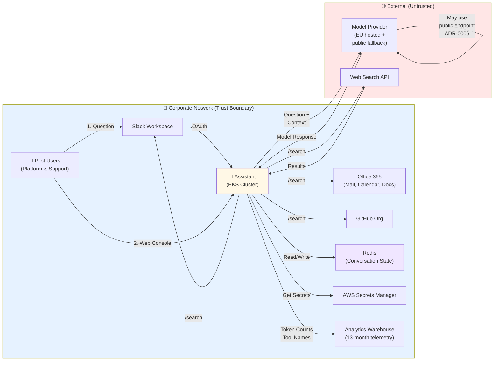
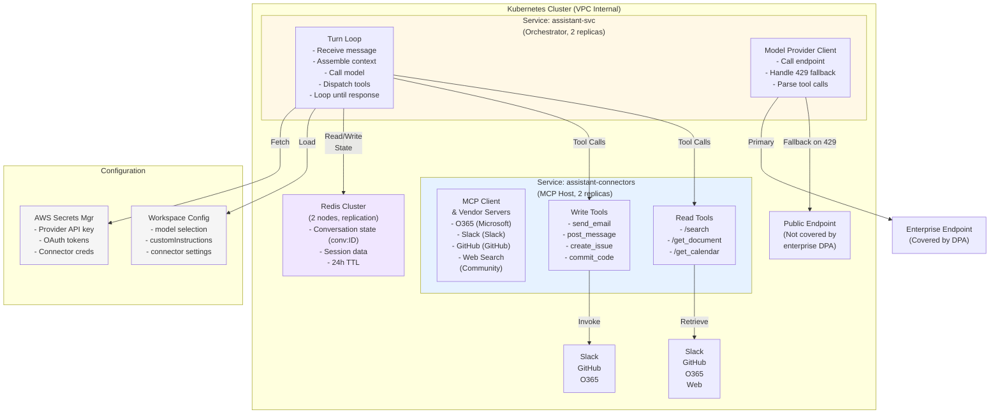
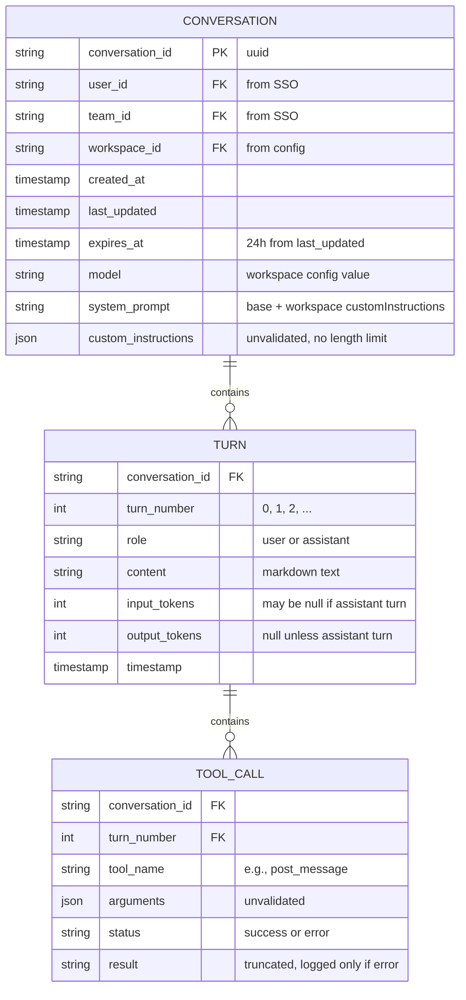
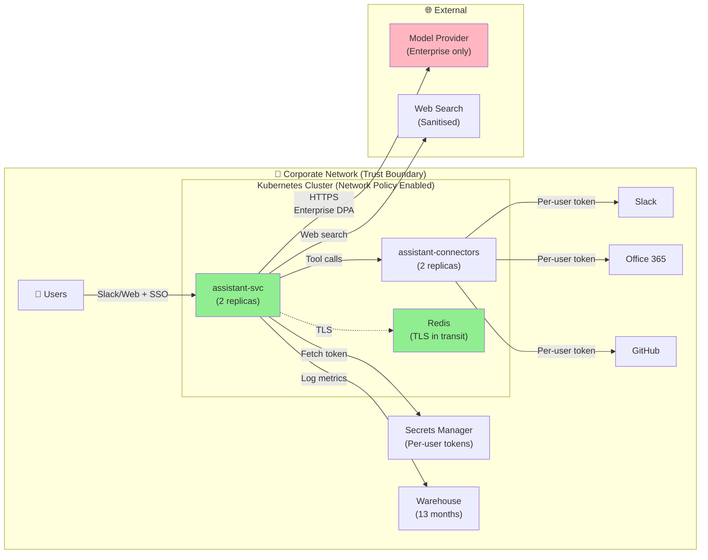

# Security Architecture: Internal AI Assistant

**System:** Internal AI Assistant (Pilot)  
**Date:** 2026-09-09  
**Architecture Reviewed By:** Claude Haiku 4.5  
**Attribution:** Brett Crawley, Principal Application Security Engineer

---

## 1. Architectural Context and Constraints

### Intended Design (From Confluence)

The assistant sits alongside existing tools, reads across them, and acts on their behalf. It is not a system of record; it holds no persistent copy of organisational data beyond transient conversation state (24-hour Redis TTL). Users authenticate via delegated OAuth per connector (planned PLAT-2820); currently using shared app registration for expedited pilot. Actions are unconfirmed but visible post-hoc. The system is deployed on EKS within the corporate network boundary.

### Known Design Gaps (From ADRs)

1. **Per-user delegation delayed:** PLAT-2820 not scheduled. Pilot uses shared app registration.
2. **Actions without pre-confirmation:** ADR-0003 accepts this for UX; risk mitigated by human presence + post-hoc visibility.
3. **Workspace instructions not validated:** ADR-0005 allows free-text system prompt injection by admin; mitigated by trusting admins.
4. **Retrieval merges untrusted content:** ADR-0004 only sanitises web search; internal sources trusted.
5. **Model fallback violates DPA:** ADR-0006 falls back to public endpoint on enterprise rate limit; violates DPA until quota increases.
6. **Network policy disabled:** Terraform shows network policy disabled on beta cluster.
7. **Redis transit encryption disabled:** Terraform shows it was attempted but disabled due to client library limitations.
8. **Debug routes intentionally unset:** Helm values comment indicates runbook relies on debug routes.

### Deployment Context

- **Platform:** EKS (Elastic Kubernetes Service, AWS)
- **Cluster:** Beta cluster (per helm/values.yaml); network policy feature not enabled
- **Region:** EU-west-1 (per iam.tf)
- **Network:** VPC-internal; corporate perimeter provides outer boundary
- **Trust Boundary:** Corporate network boundary (inside = trusted; outside = untrusted)
- **Pilot Users:** 21 total (12 Platform + 9 Support); all corporate employees
- **Data Classification:** Internal (baseline), some Confidential

---

## 2. System Context Diagram (C4 Level 1)



**Key Trust Boundaries:**
- **Inner boundary:** Corporate network (inside trusted, outside untrusted)
- **Perimeter:** Ingress termination, outbound egress proxy, VPN-only access
- **Model provider:** External, covered by enterprise DPA (but fallback to public endpoint violates it)
- **Web search:** Explicitly untrusted; output sanitised

---

## 3. Component Decomposition (C4 Level 2-3)

### Services



### Component Responsibilities

**assistant-svc (Orchestrator)**
- Receives turn request from Slack or web console
- Resolves conversation from Redis using conversation ID
- Loads workspace configuration (model, custom instructions)
- Fetches secrets for provider credentials
- Calls model provider with user message + conversation history + system prompt
- Parses model's tool calls (function calls in the response)
- Dispatches tool calls to assistant-connectors
- Handles tool results and loops until model returns final response
- Stores conversation state back to Redis
- Renders response to Slack or web console
- Logs metrics to analytics warehouse

**assistant-connectors (MCP Host)**
- Hosts MCP client and vendor/community MCP servers
- Implements per-connector tool surface (read and write)
- O365 connector: lists documents, calendar entries, sends email
- Slack connector: searches messages, posts to channels/DMs
- GitHub connector: lists issues/PRs, comments, commits
- Web search connector: calls search API, returns snippets
- Transforms tool results to consistent format
- No state management (stateless); credentials passed per request

**Redis (Conversation State)**
- Stores conversation history keyed by conversation ID
- Stored data: conversation ID, user ID, team ID, messages, tool calls, results, workspace config
- 24-hour TTL (automatic expiry)
- Replication across 2 nodes
- No auth token required (security group restricts to VPC CIDR)

**AWS Secrets Manager**
- Stores provider API keys
- Stores per-user OAuth tokens (planned for PLAT-2820; currently not implemented)
- Stores connector credentials (shared app registration, planned to migrate)
- Workload identity (IRSA) grants assistant pods read-only access to `assistant/*` secrets

**Analytics Warehouse**
- Receives usage telemetry per turn (user, team, tool names, token counts, latency)
- Retention: 13 months
- No tool arguments or results logged (to reduce volume)

---

## 4. Data Flow Diagram with Trust Zones

```mermaid
graph LR
    subgraph Untrusted["🌐 Untrusted Zone"]
        U1["Pilot User<br/>in Slack"]
        Web["Web Search API"]
        Provider["Model Provider"]
    end
    
    subgraph Trusted["🏢 Trusted Zone (Corporate Network)"]
        Slack["Slack<br/>(Authenticated)"]
        Office["O365<br/>(Authenticated)"]
        GH["GitHub<br/>(Authenticated)"]
    end
    
    subgraph Protected["🔒 Protected Zone (EKS Cluster)"]
        Svc["assistant-svc<br/>(Orchestrator)"]
        Conn["assistant-connectors<br/>(MCP Host)"]
        Redis["Redis<br/>(No transit encryption)"]
        SM["Secrets Manager<br/>(via IRSA)"]
    end
    
    U1 -->|1. Unencrypted in client<br/>HTTPS to Slack| Slack
    Slack -->|2. HTTPS to assistant-svc| Svc
    
    Svc -->|3. Redis read<br/>No transit encryption<br/>In-cluster only| Redis
    
    Svc -->|4. Fetch secrets| SM
    
    Svc -->|5. Tool call| Conn
    Conn -->|6. Connector request| Slack
    Conn -->|6. Connector request| Office
    Conn -->|6. Connector request| GH
    Conn -->|6. Web API call| Web
    
    Svc -->|7. Question + Context<br/>HTTPS| Provider
    Provider -->|8. Model Response| Svc
    
    Web -->|9. Results (untrusted)| Conn
    Conn -->|10. Sanitised results| Svc
    
    Svc -->|11. Redis write<br/>Conversation state| Redis
    
    Svc -->|12. Telemetry<br/>No arguments| Analytics["Analytics Warehouse<br/>(13 months)"]
    
    Svc -->|13. Response| Slack
    Slack -->|14. Display| U1
    
    style Untrusted fill:#ffe6e6
    style Trusted fill:#e6f2ff
    style Protected fill:#fff8e6
```

**Data Classifications in Transit:**

| Data | Source | Destination | Classification | Protection |
|------|--------|-------------|-----------------|------------|
| User question | Slack | assistant-svc | Internal | HTTPS |
| Conversation context | Redis | assistant-svc | Internal + Confidential | No transit encryption (cluster-internal) |
| Retrieved documents | O365/GitHub/Slack | assistant-svc | Internal + Confidential | HTTPS |
| Web search results | Web API | assistant-svc | Public | HTTPS + sanitised |
| System prompt + custom instructions | Config | Model provider | Internal | HTTPS (may include business logic) |
| Model response | Model provider | assistant-svc | Internal + Confidential | HTTPS |
| Tool calls + arguments | assistant-svc | Connector | Internal + Confidential | Internal service mesh |
| Actions (email, post, commit) | Connector | O365/Slack/GitHub | Internal + Confidential | HTTPS |

---

## 5. Control Architecture

### Identity and Authentication

**Current State (Pilot):**
- **User authentication:** Slack OAuth (Slack workspace SSO) or web console (shared password behind VPN)
- **Service authentication:** AWS IRSA (IAM Roles for Service Accounts)
- **Connector authentication:** Shared app registration (all connectors)
- **Model provider:** API key (one per workspace model selection)

**Planned (PLAT-2820):**
- Per-user delegated OAuth for each connector
- Tokens held in Secrets Manager with short TTL
- Automatic token refresh

**Gap:** No per-user delegation means the assistant cannot distinguish which user made a read request at the connector level. Attribution in downstream systems (Office 365 audit logs, GitHub commit logs) shows the service principal, not the user.

### Authorization

**Current Design:**
- **Workspace-level:** Workspace ID determines which model, which instructions, which cost center
- **User-level:** User is assumed to be authorized (corporate employee in SSO); no explicit RBAC
- **Connector-level:** No authorization checks in the assistant layer; relies on downstream system authorization
- **Tool-level:** No scoping per tool; all authorized users can invoke all available tools

**Access Control Matrix:**

| Subject | Resource | Current | Planned |
|---------|----------|---------|---------|
| Pilot user | Read from O365 | Via shared app (over-provisioned) | Via user's delegated token |
| Pilot user | Read from GitHub | Via shared app (over-provisioned) | Via user's delegated token |
| Pilot user | Read from Slack | Via shared app (over-provisioned) | Via user's delegated token |
| Pilot user | Post to Slack | Via shared app | Via user's delegated token |
| Pilot user | Send email | Via shared app | Via user's delegated token |
| Pilot user | Invoke `/search` | All connectors | (No change, by design) |
| Workspace admin | Modify system prompt | Yes (free text, no validation) | (No change; admins trusted) |
| Non-pilot user | Access assistant | No (pilot only) | (Unchanged until Phase 2) |

### Encryption

**In Transit:**
- **External traffic:** TLS 1.2+ enforced by platform perimeter
- **User to assistant-svc:** HTTPS via Slack or web console
- **assistant-svc to model provider:** HTTPS
- **assistant-connectors to external APIs:** HTTPS
- **assistant-svc to Redis:** Unencrypted (in-cluster, security group limited to VPC CIDR)
- **assistant-connectors to Redis:** None (connectors do not access Redis)

**At Rest:**
- **Redis:** AES-256 (at-rest encryption enabled in terraform/redis.tf)
- **Secrets Manager:** Envelope encryption with AWS KMS
- **Kubernetes Secrets (if used):** Not encrypted by default; CSI driver recommended (not mentioned in architecture)

**Gap:** Redis transit encryption is disabled. Terraform comment: "Transit encryption adds a TLS handshake per command and the client library in the pilot did not support it cleanly. Cluster internal only." For GA, either enable transit encryption (after updating client library) or enforce network policy + in-cluster-only access.

### Network Segmentation

**Current State:**
- **Perimeter:** All inbound traffic terminates at edge; no public ingress to services (per platform-security-controls.md)
- **Egress:** Outbound traffic through egress proxy with domain allowlist (per platform-security-controls.md)
- **Cluster-internal:** Default-deny network policy specified by platform (per platform-security-controls.md)
- **Beta cluster:** Network policy feature is disabled, so rules are not enforced (per helm/values.yaml)

**Gap:** Network policy is disabled on beta cluster. This means any pod in the cluster can reach any port on any other pod. Combined with no Redis transit encryption, this creates a wider attack surface.

**Remediation for GA:**
```yaml
# Network policy (not yet enforced)
apiVersion: networking.k8s.io/v1
kind: NetworkPolicy
metadata:
  name: assistant-default-deny
  namespace: assistant
spec:
  podSelector: {}
  policyTypes:
  - Ingress
  - Egress
---
apiVersion: networking.k8s.io/v1
kind: NetworkPolicy
metadata:
  name: assistant-allow-svc-to-redis
  namespace: assistant
spec:
  podSelector:
    matchLabels:
      app: assistant-svc
  policyTypes:
  - Egress
  egress:
  - to:
    - podSelector:
        matchLabels:
          app: redis
    ports:
    - protocol: TCP
      port: 6379
```

### Secrets Management

**Storage:**
- AWS Secrets Manager (terraform/iam.tf: `Resource = "arn:aws:secretsmanager:eu-west-1:000000000000:secret:assistant/*"`)

**Access:**
- IAM role `assistant-pilot` with policy allowing `secretsmanager:GetSecretValue` on `assistant/*`
- IRSA (IAM Roles for Service Accounts) mounts the role into both assistant-svc and assistant-connectors pods
- Secrets mounted at pod start (not in shared volume, not in environment variables that leak into logs)

**Lifecycle:**
- **Provider API key:** Long-lived, manually rotated (not mentioned; assume annual review)
- **Connector credentials (shared app):** Long-lived (current state)
- **Connector credentials (per-user OAuth):** Short-lived, refreshed (planned PLAT-2820)

**Gap:** Shared app registration means one compromised secret compromises all connectors for all pilot users.

### Audit Logging

**Request-Level Logging (Always On):**
- Conversation ID, user ID, team ID, timestamp, model, input token count, output token count, tool names, latency
- Written to analytics warehouse

**Tool Arguments and Results (Debug Level, Off in Production):**
- Tool arguments not logged in production (volume reasons)
- Tool results not logged in production
- Cannot reconstruct exactly what a tool was called with in production

**Downstream Audit Trails:**
- O365: Audit log shows actions taken by service principal
- GitHub: Commit history and PR comments show service principal as author (until PLAT-2820)
- Slack: Audit log shows messages posted by service principal
- Redis access: Not logged (no audit trail for Redis reads/writes)

**Gap:** No audit trail of tool arguments means if a prompt injection attack succeeds, the audit log cannot show what arguments the model intended vs. what the injection caused.

**Gap:** Custom instructions are not versioned; no audit trail of who changed them or when.

**Gap:** Redis access is not logged; no detection if someone reads conversation state directly.

### Detection and Monitoring

**Current Monitoring:**
- Kubernetes native metrics (CPU, memory, pod restarts)
- Request latency and token counts (via telemetry)
- Rate limiting from provider (handled in client, not logged)

**Missing Security Signals:**
- Unusual tool invocation patterns (e.g., a user calling a tool they don't normally use)
- Repeated tool failures or retries (may indicate fuzzing or attack)
- Cost spike (consumption exceeding team budget)
- Redis errors or connection anomalies
- Failed authentication attempts
- Unusual model responses (e.g., repeated refusals, error patterns)

**Action Required:** Define monitoring and alerting for security signals before GA.

---

## 6. Data Model and Schemas

### Conversation State (Redis)



**Data Classifications:**

| Field | Classification | Sensitivity | Retention |
|-------|-----------------|-------------|-----------|
| conversation_id | Internal | Low (ID only) | 24h |
| user_id | Internal | Medium (identifies employee) | 24h + 13mo telemetry |
| team_id | Internal | Low | 24h + 13mo telemetry |
| content | Internal + Confidential | High (may include business logic, customer data) | 24h |
| model | Internal | Low | 24h |
| system_prompt | Internal | High (may include custom logic) | 24h |
| custom_instructions | Internal | High (admin input, not validated) | 24h |
| tool_name | Internal | Medium | 24h + 13mo telemetry |
| arguments | Internal + Confidential | High (user requests, data) | 24h only (not logged in production) |
| result | Internal + Confidential | High | 24h only (not logged in production) |

**Encryption & Protection:**
- At rest: AES-256 (enabled in terraform)
- In transit: Unencrypted within cluster (gap for GA)
- Access control: IRSA limits access to assistant pods only (intended, but network policy not enforced)
- Expiry: 24-hour automatic TTL (mitigates data accumulation)

### Analytics Telemetry (Warehouse, 13 months)

```yaml
{
  "conversation_id": "uuid",
  "user_id": "email",
  "team_id": "string",
  "workspace_id": "string",
  "timestamp": "ISO 8601",
  "model": "string",
  "input_tokens": 42,
  "output_tokens": 120,
  "tools_invoked": ["search", "post_message"],
  "latency_ms": 1234,
  # Not logged: tool arguments, results, conversation content
}
```

**Purpose:** Cost attribution (token counts by team) and usage analytics

---

## 7. Data Lifecycle

| Stage | Location | Classification | Retention | Encryption | Access |
|-------|----------|-----------------|-----------|------------|--------|
| **Collection** | User → Slack/Web Console | Internal + Confidential | Transient | HTTPS | User + Slack platform |
| **Retrieval** | Redis + External APIs | Internal + Confidential | 24h (Redis) | At rest (Redis) | assistant-svc + connectors |
| **Processing** | Model Provider | Internal + Confidential | (Provider policy) | HTTPS | Model provider (may not be enterprise DPA per ADR-0006) |
| **Storage (Active)** | Redis | Internal + Confidential | 24h | At rest only | Pod identity (IRSA) |
| **Aggregation** | Warehouse | Internal (metadata only) | 13 months | (Warehouse policy) | Analytics team |
| **Deletion** | Automatic | — | TTL expiry | — | Auto-delete via Redis TTL |
| **Backup** | (Not documented) | — | (Unknown) | (Unknown) | (Unknown) |

**Gaps:**
- Backup retention not documented (conversation data may persist in cold storage beyond 24h)
- No documented right-to-erasure flow (user cannot request immediate deletion; must wait for TTL)
- Warehouse retention (13 months) exceeds transient design philosophy

---

## 8. Security Implications of Accepted ADRs

### ADR-0001: Node/TypeScript, Two Services
**Implication:** A second runtime in the estate; different dependency posture from rest of Go codebase. Increased surface area for supply chain attacks. Shared CI templates don't cover Node dependencies. Dependency scanning status unclear (PLAT-2077 listed as open).

### ADR-0002: Shared App Registration
**Implication:** All pilot users can reach everything any pilot user can reach, and more (per-user permissions not enforced). Over-provisioned access is a known risk, accepted for pilot. PLAT-2820 is the required fix; currently not scheduled.

### ADR-0003: Actions Without Confirmation
**Implication:** Any tool invocation that reaches the model can be triggered by prompt injection. Mitigated by human presence and post-hoc visibility for pilot; unattended operation (Phase 3) requires pre-action confirmation or scope limits.

### ADR-0004: Retrieval Fans Out
**Implication:** Content from different sources and trust levels (internal vs. web) arrives in the same prompt. Only web search is sanitised. No per-source access control. By design; no change planned.

### ADR-0005: Workspace Instructions in System Prompt
**Implication:** Workspace admin can inject arbitrary instructions. Free-text field, no validation, no length limit. Mitigated by trusting admins in pilot. For multi-tenant GA, requires validation and limits.

### ADR-0006: Provider Fallback on Rate Limit
**Implication:** Prompt + context sent to public endpoint not covered by enterprise DPA, violating data protection commitments. Volume highest exactly when this happens (peak load). Until quota increases (no owner assigned), data protection is weakened.

### ADR-0007: Per-Workspace Model Selection
**Implication:** Workspace can select cheaper model at any time with no review. Answer quality and safety properties vary across models; no measured impact. Teams pick based on cost, not safety.

### ADR-0008: Conversation State in Redis
**Implication:** Identity for resumed conversation comes from stored state, not from current request. Redis credentials not version-controlled; Redis access not logged. If Redis is compromised, conversation identity can be forged.

---

## 9. Assessment Against Security Principles

| Principle | Current State | Gap |
|-----------|---------------|-----|
| **Defense in Depth** | Multiple layers (perimeter, network, app-level auth, logging) | No input validation at model layer; prompt injection mitigated by human presence only |
| **Least Privilege** | Shared app has org-level access (over-provisioned) | Per-user delegation required (PLAT-2820) |
| **Secure by Default** | Actions execute immediately (no confirmation); no output filtering | Pre-confirmation or scope limits required for unattended operation |
| **Fail Securely** | No explicit fail-closed behavior documented | Model provider rate limit falls back to public endpoint (fail-open) |
| **Complete Mediation** | Authorization checked at connector level (inherited from connector) | No re-check of user permissions within assistant; all pilot users treated equally |
| **Separation of Duties** | No explicit separation (e.g., no approval workflow for high-risk actions) | By design; acceptable for pilot with human present |
| **Economy of Mechanism** | Relatively simple architecture (two services, one cache, connectors); clear responsibilities | System prompt not length-limited; debug routes not removed |
| **Weakest Link** | Prompt injection (model misuse); shared credentials (over-provisioned access); Redis unencrypted | Multiple planned mitigations (PLAT-2820, ADR-0006 revert, SUC-001 implementation) |

---

## 10. Architectural Changes Required Before GA

### Critical (Blocks GA)

1. **PLAT-2820: Per-User Delegated OAuth**
   - Implement per-user credentials for each connector
   - Removes over-provisioned access
   - Fixes attribution (actions attributed to user, not service principal)

2. **ADR-0006 Revert: Close Provider Quota Gap**
   - Either increase enterprise quota or remove fallback to public endpoint
   - Restores DPA compliance

3. **Network Policy & Redis Transit Encryption**
   - Enable Kubernetes network policy on GA cluster
   - OR enable Redis transit encryption (after updating client library)
   - Reduces blast radius if Redis is compromised

### High (Strong Recommendation)

4. **Output Sanitisation for Tool Arguments**
   - Validate tool arguments to prevent prompt injection reaching external tools
   - Required for unattended operation

5. **GDPR Data Subject Rights**
   - Implement access, erasure, and portability flows
   - Required for compliance with GDPR Articles 15, 17, 20

6. **Tool Scope Narrowing**
   - Narrow Slack connector scopes (PLAT-2814-6) from full to minimum required
   - Limit tool descriptions to documented interfaces (prevent injection)

### Medium (Before Phase 2 Expansion)

7. **Monitoring and Alerting**
   - Define security signals (unusual tools, cost spikes, rate limit hits)
   - Alert on anomalies

8. **Incident Response Playbook**
   - Define escalation path for security incidents
   - Define kill-switch activation process

9. **Privacy Notice & Consent**
   - Publish privacy notice with data handling explanation
   - Obtain legal sign-off on lawful basis (likely legitimate interest)

---

## 11. Architecture Diagram: Target State (Post-GA Requirements)



**Changes from current:**
- ✅ Per-user tokens (PLAT-2820)
- ✅ No public endpoint fallback (ADR-0006 revert)
- ✅ Redis TLS (ADR-0008 update)
- ✅ Network policy enforced (PLAT-2101)
- ✅ Tool scope validation (PLAT-2814-6)

---

## Session Participants

**Architect:** Claude Haiku 4.5  
**Attribution:** Brett Crawley, Principal Application Security Engineer  
**Date:** 2026-09-09  
**Review Status:** Architecture map phase (descriptive); evaluation phase (prescriptive) pending threat model review.

